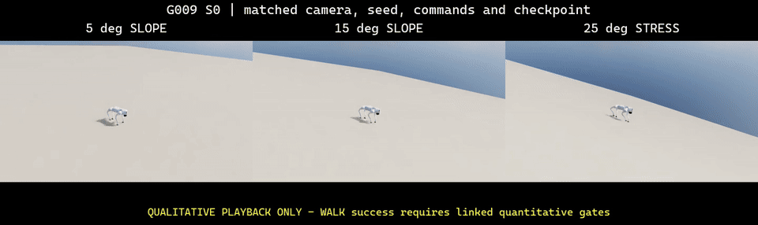
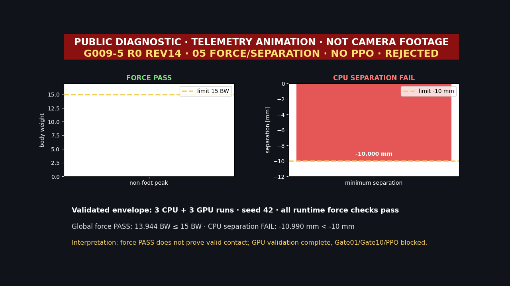
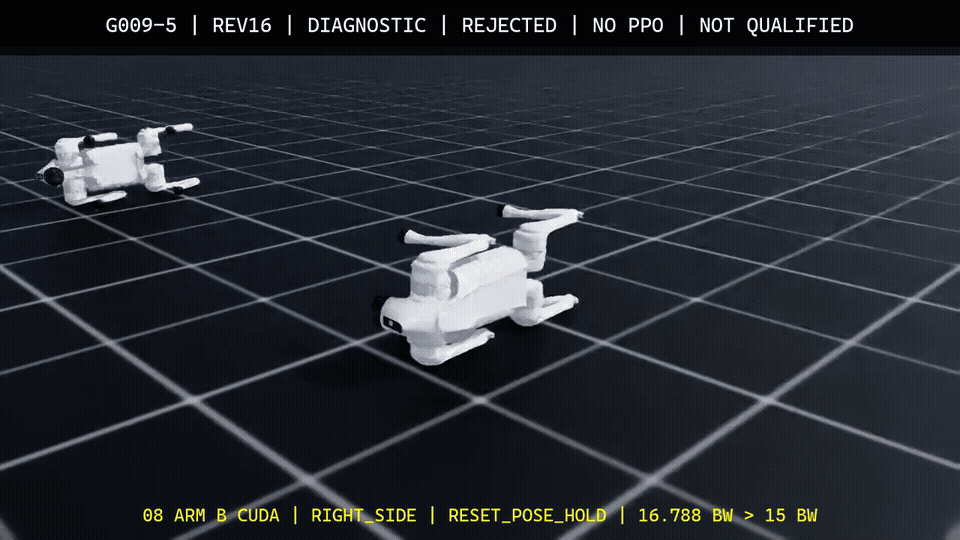
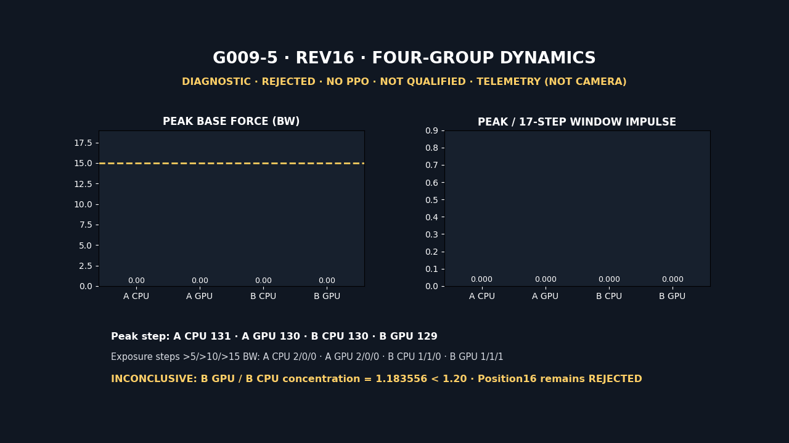

# Isaac Walk RL

Windows 네이티브 환경에서 Isaac Sim 4.5와 Isaac Lab 2.1.1을 사용해 사족보행 PPO 실험을 재현하고, 보상·지형·외란 회복을 한 축씩 확장하는 프로젝트입니다.

## 고정 스택

| 구성 | 고정값 | 상태 |
| --- | --- | --- |
| 운영체제 | Windows 11 네이티브 | 확정 |
| Isaac Sim | 4.5.0 binary | 로컬 설치·Python smoke 확인 |
| Isaac Lab | v2.1.1 / `90b79bb2d44feb8d833f260f2bf37da3487180ba` | 소스 설치·태그 확인 |
| Python | Isaac Sim 번들 3.10.x | 로컬 3.10.15 확인 |
| RL | RSL-RL PPO / `rsl-rl-lib==2.3.3` | 설치·CUDA import 확인 |
| 관측 | 상태 기반, headless | 확정 |

이 프로젝트는 `Ubuntu 24.04/Jazzy` 기본 로보틱스 환경의 예외입니다. RL 학습 자체에는 ROS 2나 WSL2가 필요하지 않으므로 설치하지 않습니다.

## 검토 후 보정한 전제

- Isaac Lab 2.1.1은 `pip install isaaclab==2.1.1` 대상이 아닙니다. 공식 태그 소스를 저장소 밖에 clone해 설치합니다.
- Isaac Lab 2.2는 Sim 4.5에서 무조건 사용할 수 없는 버전이 아닙니다. 이 프로젝트는 재현성을 위해 2.1.1을 고정합니다.
- RTX 3060 12GB에서 2048/4096 environments가 된다는 보장은 없습니다. 64부터 단계적으로 올리며 peak VRAM과 steps/s를 실측합니다.
- Go2를 "가장 많이 쓰이는 모델"이라고 단정하지 않습니다. ANYmal-C 공식 baseline을 관문으로 삼고, Isaac Lab 내장 Go2 태스크를 심화 대상으로 사용합니다.
- RBQ v1.20.0에는 공개 URDF·STL 경로가 있습니다. 공식 Isaac Lab v2.1.1·v2.3.2·조사 시점 main에는 대상 구현이 없으므로, 마지막 단계는 외부 커스텀 자산의 라이선스와 호환성을 fail-closed로 판정합니다.

## 실행 순서

1. Isaac Lab v2.1.1 소스 설치 및 등록 태스크 검증
2. ANYmal-C flat 50-iteration smoke와 300-iteration baseline
3. Go2 flat 환경 수별 VRAM·steps/s 측정
4. 세 보상 항목의 one-factor ablation
5. official Go2 rough baseline에서 terrain curriculum과 official domain randomization 공통 조건 고정
6. 동일 rough·공통 official DR 조건에서 `events.push_robot`만 변경한 push curriculum의 고정 프로토콜 비교
7. RBQ 외부 자산 라이선스·호환성 사전조사

구체적인 명령과 단계별 완료 조건은 `PROMPT_WINDOWS.md`, 측정 상태는 `docs/VALIDATION_MATRIX.md`, 모든 실행 기록은 `RUN_NOTES.md`에서 관리합니다.

## 수령 MPC/WBC 자료 반영

2026-08-30에 수령한 Notion의 Centroidal MPC 여섯 하위 문서와 주석 포함 MIT Cheetah 3 convex MPC 논문 8쪽을 끝까지 검토했습니다. 전체 연결과 적용 로드맵은 [`docs/MPC_WBC_SOURCE_AND_INTEGRATION_20260830.md`](docs/MPC_WBC_SOURCE_AND_INTEGRATION_20260830.md), 논문의 식 (1)~(33)·Table I·Figure 2~10·페이지별 Go2 적용 경계는 [`docs/MIT_CHEETAH3_CONVEX_MPC_PAPER_REVIEW_20260830.md`](docs/MIT_CHEETAH3_CONVEX_MPC_PAPER_REVIEW_20260830.md)에 분리했습니다. URL·절 수·첨부 audit·PDF portable path와 SHA-256은 [`reports/research/mpc_wbc_material_intake_20260830.json`](reports/research/mpc_wbc_material_intake_20260830.json)에 고정했습니다.

현재 Go2 제어기는 MPC/WBC가 아니라 50 Hz joint-position PPO입니다. 이 자료는 당장 G009 RECOVER action이나 solver calibration을 바꾸는 근거로 사용하지 않습니다. 먼저 import-light 수학 검증과 PPO read-only contact/GRF/foothold telemetry를 거친 뒤, 별도 flat Centroidal MPC baseline과 terrain-reference/residual RL을 순차적으로 검토합니다. Notion의 `1.4 Hz`, duty factor `0.65`, `0.24 s` horizon, OSQP, Q weight와 Cheetah 3의 force limit은 현재 Go2 설정으로 복사하지 않습니다.

## G008에서 G009까지의 작업 번호

아래 번호는 의존성과 문서 순서를 나타냅니다. `G008-3/5/7/8`은 마찰·도로 분기, `G008-4/6`은 링크 질량 분기입니다. 두 분기의 실행 시각을 번호로 단정하지 않습니다. `G008-9`는 각 단계 직후 만든 자료를 모은 증거 index입니다. 코드의 `S1`, `G0`, `R0` 같은 protocol stage ID는 괄호에 함께 적습니다.

```text
G008-1 command smoke -> G008-2 command PPO
                           |-> G008-3 friction S1 -> G008-5 mixed friction -> G008-7 irregular road -> G008-8 G0/T1
                           `-> G008-4 leg-mass S1 -> G008-6 link-mass sensitivity

각 단계 직후 촬영한 증거 ---------------------------------------------------------------> G008-9 index
```

| 작업 번호 | 수행 내용 | 실행 성격 | 판정 |
| --- | --- | --- | --- |
| `G008-1` | 전진·후진·좌회전·우회전 command 경로와 64환경 smoke | 학습 smoke | 완료 |
| `G008-2` | G006 checkpoint에서 command PPO 재개, `1,024 env × 300 iter` | 강화학습 | 평면 네 방향 통과 |
| `G008-3` | 발바닥 마찰 S1, `1,024 env × 300 iter` | 강화학습 | 평면 네 방향 통과, rough 확대 보류 |
| `G008-4` | 다리 링크 질량 S1, `1,024 env × 300 iter` | 강화학습 | 학습 완료, 우회전 gate 실패 |
| `G008-5` | 주기 고·저마찰 띠에서 최저 마찰 탐색 | held-out 평가 | 일부 방향 통과, 전 방향 하한 미확정 |
| `G008-6` | hip·thigh·calf·foot 그룹별 `0.8~1.2배` 질량 민감도 | held-out 평가 | leg-mass 우회전 실패 유지 |
| `G008-7` | 비주기 마찰 mosaic와 crown·요철·함몰 도로 | 강화학습·평가 | 추가 학습 checkpoint 기각 |
| `G008-8` | 균일 마찰 도로 G0와 회전 보상 T1 | 강화학습·평가 | 두 후보 기각, 저마찰 F1 보류 |
| `G008-9` | 각 단계 직후 촬영한 MP4·GIF·PNG와 물성 readback을 한 묶음으로 정리 | 시각 증거 index | 완료 |
| `G009-1` | goal별 경로와 24개 stage registry (`C0`) | 증거 계약 | 완료 |
| `G009-2` | 6개 경사 × 4개 방위 analytic gate (`S0`) | 지형 검증 | `24/24` 통과 |
| `G009-3` | collision mesh·마찰·support-normal reset (`S0`) | Isaac runtime 검증 | 완료 |
| `G009-4` | 5°·15°·25° 동일 조건 재생 (`S0`) | 시각 증거 | 완료, 25°는 실패 경계 |
| `G009-5` | 네 전복 자세의 평지 RECOVER (`R0`) | 강화학습·안전 귀속 | rev12 gate10 기각·full-state 귀속 완료, rev13·rev14·rev15 기각, rev16 12-run attribution 완료·가설 `inconclusive`, Gate01·Gate10·PPO 미실행 |
| `G009-6` | 5°·10° 횡경사 WALK (`S1-low`) | 다음 강화학습 | R0·calibration 뒤 실행 |

G008의 상세 번호표는 [`docs/G008_COMMAND_FRICTION_LINK_MASS.md`](docs/G008_COMMAND_FRICTION_LINK_MASS.md), G009의 전체 후속 순서는 [`docs/G009_MOUNTAIN_SLOPE_RECOVERY.md`](docs/G009_MOUNTAIN_SLOPE_RECOVERY.md)에서 이어집니다.

## 저장소 경계

- 이 저장소: 커스텀 코드, 설정, 재현 스크립트, 문서, 정량 결과표, 검증용 소형 GIF·스크린샷
- 저장소 밖: `%USERPROFILE%\IsaacLab`, `E:\IsaacSim\isaac-sim-4.5.0`, 학습 로그, 체크포인트, 원본 영상, 중간 생성 자산

## 환경 매니페스트와 저장소 검증

이 프로젝트의 명령은 PowerShell 7.x(`pwsh`)에서 실행합니다. 현재 검증 버전은 7.6.5이며, Windows PowerShell 5.1은 지원 검증 대상이 아닙니다.

다음 명령을 실행하면 사용자명이나 인증정보를 기록하지 않고 Git, GPU, Isaac 설치 상태와 현재 commit 상태를 `reports/environment_manifest.json`에 갱신합니다.

```powershell
cd "$HOME\isaac-walk-rl"
.\scripts\collect_environment.ps1
.\scripts\verify_isaaclab.ps1
.\scripts\validate_repository.ps1
```

Isaac Lab을 다른 위치에 설치한 경우 `-IsaacLabPath` 인자로 경로를 지정합니다. 사용자 홈 아래 경로는 보고서에서 `%USERPROFILE%`로 치환됩니다. Isaac Lab v2.1.1의 Windows `isaaclab.bat -p`는 nested batch를 `call` 없이 실행해 성공 후에도 exit 1을 전달할 수 있으므로, runtime 검증은 동일한 공식 bundled `python.bat`를 직접 사용하고 wrapper 문제는 경고로 기록합니다.

## ANYmal-C 학습 하네스

`scripts/run_training.ps1`은 Isaac Sim bundled `python.bat`로 headless RSL-RL 학습을 실행하고, 원시 로그는 저장소 밖 `%USERPROFILE%\IsaacLab\logs\harness`에 두며 휴대 가능한 JSON 요약만 `reports/runs`에 기록합니다.

```powershell
cd "$HOME\isaac-walk-rl"
.\scripts\run_training.ps1 -Task Isaac-Velocity-Flat-Anymal-C-v0 -NumEnvs 64 -MaxIterations 50 -Seed 42 -RunName "anymalc_flat_smoke_s42_YYYYMMDD-HHmm"
```

G003에서는 1-iteration probe, 50-iteration smoke, 300-iteration flat baseline을 순서대로 통과했습니다. 측정값과 체크포인트 해시는 `reports/runs/g003_anymal_summary.json`을 기준으로 봅니다.

## Go2 환경 수 scale ladder

`scripts/run_scale_ladder.ps1`은 Go2 flat 태스크를 seed 42, 각 10 iterations로 64→256→512→1024→2048 environments 순서로 실행합니다. rung 실패나 GPU 측정·회복 실패가 있으면 상위를 중단하며, 4096은 2048이 PASS하고 peak VRAM이 총 12,288 MiB의 80%(9,830.4 MiB) 이하일 때만 실행합니다.

```powershell
cd "$HOME\isaac-walk-rl"
.\scripts\run_scale_ladder.ps1
```

현재 호스트에서는 4096까지 짧은 10-iteration 실행이 통과해 `highest_operational=4096`, `highest_safe=4096`으로 측정됐습니다. 이는 장기 안정성 판정이 아닙니다. 전체 표, checkpoint hash와 TensorBoard 경로는 `reports/runs/g004_go2_scale_summary.json`과 `RUN_NOTES.md`에 있습니다. 사용자 제공 MuJoCo 51k steps/s는 동일 조건 벤치마크가 아니므로 직접 비교하지 않습니다.

## Go2 flat 보상 ablation

G005에서는 4096 environments × 300 iterations 조건에서 baseline과 `dof_torques_l2`, `action_rate_l2`, `feet_air_time` 단일 제거 variants를 seeds 42/43/44로 학습했습니다. 12/12 runs가 실패 없이 완료됐고, 총 학습 시간은 105.4분, 실행별 평균 처리량의 평균은 60,238.2 steps/s, 최대 peak VRAM은 4,822 MiB였습니다.

```powershell
cd "$HOME\isaac-walk-rl"
.\scripts\run_reward_ablation.ps1

# 중단된 queue 재개
.\scripts\run_reward_ablation.ps1 -Resume

# 기존 증거를 엄격 검증하고 summary 재생성
& "$HOME\IsaacLab\_isaac_sim\python.bat" .\scripts\summarize_reward_ablation.py `
  --manifest .\configs\g005_reward_ablation.json `
  --queue .\reports\runs\g005_reward_ablation_state.json `
  --output .\reports\runs\g005_reward_ablation_summary.json
```

해석과 한계는 [`docs/G005_REWARD_ABLATION.md`](docs/G005_REWARD_ABLATION.md), 정량 summary는 [`reports/runs/g005_reward_ablation_summary.json`](reports/runs/g005_reward_ablation_summary.json), job별 checkpoint·TensorBoard·해시는 [`reports/runs/g005_reward_ablation_state.json`](reports/runs/g005_reward_ablation_state.json)에 있습니다. 학습 reward는 variant마다 정의가 달라 직접 비교하지 않습니다. Isaac Lab 본체는 계속 저장소 밖 `$HOME\IsaacLab`에 둡니다.

## Rough·DR·외란 회복 결과

G006은 4096 env × 1500 iterations × seeds 42/43/44로 baseline과 push curriculum을 비교했습니다. pooled 회복률은 `99.5370%` 대 `99.5988%`로 push curriculum이 `+0.0617%p`였지만, paired bootstrap 95% CI가 `-0.7716%p ~ +0.9568%p`이므로 유의한 개선을 주장하지 않습니다. 두 variant의 guardrail 생존률은 모두 `100%`였습니다.

학습 도구, headless 실행 구조, 관측·보상, PPO batch·epoch, 네트워크, 실행 시간과 평가 설계는 포트폴리오 형식의 [`docs/G006_PORTFOLIO.md`](docs/G006_PORTFOLIO.md)에 정리했습니다. 해석·seed별 결과·추적 및 에너지 proxy는 [`docs/G006_ROUGH_PUSH_RECOVERY.md`](docs/G006_ROUGH_PUSH_RECOVERY.md), 정량 summary는 [`reports/runs/g006_summary.json`](reports/runs/g006_summary.json), job별 checkpoint·평가 보고서 해시는 [`reports/runs/g006_queue_state.json`](reports/runs/g006_queue_state.json)에 있습니다. 이 durable JSON의 경로와 평가 command는 저장소 상대경로 또는 `%USERPROFILE%`, `%REPO_ROOT%`, `%ISAACLAB_ROOT%` 표현으로만 기록하며, 실제 evaluator 실행 시점에만 허용된 root 안의 절대경로로 resolve합니다.

seed 42의 실제 정책 재생 비교 GIF와 스크린샷, 로컬 전용 원본 영상의 무결성 정보는 [`docs/G006_VISUAL_EVIDENCE.md`](docs/G006_VISUAL_EVIDENCE.md)에 있습니다. 시각 자료는 정성 작동 증거이며 정량 평가를 대체하지 않습니다.

G008 단일축 물성 gate와 후속 held-out dynamics, cross-simulator, RMA식 적응 모듈의 적용 우선순위는 [`docs/PORTFOLIO_SIM_TO_REAL_20260826.md`](docs/PORTFOLIO_SIM_TO_REAL_20260826.md)에 정리했습니다. 실물 Go2 결과가 생기기 전까지 이 단계는 `sim-to-real readiness`로 표시합니다.

```powershell
cd "$HOME\isaac-walk-rl"
python .\scripts\summarize_g006.py `
  --manifest .\configs\g006_rough_push.json `
  --queue-state .\reports\runs\g006_queue_state.json `
  --isaaclab-root "$HOME\IsaacLab" `
  --output .\reports\runs\g006_summary.json
```

## 방향 명령·마찰·링크 질량 단계

G008은 논문 조사 결과를 세 개의 분리된 태스크 축으로 옮겼습니다. command suite는 전진·후진·제자리 좌회전·제자리 우회전 exact primitive를 명령 sampler의 80%에 배정하고, 나머지 20%는 연속 `v_x/v_y/ω_z` 명령으로 둡니다. 마찰과 다리 링크 질량은 서로 섞지 않고 S1→S2→S3으로 범위를 넓힙니다.

2026-08-26 기준 command, friction S1, leg-mass S1의 `64 env × 1 iteration` headless 스모크가 모두 통과했습니다. command를 처음부터 `1,024 env × 300 iterations` 학습한 run은 평면에서 정지에 가까운 지역해로 수렴했습니다. G006 `model_1499.pt`에서 같은 budget을 이어 학습한 `model_1798.pt`는 평면 네 방향 gate를 모두 통과했습니다. 64/64 환경이 생존했고 선속도 RMSE는 `0.0466~0.0794 m/s`, yaw RMSE는 `0.0741~0.1154 rad/s`였습니다. rough terrain에서는 좌·우 회전만 전체 gate를 통과했고, 전진·후진은 순간 roll/pitch가 `0.35 rad` 기준을 넘었습니다.

S1 runtime probe에서는 발바닥 static/dynamic friction이 `0.7226~0.8770`/`0.5295~0.6729`, 다리 링크별 mass scale이 `0.9500~1.0500`으로 실제 적용됐습니다. 질량 변경 뒤 inertia tensor의 최대 재계산 오차는 약 `1.86e-9`였습니다. friction S1은 `1,024 env × 300 iterations` 학습 뒤 randomized·nominal 평면 네 방향 gate를 모두 통과했습니다. 다만 rough 학습의 terrain level mean이 약 3.45에서 2.27로 내려가 S2 확대는 보류합니다.

leg-mass S1도 같은 budget으로 별도 학습했지만 randomized·nominal 평면 모두 우회전 yaw gate에 실패했습니다. 평균 yaw rate가 command checkpoint의 `-0.4533 rad/s`에서 약 `-0.235 rad/s`로 줄고 yaw RMSE가 약 `0.295 rad/s`로 커졌습니다. nominal guardrail도 실패했으므로 leg-mass S2는 중단합니다.

후속 held-out 시험에서는 폭 `0.5 m`의 고·저마찰 띠를 단일 triangle mesh의 face material로 교차 배치하고, 기본 ground collider를 제거해 이중 접촉을 막았습니다. friction S1은 전진·후진·좌회전을 완료된 최저 조건 `μ_s/μ_d=0.2/0.1`까지 연속 통과했습니다. 우회전은 `0.7/0.5`에서 먼저 실패하고 `0.6/0.4`에서 개별 통과해 전 방향 보수적 하한은 확정하지 않았습니다. `0.1/0.05`는 네 번 모두 Isaac Sim native 종료가 재현돼 PASS/FAIL이 아닌 미확정으로 남겼습니다. hip·thigh·calf·foot를 한 그룹씩 `0.8~1.2`배로 바꾼 시험에서는 두 정책의 전진·후진이 25개 조건을 모두 통과했지만, leg-mass S1은 nominal부터 우회전 gate에 실패했습니다. 평가 설계, 시뮬레이터 한계, 그룹별 질량 표와 다음 실험은 [`docs/G008_PERIODIC_FRICTION_AND_LINK_MASS_LIMITS.md`](docs/G008_PERIODIC_FRICTION_AND_LINK_MASS_LIMITS.md)에 정리했습니다.

주기적인 띠보다 실제 도로에 가까운 다음 단계로, 56m × 56m 비주기 2D 마찰 mosaic에 crown·긴 파장 굴곡·표면 요철·얕은 함몰을 합친 전용 태스크를 만들었습니다. 네 발이 같은 마찰에 놓이는 frame과 네 발이 모두 다른 frame을 runtime에서 함께 확인했습니다. friction S1 정책은 32환경·10초 평가에서 낙상 없이 3/4 방향을 통과했고, 불규칙 도로에서 64환경 × 300 iterations를 추가 학습한 checkpoint는 회전 중 5회 넘어져 채택하지 않았습니다. 구현, 실제 PPO batch·epoch, 네 발 접촉 분포, 역학 해석과 단계별 후속 curriculum은 [`docs/G008_IRREGULAR_ROAD.md`](docs/G008_IRREGULAR_ROAD.md)에 기록했습니다.

후속 G0에서는 같은 높이 형상에 균일 `0.8/0.6` 마찰만 두어 기하와 저마찰을 분리했습니다. 기존 friction S1 정책은 세 terrain seed 중 `2/3`, 방향 조건 `11/12`를 통과했습니다. G0와 순수 회전에서도 `feet_air_time`을 켠 T1을 각각 `128 env × 300 iterations = 921,600 transitions`로 실제 추가 학습했지만, 두 최선 후보 모두 세 지형의 우회전 gate를 통과하지 못했습니다. 그래서 두 구간 저마찰 F1은 보류했습니다. 런타임에서 추출한 정확한 보상 수식·가중치, PPO 설정, checkpoint 선별, 비교 영상과 다음 실험은 [`docs/G008_REWARD_AND_ROAD_CURRICULUM.md`](docs/G008_REWARD_AND_ROAD_CURRICULUM.md), 정량 집계는 [`reports/runs/g008_road_curriculum_summary_s20260826.json`](reports/runs/g008_road_curriculum_summary_s20260826.json)에 있습니다.

혼합 `0.8/0.6 ↔ 0.2/0.1` 마찰 띠와 hip·thigh·calf·foot `1.2배` 질량 화면도 별도로 촬영했습니다. 원본 MP4는 로컬에만 두고 단계별 GIF·네 방향 스크린샷·물리 readback JSON을 Git에 넣었습니다. 이후 실행 동작에 영향을 주는 stage, checkpoint, randomization 범위 또는 평가 지형이 바뀌면 같은 촬영 세트를 다시 만듭니다.

command, friction S1, leg-mass S1 checkpoint를 같은 평면·seed·명령 시퀀스로 재생한 동기화 GIF와 접촉시트, 로컬 전용 원본 MP4의 경로·해시는 [`docs/G008_VISUAL_EVIDENCE.md`](docs/G008_VISUAL_EVIDENCE.md)에 있습니다. Git에는 GIF와 PNG만 포함하며 원본 MP4는 `%USERPROFILE%\IsaacLab\logs\visual_evidence\g008`에 보관합니다.

PPO batch·epoch, 235차원 observation, 50 Hz 제어, 마찰원뿔, yaw moment, 링크별 질량과 inertia 재계산, 논문 수치의 채택·배제 근거, sim-to-real 측정 항목은 [`docs/G008_COMMAND_FRICTION_LINK_MASS.md`](docs/G008_COMMAND_FRICTION_LINK_MASS.md)에 정리했습니다. 혼합 마찰과 그룹별 질량 한계 시험은 [`docs/G008_PERIODIC_FRICTION_AND_LINK_MASS_LIMITS.md`](docs/G008_PERIODIC_FRICTION_AND_LINK_MASS_LIMITS.md), 실행 계약은 [`configs/g008_locomotion_dynamics.json`](configs/g008_locomotion_dynamics.json), runtime 증거는 `reports/runs/g008_*.json`을 기준으로 봅니다.

```powershell
cd "$HOME\isaac-walk-rl"

.\scripts\run_g008_stage.ps1 -Part command -Stage 0 -NumEnvs 64 -MaxIterations 1 -Seed 42 -RunName g008_command_smoke_e64_i1_s42
.\scripts\run_g008_stage.ps1 -Part friction -Stage 1 -NumEnvs 64 -MaxIterations 1 -Seed 42 -RunName g008_friction_s1_smoke_e64_i1_s42
.\scripts\run_g008_stage.ps1 -Part leg_mass -Stage 1 -NumEnvs 64 -MaxIterations 1 -Seed 42 -RunName g008_leg_mass_s1_smoke_e64_i1_s42
```

## 산 비탈 S0 지형·재생 검증

G009는 경사 횡단 WALK와 전복 RECOVER를 별도 PPO로 학습하기 전에 경사 지형과 계측 기준부터 고정하는 단계입니다. `0/5/10/15/20/25° × 0/90/180/270°` 24개 analytic cell을 통과했고, Isaac runtime에서 5°·15°·25°의 단일 collision mesh, `0.8/0.6` ground material과 support-normal 정렬을 다시 읽어 확인했습니다.

같은 G008 checkpoint, seed, 명령, 카메라로 525-step headless off-screen 재생도 촬영했습니다. 5°와 15°는 낙상 termination 없이 시퀀스를 마쳤습니다. 25°에서는 최대 기울기 `84.78°`, 하방 이동 `2.39 m`가 기록돼 성공이 아닌 stress 실패 경계로 판정했습니다. `25°`는 로봇이나 시뮬레이터의 최대 경사가 아니라 현재 protocol의 가장 높은 stress cell입니다. 이 단계에서는 G009 PPO update를 수행하지 않았습니다.



설계한 보상 함수, actor/critic 관측, PPO batch·epoch, WALK/RECOVER 분리, 단계별 학습 budget과 다음 실행 순서는 [`docs/G009_MOUNTAIN_SLOPE_RECOVERY.md`](docs/G009_MOUNTAIN_SLOPE_RECOVERY.md)에 정리했습니다. 캡처의 source commit·checkpoint·물리 readback·파일 해시는 [`reports/runs/g009_s0_visual_evidence.json`](reports/runs/g009_s0_visual_evidence.json)에서 확인할 수 있습니다. 원본 MP4는 `%USERPROFILE%\IsaacLab\logs\visual_evidence\g009\S0`에만 보관합니다.

## G009-5 R0 rev14 접촉 trade-off

rev14는 rev13에서 기각된 solver `position=8 / velocity=1` 위에서 rigid-body `max_depenetration_velocity`만 `1.0 → 0.75m/s`로 낮춘 진단 후보입니다. source commit은 `e9c1eff15bb2679c67e325546a749dbe7f98b07c`, 계약 SHA-256은 `744c53d3c8d1e608f849af405c7d0fad314b01234fc4cb9a4ab1000c69140506`입니다. 실제 live stage의 8 articulation × 19 rigid body = `152`개에서 `0.75m/s`를 확인했습니다.

CPU·GPU runtime을 각각 세 번 실행했습니다. CPU right-side reset-hold primary force는 `8.5023536682 BW`, CPU global peak는 `13.9438562393 BW`, GPU global peak는 `12.6103706360 BW`로 force gate를 통과했고 numeric-invalid와 hard-joint-limit termination도 `0`이었습니다. 그러나 CPU contact separation은 `-0.0109901875m`로 `-0.01m` 기준보다 `0.9901875mm` 깊었습니다. strict synthesis에서 `rejected_before_gate01`로 기각했으며 qualification은 `not_run`입니다. CPU·GPU runtime은 완료 단계이고 Gate01·Gate10·PPO만 차단 단계입니다.




`04`는 실제 headless off-screen camera footage이고, `05`는 `TELEMETRY ANIMATION · NOT CAMERA FOOTAGE`로 표시한 정량 애니메이션입니다. 로컬 전용 MP4는 `%USERPROFILE%\IsaacLab\logs\visual_evidence\g009\R0\diagnostic\g009_5_r0_diag_rev14_04_right_side_tradeoff_s42.mp4`, SHA-256은 `0bebba8177d48357a743a9a00b93a6ed9ae403a1a53813dc71bff59c027cb865`입니다. capture commit은 `0463dc69297b6c52b546ec40670f20038a766285`, media commit은 `68fddd2`입니다. 정량 결론은 [`rev14 3×3 trade-off synthesis`](reports/runs/g009_r0_runtime_probe_rev14_tradeoff_synthesis_3x3_s42.json)에 있습니다.

## G009-5 R0 rev15 CPU/GPU 접촉력 divergence

rev15는 rev14를 이어받지 않고 마지막 승인 runtime인 rev12의 solver `8/0`, rigid-body `max_depenetration_velocity=1.0m/s`로 돌아간 뒤 position iteration만 `8 → 16`으로 바꾼 scratch 단일변수 진단입니다. source commit은 `bc999d504e226011ff3d83e68a416b9049b406cb`, 계약 SHA-256은 `5f29ba19458404b5009d3734294c57e79294efecc7fe03bf8c71c71656129832`입니다. CPU와 `cuda:0`에서 각각 `8 env × 150 control step`을 새 프로세스로 세 번 실행했고, live stage의 8 articulation과 152개 rigid body에서 solver `16/0`과 `1.0m/s`를 다시 읽었습니다.

CPU는 세 번 모두 non-foot peak force `13.2482814789 BW`, worst contact separation `-0.00935308635m`로 force `≤15 BW`와 separation `≥-0.01m` 관문을 통과했습니다. GPU는 세 번 모두 env 7의 `right_side / reset_pose_hold`, base, physics step 129에서 `16.7882747650 BW`를 기록했습니다. `15 BW`보다 `1.7882747650 BW`, 즉 `11.92%` 높습니다. numeric-invalid와 hard-joint-limit termination은 여섯 실행 모두 `0`이었지만, 동일 계약의 GPU force 관문이 실패했으므로 strict synthesis는 rev15를 `rejected_before_gate01`로 판정했습니다. Gate01·Gate10·PPO는 실행하지 않았고 `learned=false`, qualification은 `not_run`입니다.


`06`은 `cuda:0` physics를 headless로 실행하면서 off-screen 카메라로 촬영한 실제 Isaac Sim 진단 영상입니다. 창을 띄우지 않았다는 뜻이지 physics를 생략했다는 뜻이 아니며, PPO checkpoint를 사용한 보행·복구 영상도 아닙니다. `07`은 `TELEMETRY ANIMATION · NOT CAMERA FOOTAGE`로 표시한 CPU/GPU 수치 비교입니다. 로컬 전용 H.264 MP4는 `%USERPROFILE%\IsaacLab\logs\visual_evidence\g009\R0\diagnostic\g009_5_r0_diag_rev15_06_gpu_right_side_force_fail_s42.mp4`, SHA-256은 `5c3436ce16edc3ea904b609d5a2a975db0b1fef052a78e233cd03f958f129b86`입니다. 정량 결론은 [`rev15 3×3 rejection synthesis`](reports/runs/g009_r0_runtime_probe_rev15_rejection_synthesis_3x3_s42.json)에 있습니다.

다음 단계는 PPO 학습이 아니라 rev12와 rev15의 동일 pose/action 경로에서 CPU/GPU contact impulse, normal force, root 상태와 solver readback을 physics step 단위로 맞춰 최초 divergence 시점을 찾는 진단이었습니다. rev16에서 이 계획을 12회 실행했고 결과는 아래와 같습니다.

## G009-5 R0 rev16 backend divergence attribution

rev16은 source commit `9ac874f48a1403e0ed838beb5e75938db5873d1c`에서 rev12 solver `8/0`을 Arm A, rev15 solver `16/0`을 Arm B로 두고 CPU·GPU를 각각 세 번 실행했습니다. 모든 실행은 seed `42`, headless, `8 env × 600 physics step × 150 control step`이며, Arm A CPU → A GPU → B CPU → B GPU 순서로 앞 단계 synthesis가 유효할 때만 다음 그룹을 열었습니다. 12개 report 모두 historical fingerprint, live solver/depenetration readback, telemetry count, numeric-invalid `0`, hard-joint-limit `0`을 통과했습니다.

right-side/reset-hold base peak는 A CPU `9.3328602041 BW`(step 131), A GPU `8.7950077539 BW`(130), B CPU `13.2482805877 BW`(130), B GPU `16.7882770994 BW`(129)였습니다. B GPU의 peak-window root angular speed `11.1889840753rad/s`와 joint speed `10.7847614288rad/s`도 B CPU와 A GPU보다 높았습니다. action과 EMA trace의 최대 차이는 `0`이었습니다.

그러나 사전에 정한 핵심 판정은 통과하지 못했습니다. B GPU/B CPU impulse concentration ratio가 세 번 모두 `1.18355612696`으로, 기준 `1.20`보다 낮았습니다. 다른 검사 여덟 개가 참이어도 다수결로 바꾸지 않는 계약이므로 최종 가설은 `inconclusive`, `supported_3_of_3=false`입니다. position iteration 16은 B GPU force `16.7882770994 BW > 15 BW` 때문에 계속 기각합니다.

과거 rev12·rev15의 native Torch float32 fingerprint와 현재 canonical telemetry 산식은 별도 projection으로 분리했습니다. historical tolerance `1e-6`은 유지했고, 두 projection의 shared field·finite 값·`15 BW` 분류·force 차이 `≤4e-6 BW`를 별도 crosscheck했습니다. 12회 모두 통과했고 최대 차이는 `2.3343854494e-6 BW`였습니다.

rev16은 학습이 아닙니다. RECOVER 보상 함수와 PPO 계약은 그대로 있지만 rollout batch, mini-batch, epoch, optimizer update는 모두 `0`입니다. Gate01·Gate10은 `forbidden`, PPO·qualification은 `not_run`, `learned=false`입니다. 정량 결론과 12개 입력 report는 [`rev16 12-run final synthesis`](reports/runs/g009_r0_rev16_synthesis_12_full_retry01_s42.json)에서 확인할 수 있습니다.





`08`은 Arm B `cuda:0`의 `right_side / reset_pose_hold`를 실제 headless off-screen camera로 촬영한 조건 일치 시각 재생입니다. 화면의 force는 연결한 runtime report 값이며 영상 픽셀로 측정한 값이 아닙니다. `09`는 네 그룹의 force·peak step·impulse concentration을 그린 텔레메트리입니다. 로컬 전용 MP4는 `%USERPROFILE%\IsaacLab\logs\visual_evidence\g009\R0\diagnostic\g009_5_r0_diag_rev16_08_b_gpu_right_side_force_repro_s42.mp4`, `267,188 bytes`, SHA-256 `151146e078ce19f113e197fef931c4e32014424af2d7ce0ef20db7f6c40618b0`입니다. 실행 데이터 커밋 `9ac874f48a1403e0ed838beb5e75938db5873d1c`와 clean capture 커밋 `51f2c63eaf408525fc5ddce3249f8138b8c5baaa`는 sidecar에서 분리해 추적합니다. Git에는 GIF·PNG·JSON만 둡니다.

다음 진단은 B CPU/GPU physics step `128~130`의 impulse 분자·분모와 link별 하중 경로를 분리한 뒤 rev12 `8/0`에서 새 단일변수 후보를 정하는 작업입니다.

## RBQ 외부 자산 호환성 게이트

G007은 RBQ v1.20.0의 8개 자산 경로와 Git 객체를 고정했습니다. `rbq_description/package.xml`의 Apache-2.0 선언이 URDF·STL blob에 적용되는 범위와 로컬 처리 권한은 확인되지 않아 `license_scope_unresolved`로 차단합니다. 자산 다운로드·변환·smoke는 실행하지 않았으며, 이 blocker는 G007의 재현 가능한 완료 경로이지 G006이나 전체 프로젝트의 중단 사유가 아닙니다.

```powershell
cd "$HOME\isaac-walk-rl"
python .\scripts\validate_rbq_assets.py --manifest .\configs\g007_rbq_asset_manifest.json --expect-blocked --report .\reports\g007_rbq_compatibility_spike.json
```

상세 판정, 공식 출처, 해시와 blocker 해제 조건은 [`docs/G007_RBQ_COMPATIBILITY_SPIKE.md`](docs/G007_RBQ_COMPATIBILITY_SPIKE.md)에 있습니다.
