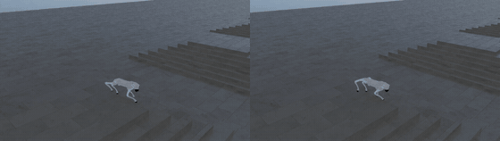

# Unitree Go2 rough terrain PPO와 push curriculum

이 프로젝트는 Unitree Go2가 거친 지형에서 속도 명령을 따라 걷고, 몸통에 순간 외란을 받은 뒤에도 자세와 속도를 회복하도록 학습한 실험이다. NVIDIA Isaac Sim과 Isaac Lab에서 4,096개 환경을 병렬로 돌렸고, RSL-RL의 PPO로 baseline과 push curriculum을 각각 3개 seed에서 학습했다.

비교할 때는 지형, 관측, 보상, 네트워크, 학습 budget을 그대로 두고 `events.push_robot`만 바꿨다. 결과는 push curriculum의 회복률이 `+0.0617%p` 높았지만 seed별 방향이 엇갈렸고, bootstrap 신뢰구간도 0을 포함했다. 좋아 보이는 숫자를 성능 향상으로 포장하지 않고, 추적 오차가 줄어든 대신 torque와 mechanical power proxy가 늘어난 부분까지 함께 기록했다.



GIF는 좌측이 baseline, 우측이 push curriculum이다. 원본 영상의 생성 조건과 해시는 [G006 시각 증거 문서](G006_VISUAL_EVIDENCE.md)에 따로 남겼다.

## 프로젝트 요약

| 항목 | 내용 |
| --- | --- |
| 로봇 | Unitree Go2, 12개 관절 action |
| 시뮬레이터 | NVIDIA Isaac Sim `4.5.0`, PhysX GPU simulation |
| RL 프레임워크 | Isaac Lab `2.1.1` manager-based RL + RSL-RL `2.3.3` |
| 알고리즘 | PPO, actor-critic |
| 학습 방식 | 상태 기반, `cuda:0`, headless, 4,096 parallel environments |
| 비교 대상 | baseline 대 push curriculum |
| production 반복 | variant 2개 × training seed 3개 = 6 runs |
| run당 학습 | 1,500 iterations, rollout 24 steps/env, PPO 5 epochs, 4 mini-batches |
| 전체 학습량 | 884,736,000 transitions, 180,000 mini-batch optimizer updates |
| 전체 wall time | 29.25시간 |
| 평가 | 6,480 push trials + 540 guardrail trials |
| 결론 | 회복률 차이는 작았고 통계적 우월성은 확인되지 않음 |

## 사용한 도구와 실행 환경

| 구분 | 도구와 버전 | 맡은 역할 |
| --- | --- | --- |
| 물리·로봇 시뮬레이션 | NVIDIA Isaac Sim `4.5.0` | Go2 articulation, 접촉, PhysX 물리 계산 |
| RL 환경 | Isaac Lab `2.1.1`, commit `90b79bb2d44feb8d833f260f2bf37da3487180ba` | 관측·보상·event·curriculum을 manager 단위로 구성 |
| 강화학습 | RSL-RL `2.3.3` | PPO rollout, GAE, actor-critic update, checkpoint 저장 |
| 텐서 연산 | PyTorch `2.7.0+cu128`, CUDA `12.8` | 정책 추론과 학습 |
| 실험 제어 | PowerShell `7.6.5`, Python `3.10.15` | scale ladder, 6개 run queue, 재개·검증·보고서 생성 |
| 로그 | TensorBoard `2.21.0` | reward, episode length, terrain와 push curriculum 상태 기록 |
| 자원 감시 | `nvidia-smi` | 2초 간격 VRAM 측정과 종료 후 GPU 회수 확인 |
| 시각 증거 | Gymnasium RecordVideo, FFmpeg `8.1` | checkpoint 재생, GIF와 비교 스크린샷 생성 |

실행 장비는 Windows 11 Pro와 NVIDIA GeForce RTX 3060 12GB였다. production run의 최대 peak VRAM은 `9,022 MiB`로 측정됐다.

## headless 학습이 뜻하는 것

production 학습 보고서에는 모두 `headless=true`가 기록돼 있다. 학습 중 Isaac Sim 창과 viewport를 띄우지 않고, RGB 카메라 프레임도 만들지 않았다. 물리 시뮬레이션과 정책 학습은 그대로 GPU에서 실행한다.

정책이 받는 입력은 화면이 아니라 `235`차원 수치 벡터다. 몸통 속도와 자세, 관절 상태, 직전 action, 목표 속도, 지면 높이 ray scan이 여기에 들어간다. 지면 정보도 RGB나 depth image가 아니라 로봇 주변 높이를 수치로 읽은 `187`개 ray sample이다. 이 구성을 택해 12GB GPU에서 4,096개 환경을 병렬로 실행했다.

영상 녹화는 학습과 분리했다. 학습이 끝난 뒤 checkpoint 하나와 환경 하나만 불러와 headless viewport capture를 켰다. 이때의 `headless`는 UI가 숨겨진 상태를 뜻하며, 영상 프레임을 얻기 위한 viewport와 D3D12 renderer는 별도로 활성화했다. 따라서 GIF의 렌더링 비용은 production 학습 처리량에 포함되지 않는다.

## 환경과 MDP 구성

### 시뮬레이션 주기

| 설정 | 값 |
| --- | ---: |
| PhysX simulation timestep | `0.005 s` (`200 Hz`) |
| control decimation | `4` physics steps |
| policy/control timestep | `0.02 s` (`50 Hz`) |
| episode 제한 | `20 s`, 최대 1,000 policy steps |
| velocity command 갱신 | `10 s` |
| command 범위 | x/y 선속도 `-1.0~1.0 m/s`, yaw rate `-1.0~1.0 rad/s` |

PPO가 action 하나를 내면 같은 관절 목표를 네 번의 PhysX step 동안 적용한다. 몸통이 바닥에 닿으면 episode를 종료하고, 20초를 채우면 timeout으로 reset한다.

### 관측과 action

| policy observation | 차원 | 학습 시 처리 |
| --- | ---: | --- |
| body linear velocity | 3 | uniform noise `±0.1` |
| body angular velocity | 3 | uniform noise `±0.2` |
| projected gravity | 3 | uniform noise `±0.05` |
| velocity command | 3 | x/y/yaw 목표 |
| relative joint position | 12 | uniform noise `±0.01` |
| relative joint velocity | 12 | uniform noise `±1.5` |
| previous action | 12 | 직전 정책 출력 |
| height scan | 187 | uniform noise `±0.1`, `[-1, 1]` clip |
| 합계 | 235 | 하나의 policy vector로 연결 |

action은 12개 관절의 position target이다. 정책 출력에 Go2 기본 관절 자세를 offset으로 더하고 scale `0.25`를 적용한다. 토크를 직접 출력하는 정책은 아니다.

### actor와 critic

actor와 critic은 관측 `235`차원을 각각 입력받는 MLP다. hidden layer는 `[512, 256, 128]`, activation은 ELU를 사용했다. actor는 12차원 action mean을 출력하고 초기 exploration noise standard deviation은 `1.0`이다. critic의 마지막 출력은 state value 하나다. empirical observation normalization은 사용하지 않았다.

```text
Actor: 235 -> 512 -> 256 -> 128 -> 12
Critic: 235 -> 512 -> 256 -> 128 -> 1
Activation: ELU
```

### 보상 함수

runtime log에서 확인한 non-zero reward weight는 다음과 같다.

| reward term | weight | 의도 |
| --- | ---: | --- |
| `track_lin_vel_xy_exp` | `+1.5` | x/y 속도 명령 추종 |
| `track_ang_vel_z_exp` | `+0.75` | yaw rate 명령 추종 |
| `lin_vel_z_l2` | `-2.0` | 몸통의 수직 흔들림 억제 |
| `ang_vel_xy_l2` | `-0.05` | roll/pitch 방향 각속도 억제 |
| `dof_torques_l2` | `-0.0002` | 큰 관절 torque 억제 |
| `dof_acc_l2` | `-2.5e-7` | 급격한 관절 가속 억제 |
| `action_rate_l2` | `-0.01` | action 변화량 억제 |
| `feet_air_time` | `+0.01` | 발의 swing time 유도 |

`flat_orientation_l2`와 `dof_pos_limits`는 manager에 등록돼 있지만 weight가 `0.0`이라 학습 목적함수에는 기여하지 않는다. Go2 몸통의 base contact는 reward가 아니라 termination 조건으로 처리했다.

### rough terrain과 randomization

학습 지형은 Isaac Lab의 rough terrain generator를 사용했다. `8 m × 8 m` patch를 10행 20열로 만들고, 계단·역계단·box·random rough·경사·역경사를 섞었다. Go2 크기에 맞춰 box 높이를 `0.025~0.10 m`, random rough noise를 `0.01~0.06 m`로 낮췄다.

terrain curriculum은 로봇이 해당 patch에서 이동한 거리를 보고 난도를 올리거나 내린다. baseline과 push curriculum 모두 같은 지형 curriculum을 사용했다. 두 정책의 차이를 외란 event 하나로 제한하기 위한 선택이다.

학습 중에는 다음 변동을 공통으로 적용했다.

- base mass에 `-1~+3 kg`를 더한다.
- reset 위치는 x/y 각각 `-0.5~0.5 m`, yaw는 `-3.14~3.14 rad`에서 뽑는다.
- 관측값에는 위 표의 uniform noise를 넣는다.
- startup material 값은 static friction `0.8`, dynamic friction `0.6`, restitution `0.0`으로 고정한다.
- Go2 설정에서는 base center-of-mass randomization을 사용하지 않는다.

평가에서는 observation noise와 event randomization을 모두 껐다. 학습 때의 랜덤 요인이 평가 분산에 섞이지 않도록 고정된 terrain, command, 초기 상태, push 조건만 사용했다.

## PPO 학습 설정

| 항목 | 값 |
| --- | ---: |
| algorithm | PPO |
| rollout length | 환경당 24 steps |
| parallel environments | 4,096 |
| rollout batch | 98,304 transitions/iteration |
| mini-batches | epoch당 4개 |
| mini-batch 크기 | 24,576 transitions |
| learning epochs | rollout batch당 5 epochs |
| iterations | run당 1,500 |
| optimizer updates | iteration당 20회, run당 30,000회 |
| learning rate | `1.0e-3`, adaptive schedule |
| PPO clip | `0.2` |
| discount `gamma` | `0.99` |
| GAE `lambda` | `0.95` |
| target KL | `0.01` |
| entropy coefficient | `0.01` |
| value loss coefficient | `1.0` |
| clipped value loss | 사용 |
| gradient norm limit | `1.0` |
| checkpoint interval | 50 iterations |

RSL-RL에서 iteration 하나는 다음 순서로 진행된다.

```text
4,096 env × 24 steps = 98,304 transition 수집
98,304 / 4 mini-batches = mini-batch당 24,576 transition
4 mini-batches × 5 epochs = iteration당 20 optimizer updates
1,500 iterations = run당 147,456,000 transition, 30,000 updates
6 production runs = 884,736,000 transition, 180,000 updates
```

여기서 epoch는 새 simulation data를 다시 모으는 횟수가 아니다. rollout batch를 한 번 무작위로 나눈 4개 mini-batch를 5번 반복해 학습한다. 5 epoch가 끝나면 기존 batch를 버리고 4,096개 환경에서 다음 24 step을 수집한다.

## push curriculum 설계

baseline은 학습 중 push event를 끈 상태다. push curriculum은 10~15초마다 각 환경의 로봇에 body XY 방향 delta velocity를 더한다. 방향은 `0~2π`에서 균일하게 뽑고, 로봇의 현재 yaw를 적용해 world frame으로 변환한다. `is_global_time=false`이므로 4,096개 환경의 push timer가 서로 독립적이다.

| 학습 구간 | common step | PPO iteration | push magnitude |
| --- | ---: | ---: | ---: |
| stage 0 | `0~11,999` | `0~499` | `0.10~0.25 m/s` |
| stage 1 | `12,000~23,999` | `500~999` | `0.25~0.50 m/s` |
| stage 2 | `24,000~35,999` | `1,000~1,499` | `0.50~1.00 m/s` |

각 iteration이 24 control step이므로 stage 경계가 500 iteration 간격과 정확히 맞는다. TensorBoard에는 stage별 event 수와 실제 magnitude의 최소·평균·최댓값을 기록해 curriculum이 설정대로 실행됐는지 검사했다.

## production 실행 규모와 자원 사용

4,096개 환경을 바로 production에 넣지 않았다. 1,024, 2,048, 4,096 환경 순서로 scale ladder를 돌리고, VRAM 측정과 프로세스 종료 후 GPU 회수 조건을 통과한 뒤 4,096을 공통 환경 수로 선택했다.

| variant | seed | wall time | 평균 steps/s | median steps/s | peak VRAM |
| --- | ---: | ---: | ---: | ---: | ---: |
| baseline | 42 | 4.854 h | 8,548.25 | 8,725.0 | 7,889 MiB |
| baseline | 43 | 4.984 h | 8,333.55 | 8,543.0 | 7,719 MiB |
| baseline | 44 | 4.424 h | 9,478.04 | 9,959.0 | 7,856 MiB |
| push curriculum | 42 | 5.182 h | 8,074.10 | 8,040.5 | 7,780 MiB |
| push curriculum | 43 | 5.190 h | 8,046.65 | 8,178.0 | 7,735 MiB |
| push curriculum | 44 | 4.618 h | 9,036.51 | 9,093.5 | 9,022 MiB |

6개 run은 모두 `1499/1500` iteration 표기까지 완료하고 `model_1499.pt`를 저장했다. 표기가 1499에서 끝나는 이유는 iteration index가 0부터 시작하기 때문이다. run 평균 처리량의 평균은 `8,586.18 steps/s`, 전체 wall time은 `29.25시간`이다.

## 평가 프로토콜

학습 reward나 영상만으로 두 정책을 비교하지 않았다. 각 checkpoint를 별도 headless evaluator에 넣고, 학습 때 쓰지 않은 고정 조건에서 같은 trial grid를 실행했다.

| 평가 축 | 설정 |
| --- | --- |
| training seeds | 42, 43, 44 |
| evaluation/terrain seed | `20260824` |
| terrain 난도 | held-out row 1, 4, 8 |
| command | 전진 `(0.75, 0, 0)`, 횡이동 `(0, 0.50, 0)`, 회전 `(0.50, 0, 0.50)` |
| push 방향 | body frame 전·후·좌·우 |
| push 크기 | `0.5`, `1.0`, `1.5 m/s` |
| push 시점 | completed step 200, simulation time 4.0초 |
| 회복 판정 구간 | step 201~450 |
| 전체 horizon | 600 steps, 12초 |
| push trials | seed·variant당 108 cells × 10 = 1,080 |
| guardrail trials | seed·variant당 9 cells × 10 = 90 |

회복 성공은 선속도 오차 `0.30 m/s` 이하, yaw rate 오차 `0.30 rad/s` 이하, roll과 pitch 절댓값 `0.35 rad` 이하를 25 step 연속 유지하는 조건이다. 이 조건을 만족해도 몸통이 바닥에 닿거나 12초 horizon까지 생존하지 못하면 성공으로 세지 않았다.

전체 비교에는 6,480개 push trial과 540개 no-push guardrail trial이 들어갔다. recovery rate에는 Wilson 95% interval을 계산했고, 108개 고정 stratum을 같은 비중으로 뽑는 paired hierarchical bootstrap을 10,000회 수행했다.

## 결과

| 지표 | baseline | push curriculum | 차이 |
| --- | ---: | ---: | ---: |
| push 회복률 | 3225/3240 (`99.5370%`) | 3227/3240 (`99.5988%`) | `+0.0617%p` |
| push horizon 생존률 | 3235/3240 (`99.8457%`) | 3231/3240 (`99.7222%`) | `-0.1235%p` |
| guardrail 생존률 | 270/270 (`100%`) | 270/270 (`100%`) | `0%p` |
| tracking error squared mean | `0.029994` | `0.027256` | `-9.1290%` |
| yaw error squared mean | `0.014111` | `0.012737` | `-9.7386%` |
| torque L2 mean | `200.289065` | `209.184042` | `+4.4411%` |
| mechanical power proxy | `35.583149` | `36.868460` | `+3.6121%` |

paired bootstrap의 회복률 차이 추정치는 `+0.0619%p`, 95% 신뢰구간은 `-0.7716%p~+0.9568%p`였다. seed 42에서는 push curriculum이 앞섰지만 seed 44에서는 baseline이 앞섰다. 이 결과로는 push curriculum의 우월성을 주장할 수 없다.

대신 어떤 trade-off가 생겼는지는 확인할 수 있었다. push curriculum 정책은 속도와 yaw 추적 오차가 낮았고 action 변화량도 조금 줄었다. torque와 mechanical power proxy는 늘었다. mechanical power는 `sum(abs(torque × joint_velocity))`로 계산한 simulation proxy이며 배터리 소비 전력은 아니다.

## 구현한 실험 인프라

- [rough 환경 설정](../src/isaac_walk_g006/rough_env_cfg.py)에서 official Go2 rough config를 상속하고 baseline과 push variant의 차이를 `events.push_robot` 하나로 제한했다.
- [push event](../src/isaac_walk_g006/mdp/events.py)는 body frame 방향을 world frame으로 변환한 뒤 root velocity에 더하고, 실제 발생 횟수와 magnitude를 남긴다.
- [curriculum logger](../src/isaac_walk_g006/mdp/curriculums.py)는 push stage와 terrain level 분포를 TensorBoard에 기록한다.
- [실험 orchestrator](../scripts/run_g006_experiment.ps1)는 scale ladder, 6개 production run, checkpoint 검증, 평가, resume를 하나의 state machine으로 묶는다.
- [고정 evaluator](../scripts/evaluate_push_recovery.py)는 1,080개 trial을 병렬 생성하고 회복 판정 state machine, 경계 이탈 검사, 원시 metric 집계를 수행한다.
- [summary 생성기](../scripts/summarize_g006.py)는 seed 결과와 bootstrap을 모아 strict JSON을 만든다.
- 모든 checkpoint, protocol, training source bundle, evaluation source bundle, report에 SHA-256을 붙여 결과와 실행 코드를 연결했다.

한 run이 끝났다는 기준도 exit code 하나에 두지 않았다. 요청 iteration 도달, TensorBoard와 checkpoint 존재, fatal pattern 부재, GPU 측정 완료, 프로세스 종료 후 GPU 회수를 함께 검사했다. seed 44 push run에서 새 Codex 앱 GPU context 때문에 기존 회수 게이트가 false-negative를 냈을 때는 checkpoint와 raw log를 다시 검증하고 별도 attestation으로 복구 판정을 남겼다.

## 실행 명령

전체 실험의 coordinator 진입점은 다음과 같다.

```powershell
cd "$HOME\isaac-walk-rl"
.\scripts\run_g006_experiment.ps1
```

coordinator가 실제 training process를 시작할 때 사용한 형식은 다음과 같다. task와 seed를 바꿔 6개 production run을 만들었다.

```powershell
cd "$HOME\IsaacLab"
& "$HOME\IsaacLab\_isaac_sim\python.bat" `
  "$HOME\isaac-walk-rl\scripts\bootstrap_train_g006.py" `
  --task Isaac-G006-Velocity-Rough-Go2-PushCurriculum-v0 `
  --num_envs 4096 `
  --max_iterations 1500 `
  --seed 42 `
  --run_name g006_production_push_curriculum_e4096_i1500_s42 `
  --headless
```

## 근거 파일과 한계

- 실험 계약: [configs/g006_rough_push.json](../configs/g006_rough_push.json)
- 정량 결과 원문: [reports/runs/g006_summary.json](../reports/runs/g006_summary.json)
- run별 상태·checkpoint 해시: [reports/runs/g006_queue_state.json](../reports/runs/g006_queue_state.json)
- 결과 해석: [G006_ROUGH_PUSH_RECOVERY.md](G006_ROUGH_PUSH_RECOVERY.md)
- GIF·스크린샷·원본 영상 해시: [G006_VISUAL_EVIDENCE.md](G006_VISUAL_EVIDENCE.md)

이 결과는 simulation에서 상태 관측을 사용하는 정책에 한정된다. 카메라 기반 perception, 실제 Go2 하드웨어, actuator 지연, 통신 지연, 배터리와 열 특성은 다루지 않았다. variant당 training seed가 3개라 작은 차이의 통계 검정에도 한계가 있다. 따라서 이 작업의 산출물은 sim-to-real 완료가 아니라, 비교 조건을 통제한 rough-terrain PPO 학습과 외란 회복 평가 파이프라인이다.
