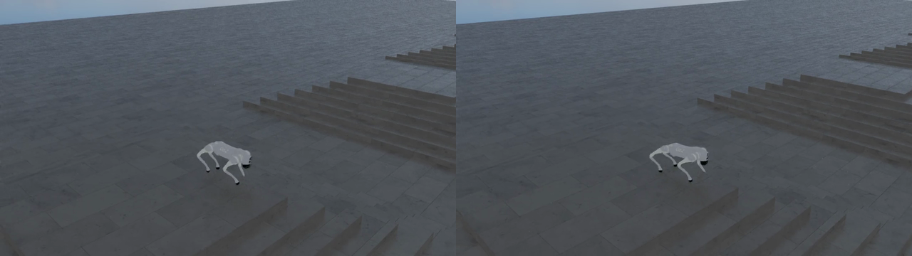
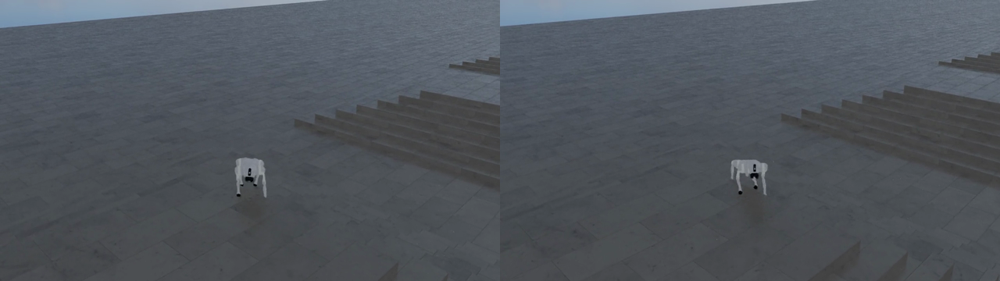

# G006 주요 작동 시각 증거

## 결과

seed 42의 production baseline과 push-curriculum checkpoint를 동일한 push-enabled rough task에서 각각 800스텝 재생했다. 두 정책 모두 샘플링한 외란 구간에서 자세를 유지하며 보행을 계속했고, 단일 재생 영상에서 한쪽의 명확한 우월성은 관찰되지 않았다.

아래 비교 자료는 모두 **좌측 baseline / 우측 push curriculum**이다. GIF는 시뮬레이션 약 9.6초부터 6.2초 구간을 4fps로 축약했다.


## 비교 스크린샷

시뮬레이션 10.4초:



시뮬레이션 13.6초:



## 재생 조건

| 항목 | 값 |
| --- | --- |
| task | 두 checkpoint 모두 `Isaac-G006-Velocity-Rough-Go2-PushCurriculum-v0` |
| checkpoint | seed 42, iteration 1499 |
| 환경 수 | 1 |
| 요청 길이 | 800 simulation steps (`step_dt=0.02`, 약 16초) |
| 인코딩 결과 | 각 799 frames, 15.98초, H.264, 1280×720, 50fps |
| 물리·정책 device | `cuda:0` |
| renderer | `performance`, D3D12, headless viewport capture |
| capture-only 설정 | 로봇 추적 카메라, command debug 표시 비활성화, 1개 환경 clone 복제 비활성화 |

baseline checkpoint SHA-256은 `4ad0d9889b6e1163a81322ccc0afe0095824aac297af7cea4304eb05f59edcfd`, push-curriculum checkpoint SHA-256은 `e91fc238d531f18e173c45d24d7ab77d111e2c279ea095cd39ffe058027b858c`다.

두 정책을 같은 push-enabled task에서 재생했으므로 화면에 나타나는 지형·명령·외란 조건은 일치한다. 이 재생은 작동 확인용이며 production 평가 프로토콜을 대체하지 않는다.

## 재현 명령과 provenance

캡처는 IsaacLab commit `90b79bb2d44feb8d833f260f2bf37da3487180ba`에서 수행했다. 공식 재생 진입점 `%USERPROFILE%\IsaacLab\scripts\reinforcement_learning\rsl_rl\play.py`의 SHA-256은 `0966feac5a96812fca880e3731e96b001918b57fa372f69e4cf5fdca538bd7bd`다. 전체 MP4 캡처 당시 `scripts\record_g006_policy.py` SHA-256은 `2d74fe41bb7a1f28f782f20d7f0556a5e30ad91dab99970c17544d71c3489e41`이며, 캡처 후 기존 `--kit_args` 병합과 upstream 해시 검증을 fail-safe로 강화한 현재 wrapper SHA-256은 `4eef87e63b6b9fd43e478b72491c5283d4ea9e7c99a46faac8d52b56abeb3054`다. 아래 명령의 캡처 설정은 원본 생성 조건과 동일하다.

baseline 재현 명령:

```powershell
cd "$HOME\IsaacLab"
.\isaaclab.bat -p "$HOME\isaac-walk-rl\scripts\record_g006_policy.py" `
  --task Isaac-G006-Velocity-Rough-Go2-PushCurriculum-v0 `
  --checkpoint "$HOME\IsaacLab\logs\rsl_rl\unitree_go2_rough\2026-08-24_18-31-51_g006_production_baseline_e4096_i1500_s42\model_1499.pt" `
  --video --video_length 800 --num_envs 1 --seed 42 `
  --device cuda:0 --headless --rendering_mode performance
```

push-curriculum 재현 명령:

```powershell
cd "$HOME\IsaacLab"
.\isaaclab.bat -p "$HOME\isaac-walk-rl\scripts\record_g006_policy.py" `
  --task Isaac-G006-Velocity-Rough-Go2-PushCurriculum-v0 `
  --checkpoint "$HOME\IsaacLab\logs\rsl_rl\unitree_go2_rough\2026-08-25_08-56-42_g006_production_push_curriculum_e4096_i1500_s42\model_1499.pt" `
  --video --video_length 800 --num_envs 1 --seed 42 `
  --device cuda:0 --headless --rendering_mode performance
```

Windows용 D3D12 전환, UI 숨김, 로봇 추적 카메라와 capture-only Hydra override는 wrapper가 주입한다. wrapper는 공식 `play.py`가 위 해시와 다르거나 D3D12/UI 옵션과 충돌하는 `--kit_args`가 있으면 실행을 중단한다. 전체 캡처 로그는 로컬 전용이며 baseline은 `%USERPROFILE%\IsaacLab\logs\visual_evidence\g006\record_baseline_800.log` (SHA-256 `120064a72144d1a94f42ce27e411d328cb591d32b217070d2e0f4e36f4009deb`), push curriculum은 `%USERPROFILE%\IsaacLab\logs\visual_evidence\g006\record_push_800.log` (SHA-256 `257f9aa8d0aa970dfaaabc19e0843dcc269b0a73200fa6074995a46ae6215cf1`)에 보관했다.

GIF와 PNG는 `ffmpeg 8.1-full_build-www.gyan.dev`로 다음과 같이 만들었다.

```powershell
$baseline = "$HOME\IsaacLab\logs\visual_evidence\g006\g006_baseline_s42.mp4"
$push = "$HOME\IsaacLab\logs\visual_evidence\g006\g006_push_curriculum_s42.mp4"
$media = "$HOME\isaac-walk-rl\docs\media\g006"

ffmpeg -y -ss 9.6 -t 6.2 -i $baseline -ss 9.6 -t 6.2 -i $push `
  -filter_complex "[0:v]fps=4,scale=280:-2:flags=lanczos,setpts=PTS-STARTPTS[left];[1:v]fps=4,scale=280:-2:flags=lanczos,setpts=PTS-STARTPTS[right];[left][right]hstack=inputs=2,split[s0][s1];[s0]palettegen=max_colors=40:stats_mode=diff[p];[s1][p]paletteuse=dither=bayer:bayer_scale=4:diff_mode=rectangle" `
  -loop 0 "$media\g006_policy_comparison.gif"

ffmpeg -y -ss 10.4 -i $baseline -ss 10.4 -i $push `
  -filter_complex "[0:v]scale=640:-2:flags=lanczos[left];[1:v]scale=640:-2:flags=lanczos[right];[left][right]hstack=inputs=2" `
  -frames:v 1 "$media\g006_comparison_10_4s.png"

ffmpeg -y -ss 13.6 -i $baseline -ss 13.6 -i $push `
  -filter_complex "[0:v]scale=640:-2:flags=lanczos[left];[1:v]scale=640:-2:flags=lanczos[right];[left][right]hstack=inputs=2" `
  -frames:v 1 "$media\g006_comparison_13_6s.png"
```

## 로컬 전용 원본 영상

원본 MP4는 Git에 포함하지 않고 사용자 로컬에만 보관했다.

| variant | 로컬 경로 | SHA-256 | 크기 |
| --- | --- | --- | ---: |
| baseline | `%USERPROFILE%\IsaacLab\logs\visual_evidence\g006\g006_baseline_s42.mp4` | `6a149e5329692cf41852f49834a1661cd77aa4c0b3e55899825f18c9163ddc78` | 2,258,914 bytes |
| push curriculum | `%USERPROFILE%\IsaacLab\logs\visual_evidence\g006\g006_push_curriculum_s42.mp4` | `d9ae6094fbcd0a430137ac96a9e8ab66acef74e50ca700b5857e6af6c25ba315` | 2,246,761 bytes |

## GitHub 시각 자료 무결성

| 파일 | 규격 | SHA-256 |
| --- | --- | --- |
| `g006_policy_comparison.gif` | 560×158, 4fps, 25 frames, 6.25초, 862,540 bytes | `188f355145d77a0c7666376513f37536607bf02fe0f77000d6aee95a44b2f45a` |
| `g006_comparison_10_4s.png` | 1280×360, 362,088 bytes | `e7f54b086e3905917113ef6d51c6fd680b7f59460ea6770218af6a8626d8dfee` |
| `g006_comparison_13_6s.png` | 1280×360, 371,301 bytes | `cd8aa7613e1b44792cbb721416c84ebbe4625baa21b48059ae7fbbc43bf28252` |

## 해석과 한계

- 두 영상 모두 10~15초 외란 스케줄 구간을 포함하며, 샘플링한 프레임에서는 넘어짐 없이 보행이 이어졌다.
- 단일 seed·단일 환경의 정성 재생이므로 작은 자세 차이를 성능 차이로 일반화하지 않는다.
- production 정량 결과는 회복률 `99.5370%` 대 `99.5988%`, 차이 `+0.0617%p`였으나 paired bootstrap 95% CI가 `-0.7716%p ~ +0.9568%p`로 0을 포함한다. 시각 결과도 “양쪽 모두 강건하지만 우월성은 입증되지 않음”이라는 판정과 모순되지 않는다.
- 현재 Windows 드라이버에서 Isaac Sim 4.5의 Vulkan viewport 초기화가 access violation을 일으켜 D3D12로 캡처했다. D3D12는 Go2 UV primvar 경고로 재질이 단순한 흰색에 가깝게 보이지만, 관절 운동·자세·지형 접촉은 확인할 수 있다.
- `isaaclab.bat -p`는 정상 완료 후에도 알려진 nested batch 문제로 exit 1을 전달했다. 완료 판정은 프로세스 종료, MP4 close, ffprobe 프레임·duration 검사, 추출 프레임 육안 확인으로 수행했다.

정량 판정과 전체 실험 계약은 [`G006_ROUGH_PUSH_RECOVERY.md`](G006_ROUGH_PUSH_RECOVERY.md), 정량 summary는 [`../reports/runs/g006_summary.json`](../reports/runs/g006_summary.json)을 기준으로 한다.
