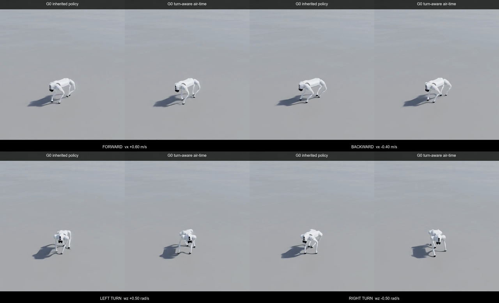

# G008 보상함수와 불규칙 도로 curriculum

- 실행 시점: 2026-08-26~27 KST
- 시뮬레이터: Isaac Sim 4.5.0, Isaac Lab v2.1.1
- 로봇: Isaac Lab 내장 Unitree Go2
- 학습기: RSL-RL 2.3.3 PPO
- 실행 방식: Windows 네이티브, `cuda:0`, headless
- 최종 판정: G0 형상 단계 미통과, 저마찰 F1 진입 보류

## 결론부터 말하면

강화학습은 실제로 두 번 더 수행했다. 기존 friction S1 정책에서 시작해 균일 마찰 불규칙 도로 G0를 `128환경 × 300 iterations` 학습했고, 이어서 순수 회전에서 꺼지던 발 공중시간 보상만 고친 T1도 같은 예산으로 학습했다. 두 실행은 각각 `921,600 transitions`, `6,000 PPO mini-batch updates`를 처리했다.

그렇지만 새 checkpoint는 채택하지 않았다. 기존 정책은 세 지형 seed 중 두 개, 전체 12개 방향 조건 중 11개를 통과했다. G0 추가 학습의 최선 후보와 T1의 최선 후보는 모두 세 지형에서 우회전에 실패했다. 짧은 16환경 screening은 통과했지만 32환경·500-step 정식 평가에서는 재현되지 않았다.

따라서 `0.60/0.45 ↔ 0.80/0.60` 두 마찰 구간을 섞는 F1을 지금 열지 않는다. 기하 형상만 둔 G0도 통과하지 못한 상태에서 마찰 난이도를 올리면 회전 추종, 자세, 미끄럼의 원인을 다시 섞게 된다.




영상은 한 환경의 재생 결과다. 정책 채택과 stage 통과 여부는 `reports/runs/g008_road_curriculum_summary_s20260826.json`에 묶은 다중 환경 정량 평가로 결정했다.

## 보상함수는 무엇인가

보상 설정은 설명을 보고 옮겨 적지 않았다. 실제 등록 태스크를 Isaac Lab 런타임에서 열어 최종 함수, 가중치, 매개변수와 원본 소스 SHA-256을 추출했다. 기계 판독 가능한 원본은 `reports/runs/g008_reward_contract_s20260826.json`이다.

한 control step의 총보상은 다음과 같다.

\[
r_t=\Delta t\sum_i w_i\rho_i(t),\qquad \Delta t=0.02\;\mathrm{s}
\]

Isaac Lab RewardManager는 각 항의 `weight`에 control step 시간 `0.02s`를 곱한다. 물리 적분은 `0.005s`, 정책 action 갱신은 네 물리 step마다 한 번이라 50Hz다.

### 활성 보상 항

| 이름 | 가중치 | 원시 계산식 | 의미 |
| --- | ---: | --- | --- |
| `track_lin_vel_xy_exp` | `+1.5` | `exp(-||v_cmd,xy-v_base,xy||²/0.5²)` | 전후·측방 선속도 추종 |
| `track_ang_vel_z_exp` | `+0.75` | `exp(-(ω_cmd,z-ω_base,z)²/0.5²)` | 좌우 yaw-rate 추종 |
| `lin_vel_z_l2` | `-2.0` | `v_base,z²` | 불필요한 수직 운동 억제 |
| `ang_vel_xy_l2` | `-0.05` | `ω_base,x²+ω_base,y²` | roll·pitch 각속도 억제 |
| `dof_torques_l2` | `-0.0002` | `Στ_j²` | 큰 관절 토크 억제 |
| `dof_acc_l2` | `-2.5e-7` | `Σq̈_j²` | 급한 관절 가속 억제 |
| `action_rate_l2` | `-0.01` | `Σ(a_t,j-a_t-1,j)²` | action 진동 억제 |
| `feet_air_time` | `+0.01` | `Σ((last_air_time-0.5s)·first_contact)·gate` | 발을 들어 다음 접촉까지 유지 |

기존 `feet_air_time`의 gate는 다음 하나뿐이다.

\[
gate_{base}=I(\lVert v_{cmd,xy}\rVert>0.1\;\mathrm{m/s})
\]

전진과 후진에서는 켜지지만 제자리 좌·우회전 명령 `[0,0,±0.5]`에서는 꺼진다. 제자리 회전도 발마다 $\omega\times r_i$에 해당하는 접선 운동이 필요한데, 기존 항은 yaw 명령을 보지 않는다.

### 설정에는 있지만 비활성인 항

| 이름 | 가중치 또는 상태 | 결과 |
| --- | --- | --- |
| `flat_orientation_l2` | `0.0` | 계산하지 않음 |
| `dof_pos_limits` | `0.0` | 계산하지 않음 |
| `undesired_contacts` | `None` | Go2 설정에서 제거됨 |

base 접촉 force가 `1N`을 넘으면 episode가 끝나지만 별도의 scalar termination penalty는 없다. 평가에서 사용하는 최대 roll·pitch와 접촉 중 발 미끄럼도 현재 목적함수에 직접 들어가지 않는다. `ang_vel_xy_l2`가 roll·pitch 각속도를 간접 억제할 뿐, 기울어진 자세 자체를 벌점으로 주는 항은 비활성이다.

## T1에서 보상 하나만 어떻게 바꿨는가

T1은 `feet_air_time`의 가중치 `+0.01`, 공중시간 기준 `0.5s`, 나머지 일곱 활성 항, PPO 설정, 도로와 마찰을 모두 유지했다. gate에 yaw 조건만 추가했다.

\[
gate_{T1}=I\left(\lVert v_{cmd,xy}\rVert>0.1\;\mathrm{m/s}\;\lor\;|\omega_{cmd,z}|>0.1\;\mathrm{rad/s}\right)
\]

`G008IrregularRoadTurnAirTimeEnvCfg`와 G0의 전체 설정 diff는 다음 두 경로뿐이다.

- `rewards.feet_air_time.func`
- `rewards.feet_air_time.params.yaw_command_threshold`

테스트에서는 `[0,0,+0.5]` 순수 yaw 명령에 보상이 실제로 켜지고 `[0,0,0]`에서는 0이 되는지 수치로 확인했다. 런타임 보상 보고서도 PPO와 비보상 설정이 기존 태스크와 같고 이 항 하나만 다른지 검사한다.

여기서 중요한 부호 문제가 드러났다. 이 항은 `last_air_time-0.5s`라서 발이 0.5초보다 빨리 다시 닿으면 원시값이 음수가 된다. T1 학습 중 `Episode_Reward/feet_air_time`도 계속 작은 음수였다. 순수 회전에서 항을 켜는 수정은 논리적 누락을 고쳤지만, 현재 gait의 짧은 swing에는 오히려 추가 벌점이 될 수 있다. T1이 실패한 뒤 가중치를 무작정 키우지 않은 이유다.

## G0는 무엇을 분리했는가

기존 S1 도로는 하나의 비주기 높이 field 위에 네 마찰 구간을 함께 배치했다. G0는 높이 vertex, cell 크기, crown, 굴곡, 거칠기, 함몰을 그대로 두고 바닥 재질만 한 종류로 바꿨다.

| 항목 | G0 값 |
| --- | ---: |
| 도로 범위 | x/y 각각 `-28~28m` |
| cell 크기 | `0.25m` |
| cell 수 | `224×224=50,176` |
| static/dynamic 마찰 | 전체 `0.8/0.6` |
| road crown | `0.015m` |
| 긴 파장 굴곡 amplitude | `0.030m` |
| 표면 roughness amplitude | `0.012m` |
| 함몰 깊이 설정 | `0.025m` |

G0와 네 구간 혼합 도로의 설정 차이는 `static_friction`, `dynamic_friction`, 시각화 색 세 경로뿐이다. 로봇 발 material은 `1.0/1.0`, combine mode는 `multiply`라 유효 마찰은 바닥의 `0.8/0.6`이다.

세 terrain seed의 전체 높이차는 약 `8.1~8.2cm`, 최대 국부 경사는 약 `2.48~3.90°`였다. 동일 checkpoint를 세 도로에 배치해 특정 도로 한 장면에 맞춘 결과인지 확인했다.

## 학습은 어떻게 돌렸는가

두 실험은 friction S1에서 선택한 `model_2097.pt`에서 각각 독립적으로 시작했다. G0 학습 결과를 T1의 시작점으로 사용하지 않았다. 그래야 도로 적응과 보상 변경의 효과가 누적되어 섞이지 않는다.

### 공통 PPO 설정

| 항목 | 값 |
| --- | ---: |
| actor/critic | 각각 `512→256→128`, ELU |
| observation/action | `235 / 12` |
| rollout | 환경당 iteration마다 `24 steps` |
| PPO epochs | `5` |
| mini-batches/epoch | `4` |
| clip parameter | `0.2` |
| value loss coefficient | `1.0` |
| entropy coefficient | `0.01` |
| initial learning rate | `1e-3`, adaptive |
| discount `γ` | `0.99` |
| GAE `λ` | `0.95` |
| desired KL | `0.01` |
| max gradient norm | `1.0` |
| empirical normalization | 사용하지 않음 |

### 실제 실행량

| 실행 | 환경×iteration | transitions | optimizer update | wall time | 평균 처리량 | peak VRAM | final mean reward | final episode length |
| --- | ---: | ---: | ---: | ---: | ---: | ---: | ---: | ---: |
| G0, 보상 유지 | `128×300` | `921,600` | `6,000` | `537.494s` | `2,021.73 steps/s` | `5,463MiB` | `33.64` | `1,000.00` |
| T1, 회전 air-time gate | `128×300` | `921,600` | `6,000` | `586.972s` | `1,847.79 steps/s` | `5,271MiB` | `24.06` | `993.69` |

headless는 물리와 학습을 생략한 실행이 아니다. 창과 실시간 카메라만 끄고 PhysX 접촉, 187개 height scan, reward 계산, rollout 수집, advantage 계산과 PPO update는 GPU에서 그대로 수행했다. 영상은 학습을 끝낸 checkpoint를 별도의 off-screen 카메라 환경에서 추론만 돌려 만들었다.

## checkpoint 선별과 정식 평가

300 iterations 동안 50회 간격으로 저장된 `model_2100`, `2150`, `2200`, `2250`, `2300`, `2350`과 최종 `2396`을 검사했다.

1. 가장 어려웠던 terrain seed `20260828`에서 16환경·300-step screening을 한다.
2. 전 방향을 통과한 후보만 32환경·500-step 정식 평가로 올린다.
3. terrain seed `20260826`, `20260827`, `20260828`을 모두 평가한다.
4. 통과 seed 수, 전체 방향 PASS 수를 최대화한 뒤 낙상 수와 최악 normalized gate ratio를 최소화한다.

screening PASS는 채택 조건이 아니다. G0의 `model_2100`, `2250`과 T1의 `model_2100`이 screening을 통과했지만 모두 정식 평가에서 탈락했다.

### 전체 후보 결과

| 정책 | 통과 terrain seed | 방향 PASS | 낙상 | 최악 normalized gate ratio | 채택 |
| --- | ---: | ---: | ---: | ---: | --- |
| 기존 friction S1을 G0에서 재생 | `2/3` | `11/12` | `1` | `0.87` | 유지 |
| G0 PPO `model_2100` | `0/3` | `9/12` | `0` | `1.10` | 기각 |
| T1 PPO `model_2100` | `0/3` | `9/12` | `0` | `1.23` | 기각 |
| G0 PPO `model_2250` | `0/3` | `8/12` | `4` | `1.75` | 기각 |

기존 정책은 seed `20260826`, `20260827`을 통과했다. seed `20260828` 우회전에서는 추종과 자세 수치가 한계 안이었지만 8환경 중 1개가 넘어져 실패했다. 균일한 비교적 높은 마찰에서도 실패했으므로, 이 낙상을 낮은 마찰 하나로 설명할 수 없다.

### T1의 우회전 결과

| terrain seed | linear RMSE | yaw RMSE | max roll | max pitch | 낙상 | 판정 원인 |
| --- | ---: | ---: | ---: | ---: | ---: | --- |
| `20260826` | `0.0478m/s` | `0.2609rad/s` | `0.3060rad` | `0.1840rad` | `0` | yaw 기준 초과 |
| `20260827` | `0.0486m/s` | `0.2752rad/s` | `0.3033rad` | `0.1745rad` | `0` | yaw 기준 초과 |
| `20260828` | `0.1204m/s` | `0.2599rad/s` | `0.4311rad` | `0.3767rad` | `0` | yaw·roll·pitch 기준 초과 |

T1은 낙상을 없앴지만 우회전 yaw 추종을 세 seed에서 모두 잃었다. seed `20260828`에서는 자세 peak도 커졌다. “낙상이 줄었다” 하나만 보고 채택하면 목표 회전 속도를 내지 않는 보수적 정책을 고를 수 있다.

## 역학적으로 어떻게 해석해야 하는가

### 마찰보다 먼저 드러난 회전·형상 문제

마찰원뿔은 접선력 한계를 다음처럼 제한한다.

\[
\lVert F_t\rVert\leq \mu F_n
\]

G0는 모든 위치에서 같은 `μ_s/μ_d=0.8/0.6`을 사용한다. 그런데도 seed `20260828`에서 기존 정책이 한 번 넘어지고, G0·T1 추가 학습은 우회전 gate를 잃었다. 현재 증거는 “낮은 마찰 때문에만 실패했다”는 설명과 맞지 않는다. 지면 높이 차이, 회전 중 지지 다각형, 좌우 비대칭 gait와 checkpoint drift를 함께 봐야 한다.

제자리 회전의 yaw moment는 발 접촉력과 몸체 중심에서 발까지의 모멘트암으로 생긴다.

\[
\tau_z=\sum_i(r_{i,x}F_{i,y}-r_{i,y}F_{i,x})
\]

발 하나가 높은 셀이나 기울어진 triangle에 놓이면 법선력 (F_n), 가능한 접선력, 지지 다각형이 동시에 달라진다. 우회전만 반복해서 나빠지는 현상은 좌우 command 부호, 관절 action과 접촉 시계열까지 대칭 검사를 해야 한다. 지금 보고서만으로 특정 링크나 특정 발이 원인이라고 단정하지 않는다.

### 평균 reward와 최악 방향은 다른 지표다

학습 로그의 mean reward는 명령과 환경의 평균이다. 정식 평가는 순수 전진·후진·좌회전·우회전을 따로 고정하고 최악 방향을 본다. G0 학습은 episode length `1,000`과 mean reward `33.64`를 기록했지만 정식 우회전은 나빠졌다. 학습 실행 성공과 정책 채택을 분리해야 하는 이유다.

## 다음 고도화 순서

### R2. 방향별 reward 분해부터 기록한다

현재 TensorBoard는 여러 명령의 reward를 평균낸다. 다음 evaluator는 네 고정 방향마다 아래 값을 따로 누적해야 한다.

- 여덟 활성 reward의 raw 값과 `dt×weight` 적용값
- 발별 air time, contact time, first-contact 횟수
- 접촉 중 발 평면 속도와 접선/법선 force 비율
- 발별 yaw moment 기여 (r_xF_y-r_yF_x)
- roll·pitch peak 전후 0.5초의 command, achieved velocity, action, torque

T1의 `feet_air_time` 평균이 음수였다는 사실만으로 어느 방향이 벌점을 받았는지는 알 수 없다. 방향별 분해가 끝난 뒤에만 threshold를 조정한다.

### R3. air-time threshold를 단일 축으로 비교한다

T1 gate를 유지한 채 `0.5s` 기준을 `0.35s`, `0.25s`와 비교한다. 한 run에서 동시에 섞지 않고 같은 시작 checkpoint, `128×300`, 같은 seed와 평가 조건을 사용한다. 가중치 `+0.01`은 먼저 고정한다.

채택 조건은 mean reward가 아니라 다음과 같다.

- 세 terrain seed의 12/12 방향 PASS
- 낙상 0
- 기존 nominal 평면 guardrail 유지
- 좌우 yaw RMSE 차이와 roll/pitch peak가 악화되지 않음

### R4. 미끄럼과 자세는 별도 축으로 검증한다

air-time 실험이 실패하면 다음 두 항을 동시에 넣지 않는다.

1. Isaac Lab의 접촉 조건부 `feet_slide` 벌점
2. 지형 support plane에 대한 body up-vector 오차

`flat_orientation_l2`를 그대로 켜면 경사면의 정상적인 자세까지 벌점으로 셀 수 있다. 네 발 접촉점이나 height field에서 local support plane을 추정하고 그 법선과 body up-vector의 각도를 사용해야 한다. 미끄럼 벌점과 자세 항은 각각 독립 ablation으로 검증한다.

### C1. 학습 seed와 평가 seed를 분리한다

도로 생성 seed 하나에 오래 맞추지 않도록 학습 run을 여러 seed로 반복하고, checkpoint 선택에 쓰지 않은 held-out seed를 남긴다. 각 저장 checkpoint의 평가는 50 iterations 간격으로 하되, 짧은 screening은 탈락 필터로만 쓴다.

### A1. 마찰 적응은 이력 모델과 비교한다

height scan은 형상을 접촉 전에 볼 수 있지만 마찰계수는 observation에 직접 없다. 마찰은 미끄러진 뒤 base·관절 상태 변화로만 간접 추정한다. G0가 통과한 뒤 다음 세 모델을 같은 transition budget으로 비교한다.

- 현재 feed-forward MLP
- 짧은 state/action frame stack
- GRU 또는 RMA식 history adaptation module

RMA처럼 privileged friction·질량 정보를 쓰는 teacher와 history-based student를 구성하려면 별도 단계가 필요하다. 지금 T1 결과만으로 adaptation module을 추가하지 않는다.

### F1. 두 구간 마찰은 마지막 gate 뒤에 연다

G0의 세 terrain seed가 모두 통과한 정책이 생기면 그때 다음 두 구간을 공간적으로 섞는다.

- `0.80/0.60`
- `0.60/0.45`

F1 통과 뒤에만 `0.40/0.28`, 마지막에 `0.25/0.15`를 추가한다. 다리 링크 질량은 이 curriculum과 합치지 않고 별도 파트로 유지한다.

## 논문과 공식 구현에서 가져온 원칙

| 근거 | 이 프로젝트에 적용한 부분 | 아직 적용하지 않은 부분 |
| --- | --- | --- |
| [Isaac Lab v2.1.1 reward source](https://github.com/isaac-sim/IsaacLab/blob/v2.1.1/source/isaaclab_tasks/isaaclab_tasks/manager_based/locomotion/velocity/mdp/rewards.py) | 실제 `feet_air_time` gate와 `feet_slide` 접촉 조건을 원문 기준으로 확인 | 최신 버전 보상값을 현재 고정 버전에 그대로 이식하지 않음 |
| [Rudin et al., Learning to Walk in Minutes](https://proceedings.mlr.press/v164/rudin22a.html) | 병렬 PPO, 쉬운 지형부터 넓히는 curriculum, 고정 예산 비교 | 논문의 전체 terrain curriculum 재현은 아님 |
| [Margolis & Agrawal, Walk These Ways](https://proceedings.mlr.press/v205/margolis23a.html) | 하나의 정책 안에서도 gait 선택과 행동 다양성이 일반화에 영향을 준다는 관점 | gait parameter를 정책 입력으로 넣지 않음 |
| [Kumar et al., RMA](https://arxiv.org/abs/2107.04034) | 보이지 않는 마찰·payload를 history로 적응하는 후속 구조 | privileged teacher와 adaptation module 미구현 |
| [Miki et al., robust perceptive locomotion](https://arxiv.org/abs/2201.08117) | height scan과 proprioception을 함께 보고, perception과 접촉 반응을 구분 | attention/recurrent perception encoder와 실물 검증 미구현 |

이 문헌들은 설계 근거다. 현재 결과가 해당 논문을 재현했다는 뜻은 아니다.

## 시각 증거와 저장 위치

원본 영상은 Git에 넣지 않았다.

| 항목 | 위치 | 정책 |
| --- | --- | --- |
| G0 기존 정책 MP4 | `%USERPROFILE%\IsaacLab\logs\visual_evidence\g008\g008_road_g0_inherited_s20260826.mp4` | 로컬 전용 |
| T1 `model_2100` MP4 | `%USERPROFILE%\IsaacLab\logs\visual_evidence\g008\g008_road_g0_turn_air_i2100_s20260826.mp4` | 로컬 전용 |
| 동기화 비교 MP4 | `%USERPROFILE%\IsaacLab\logs\visual_evidence\g008\g008_road_g0_vs_turn_air_s20260826.mp4` | 로컬 전용 |
| 공개 GIF | `docs/media/g008/g008_road_g0_vs_turn_air.gif` | Git 공개, 720×438, 18초 |
| 접촉시트 | `docs/media/g008/g008_road_g0_vs_turn_air_contact_sheet.png` | Git 공개, 1280×780 |
| 무결성 보고서 | `reports/runs/g008_road_curriculum_visual_evidence.json` | Git 공개 |

각 capture JSON에는 task, checkpoint SHA-256, terrain seed, 마찰·높이 field readback, 900-step 명령 시퀀스와 원본 MP4 SHA-256이 들어 있다.

## 재현 명령

```powershell
cd "$HOME\isaac-walk-rl"

# G0: 같은 높이 형상, 균일 마찰, 기존 보상
.\scripts\run_g008_stage.ps1 `
  -Part irregular_road -Stage 0 `
  -NumEnvs 128 -MaxIterations 300 -Seed 20260826 `
  -ResumeRun 2026-08-26_11-37-54_g008_friction_s1_finetune_command_s42_e1024_i300 `
  -ResumeCheckpoint model_2097.pt `
  -RunName g008_road_geometry_g0_finetune_friction_s1_e128_i300_s20260826

# T1: G0와 같고 순수 yaw에서 feet_air_time만 활성화
.\scripts\run_g008_stage.ps1 `
  -Part irregular_road -Stage 0 -RewardVariant turn_air_time `
  -NumEnvs 128 -MaxIterations 300 -Seed 20260826 `
  -ResumeRun 2026-08-26_11-37-54_g008_friction_s1_finetune_command_s42_e1024_i300 `
  -ResumeCheckpoint model_2097.pt `
  -RunName g008_road_g0_turn_air_finetune_friction_s1_e128_i300_s20260826
```

평가와 촬영 명령의 전체 인자, checkpoint 경로와 SHA-256은 각 JSON 보고서에 남겼다.

## 해석 한계

- 모든 결과는 Isaac Sim 4.5/PhysX 시뮬레이션이다.
- 학습 seed는 `20260826` 하나이며, 세 terrain seed 평가는 일반화의 최소 gate다.
- 영상은 한 환경의 정성 증거다.
- 마찰계수, 링크 질량, 모터 강도와 지연을 실물 Go2에서 동정하지 않았다.
- 실제 도로와 실기체 시험이 없으므로 sim-to-real 완료나 실물 대응 마찰 한계를 주장하지 않는다.
