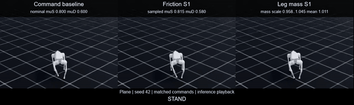
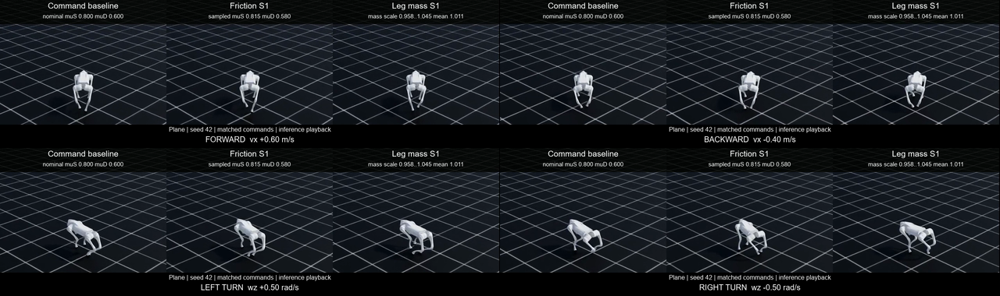
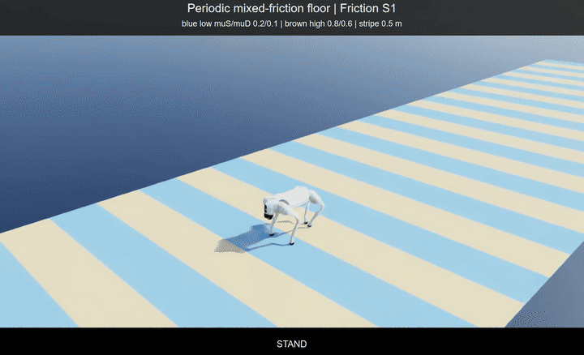
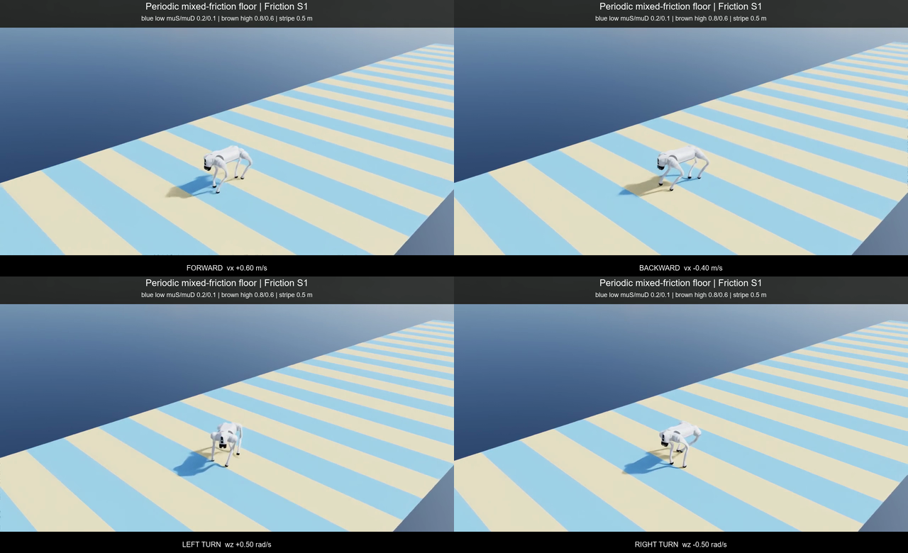
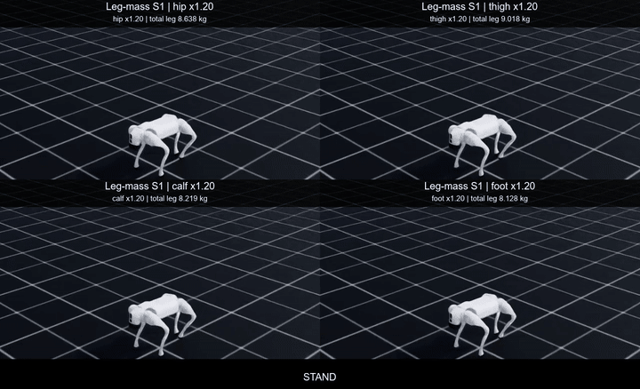
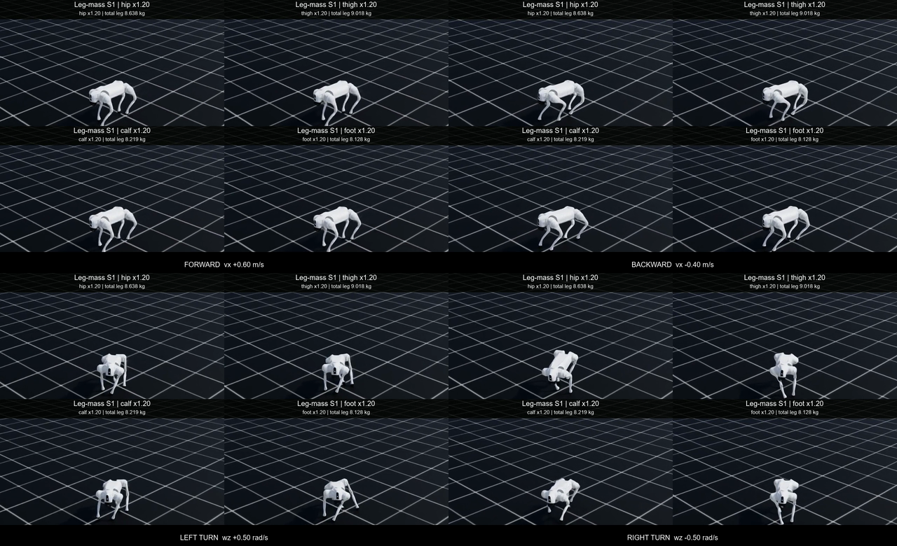
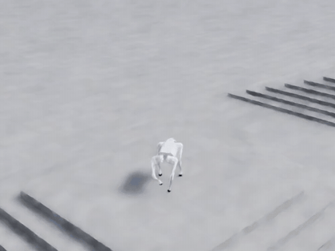
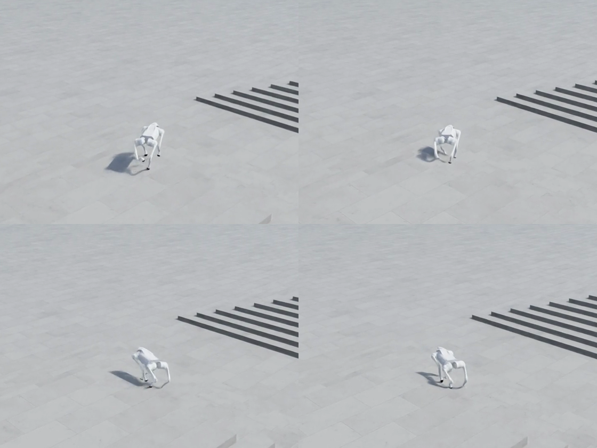
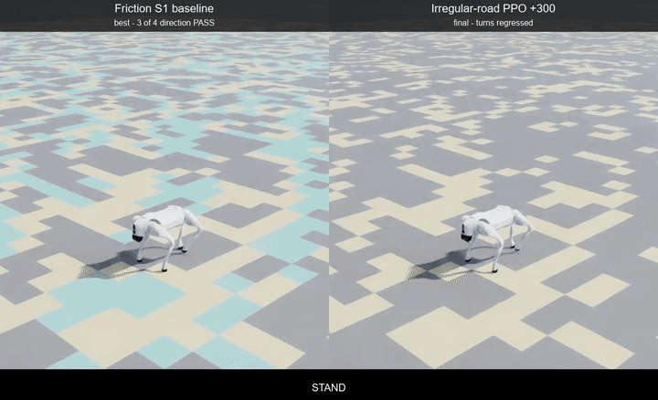
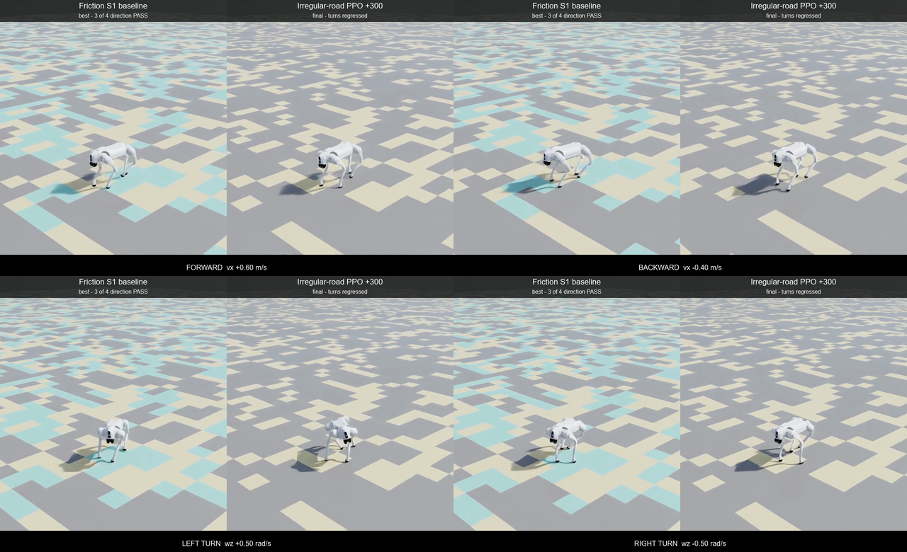

# G008 방향·마찰·링크 질량 시각 증거

## 공개 범위

Git에는 GIF와 접촉시트만 넣는다. 정책별 원본과 비교 MP4는 로컬 Isaac Lab 로그에 보관한다. 공개 파생물은 동작을 확인하는 자료이며 단계별 다중 환경 정량 평가 JSON을 대신하지 않는다.





비교 화면은 왼쪽부터 command 정책, friction S1 정책, leg-mass S1 정책이다. 세 화면에는 같은 시점에 같은 `[v_x, v_y, ω_z]` 명령이 들어간다. 접촉시트의 네 구역은 왼쪽 위부터 전진, 후진, 좌회전, 우회전 순서다.

## 무엇을 비교했는가

세 정책을 평면, seed 42, 50 Hz 제어 조건에서 각각 실행했다. 카메라와 명령 시퀀스는 같고, 각 정책이 학습한 물성 축만 남겼다. 마찰과 링크 질량을 한 환경에 동시에 넣지 않았다.

| 패널 | checkpoint | 촬영 시 물성 |
| --- | --- | --- |
| Command baseline | `model_1798.pt`, SHA-256 `53cc09043088bcd53618d2ae1f90c7f2e91d01eab7090cc63922486942b2ed47` | `μ_s=0.8`, `μ_d=0.6`, 링크 질량 nominal |
| Friction S1 | `model_2097.pt`, SHA-256 `40af0a0f80489d705e1e8fdeedd2f765177d3d67bf757709b9195cc2bbeaaee0` | seed 42에서 뽑힌 발바닥 평균 `μ_s=0.8152`, `μ_d=0.5799`, 링크 질량 nominal |
| Leg mass S1 | `model_2097.pt`, SHA-256 `8976cfff6eee6d1a998c7aa554b23d98b01d3d64da02b43ac3133a9186ae97fa` | 16개 다리 body의 질량 scale `0.9575~1.0452`, 평균 `1.0109`; 발바닥 `0.8/0.6` |

friction S1의 표본값은 S1 전체 범위가 아니라 영상 속 환경 하나에 배정된 값이다. leg-mass S1도 같은 원칙으로 실제 runtime tensor에서 읽었다. 촬영 시 총 다리 질량은 command와 friction이 `8.0960 kg`, leg-mass가 `8.2033 kg`이었다.

## 명령 시퀀스

각 정책은 900 control step을 실행한다. 시뮬레이션 step은 900회였지만 Gymnasium recorder가 쓴 프레임은 정책당 899개다.

| 구간 | steps | 시간 | 명령 `[v_x, v_y, ω_z]` |
| --- | ---: | ---: | --- |
| 정지 | 50 | `1.0 s` | `[0, 0, 0]` |
| 전진 | 175 | `3.5 s` | `[0.6, 0, 0]` |
| 정지 | 50 | `1.0 s` | `[0, 0, 0]` |
| 후진 | 175 | `3.5 s` | `[-0.4, 0, 0]` |
| 정지 | 50 | `1.0 s` | `[0, 0, 0]` |
| 좌회전 | 175 | `3.5 s` | `[0, 0, 0.5]` |
| 정지 | 50 | `1.0 s` | `[0, 0, 0]` |
| 우회전 | 175 | `3.5 s` | `[0, 0, -0.5]` |

## headless 촬영 방식

촬영 명령에는 `--headless`가 들어간다. 여기서 headless는 학습 때처럼 조작용 창을 띄우지 않는다는 뜻이다. 영상이 필요하므로 `enable_cameras=True`와 `isaaclab.python.headless.rendering.kit`을 사용하고, Windows에서는 D3D12로 off-screen frame을 렌더링한다.

촬영 중 PPO를 다시 학습하지 않는다. RSL-RL `OnPolicyRunner`가 checkpoint를 읽고, `get_inference_policy()`와 `torch.inference_mode()`로 action만 계산한다. 세 정책은 Isaac Sim 프로세스를 따로 열어 녹화했다. 한 프로세스에서 환경을 닫고 다음 환경을 만들면 이전 viewport tracking callback이 남는 Isaac Lab 2.1.1 동작을 피하기 위한 분리다.

## 원본과 파생물 무결성

정책별 원본은 H.264, 1280×720, 50 fps, 899 frames, 17.98초다. 이 원본들을 중앙 확대하고 가로로 맞춰 1280×380 비교 MP4를 만들었다.

| 파일 | 공개 여부 | 크기 | SHA-256 |
| --- | --- | ---: | --- |
| `%USERPROFILE%\IsaacLab\logs\visual_evidence\g008\g008_policy_command_s42.mp4` | 로컬 전용 | `3,043,204 bytes` | `0116df7b972fad9748f27c742da1f40be07900700c0f7bbfe9e229cf08e3804a` |
| `%USERPROFILE%\IsaacLab\logs\visual_evidence\g008\g008_policy_friction_s1_s42.mp4` | 로컬 전용 | `3,012,797 bytes` | `c5985f6a1e4a60aa62375434d5478e8e3690345c7f03f9ec974f43b255598a74` |
| `%USERPROFILE%\IsaacLab\logs\visual_evidence\g008\g008_policy_leg_mass_s1_s42.mp4` | 로컬 전용 | `3,114,651 bytes` | `f877a1373f88f9616f402f00af8a9b4700f8d4a7017012cb7a0ebe4e41cc2fd8` |
| `%USERPROFILE%\IsaacLab\logs\visual_evidence\g008\g008_policy_comparison_s42.mp4` | 로컬 전용 | `3,818,585 bytes` | `1a82ffb29a9d94bebe621e6ca55f6066651a8917d63918d70ad6cd624db904ee` |
| `docs/media/g008/g008_policy_comparison.gif` | Git 공개 | `5,941,014 bytes` | `92693bb35f06d15c5e488e5c11eed4036f6485f1f9642431d67a1f3e63492237` |
| `docs/media/g008/g008_policy_comparison_contact_sheet.png` | Git 공개 | `589,277 bytes` | `71db844c202cf1e617d99500c343f5c250efa598beedf09201331ebbb6ccc49d` |

합성과 파생물 생성에는 FFmpeg `8.1-full_build-www.gyan.dev`를 사용했다. 공개 GIF는 720×214, 5 fps, 64색, 90 frames다. 원본과 비교 MP4는 저장소에 넣지 않는다.

## 재현 명령

다음 세 명령은 각각 별도 Isaac Sim 프로세스로 실행한다.

```powershell
cd "$HOME\isaac-walk-rl"

& "$HOME\IsaacLab\_isaac_sim\python.bat" .\scripts\record_g008_policy_comparison.py `
  --profile command `
  --checkpoint "$HOME\IsaacLab\logs\rsl_rl\unitree_go2_rough\2026-08-26_11-11-12_g008_command_finetune_g006_s42_e1024_i300\model_1798.pt" `
  --output-dir "$HOME\IsaacLab\logs\visual_evidence\g008" `
  --report .\reports\runs\g008_policy_command_capture.json --seed 42 --headless

& "$HOME\IsaacLab\_isaac_sim\python.bat" .\scripts\record_g008_policy_comparison.py `
  --profile friction_s1 `
  --checkpoint "$HOME\IsaacLab\logs\rsl_rl\unitree_go2_rough\2026-08-26_11-37-54_g008_friction_s1_finetune_command_s42_e1024_i300\model_2097.pt" `
  --output-dir "$HOME\IsaacLab\logs\visual_evidence\g008" `
  --report .\reports\runs\g008_policy_friction_s1_capture.json --seed 42 --headless

& "$HOME\IsaacLab\_isaac_sim\python.bat" .\scripts\record_g008_policy_comparison.py `
  --profile leg_mass_s1 `
  --checkpoint "$HOME\IsaacLab\logs\rsl_rl\unitree_go2_rough\2026-08-26_12-06-51_g008_leg_mass_s1_finetune_command_s42_e1024_i300\model_2097.pt" `
  --output-dir "$HOME\IsaacLab\logs\visual_evidence\g008" `
  --report .\reports\runs\g008_policy_leg_mass_s1_capture.json --seed 42 --headless
```

세 원본이 준비되면 FFmpeg 빌더를 실행한다.

```powershell
py .\scripts\build_g008_comparison_media.py `
  --capture-reports `
    .\reports\runs\g008_policy_command_capture.json `
    .\reports\runs\g008_policy_friction_s1_capture.json `
    .\reports\runs\g008_policy_leg_mass_s1_capture.json `
  --local-composite "$HOME\IsaacLab\logs\visual_evidence\g008\g008_policy_comparison_s42.mp4" `
  --public-gif .\docs\media\g008\g008_policy_comparison.gif `
  --public-contact-sheet .\docs\media\g008\g008_policy_comparison_contact_sheet.png `
  --output-report .\reports\runs\g008_policy_comparison_visual_evidence.json
```

## 단계가 바뀔 때 남기는 촬영 세트

2026-08-26부터 실행 동작에 영향을 주는 stage 변경은 촬영 없이 완료 처리하지 않는다. 학습 stage, checkpoint, 물리 randomization 범위, 평가 지형이 바뀌면 다음 네 파일을 함께 만든다.

1. 로컬 전용 H.264 MP4
2. Git 공개 GIF
3. 전진·후진·좌회전·우회전 대표 프레임을 묶은 PNG
4. checkpoint, runtime 물성, 원본·파생물 SHA-256을 기록한 JSON

영상은 한 환경의 추론 재생이고 성능 판정은 아니다. 각 시각 증거 JSON은 같은 단계의 다중 환경 평가 JSON 경로와 해시를 따로 가진다.

### 공간 혼합 마찰 단계





friction S1 checkpoint를 고마찰 `0.8/0.6`과 저마찰 `0.2/0.1`이 `0.5m`마다 반복되는 바닥에서 재생했다. 파란 띠가 저마찰, 갈색 띠가 고마찰이다. 색은 collision API가 없는 별도 표시 mesh에만 넣었다. 접촉 계산은 평가 때 쓴 multi-material collision mesh가 담당한다.

원본과 자막 MP4는 1280×720 또는 1280×780, 50fps, 899 frames, 17.98초다. 공개 GIF는 720×438, 4fps, 72 frames다.

| 파일 | 공개 여부 | 크기 | SHA-256 |
| --- | --- | ---: | --- |
| `%USERPROFILE%\IsaacLab\logs\visual_evidence\g008\g008_stage_periodic_friction_s1_mu020_010_s20260826.mp4` | 로컬 전용 | `1,211,646 bytes` | `5337a53a878df3b229707781c5b7a04419358882a2dab0e85b77637d8e011f3d` |
| `%USERPROFILE%\IsaacLab\logs\visual_evidence\g008\g008_stage_periodic_friction_s1_mu020_010_annotated_s20260826.mp4` | 로컬 전용 | `1,784,056 bytes` | `3269ac7f69e898aa37aaec93995018e6d43bc185240228404d53584232e727e2` |
| `docs/media/g008/g008_stage_periodic_friction.gif` | Git 공개 | `5,181,131 bytes` | `4f0681d7039afefd5bba8c5011239e2eac12d46b8bfb8132cd8df5606ff6c6ef` |
| `docs/media/g008/g008_stage_periodic_friction_contact_sheet.png` | Git 공개 | `511,783 bytes` | `92c0375d863cea9a1e12f25c6bf736a2837eb0d6b16e809e3aaa73a0ed1d8307` |

정량 판정은 `reports/runs/g008_periodic_friction_sweep_command_vs_friction_s1_e32_h500_s20260826.json`, 촬영 조건과 파생물 해시는 `reports/runs/g008_stage_periodic_friction_capture.json`, `reports/runs/g008_stage_periodic_friction_visual_evidence.json`에 있다.

### 링크 그룹 질량 단계





leg-mass S1 checkpoint에 hip·thigh·calf·foot 중 한 그룹만 `1.2배`로 바꾼 네 환경을 별도 Isaac Sim 프로세스로 촬영했다. 질량과 inertia tensor는 같은 비율로 바꿨고 COM은 옮기지 않았다. 2×2 영상은 네 원본의 같은 시점을 맞췄다.

| 패널 | 실제 mass ratio 평균 | 실제 총 다리 질량 | inertia 최대 오차 |
| --- | ---: | ---: | ---: |
| hip `1.2배` | `1.20000005` | `8.638399kg` | `1.16e-10` |
| thigh `1.2배` | `1.20000005` | `9.017599kg` | `4.66e-10` |
| calf `1.2배` | `1.20000005` | `8.219200kg` | `1.16e-10` |
| foot `1.2배` | `1.20000005` | `8.127999kg` | `0` |

| 파일 | 공개 여부 | 크기 | SHA-256 |
| --- | --- | ---: | --- |
| `%USERPROFILE%\IsaacLab\logs\visual_evidence\g008\g008_stage_link_mass_hip_120_s20260826.mp4` | 로컬 전용 | `3,080,431 bytes` | `5016767f84d1bbb7e2a3e8c8642b6330aecbbb0ba99a834f986a45c7e04fb3ce` |
| `%USERPROFILE%\IsaacLab\logs\visual_evidence\g008\g008_stage_link_mass_thigh_120_s20260826.mp4` | 로컬 전용 | `3,253,695 bytes` | `ea7111f2664b8604303b78b62520cec76e55af98a6e80eeb50ba76bb627fddb3` |
| `%USERPROFILE%\IsaacLab\logs\visual_evidence\g008\g008_stage_link_mass_calf_120_s20260826.mp4` | 로컬 전용 | `3,227,495 bytes` | `874dfeca6d253a368cc474ec9a8916ea3b78199825bfc4d60bde84e51e93caf8` |
| `%USERPROFILE%\IsaacLab\logs\visual_evidence\g008\g008_stage_link_mass_foot_120_s20260826.mp4` | 로컬 전용 | `3,228,144 bytes` | `d14f545373acbdc53bb4e4f6be4c472c2ddde4fb6cdda99b88f854eaa4eb74a3` |
| `%USERPROFILE%\IsaacLab\logs\visual_evidence\g008\g008_stage_link_mass_groups_120_comparison_s20260826.mp4` | 로컬 전용 | `7,698,786 bytes` | `456eded4c086dd2529b788c592e5a6d0a2c0c3ab00372499ebd9fd512731d517` |
| `docs/media/g008/g008_stage_link_mass_groups.gif` | Git 공개 | `9,045,987 bytes` | `19424be094d131efda701891f0e95f6f3709e81e6afb5759467a82b506d4a26d` |
| `docs/media/g008/g008_stage_link_mass_groups_contact_sheet.png` | Git 공개 | `1,146,477 bytes` | `849bc36280da646808567af6408691e27b49145ae635fbf4a349e5cb6627aaf3` |

정량 판정은 `reports/runs/g008_link_mass_sensitivity_command_vs_leg_mass_s1_e800_h300_s20260826.json`을 따른다. 네 촬영 보고서와 최종 파생물 보고서는 `reports/runs/g008_stage_link_mass_*_capture.json`, `reports/runs/g008_stage_link_mass_visual_evidence.json`이다.

### 단계 촬영 재현 명령

혼합 마찰 원본은 다음 명령으로 다시 만든다.

```powershell
cd "$HOME\isaac-walk-rl"

& "$HOME\IsaacLab\_isaac_sim\python.bat" .\scripts\record_g008_stage_evidence.py `
  --profile periodic_friction_s1_mu020_010 `
  --checkpoint "$HOME\IsaacLab\logs\rsl_rl\unitree_go2_rough\2026-08-26_11-37-54_g008_friction_s1_finetune_command_s42_e1024_i300\model_2097.pt" `
  --output-dir "$HOME\IsaacLab\logs\visual_evidence\g008" `
  --report .\reports\runs\g008_stage_periodic_friction_capture.json `
  --seed 20260826 --headless
```

링크 질량은 profile만 `link_mass_hip_120`, `link_mass_thigh_120`, `link_mass_calf_120`, `link_mass_foot_120`으로 바꿔 각각 실행한다. checkpoint는 leg-mass S1 `model_2097.pt`를 쓴다. 원본이 준비되면 `scripts/build_g008_stage_media.py`가 로컬 자막 MP4와 공개 GIF·PNG를 만든다.

## 정량 결과와의 관계

비교 영상은 한 환경의 추론 재생이다. command와 friction S1은 64환경 평면 평가에서 네 방향 gate를 통과했다. leg-mass S1은 전진·후진·좌회전을 통과했지만 우회전 yaw RMSE가 randomized `0.2956 rad/s`, nominal `0.2947 rad/s`로 기준 `0.25 rad/s`를 넘었다. 영상 한 번에서 차이가 작게 보이더라도 이 판정을 바꾸지 않는다.

정량 판정은 `reports/runs/g008_directional_qualification_*.json`, 촬영 물성과 파일 해시는 `reports/runs/g008_policy_*_capture.json`과 `reports/runs/g008_policy_comparison_visual_evidence.json`을 기준으로 한다.

## 방향 정책 단독 자료

첫 촬영 자료도 그대로 보존한다. 이 영상은 command 정책 하나만 rough task에서 실행한 기록이다.





단독 원본은 `%USERPROFILE%\IsaacLab\logs\visual_evidence\g008\g008_directions_s42.mp4`에 있다. H.264, 1280×720, 50 fps, 899 frames, 17.98초이며 SHA-256은 `c388648da898b48a6a00d2415c5a9d7e2342b605c8d07fd559b7400525a716ec`이다. 기존 공개 GIF와 접촉시트의 메타데이터는 `reports/runs/g008_direction_visual_evidence.json`에 남겼다.

## 비주기 불규칙 도로 단계





왼쪽은 기존 friction S1 `model_2097.pt`, 오른쪽은 불규칙 도로에서 64환경 × 300 iterations를 추가 학습한 `model_2396.pt`다. 두 패널은 seed `20260826`, 같은 900-step 명령 시퀀스, 같은 카메라를 사용한다. 색은 네 마찰 구간을 구분하며, 실제 접촉은 구간별로 분리한 네 collision mesh가 계산한다.

이 영상은 추가 학습 모델의 개선을 뜻하지 않는다. 32환경·500-step full 평가에서 기존 정책은 3/4 방향 PASS·낙상 0, 추가 학습 최종 정책은 2/4 방향 PASS·낙상 5였다. 최종 선택은 기존 friction S1이다.

| 파일 | 공개 여부 | 크기 | SHA-256 |
| --- | --- | ---: | --- |
| `%USERPROFILE%\IsaacLab\logs\visual_evidence\g008\g008_irregular_road_baseline_friction_s1_s20260826.mp4` | 로컬 전용 | `2,280,120 bytes` | `53a62317a4b1db7b29358c65d0c78135f2c7108b54ad3fa3ac98274fab4ff6a9` |
| `%USERPROFILE%\IsaacLab\logs\visual_evidence\g008\g008_irregular_road_trained_i300_s20260826.mp4` | 로컬 전용 | `2,286,032 bytes` | `fdb7d7319edbe431bd5f0bb2b37b8ca8377d53281189c9a65a3220f404006943` |
| `%USERPROFILE%\IsaacLab\logs\visual_evidence\g008\g008_irregular_road_baseline_vs_trained_s20260826.mp4` | 로컬 전용 | `3,939,535 bytes` | `8759fc601d90fa94ff3199666baba9720448327b9d282bd67c4d2cfd6bf218e7` |
| `docs/media/g008/g008_irregular_road_baseline_vs_trained.gif` | Git 공개 | `6,633,310 bytes` | `f8f93efe9920e3d755e52f9b74bc6eb9c33624fabb37fe166d2134863fb70426` |
| `docs/media/g008/g008_irregular_road_baseline_vs_trained_contact_sheet.png` | Git 공개 | `934,030 bytes` | `6191c9bf6a8aee28ace69f6d15df1bb559b63271f5520390b413c7be0f9d282b` |

원본과 비교 MP4는 H.264, 50fps, 899 frames, 17.98초다. 공개 GIF는 720×438, 4fps, 72 frames이며 Git 제한 10MiB 아래다. 촬영 조건·checkpoint·지형 readback·파생물 해시는 `reports/runs/g008_irregular_road_*_capture.json`과 `reports/runs/g008_irregular_road_visual_evidence.json`에 있다. 정량 해석은 [G008 불규칙 도로·공간 마찰 강화학습](G008_IRREGULAR_ROAD.md)을 따른다.

## G0 형상 분리와 회전 보상 T1


왼쪽은 높이 형상을 유지하고 바닥 전체를 static/dynamic `0.8/0.6`으로 고정한 G0에서 기존 friction S1 `model_2097.pt`를 재생한 화면이다. 오른쪽은 같은 G0에서 순수 yaw 명령에도 `feet_air_time`을 활성화해 학습한 T1의 `model_2100.pt`다. 두 패널은 terrain seed `20260826`, 같은 900-step 명령 시퀀스와 카메라를 사용한다.

T1 영상이 정책 개선을 뜻하지는 않는다. 32환경·500-step·terrain seed 3개 정식 평가에서 기존 정책은 방향 조건 `11/12`, T1은 `9/12`를 통과했다. T1은 세 지형의 우회전 yaw gate를 모두 잃어 기각했다.

| 파일 | 공개 여부 | 크기 | SHA-256 |
| --- | --- | ---: | --- |
| `%USERPROFILE%\IsaacLab\logs\visual_evidence\g008\g008_road_g0_inherited_s20260826.mp4` | 로컬 전용 | `1,043,721 bytes` | `751d0716ec5102de09501f056c4674fea7b7d5a65425d6cc38bd7a3452733275` |
| `%USERPROFILE%\IsaacLab\logs\visual_evidence\g008\g008_road_g0_turn_air_i2100_s20260826.mp4` | 로컬 전용 | `1,098,071 bytes` | `7a1d74c6d28dbb028bd5bcb1f0ef94e6cdd22b6b574fde602085eadff1dd2ad0` |
| `%USERPROFILE%\IsaacLab\logs\visual_evidence\g008\g008_road_g0_vs_turn_air_s20260826.mp4` | 로컬 전용 | `1,896,641 bytes` | `eb39ced93f00a2fb741879bce1224ae95831c20f8566a23d5b278f4cd4daf1c0` |
| `docs/media/g008/g008_road_g0_vs_turn_air.gif` | Git 공개 | `3,141,682 bytes` | `6e1160614195cf4665abfaa6878b98fba27bc2c75c9f3cdd90cf1d8b8b142f3e` |
| `docs/media/g008/g008_road_g0_vs_turn_air_contact_sheet.png` | Git 공개 | `247,734 bytes` | `55a9dbe9b4ec61dc2ed1957f8100ab094597f03eb0e18211788371ea09f8b720` |

원본과 비교 MP4는 H.264, 1280×720 또는 1280×780, 50fps, 약 18초다. 공개 GIF는 720×438, 4fps, 72 frames다. 촬영 조건·checkpoint·G0 field readback·보상 계약과 파일 해시는 `reports/runs/g008_road_g0_*_capture.json`과 `reports/runs/g008_road_curriculum_visual_evidence.json`에 있다. 정량 해석은 [G008 보상함수와 불규칙 도로 curriculum](G008_REWARD_AND_ROAD_CURRICULUM.md)을 따른다.
