# G009 산 비탈 횡단·전복 복구 강화학습

- 기준일: 2026-08-30
- 시뮬레이터: Isaac Sim 4.5.0
- 학습 프레임워크: Isaac Lab v2.1.1 (`90b79bb2d44feb8d833f260f2bf37da3487180ba`)
- 강화학습: RSL-RL 2.3.3 PPO
- 로봇: Isaac Lab 내장 Unitree Go2
- 현재 단계: C0·S0 완료, G009-5 R0 rev9 진단 미디어 완료, rev10 CPU 안전 실패 재현, rev11 scratch `gate01` 안전 실패·fresh attribution `3/3` 완료, rev12 solver A/B runtime `6/6`·gate01 안전 통과 후 gate10 hard-limit 재발, full-state GPU fresh attribution `3/3` 완료, rev13 velocity solver 기각, rev14 max-depenetration 기각, rev15 position solver CPU·GPU runtime 각 `3/3`과 `06` CUDA 카메라·`07` 텔레메트리 증거 완료, rev16 backend divergence attribution `12/12`·순차 synthesis와 `08` CUDA 카메라·`09` 텔레메트리 증거 완료, rev17 `G009-5-E010` offline mechanism split·`10` 텔레메트리 증거 완료
- 현재 한계: rev17은 rev16의 고정된 12개 report를 다시 분석해 B GPU/B CPU의 peak base force `+26.7204%`, 17-step 전신 impulse magnitude `+1.42027%`, base impulse `+7.06752%`와 하중 재배치를 분리했다. CPU에서는 physics step `128→129→130`의 접촉쌍 변화를 확인했지만 GPU contact-pair authority는 없어 CPU/GPU 접촉 토폴로지 차이 시점은 `unavailable`, `step=null`이다. 따라서 원인 lever는 선택하지 않았고 `selected_lever=null`, 결론은 `inconclusive`다. B GPU peak force도 `16.7882770994 BW > 15 BW`이므로 position iteration 16은 계속 기각한다. scratch Gate01·Gate10·PPO는 실행하지 않았고 qualification은 `not_run`이다. `learned_policy_qualified=false`이므로 전복 복구 성능은 주장하지 않는다.

## 작업 순번

`G009-n`은 읽는 순서를 위한 번호이고 괄호의 `C0`, `S0`, `R0`, `S1-low`가 protocol stage ID다.

| 작업 번호 | protocol stage | 내용 | 상태 |
| --- | --- | --- | --- |
| `G009-1` | `C0` | goal별 미디어 경로와 24개 stage registry | 완료 |
| `G009-2` | `S0` | 6개 경사 × 4개 방위 analytic gate | `24/24` 통과 |
| `G009-3` | `S0` | collision mesh, material, support-normal reset의 Isaac runtime readback | 완료 |
| `G009-4` | `S0` | 5°·15°·25° 동일 조건 headless 재생 | 완료, 25°는 실패 경계 |
| `G009-5` | `R0` | 평지 네 전복 자세 RECOVER PPO | rev12 gate10 기각·full-state 귀속 완료, rev13·rev14·rev15 기각, rev16 12-run attribution과 rev17 E010 mechanism split 완료·lever 미선정, Gate01·Gate10·PPO 미실행 |
| `G009-6` | `S1-low` | 5°·10° 횡경사 WALK PPO | R0·calibration 뒤 실행 |

이후 `S1-high`, 외란, residual terrain, 발별·공간 마찰, 경사 RECOVER와 link-mass를 순차적으로 연다. 전체 stage 순서는 [다음 학습과 검증 순서](#다음-학습과-검증-순서)에 있다.

## 먼저 결론

G009는 산 비탈에서 보행 영상을 만드는 작업이 아니라, 경사·요철·발별 마찰·외란·전복을 서로 분리해 학습하고 다시 결합하는 실험이다. 목표는 다음 네 상황을 수치와 실행 증거로 설명하는 것이다.

1. 로봇이 경사면을 등고선 방향으로 가로지를 때 하산 방향으로 밀리는 현상을 억제한다.
2. prone, supine, left-side, right-side 전복 상태에서 지형 법선을 기준으로 다시 일어난다.
3. 네 발이 서로 다른 마찰을 받거나 공간 마찰 지도가 이동 경로에 따라 바뀌어도 복구한다.
4. 외란을 버틴 경우와 실제 낙상 뒤 RECOVER 정책으로 전환한 경우를 구분해 평가한다.

현재 C0·S0와 R0 rev12 학습 전 runtime calibration을 완료하고 첫 scratch safety gate까지 열었지만 gate10에서 중단했다. 경사 `0/5/10/15/20/25°`와 방위 `0/90/180/270°`를 교차한 24개 analytic cell이 모두 통과했다. 여기서 `25°`는 로봇이나 시뮬레이터가 갈 수 있는 최대 경사가 아니라 현재 protocol이 배치한 가장 높은 stress cell이다. 더 높은 경사는 낮은 각도의 안전·성능 gate를 통과한 뒤 별도 curriculum과 held-out stress로 확장한다. R0는 네 canonical 전복 자세, P-RECOVER-83/C-RECOVER-107 관측, EMA action, 엄격 성공 latch, 할인 호환 잠재 보상, pose curriculum을 코드와 manifest로 고정했다. rev12 canonical 계약 SHA-256은 `d4b48d2b5fc1ea7684684a6324ba22fbfae767effeae45668c7310df382392e0`이다. CPU·GPU runtime `6/6`과 `1,024×1` scratch gate01은 통과했지만 `1,024×10` gate10에서 hard-limit이 세 번 상당 재발했다. 이후 같은 10-iteration 경로를 fresh GPU 프로세스 세 번으로 다시 실행한 full-state attribution에서 사건 topology와 canonical full-event payload가 모두 재현됐다. rev13은 velocity iteration `0 → 1`에서 접촉력 상한을 넘겨 기각했다. rev14는 그 기각 후보의 solver `8/1` 위에서 rigid-body max depenetration velocity만 `1.0 → 0.75m/s`로 낮췄고, force는 통과했지만 CPU separation strict gate에서 기각됐다. rev15는 승인된 rev12 의미론으로 돌아가 position iteration만 `8 → 16`으로 바꿨다. CPU는 force와 separation을 통과했지만 GPU force가 `16.7882747650 BW`로 올라 동일 계약의 backend 결과가 갈렸고, Gate01 전에 다시 기각했다. rev16은 두 solver arm을 CPU·GPU 각 `3/3`으로 다시 실행해 physics substep과 control step을 같은 schema로 맞췄다. GPU peak가 더 이르고 root·joint speed가 함께 증가한 사실은 재현했지만, B GPU의 impulse concentration 증가는 CPU 대비 `18.36%`로 사전 기준 `20%`를 넘지 못했다. rev17 E010은 이 12개 immutable report의 600-step physics, 150-step control, CPU contact callback을 오프라인으로 재검산했다. 순간 peak와 17-step 전신 impulse 증가가 같은 크기가 아니고 GPU 접촉쌍은 관측할 수 없다는 점까지 분리했지만 단일 원인은 고르지 못했다. 따라서 원래 임계값을 유지하고 position 16 기각, Gate01/PPO 차단을 그대로 둔다.

이 결과는 지형 생성·계측 수학과 R0 실행 계약이 맞는다는 뜻이다. G009 정책이 경사에서 걷거나 전복 뒤 일어난다는 뜻은 아니다. 기존 G008 checkpoint는 S0 지형과 카메라 연결을 확인하는 시각 재생용이며, R0 rev1~rev8 체크포인트는 성공 경험이 없어 전부 기각했다.

**S0에서 재생하는 실제 policy는 G008 checkpoint다. 현재 결과의 정확한 의미는 `G009 학습 전 배선·정성 재생 검증`이며 `G009 강화학습 완료`가 아니다.**

## 현재 상태와 주장 범위

| 구분 | 상태 | 확인된 내용 | 아직 주장하지 않는 내용 |
| --- | --- | --- | --- |
| C0 미디어 계약 | PASS | `<goal_id>`별 로컬 MP4 경로, G009 24개 stage registry, G008 경로 회귀 | G009 동작 성능 |
| S0 import-light 지형 gate | PASS | 6개 경사 × 4개 방위, 총 `24/24` cell | Isaac USD runtime 전체 물리 readback |
| S0 Isaac 구성·runtime | PASS | G009 7개 구성·spawn·reset 검사, G008 8개 회귀 검사, `5/15/25°` USD geometry·material readback | PPO 학습 성능 |
| support-plane 수학 모듈 | 순수 수학 PASS | robust fit, fallback, 접평면 투영, COM, 지지 영역 수학 | 매 step RayCaster runtime 연결 완료 |
| G009 WALK PPO | 미실행 | 학습 계약과 stage 순서가 사전 등록됨 | 경사 횡단 성공 |
| G009 RECOVER PPO | rev12 runtime `6/6`, gate01 PASS, gate10 safety FAIL, full-state attribution `3/3` | scratch rev1~rev9, 실패 동작 증거, rev10 CPU 실패 재현, rev11 gate01 실패 미디어·fresh attribution, rev12 runtime·gate01·gate10 단계 미디어, 세 hard-limit 사건의 joint·target·torque·contact 귀속 | hard-limit 제거, learned checkpoint의 전복 복구 성공, 공식 qualification |
| supervisor | 미구현 | 상태 전이와 평가 계약이 정해짐 | `fall -> recover -> walk` 연결 성공 |
| S0 미디어 녹화 | 완료 | 3개 로컬 MP4, 공개 GIF·PNG, capture JSON·summary·sidecar 해시 결합 | G009 WALK 성공 |
| 실물 로봇 | 범위 밖 | Mini Pupper 재학습 원칙만 정함 | Go2 정책의 직접 전이, sim-to-real 완료 |

S0 증거의 source commit은 `4bad4dd8634c11aa452da41ad0c2fb852e70e607`이다. 원본 MP4는 저장소 밖에 두고 GIF·PNG·JSON만 공개한다. 25° 재생은 `termination.fall=false`였지만 최대 기울기가 `84.7832°`, 최대 하방 이동이 `2.3925 m`였다. 이를 통과나 보행 성공으로 판정하지 않고, 기존 G008 정책의 한계를 드러낸 stress 결과로 남긴다. C0는 동작 stage가 아닌 governance 변경이므로 영상이 없는 것이 계약에 맞다.

## 문제 정의

### 1. 횡경사 보행

경사각을 `theta`, 로봇 질량을 `m`이라 하면 경사 아래 방향 중력 성분은 다음과 같다.

\[
F_{downhill}=m g \sin(\theta)
\]

로봇이 경사를 정면으로 오르는 대신 옆으로 가로지르면 등산측 발과 하산측 발의 수직항력이 달라진다. 같은 gait라도 발별 마찰 한계와 몸통 roll moment가 비대칭이 된다. 따라서 월드 수평면에서 속도와 roll만 보는 방식으로는 정상적인 경사 적응 자세와 실제 낙상을 구분하기 어렵다.

G009는 경사 좌표를 `+x=uphill`, `-x=downhill`, `+y=contour-left`, `-y=contour-right`로 고정한다. WALK는 contour-left와 contour-right를 별도 blocking cell로 평가해 한쪽 방향의 실패를 평균에 숨기지 않는다.

### 2. 경사면 전복과 self-righting

기존 보행 환경에서는 몸통 접촉이 낙상이며 episode 종료다. 그러나 self-righting에서는 몸통이나 다리 링크의 지면 접촉이 시작 조건이자 필요한 동작이다. 같은 `base_contact`를 한 정책 안에서 실패와 정상 접촉으로 동시에 해석하면 보상과 종료 조건이 충돌한다.

RECOVER는 prone, supine, left-side, right-side 네 curated pose에서 시작한다. 한 순간 upright threshold를 넘는 것으로 성공 처리하지 않는다. 지형 법선 대비 tilt, base 높이, 낮은 각속도를 연속으로 유지하고 zero-command hold와 command resume까지 통과해야 복구 성공이다.

### 3. 비대칭·공간 마찰

G008은 비주기 공간 마찰과 불규칙 도로를 이미 구현했다. 네 발이 같은 마찰을 밟는 frame과 서로 다른 마찰을 밟는 frame을 모두 관측했지만, 기존 도로의 국소 경사는 최대 약 `2.7°`였다. 이 결과를 산 비탈 대응으로 확대 해석하지 않는다.

G009는 마찰 난이도를 두 단계로 분리한다.

- controlled per-foot: 바닥을 `1.0/1.0`으로 고정하고 발 material만 바꿔 어느 발이 낮은 마찰인지 통제한다.
- spatial mosaic: 발을 `1.0/1.0`으로 고정하고 지면 material map만 바꿔 이동 중 접촉 재질이 달라지게 한다.

두 축을 동시에 바꾸지 않는 이유는 실패 원인을 발별 비대칭과 공간 전환 중 하나로 좁히기 위해서다. 기본 effective static/dynamic pair는 `ICE=0.25/0.15`, `LOW=0.40/0.28`, `MEDIUM=0.60/0.45`, `NOMINAL=0.80/0.60`이며 PhysX `multiply` combine mode를 유지한다.

### 4. 외란과 실제 낙상

G006은 rough terrain에서 root delta velocity `0.5/1.0/1.5m/s`를 전후좌우로 주는 외란 평가를 수행했다. baseline은 `99.5370%`, push curriculum은 `99.5988%` 회복률이었지만 paired bootstrap 95% 신뢰구간이 0을 포함했다. 따라서 정책 우월성과 산 비탈 self-righting은 입증되지 않았다. 자세한 결과는 [G006 rough·DR·외란 회복 결과](G006_ROUGH_PUSH_RECOVERY.md)에 있다.

G009는 기존 delta-velocity 회귀와 새 힘-시간-충격량 외란을 분리한다.

\[
J=m\Delta v,\qquad F=\frac{J}{T_{eff}}
\]

`control_dt=0.02s`, `sim_dt=0.005s`에서 `0.10s` pulse는 5 control step·20 physics step, `0.20s` pulse는 10 control step·40 physics step이다. 외란을 버틴 trial은 WALK disturbance recovery로, `DETECT_FALL`이 발생한 trial은 RECOVER 호출과 command resume까지 별도로 집계한다. 이 external-wrench 단계는 아직 구현되지 않았다.

## WALK와 RECOVER를 별도 PPO로 학습하는 이유

G009는 하나의 만능 정책 대신 두 PPO 정책과 한 supervisor를 사용한다.

| 구분 | WALK | RECOVER |
| --- | --- | --- |
| 시작 상태 | 정상 기립·보행 상태 | prone/supine/left/right 또는 실제 WALK 낙상 snapshot |
| 주목표 | 명령 속도 추종, drift·slip 억제 | upright 진입·유지, 충돌·에너지 제한 |
| 몸통 접촉 | 낙상 termination | 허용되는 초기·중간 상태 |
| episode | 20초 | 8초 |
| 성공 | 방향별 추종·생존·물리 gate | upright 유지 후 hold와 command resume |
| checkpoint | G008 WALK에서 seed별 독립 lineage | random initialization의 별도 lineage |

분리의 핵심은 학습 표본과 의미를 보존하는 것이다. 정상 보행 표본이 압도적으로 많으면 하나의 정책에서 드문 전복 복구 표본이 묻힐 수 있다. 반대로 몸통 접촉을 허용하면 WALK의 낙상 신호가 약해진다. 두 정책을 나누면 보상, termination, checkpoint, 실패 유형을 각각 추적할 수 있다.

두 정책은 다음 상태 감독기로 연결한다.

```text
WALK -> DETECT_FALL -> RECOVER -> VERIFY_STAND -> WALK
                          |              |
                          +-- timeout ---+--> SAFE_STOP
```

supervisor는 PPO 보상을 공유하지 않는다. false trigger, recovery timeout, 재낙상, zero-command hold, command resume 성공률을 별도 지표로 계산한다. `SAFE_STOP`은 시뮬레이션 episode 종료 절차일 뿐 실물 torque-off 검증이 아니다.

## 실행 구조: headless 학습과 off-screen 촬영

학습은 Windows 네이티브 환경에서 `--headless`로 실행한다. headless는 물리를 생략한다는 뜻이 아니다. 창과 실시간 viewport를 띄우지 않을 뿐 PhysX 접촉, height scan, 관측 생성, 정책 추론, reward 계산, rollout 수집, PPO update는 그대로 수행한다.

영상은 학습 프로세스와 분리한 off-screen headless camera replay로 만든다. 이 구조는 학습 처리량과 카메라 렌더링 비용을 분리하고, checkpoint·config·camera pose가 고정된 재생을 만든다.

| 산출물 | 위치·제약 | 역할 |
| --- | --- | --- |
| 원본 MP4 | `%USERPROFILE%\IsaacLab\logs\visual_evidence\g009\<stage>` | 사용자 로컬 원본, Git 제외 |
| 공개 GIF | `docs/media/g009/<stage>` 아래, 10 MiB 미만 | Git 공개 동작 요약 |
| 대표 PNG | `docs/media/g009/<stage>` 아래, 10 MiB 미만 | 방향·자세·실패 frame 비교 |
| JSON sidecar | `reports/runs` | checkpoint/config/report/media SHA-256 결합 |
| 정량 report | `reports/runs` | 성능 판정 권위 |

영상은 한 환경의 동작 증거이며 성능 판정은 아니다. stage가 바뀔 때마다 새로 촬영하되, 통과 여부는 같은 checkpoint를 사용한 다중 환경 평가 JSON으로 결정한다.

## 고정 정책 인터페이스

### action과 시간

- action: Go2 12개 관절의 default-offset joint-position target
- WALK action scale: `0.25`
- RECOVER action: `EMAJointPositionToLimitsAction`, scale `0.8`, alpha `0.2`, asset soft-limit factor `0.9`
- RECOVER 유효 target 범위: hard joint range의 중앙 `72%`; URDF hard-limit termination tolerance `0.01rad` 유지
- `sim_dt=0.005s`, decimation `4`
- `control_dt=0.02s`, policy rate `50Hz`
- WALK episode: `20.0s`
- RECOVER episode: `8.0s`
- supervisor 평가 horizon: `15.0s` 이상

### WALK actor observation: `P-WALK-235`

| 항목 | 차원 | noise/corruption |
| --- | ---: | --- |
| base linear velocity | 3 | uniform `±0.1` |
| base angular velocity | 3 | uniform `±0.2` |
| projected gravity | 3 | uniform `±0.05` |
| `[v_x, v_y, yaw_rate]` command | 3 | 없음 |
| relative joint position | 12 | uniform `±0.01` |
| relative joint velocity | 12 | uniform `±1.5` |
| last action | 12 | 없음 |
| height scan | 187 | uniform `±0.1`, clip `[-1,1]` |

### WALK critic observation: `C-WALK-254`

critic은 actor의 235개 항목을 corruption 없이 받고 다음 privileged 19개를 추가한다.

- `terrain_normal_gt`: 3
- 발별 effective static/dynamic friction: 8
- whole-body COM in base frame: 3
- total mass: 1
- commanded wrench vector: 3
- normalized pulse time remaining: 1

### RECOVER actor observation: `P-RECOVER-83`

| 항목 | 차원 |
| --- | ---: |
| base linear velocity | 3 |
| base angular velocity | 3 |
| projected gravity | 3 |
| relative joint position | 12 |
| relative joint velocity | 12 |
| last RECOVER action | 12 |
| four-foot contact state | 4 |
| normalized four-foot load magnitude | 4 |
| body-fixed range, 5×3 | 15 |
| body-fixed range hit mask | 15 |

range/depth 입력은 base에 고정된 5×3 pinhole ray이며 최대 거리 `1.0m`다. no-hit는 `range=1`, `mask=0`으로 표현하고 numeric invalid로 종료하지 않는다. actor의 foot load는 지형 정답 법선이 아니라 접촉력 크기를 nominal body weight로 정규화해, 실제 foot load 또는 관절 torque 기반 추정기로 교체할 수 있게 했다.

### RECOVER critic observation: `C-RECOVER-107`

critic은 actor의 83개 항목을 corruption 없이 받고 다음 privileged 24개를 추가한다.

- `terrain_normal_gt`: 3
- `base_height_gt`: 1
- 발별 effective static/dynamic friction: 8
- whole-body COM in base frame: 3
- total mass: 1
- commanded wrench vector: 3
- normalized pulse time remaining: 1
- source fall class one-hot: 4

`commanded_wrench`와 `normalized_pulse_time_remaining` 4차원은 D1 external-wrench 확장을 위해 예약한 critic-only 채널이다. 외란 event가 없는 R0에서는 각각 `critic_zero_external_wrench`, `critic_zero_disturbance_pulse`가 상수 0을 반환한다. 현재 측정 신호나 actor 입력으로 해석하지 않는다.

### privilege 원칙

actor에는 exact friction, analytic `terrain_normal_gt`, exact base height, source fall class를 넣지 않는다. `terrain_normal_gt`와 base height는 critic·성공 판정·계측 검증에만 사용한다. actor는 IMU/projected gravity, encoder, contact/load 추정, base-mounted range/depth adapter만 사용한다.

이 경계는 `configs/g009_r0.json`과 actor call-graph 회귀 테스트로 고정했다. 현재 표기는 `conditional_adapter_required`다. 실제 센서 브래킷·intrinsic·noise floor를 측정하기 전에는 hardware-equivalent 또는 sim-to-real 완료라고 표현하지 않는다.

## PPO-P1 학습 계약

WALK와 RECOVER 모두 RSL-RL 2.3.3의 `PPO-G009-P1`을 사용하되 checkpoint와 observation schema는 공유하지 않는다.

| 항목 | 값 |
| --- | --- |
| rollout horizon | `24 steps/env` |
| actor hidden dims | `[512, 256, 128]`, ELU |
| critic hidden dims | `[512, 256, 128]`, ELU |
| init noise std | WALK `1.0`, RECOVER `0.5` |
| learning epochs | `5` |
| mini-batches | `4` |
| clip parameter | `0.2` |
| entropy coefficient | `0.01` |
| discount `gamma` | `0.99` |
| GAE `lambda` | `0.95` |
| learning rate | `1e-3` |
| schedule | adaptive |
| desired KL | `0.01` |
| max gradient norm | `1.0` |
| empirical normalization | `false`로 시작 |

한 iteration의 rollout batch는 `num_envs × 24`다. 이 batch를 4개 mini-batch로 나누고 5 epoch 반복하므로 iteration당 optimizer mini-batch update는 20회다. normalization을 나중에 켜면 같은 checkpoint 계보를 이어 쓰지 않고 새 policy schema와 lineage를 만든다.

## 보상 함수 계약

아래 식에서 W1과 R1 이후 항은 아직 학습 전 설계이고, R0는 rev1~rev8 진단 결과를 반영해 코드·테스트·manifest에 고정한 rev9 계약이다. `r_*`는 각 항의 per-step 측정값을 뜻한다. 항 ID, 식, 가중치, 활성 stage, source hash는 실행 report와 reward manifest에 함께 기록한다.

### W0: 기존 Go2 회귀 reward

\[
\begin{aligned}
R_{W0}={}&1.5r_{track\_lin\_exp}+0.75r_{track\_yaw\_exp}
-2.0r_{vertical\_velocity\_L2}\\
&-0.05r_{rollpitch\_angvel\_L2}
-0.0002r_{torque\_L2}
-2.5\times10^{-7}r_{joint\_acc\_L2}\\
&-0.01r_{action\_rate\_L2}+0.01r_{feet\_air\_time}
\end{aligned}
\]

S0는 기존 checkpoint 회귀와 시각 재생을 위해 W0를 바꾸지 않는다.

### W1: 산 비탈 WALK reward

W1은 W0의 역할을 support-plane frame으로 옮기고 downhill drift, tilt, slip, 비발 접촉, 관절 한계, power proxy를 명시한다.

\[
\begin{aligned}
R_{W1}={}&1.5r_{support\_command\_exp}+0.75r_{yaw\_exp}
-2.0r_{normal\_velocity\_L2}\\
&-0.05r_{tangent\_axis\_angvel\_L2}
-0.5r_{downhill\_drift\_L2}
-0.5r_{support\_tilt\_L2}\\
&-0.1r_{contact\_tangent\_feet\_slide}
-1.0r_{nonfoot\_contact}
-2.0r_{joint\_limit}\\
&-0.0002r_{torque\_L2}
-2.5\times10^{-7}r_{joint\_acc\_L2}
-0.01r_{action\_rate\_L2}\\
&-10^{-5}r_{mechanical\_power\_proxy}
+0.01r_{feet\_air\_time}
\end{aligned}
\]

posture 항은 월드 수평을 목표로 하지 않고 body up-axis와 support normal의 관계를 사용한다.

### R0: 평지 RECOVER reward

\[
\begin{aligned}
R_{R0}={}&2.0r_{upright\_progress}+2.0r_{gated\_base\_height\_progress}
+2.0r_{soft\_stand\_progress}\\
&+0.5r_{stable\_support}
&+5.0r_{upright\_hold}+10.0r_{stable\_success\_once}
-0.05r_{gated\_angvel\_L2}\\
&-2.0r_{joint\_limit}
-0.0002r_{torque\_L2}
-2.5\times10^{-7}r_{joint\_acc\_L2}\\
&-0.01r_{gated\_action\_rate\_L2}
-10^{-5}r_{mechanical\_power\_proxy}
-1.0r_{undesired\_collision}
\end{aligned}
\]

세 progress 항은 절대 자세를 오래 유지해 보상을 누적하는 rate가 아니라 할인 호환 잠재차다.

\[
r_{\Phi,t}=\frac{\gamma\Phi(s_t)-\Phi(s_{t-1})}{0.02},\qquad \gamma=0.99
\]

RewardManager가 다시 `control_dt=0.02s`를 곱하므로 실제 contribution은 `weight × (γΦ_t-Φ_{t-1})`다. episode reset에서 이전 잠재값을 0으로 놓고 terminal 전이의 현재 잠재값도 0으로 강제해 전체 할인 shaping return이 0으로 telescope한다. 같은 상태를 오가는 roll/height 진동으로 양의 return을 만드는 경로는 다단계 회귀 테스트로 막았다.

- upright potential: body up-axis와 true support normal의 cosine alignment
- gated height potential: `clip((height-0.06)/0.24,0,1)`에 alignment `0.0→0.8` soft gate를 곱함
- soft-stand potential: `u×z×(0.5c+0.5l)`, `u=clip((alignment+1)/2)`, `c=positive-normal contact count/3`, `l=positive-normal foot load/(0.60mg)`
- strict success: tilt `≤20°`, base height `0.30~0.60m`, 양의 법선 하중을 받는 발 `≥3`, 총 발 하중 `≥0.60mg`, non-foot contact `0`, 선속도 `≤0.5m/s`, 각속도 `≤1.0rad/s`를 25 control step(`0.5s`) 연속 만족

strict success는 shaping과 분리한다. `stable_success_once`는 위 AND gate가 연속 25 step 유지될 때만 정확히 한 번 지급된다. 누운 동안 angular-velocity 페널티는 원래 값의 `0.1배`(`-0.005`), raw action-rate 페널티는 `0.2배`(`-0.002`)이고, 높이 `0.20→0.30m`와 alignment `0.50→cos20°`를 함께 만족할수록 원래 가중치로 복원된다. joint-limit·torque·joint-acceleration·power·collision 안전 항은 완화하지 않는다.

### R1: 경사 RECOVER reward

\[
R_{R1}=R_{R0}-1.0r_{downhill\_rolling\_velocity\_L2}
-0.1r_{contact\_tangent\_link\_speed}
\]

R2, R3, R4에서는 reward를 계속 바꾸지 않는다. terrain, friction, reset distribution만 한 축씩 넓혀 어떤 난이도가 실패를 만들었는지 추적한다.

### termination

| 정책 | 종료 조건 |
| --- | --- |
| WALK | `base_contact > 1N`, timeout, numeric invalid |
| RECOVER | timeout, stable success, numeric invalid, URDF hard joint-limit violation |

RECOVER에서 `base_contact`는 termination이 아니다. 이 차이가 두 정책을 분리하는 가장 직접적인 이유다.

## 경사 지형과 local support plane

### base slope와 residual height 분리

최종 지형 높이는 다음 두 배열을 독립적으로 보존한다.

\[
h_{final}(x,y)=h_{\mathrm{base}}(x,y)+h_{\mathrm{residual}}(x,y)
\]

base slope는 경사각 `theta`와 uphill unit vector `u=[u_x,u_y]`로 만든다.

\[
h_{\mathrm{base}}(x,y)=\tan(\theta)(u_xx+u_yy)
\]

S0에서는 `residual_amplitude=0`으로 순수 평면의 각도와 법선을 검증한다. 이후 S2에서 G008의 crown, long-wave, roughness, pothole을 residual로 더한다. 두 값을 분리 저장하면 원래 경사 때문에 생긴 하산 drift와 국소 요철 때문에 생긴 접촉 변화를 별도로 분석할 수 있다.

현재 구현은 [terrain.py](../src/isaac_walk_g009/terrain.py)에 있다. seed에서 residual용과 material용 난수열을 분리하며 mesh points, faces, face material의 dtype·shape·bytes를 SHA-256으로 묶는다.

### analytic triangle normal

평면 gradient가 `grad h=[g_x,g_y]`이면 analytic normal은 다음과 같다.

\[
n_{gt}=\frac{[-g_x,-g_y,1]}{\lVert[-g_x,-g_y,1]\rVert}
\]

생성된 triangle에서도 두 edge의 cross product로 normal을 다시 계산하고 항상 위쪽으로 정렬한다. `terrain_normal_gt`는 deterministic mesh에서 얻는 simulation-only 정답이다. actor observation에는 넣지 않는다.

S0 reset은 base 위치의 정확한 triangle을 찾고 그 triangle plane에서 높이와 normal을 구한다. body up-axis를 해당 normal에 맞춘 뒤 yaw를 support normal 둘레에 적용한다. 관련 코드는 [events.py](../src/isaac_walk_g009/mdp/events.py)에 있다.

### RayCaster와 contact-point proxy

Isaac Lab v2.1.1 ContactSensor는 접촉 여부와 normal force history를 제공하지만 정확한 접촉점을 기본 필드로 제공하지 않는다. 따라서 발 링크 위치를 실제 접촉점이라고 부르지 않고 지형에 투영한 `contact-point proxy`라고 기록한다.

계획된 estimator는 다음 순서를 사용한다.

1. 접촉 중인 발의 terrain projection proxy를 모은다.
2. 비공선 표본이 3개 이상이면 robust plane fit을 수행한다.
3. 접촉 표본이 부족하거나 퇴화하면 RayCaster hit 또는 base 주변 terrain stencil로 보완한다.
4. fit residual, 유효 표본 수, inlier 수, fallback 이유를 기록한다.
5. 이전 step normal을 fallback으로 사용해 normal 방향의 불연속을 줄인다.
6. analytic `terrain_normal_gt`와 `terrain_normal_est`의 각도 오차를 계측한다.

[support_plane.py](../src/isaac_walk_g009/support_plane.py)는 이 수학과 입력 계약을 구현했다. 모든 non-degenerate 3점 조합을 검사하되 표본이 많으면 고정 seed로 최대 128개 hypothesis를 선택한다. inlier 수가 가장 많은 plane을 고르고 median·maximum residual로 tie-break한 뒤 inlier 전체로 다시 fit한다. 이 모듈은 현재 순수 NumPy 수준에서 검증됐으며 실제 환경의 RayCaster stream과 매 step 연결하는 작업은 후속 단계다.

### 접평면 속도와 body tilt

월드 벡터 `v`의 support-plane 접선 성분은 다음과 같다.

\[
v_{tangent}=v-(v\cdot n)n
\]

접촉 중인 발·링크에 대해서만 이 속도의 크기를 slip proxy로 사용한다. body tilt도 world roll/pitch 하나가 아니라 body up-axis `z_b`와 support normal `n` 사이의 각도로 계산한다.

\[
tilt=\cos^{-1}(z_b\cdot n)
\]

### whole-body COM과 support region

COM은 base 위치로 대체하지 않는다. runtime link mass `m_i`와 link COM world position `p_i`를 사용한다.

\[
p_{COM}=\frac{\sum_i m_i p_i}{\sum_i m_i}
\]

COM을 support plane에 투영하고 활성 접촉 proxy의 convex hull과 비교한다. 비공선 접촉이 3개 이상이면 inside, edge, outside와 signed margin을 계산하며 outside만 blocking 진단으로 쓸 수 있다.

접촉이 2점뿐인 trot 구간은 다각형이 아니다. 두 점을 잇는 segment 또는 foot-radius capsule에 대한 거리만 기록하고 `blocking=false`로 유지한다. 2점 지지를 polygon failure로 처리하면 정상적인 동적 trot을 정적 불안정으로 오판하기 때문이다.

## 경사와 마찰의 물리 한계

정지 상태의 질점 근사에서는 미끄러지지 않기 위한 필요조건을 다음처럼 볼 수 있다.

\[
mg\sin(\theta)\leq \mu_s mg\cos(\theta)
\quad\Rightarrow\quad
\tan(\theta)\leq\mu_s
\]

G009는 각 cell마다 다음 비율을 기록한다.

\[
\rho_s=\frac{\tan(\theta)}{\mu_s},\qquad
\rho_d=\frac{\tan(\theta)}{\mu_d}
\]

`rho_s >= 1`이면 정적 질점 근사에서도 한계에 도달한 physical-limit stress로 분류한다. 이 식은 동적 보행의 충분조건이 아니다. 발 충격, 수직항력 재분배, 몸통 관성, 접촉 전환 때문에 실제 안전 여유는 더 작다.

S0 nominal static friction `0.8`에서 `25°`의 `tan(theta)/mu_s`는 약 `0.5828846`이다. 반면 `20°`와 ICE static friction `0.25`를 조합하면 약 `1.456`이므로 qualification 성공을 강제하지 않고 stress cell로 분리해야 한다.

비대칭 마찰에서는 로봇 전체를 하나의 `mu`로 요약하지 않는다. 발별 `mu_eff` vector, worst-foot ID, 패턴과 permutation을 보존한다. controlled와 spatial 단계에서 발과 지면의 마찰을 동시에 바꾸지 않는 것도 effective friction의 원인을 하나로 유지하기 위해서다.

## C0/S0 구현

### C0: goal별 미디어 계약

C0는 원본 MP4 위치를 G008 고정 경로에서 `%USERPROFILE%\IsaacLab\logs\visual_evidence\<goal_id>`로 일반화했다. G008의 기존 경로와 증거는 그대로 유효해야 한다.

구현과 증거:

- [media_contract.py](../src/isaac_walk_g009/media_contract.py)
- [validate_g009_media_contract.py](../scripts/validate_g009_media_contract.py)
- [C0 validator JSON](../reports/runs/g009_c0_media_contract.json)
- [C0 실행 로그](../reports/validation/g009_c0_media_contract.log)

검증 결과:

- G009 stage registry 24개 확인
- portable path와 공개 GIF/PNG 10 MiB 제한 확인
- C0가 동작 영상 없는 governance stage인지 확인
- G008 로컬 영상 참조 18개 경로 확인
- G008 미디어 관련 회귀 `15 passed`
- repository validator PASS

### S0: deterministic slope와 reset

구현 파일:

- [terrain.py](../src/isaac_walk_g009/terrain.py): base slope, residual, material map, mesh, analytic normal, friction limit
- [support_plane.py](../src/isaac_walk_g009/support_plane.py): robust plane, fallback, tangent projection, COM, support region
- [sim_terrain.py](../src/isaac_walk_g009/sim_terrain.py): 단일 static collision·RayCaster mesh와 nominal material spawn
- [env_cfg.py](../src/isaac_walk_g009/env_cfg.py): G008 command 환경에서 slope field만 교체하고 상속 외란·질량 randomization 비활성화
- [events.py](../src/isaac_walk_g009/mdp/events.py): exact triangle height·normal 기반 reset
- [registry.py](../src/isaac_walk_g009/registry.py): `Isaac-G009-Velocity-Slope-Go2-S0-v0` 등록
- [g009_s0.json](../configs/g009_s0.json): S0 실행·지형·시각 재생 계약
- [validate_g009_s0.py](../scripts/validate_g009_s0.py): import-light 24-cell analytic gate

S0에서는 하나의 nominal ground material `0.8/0.6`, 중립 foot material `1.0/1.0`, `multiply` combine mode를 사용한다. G008에서 상속될 수 있는 push, base mass, external wrench event는 끈다. height scanner와 collision은 동일한 slope surface를 가리켜 시각 mesh와 물리 mesh가 달라지는 문제를 막는다.

## G009-5 R0 구현과 rev1~rev9 진단

R0는 평지에서 전복된 Go2를 별도 RECOVER PPO로 일으키는 단계다. WALK checkpoint를 재사용하거나 resume하지 않는다. 관측 스키마, action envelope, 보상 또는 curriculum의 의미가 바뀔 때마다 이전 checkpoint를 버리고 scratch에서 다시 시작한다.

### 네 canonical 초기 자세

| 미디어 번호 | 자세 | root 높이 | 초기 body-up |
| ---: | --- | ---: | --- |
| `01` | prone | `0.165m` | `[0, 0, 1]` |
| `02` | supine | `0.060m` | `[0, 0, -1]` |
| `03` | left_side | `0.163m` | `[0, -1, 0]` |
| `04` | right_side | `0.163m` | `[0, 1, 0]` |

root XY에는 `±0.05m`, yaw에는 `[-π,π]` noise를 주고 root·joint state를 한 번에 쓴다. 초기 root 선속도와 각속도는 0이다. episode는 8초, 최대 400 control step이다. `physics_dt=0.005s`, decimation 4이므로 정책은 50Hz(`control_dt=0.02s`)로 동작한다.

### pose curriculum

rev7·rev8의 네 자세 균등 1,024환경×50회 파일럿에서 stable support, upright hold, strict success가 모두 0이었다. rev9는 가장 낮은 난이도인 prone에서 동작을 먼저 발견한 뒤 side와 supine을 여는 curriculum을 사용한다.

| PPO iteration | control step | prone | supine | left | right |
| ---: | ---: | ---: | ---: | ---: | ---: |
| `0~49` | `<1,200` | `100%` | `0%` | `0%` | `0%` |
| `50~99` | `<2,400` | `50%` | `0%` | `25%` | `25%` |
| `100~299` | `≥2,400` | `25%` | `25%` | `25%` | `25%` |

curriculum clock은 `env.common_step_counter`이며 한 PPO iteration을 24 control step으로 환산한다. pose class는 critic-only 정보라 actor에 들어가지 않는다. 공식 평가는 curriculum 확률을 쓰지 않고 네 자세를 같은 수로 배정한다.

### 진단 학습 계보

아래 실행의 `passed=true`는 프로세스 종료, checkpoint 저장, TensorBoard 생성 같은 run-health만 뜻한다. 학습 성공 판정이 아니다. 1회 smoke는 동작 안전성 진단이고, 50회 pilot은 보상 신호와 초기 학습 방향을 확인하는 실행이다.

rev1~rev8 report는 당시 dirty working tree에서 생성돼 `source_bundle.matches_repository_commit=false`다. 마지막 scalar와 파일 hash는 기각 근거로 보존하지만 당시 revision source를 완전 재현하는 승인 증거로 사용하지 않는다. rev9부터는 clean commit과 source bundle SHA가 없는 runtime·학습 report를 승인하지 않는다.

| revision | 실행 | 핵심 관측 | 판정 |
| --- | --- | --- | --- |
| rev1 | `64×1`, `1024×50` | 50회 최종 reward `-22.2530`, success `0`, hard-limit `0.0417` | 기각 |
| rev2 | `64×1`, `1024×50` | 50회 최종 reward `-18.2441`, upright progress `0.2291`, success `0` | 기각 |
| rev3 | `64×1` | body-fixed 5×3 range+hit mask로 P83/C107 고정, hard-limit `0.75` | 안전 envelope 실패 |
| rev4 | `64×1` | action scale `0.8`, hard-limit `0.625` | scale만으로 부족 |
| rev5 | `64×1` | EMA alpha `0.2`, hard-limit `0` | 안전 개선, 탐색 검증 필요 |
| rev6 | `64×1`, `1024×1` | 1,024환경 hard-limit `0.0417` | 확률적 한계 노출 |
| rev7 | `1024×1`, `1024×50` | stress hard-limit `0`, 50회 success/support/hold `0`, final reward `-1.0981` | sparse signal로 기각 |
| rev8 | `1024×50` | EMA alpha `0.1`, success/support/hold `0`, final reward `-0.1903` | 덜 움직여 손실만 감소, 기각 |
| rev9 | `1024×50` prone pilot | support/hold 각각 21개 scalar에서 nonzero, strict success `0`, hard-limit 23/50, 마지막 step curriculum 누출 | 부분 신호 확인·안전 gate 실패로 기각 |

rev9는 rev8 checkpoint를 이어 쓰지 않았다. rev8의 reward 개선처럼 보이는 수치는 복구 향상이 아니라 action smoothing으로 움직임과 페널티가 함께 줄어든 결과이므로 성공 근거로 사용하지 않는다.

### rev9 prone pilot 결과

rev9는 clean source에서 `1,024 env × 24 steps × 50 iterations`, seed `42`를 scratch로 실행했다. 총 transition은 `1,228,800`, optimizer mini-batch update는 `1,000회`다. 실행 시간은 `115.616초`, 평균/중앙 처리량은 `12,895.5/13,018 steps/s`, peak VRAM은 `4,376 MiB`였다. 학습 source commit은 `030d6b4471848f538a28a8649e2d5b4e615df568`, source bundle SHA-256은 `45a1b4cc9ccf73b8dedd63d69ab8e8163addb5b6cb0297daa89861a9a72abd55`다. 생성한 `model_49.pt`의 SHA-256은 `18e87baf43351d5e36aae5cabc608666099e7460a20d2606610607bfc35b3bf1`이다.

| 관측 | rev9 결과 | 해석 |
| --- | ---: | --- |
| 최종 mean reward | `0.3024127` | reward 상승만으로 복구 성공을 판정하지 않음 |
| `stable_support` | 50개 중 `21`개 scalar nonzero, 최대 `0.0001432292` | strict-stable 영역에 일부 trajectory가 진입 |
| `upright_hold` | 50개 중 `21`개 scalar nonzero, 최대 `0.001417420` | 순간적인 upright 유지 경험이 생김 |
| `stable_success_once` | 전 구간 `0` | 0.5초 연속 엄격 성공은 발견하지 못함 |
| `numeric_invalid` | 전 구간 `0` | 수치 폭주는 없음 |
| `hard_joint_limit` | 50개 중 `23`개 scalar nonzero, 최대 `0.4583333` | qualification 안전 조건 위반 |
| policy mean noise std | `0.5017449 → 0.5398955` | 탐색 분산이 학습 중 증가 |

마지막 10 iteration에서는 stable support와 upright hold가 각각 8회 nonzero였지만 strict success는 10회 모두 `0`이었다. partial recovery signal은 확인했으나 hard-limit 최대값이 `0`이어야 한다는 안전 gate를 통과하지 못했으므로 300-iteration qualification은 열지 않는다.

또한 50회 pilot의 마지막 rollout에서 pose curriculum 경계가 한 control step 먼저 열렸다. 마지막 scalar가 prone `0.9791667`, left/right `0.0104167`로 기록됐다. 이는 `<1,200 step` 경계에서 정확히 1,200번째 step이 다음 phase로 넘어간 결과다. rev10에서는 50회 안전 pilot 전체가 prone `1.0`이 되도록 경계를 수정하고 이전 checkpoint를 resume하지 않는다.

근거: [rev9 학습 보고서](../reports/runs/go2_flat_recover_rev9_prone_pilot_s42_20260828-1421.json)

### rev9 prone 진단 영상

rev9의 실제 동작을 성공 영상과 분리해 `01 prone` 진단 증거로 고정했다. 촬영은 학습과 분리된 1환경·seed 42·8초·50Hz headless off-screen replay다. H.264 원본은 Git에 넣지 않고 `%USERPROFILE%\IsaacLab\logs\visual_evidence\g009\R0\diagnostic\g009_5_r0_diag_rev9_01_prone_s42.mp4`에만 보관한다.

- capture source commit: `1ba2859d6817faa49f8d49465274ca00a4377efe`
- checkpoint: `model_49.pt`, SHA-256 `18e87baf43351d5e36aae5cabc608666099e7460a20d2606610607bfc35b3bf1`
- 원본 MP4: `1280×720`, H.264, `8.0 s`, `400 frame`, SHA-256 `acea63898220e3d355222c138b022bf77b4704705dd1c6fb84dcefd62d9a580d`
- 물리 readback: terrain static friction `0.8`, effective foot static friction `0.8000000119`, robot total mass `15.0189991 kg`
- 판정: `strict success=0`, recovery time 없음, episode time-out, safety termination은 아니지만 학습 구간의 hard-joint-limit 때문에 checkpoint 자체는 기각
- 공개 파생물: [진단 GIF](media/g009/R0/diagnostic/g009_5_r0_diag_rev9_01_prone.gif), [4시점 접촉시트](media/g009/R0/diagnostic/g009_5_r0_diag_rev9_01_prone_still.png)
- 연결 보고서: [capture JSON](../reports/runs/g009_r0_diag_rev9_01_prone_capture_s42.json), [visual summary](../reports/runs/g009_r0_diag_rev9_01_prone_visual_summary.json), [visual evidence sidecar](../reports/runs/g009_r0_diag_rev9_01_prone_visual_evidence.json)

공개 GIF와 PNG에는 `DIAGNOSTIC · NOT QUALIFIED`, `STRICT SUCCESS 0`, `HARD LIMIT EVENTS`를 고정 표기했다. 영상에서 몸통이 움직이는 사실은 복구 성공이 아니며, 다중 환경 pilot report의 strict-success `0`과 안전 gate 실패가 최종 판정이다. 첫 Vulkan 시도는 Windows renderer 초기화 전에 종료됐고, D3D12로 전환한 뒤 화면이 너무 넓었던 두 시도는 로컬 `rejected_attempts`에 보존했다. 최종 증거만 공개 경로에 연결했다.

### rev10 안전 계약

rev10 계약 ID는 `g009_r0_recover_rev10`, canonical contract SHA-256은 `b5499b4a8c111788c3c601fd983bb03907cb3779106821ce2a0be6ef447d5912`다. rev9에서 처음 나타난 support/hold 신호를 보존하면서 hard-joint-limit 원인을 한 변수로 검증하기 위해 다음 두 항목만 바꿨다.

| 항목 | rev9 | rev10 | 역학적 의미 |
| --- | ---: | ---: | --- |
| normalized action scale | `0.80` | `0.70` | 관절 목표 권한을 `12.5%` 줄여 충돌·관성·제어 오버슈트가 URDF hard limit을 넘을 여유를 낮춤 |
| effective hard-range fraction | `0.72` | `0.63` | `scale × soft factor(0.9)` |
| hard-limit margin per side | `0.14` | `0.185` | 각 관절 범위 끝의 목표 여유를 `4.5%p` 확대 |
| curriculum phase end | `(1200,2400)` | `(1201,2401)` | 1,200·2,400번째 control step의 한-step 조기 phase 전환을 제거 |

EMA alpha `0.2`, 50Hz 제어, PPO initial noise `0.5`, soft-limit factor `0.9`, 보상 항목과 가중치, hard-limit tolerance `0.01rad`는 바꾸지 않았다. action target이 hard range의 중앙 `63%`에 있다는 사실만으로 실제 joint state 안전을 보장할 수는 없다. 발·몸통 충돌과 링크 관성 때문에 관절이 target을 넘어갈 수 있으므로, rev10의 안전성은 scratch rollout의 실제 `Episode_Termination/hard_joint_limit`로 판정한다.

curriculum 회귀는 control step `0/1199/1200`을 phase 0, `1201/2399/2400`을 phase 1, `2401`을 phase 2로 고정한다. 별도 전수 검사에서 `1..1200` 전 구간은 prone 확률 `1.0`, 나머지 자세 `0.0`이어야 한다.

### rev10 CPU 실패와 rev11 역학 수정

rev10 GPU probe는 전체 runtime contract를 통과했지만 CPU probe는 `left_side / reset_pose_hold / env 6`에서 physics step `131`(`0.655 s`)에 비발 접촉력 `16.066175 BW`를 기록했다. 상한은 `15 BW`이며 약 `7.11%` 초과다. 새 프로세스에서 반복한 두 JSON이 SHA-256 `4f072ca2f5bc65813bbec5f036d6ae556cf247fa60b07a639df4104528d5dbd4`로 byte-identical이어서 일회성 solver 흔들림으로 처리하지 않았다.

직접 확인된 계약 불일치는 reset pose와 action envelope가 맞지 않는다는 점이다. rev10의 calf reset은 `-2.40 rad`지만 scale `0.70`으로 이 위치를 역변환하면 normalized action이 `-1.0`에 포화된다. soft-limit rescale 뒤 실제 도달 target은 약 `-2.373986 rad`이므로 목표가 `+0.026014 rad`, 약 `1.49°` 펴진다. EMA는 reset 직후 현재 joint position에서 시작하지만 alpha `0.2`로 이 오차를 매 step 반영한다. 따라서 probe의 `reset_pose_hold`는 실제 hold가 아니었다. 이 불일치와 CPU peak가 같은 궤적에서 반복됐다는 상관을 먼저 확인했고, 아래 rev11 한 변수 A/B로 가설을 다시 검사했다.

rev11은 힘 상한, action scale, EMA, PPO noise, reward, curriculum, hard-limit tolerance를 바꾸지 않고 calf reset만 `-2.40 → -2.37 rad`로 옮겨 위 역학 가설을 검사한다. 이는 목표를 scale `0.70`의 도달 범위 안에 넣는 약 `0.03 rad` 수정이다. 계약 ID는 `g009_r0_recover_rev11`, canonical SHA-256은 `0679a10d025156f53452e04b50c40b530318cf4c5e904cfc34152b9dea700da4`다.

runtime probe는 다음을 fail-closed로 검사한다.

- hold normalized action이 `[-1,1]` 경계에 포화되지 않는가
- inverse-map 뒤 reachable processed target과 reset joint position의 최대 오차가 `1e-6 rad` 이하인가
- 최대 비발 접촉력을 낸 body name/index와 physics step은 무엇인가
- 비발 peak `≤15 BW`, 누적 초과 impulse `≤3 m/s`, CPU separation `≥-0.01 m`인가
- numeric-invalid와 hard-joint-limit이 모두 `0`인가

CPU와 GPU를 각각 독립 프로세스 3회 실행했고 여섯 결과 모두 전체 runtime contract를 통과했다. 중앙값으로 peak를 숨기거나 통과한 실행만 고르지 않고 `all-runs/worst-case`로 판정했다. rev10 실패 JSON 두 개는 삭제하지 않고 원인 증거로 보존한다.

각 rev11 probe는 Isaac Sim을 열기 전에 기존 output과 경로 탈출을 거부하고 UUID4 execution ID, UTC 시작시각, canonical `reports/runs/<filename>.json` binding을 report에 기록한다. strict 3+3 synthesis는 task ID, seed `42`, headless, source commit·bundle, 전체 checks, CPU separation, 여섯 execution ID의 유일성, 실제 입력 경로 binding을 다시 검산한다. 따라서 같은 JSON을 세 파일명으로 복사하거나 상위 `passed=true`만 남겨도 통과할 수 없다. probe와 synthesis 결과는 target과 temporary 파일을 모두 덮어쓰지 않는다.

| backend | 독립 실행 | all-runs worst 비발 peak | worst cell | 결과 |
| --- | ---: | ---: | --- | --- |
| CPU | `3/3` | `13.9706669 BW` | `left_side / reset_pose_hold / base / step 131` | PASS |
| GPU (`cuda:0`) | `3/3` | `11.0431929 BW` | `right_side / reset_pose_hold / base / step 128` | PASS |

여섯 실행 모두 hold action이 포화되지 않았고 reachable target 최대 오차는 `1.1920929e-7 rad`였다. source commit은 `0e43426a94acf34ca6b0346bd30729c486213d5f`, source bundle SHA-256은 `22dac2899e6a709bddb9544318a8b8a3b4514c54f4c7732d7b62220a3b3f203f`다. rev10과 rev11의 통제된 한 변수 비교에서 CPU peak는 `16.066175 → 13.970667 BW`, 약 `13.04%` 감소했고 세 번 반복됐다. 이는 reset/action 불일치 제거가 peak 감소 원인이라는 가설을 지지한다. 다만 한 backend·한 seed·150-step probe만으로 모든 접촉 상황의 보편적 인과를 확정하지 않는다. 합성 결과의 `runtime_calibration_passed=true`는 학습 환경 계약을 뜻하고, 정책 평가는 아직 `learned_policy_qualified=false`, `status=not_run`이다.

### rev11 단계별 진단 증거 계약

`1,024×1`, `1,024×10`, `1,024×50`은 checkpoint와 학습 budget이 서로 다른 단계이므로 각각 새 영상을 만든다. 파일 stem은 순서가 보이도록 다음처럼 고정한다.

| 학습 gate | checkpoint | output stem | 판정 용도 |
| --- | --- | --- | --- |
| `gate01` | `model_0.pt` | `g009_5_r0_diag_rev11_gate01_01_prone` | 첫 PPO update 뒤 수치·관절 안전 |
| `gate10` | `model_9.pt` | `g009_5_r0_diag_rev11_gate10_01_prone` | 초기 탐색 증가 뒤 안전 유지 |
| `gate50` | `model_49.pt` | `g009_5_r0_diag_rev11_gate50_01_prone` | prone-only pilot의 안전·support/hold 신호 |

원본 MP4는 `%USERPROFILE%\IsaacLab\logs\visual_evidence\g009\R0\diagnostic\<stem>_s42.mp4`에만 둔다. 공개 GIF·PNG는 `docs/media/g009/R0/diagnostic`, capture·analysis·summary·sidecar JSON은 `reports/runs`에 같은 stem으로 둔다. 세 gate 모두 `diagnostic_only=true`, `qualification_status=not_run`, `public_claim_eligible=false`이며 단일 환경 영상의 성공 장면이 있어도 공식 qualification으로 승격하지 않는다.

동적 recorder는 미래 report를 자기 자신과 비교하지 않는다. 호출자가 지정한 정확한 run name, `reports/runs/<run-name>.json`, 현재 Git HEAD, 필수 source binding 10개 전체 집합·개별 hash·aggregate, checkpoint 경로·hash·iteration 번호를 함께 대조한다. output stem은 정규식 full-match를 통과해야 하며 기존 analysis·capture·MP4·GIF·PNG·summary·sidecar가 하나라도 있으면 덮어쓰지 않고 중단한다. rev9 역사 증거는 당시 training/capture commit의 Git blob을 LF와 CRLF 두 EOL 후보로 재구성해 검증하므로 rev11 config가 현재 HEAD에 있어도 과거 해시 계보가 깨지지 않는다.

각 gate의 실행 순서는 TensorBoard 분석 → 1환경 off-screen 녹화 → 공개 파생물 생성이다.

```powershell
cd "$HOME\isaac-walk-rl"

$gate = "gate01"
$runName = "<정확한 run_training.ps1 RunName>"
$stem = "g009_5_r0_diag_rev11_${gate}_01_prone"
$trainingReport = ".\reports\runs\${runName}.json"
$checkpoint = "$HOME\IsaacLab\logs\rsl_rl\g009_recover_r0\<run-directory>\model_0.pt"

& "$HOME\IsaacLab\_isaac_sim\python.bat" .\scripts\analyze_g009_r0_pilot.py `
  --training-report $trainingReport --checkpoint $checkpoint `
  --revision rev11 --gate-label $gate --output-stem $stem `
  --expected-run-name $runName

& "$HOME\IsaacLab\_isaac_sim\python.bat" .\scripts\record_g009_r0_diagnostic.py `
  --training-report $trainingReport --checkpoint $checkpoint `
  --revision rev11 --gate-label $gate --output-stem $stem `
  --expected-run-name $runName --headless

py .\scripts\build_g009_r0_diagnostic_media.py `
  --revision rev11 --gate-label $gate --output-stem $stem `
  --expected-run-name $runName
```

`gate10`은 `model_9.pt`, `gate50`은 `model_49.pt`로 바꾼다. 실제 gate 통과 판정은 영상이 아니라 bound training report의 safety aggregate와 TensorBoard series로 내린다.

### rev11 gate01 실행 결과

rev11 gate01은 clean source commit `26fa9860470fe30ce192b342165caf2122598e8f`에서 `1,024 env × 24 control step × 1 iteration`, seed `42`, headless, scratch로 실행했다. transition은 `24,576`, PPO optimizer update는 `5 epochs × 4 mini-batches = 20회`다. wall time은 `18.581 s`, 처리량은 `7,766 steps/s`, peak VRAM은 `4,368 MiB`, final mean reward는 `-0.52`였다. `model_0.pt` SHA-256은 `e89f92235656ef61e082333981a3045ba3582331cc1f7d6457d6806172291e4c`다.

| gate01 관측 | 값 | 판정 |
| --- | ---: | --- |
| process/run health | exit `0`, iteration `0/1`, checkpoint 존재 | PASS |
| `numeric_invalid` maximum | `0` | PASS |
| `hard_joint_limit` maximum | `0.0416666679` | FAIL |
| curriculum phase / prone probability | `0 / 1.0` | PASS, 경계 누수 없음 |
| stable support / upright hold / strict success | `0 / 0 / 0` | 학습 신호 없음 |

따라서 gate01은 기각하고 gate10·gate50을 열지 않는다. RSL-RL episode summary는 위반 관절, 실제 초과량, pose/action 시점을 제공하지 않으므로 다음 revision 전에 별도 attribution probe로 이를 계측한다. 1환경 deterministic playback은 8초 time-out으로 종료됐고 stable success가 없었다. 이 캡처에서는 safety termination이 없었지만, 단일 환경 재생이 1,024환경 학습 aggregate의 hard-limit 실패를 상쇄하지 않는다.

원본 MP4는 `%USERPROFILE%\IsaacLab\logs\visual_evidence\g009\R0\diagnostic\g009_5_r0_diag_rev11_gate01_01_prone_s42.mp4`에만 보관한다. H.264 `1280×720`, `50 fps`, 400 frame, 8초, SHA-256은 `7a6ffd04430508d440625a23a8105fd06087b3d4f25390dec9ef2b64bf7c04cd`다. 공개 파생물에는 `DIAGNOSTIC · NOT QUALIFIED · 01 PRONE · STRICT SUCCESS 0`를 표시했다.

- [rev11 gate01 학습 report](../reports/runs/go2_flat_recover_rev11_prone_gate01_s42_20260828-1651.json)
- [rev11 gate01 분석](../reports/runs/g009_5_r0_diag_rev11_gate01_01_prone_analysis.json)
- [rev11 gate01 capture](../reports/runs/g009_5_r0_diag_rev11_gate01_01_prone_capture_s42.json)
- [rev11 gate01 공개 GIF](media/g009/R0/diagnostic/g009_5_r0_diag_rev11_gate01_01_prone.gif)
- [rev11 gate01 공개 접촉시트](media/g009/R0/diagnostic/g009_5_r0_diag_rev11_gate01_01_prone_still.png)
- [rev11 gate01 visual summary](../reports/runs/g009_5_r0_diag_rev11_gate01_01_prone_visual_summary.json)
- [rev11 gate01 visual sidecar](../reports/runs/g009_5_r0_diag_rev11_gate01_01_prone_visual_evidence.json)

### rev11 gate01 hard-limit 귀속 실험

gate01의 `Episode_Termination/hard_joint_limit = 0.0416666679`를 관절 각도로 읽으면 안 된다. RSL-RL은 rollout 각 step에서 종료된 환경 수를 모은 뒤 24개 값을 평균한다. 따라서 `0.0416666679 × 24 ≈ 1`이고, 의미는 1,024환경의 첫 24-step stochastic rollout에서 hard-limit 종료가 한 번 기록됐다는 것이다. 이 숫자만으로 위반 env, 관절, limit 방향, 초과량은 알 수 없다.

기존 `model_0.pt`로 그 사건을 그대로 재생할 수도 없다. checkpoint는 문제의 rollout과 PPO optimizer `5 epochs × 4 mini-batches`가 끝난 뒤 저장됐으며 원 action trace와 RNG state를 보관하지 않는다. 그러므로 아래 실험은 과거 사건의 bitwise replay가 아니라, 당시 core source와 같은 task·seed·초기 학습 경로로 실행한 fresh reproduction이다. 결과 JSON은 이 한계를 `historical_event_identity_confirmed=false`로 고정한다.

#### 관측 지점과 RNG 비개입 조건

Isaac Lab의 `ManagerBasedRLEnv.step()`은 termination을 계산한 뒤 `RecorderManager.record_pre_reset()`을 호출하고, 그 다음 종료 환경을 reset한다. 실제 limit 초과 state를 보존하려면 이 경계에서 읽어야 한다. 일반 `RecorderTerm`을 등록하면 active recorder가 있는 RL 환경에서 noisy observation 계산이 한 번 더 일어나 Torch random stream이 달라진다. 따라서 진단 도구는 recorder term을 한 개도 등록하지 않고 기존 manager 인스턴스의 `record_pre_reset` 메서드만 감싼다.

observer는 state를 복사하기 전후 CPU·전체 CUDA RNG state를 비교한다. 동시에 아래 조건을 모두 검사한다.

| 검사 | 통과 조건 |
| --- | --- |
| active recorder term | 실행 전후 `0` |
| 공식 rollout 경로 | `OnPolicyRunner.learn(1, init_at_random_ep_len=True)` |
| stochastic action | `runner.alg.act()`의 wrapper clip 전 sample을 24회 수집 |
| PPO update | `alg.update()` 진입 직전 sentinel 도달, 실제 update `0회` |
| policy state | rollout 전과 update 직전 SHA-256 동일 |
| storage | `RolloutStorage.step = 24` |
| checkpoint | 기존 `model_0.pt` hash만 계보 확인, load `0회`, 새 `model_*.pt` 생성 `0개` |
| runtime pin | `cuda:0`, Isaac Lab `v2.1.1` / `90b79bb…`, RSL-RL `2.3.3`, 공식 실행 소스 11개 SHA 기대값과 실제값 일치, Git 추적 핵심 경로 6개 clean |

#### 사건별 저장 필드와 판정

hard-limit term이 참인 각 `(rollout_control_step, env_index)`에 대해 다음을 reset 전에 저장한다.

- env index, pose ID/name, rollout·episode control step, simulation step
- 12개 joint name, actual position, URDF lower/upper hard limit
- 위반 관절의 lower/upper 방향, hard limit 기준 raw excess, `0.01rad` tolerance를 뺀 margin excess
- wrapper clip 전 stochastic PPO sample, `[-1,1]` clip 후 action
- soft-limit rescale와 EMA를 거친 joint target, joint velocity, applied torque

저장 후 원 termination predicate인 `position < lower - 0.01` 또는 `position > upper + 0.01`을 다시 계산한다. termination key multiset과 attribution key multiset이 정확히 같고, 모든 vector가 finite이며, post-wrapper action이 pre-wrapper sample의 clamp와 같고, 원 gate01이 뜻한 event count `1`까지 재현돼야 `outcome=attributed`다. 사건이 없으면 `not_reproduced`, 하나라도 불일치하면 `invalid`이며 둘 다 PASS가 아니다. `attributed`여도 기존 gate01의 `safety_gate_passed=false`와 `learned_policy_qualified=false`는 바뀌지 않는다.

소스와 문서를 먼저 clean commit으로 고정한 뒤 아래 명령을 서로 다른 output으로 최대 세 번 실행한다.

```powershell
cd "$HOME\IsaacLab"
& "$HOME\IsaacLab\_isaac_sim\python.bat" `
  "$HOME\isaac-walk-rl\scripts\attribute_g009_r0_gate01.py" `
  --training-report "$HOME\isaac-walk-rl\reports\runs\go2_flat_recover_rev11_prone_gate01_s42_20260828-1651.json" `
  --output "$HOME\isaac-walk-rl\reports\runs\g009_r0_gate01_hard_limit_attribution_rev11_gpu_rep01_s42.json" `
  --headless --device cuda:0
```

첫 실행에서 정확히 귀속되더라도 반복 실행은 action-stream SHA와 귀속 관절의 반복성을 보여 주는 보강 증거다. 세 결과를 보고 rev12에서 바꿀 변수는 하나만 고른다. hard-limit tolerance `0.01rad`, 보상, curriculum, PPO noise를 동시에 완화하지 않으며 실제 원인이 reset/action envelope인지, stochastic target인지, 충돌 관성인지 분리한 뒤 scratch `gate01 → gate10 → gate50`을 다시 시작한다.

#### 3회 fresh attribution 결과

진단 도구를 포함한 clean source commit `12caebe523ae0a414630216e30d100302f693a0d`에서 `cuda:0` 새 프로세스를 세 번 실행했다. 30개 boolean check는 각 report에서 모두 참이었다. execution ID와 report SHA는 세 개 모두 달랐고, source bundle·policy·24-step stochastic action stream SHA와 사건 identity는 같았다.

| 반복 | outcome | 사건 | actual / hard lower | tolerance 밖 excess |
| --- | --- | --- | ---: | ---: |
| rep01 | `attributed` | step `23`, env `706`, `FR_calf_joint`, lower | `-2.7339249 / -2.7227001rad` | `0.0012247rad` |
| rep02 | `attributed` | step `23`, env `706`, `FR_calf_joint`, lower | `-2.7339249 / -2.7227001rad` | `0.0012247rad` |
| rep03 | `attributed` | step `23`, env `706`, `FR_calf_joint`, lower | `-2.7339249 / -2.7227001rad` | `0.0012247rad` |

사건 순간 FR calf의 wrapper clip 전·후 action은 모두 `+0.1681439`였고 EMA processed target은 `-1.6222125rad`였다. target은 hard lower보다 약 `1.10049rad` 안쪽이다. 실제 joint velocity는 `-0.1714629rad/s`로 lower 방향이었지만 applied torque는 반대 방향 최대치 `+23.5Nm`였다. Go2 DC motor의 position controller가 joint를 limit 안쪽으로 되돌리려는 최대 토크를 내고 있는데도 actual state가 lower limit을 넘었다는 뜻이다.

이 관측은 적어도 사건 순간 “policy가 calf를 lower limit 쪽으로 명령했다”는 설명과 맞지 않는다. actuator가 반대 방향 최대 토크를 내는데도 actual joint가 lower를 넘으려면 이전 step의 관성, 외부 접촉력, joint/contact constraint 오차 중 하나 이상의 비명령 요인이 필요하다. 현재 event에는 이전 step의 target·torque history와 body별 contact force가 없으므로 FR calf 자체의 바닥 접촉, 다른 링크에서 전달된 충격, 4회의 PhysX articulation position iteration이 각각 얼마나 기여했는지는 아직 확정하지 않는다. rev12는 safety threshold나 torque를 완화하지 않고 solver position iteration만 바꾸어 이 가설을 판별한다.

- [fresh attribution rep01](../reports/runs/g009_r0_gate01_hard_limit_attribution_rev11_gpu_rep01_s42.json)
- [fresh attribution rep02](../reports/runs/g009_r0_gate01_hard_limit_attribution_rev11_gpu_rep02_s42.json)
- [fresh attribution rep03](../reports/runs/g009_r0_gate01_hard_limit_attribution_rev11_gpu_rep03_s42.json)

### rev12: solver position iteration 단일변수 A/B

rev12 계약 ID는 `g009_r0_recover_rev12`, canonical SHA-256은 `d4b48d2b5fc1ea7684684a6324ba22fbfae767effeae45668c7310df382392e0`이다. 이 hash는 solver `8/0`과 아래 불변 조건을 함께 묶는다.

Go2 DC motor 모델은 position error에 `Kp=25`, velocity에 `Kd=0.5`를 적용하고 effort를 `±23.5Nm`로 제한한다. 귀속 표본에 이를 대입하면 비포화 요구 토크는 다음과 같다.

```text
25 × (-1.6222125 - -2.7339249) - 0.5 × (-0.1714629)
≈ +27.88 Nm
```

실제 readback `+23.5Nm`는 limit 안쪽으로 되돌리는 방향의 torque saturation과 일치한다. 또한 rev11 deterministic reset-pose-hold에서도 prone `RR_calf_joint`의 raw hard-lower crossing이 GPU `0.007208rad`, CPU `0.006586rad`까지 나타났다. tolerance `0.01rad` 안이라 종료되지 않았고 hold action도 포화되지 않았다. stochastic PPO action이 없어도 prone 접촉 자세가 calf를 hard limit 근처로 보낼 수 있다는 별도 관측이다.

rev12는 이 가설을 다음 한 변수로만 검사한다.

| 항목 | rev11 | rev12 | 상태 |
| --- | ---: | ---: | --- |
| PhysX articulation solver position iterations | `4` | `8` | 유일한 변경 |
| solver velocity iterations | `0` | `0` | 유지 |
| physics / control timestep | `0.005 / 0.02s` | 동일 | 유지 |
| calf reset | `-2.37rad` | 동일 | 유지 |
| action scale / EMA | `0.70 / 0.2` | 동일 | 유지 |
| PPO initial noise | `0.5` | 동일 | 유지 |
| motor effort limit | `23.5Nm` | 동일 | 유지 |
| hard-limit tolerance | `0.01rad` | 동일 | 유지 |
| reward / curriculum | rev11 | 동일 | 유지 |

position iteration 증가는 한 physics step 안에서 articulation position constraint를 반복 해석하는 횟수를 늘린다. 예상 효과는 접촉·joint constraint의 잔류 위치 오차 감소이고, 비용은 physics 계산량 증가와 접촉 궤적 변화다. 이는 아직 해결책으로 승인된 값이 아니라 판별할 가설이다.

검증 순서는 다음과 같다.

1. CPU/GPU runtime probe에서 실제 USD PhysX articulation readback이 `position=8`, `velocity=0`인지 확인한다.
2. 네 pose × `zero_normalized`, `reset_pose_hold` 두 action mode × 150 control step에서 numeric-invalid·hard-limit `0`, torque·joint speed·contact peak·tail settling 기존 상한을 유지한다.
3. prone reset-pose-hold raw crossing이 rev11 GPU `0.007208rad`보다 감소해야 solver 가설을 지지한다. 감소하지 않으면 gate01 전에 rev12를 기각한다.
4. runtime gate 통과 뒤 seed 42, headless, `1,024 env × 24 step × 1 iteration`을 resume 없이 scratch로 실행한다.
5. gate01 hard-limit이 하나라도 재발하면 gate10을 열지 않는다. 통과할 때만 `gate10 → gate50`과 각 단계 미디어를 생성한다.

#### rev12 runtime 3×3 결과

clean source commit `9da3e87e4be9142035d24e8a4a22e204f8b229d5`에서 `cuda:0`과 CPU를 각각 독립 새 프로세스 세 번으로 실행했다. 여섯 execution ID는 모두 달랐고, source bundle SHA-256 `55e6eabbde30930b89d386b8a7533beccb903fc95934fcf6c3f2f1110ba5c0b4`와 contract SHA-256 `d4b48d2b5fc1ea7684684a6324ba22fbfae767effeae45668c7310df382392e0`은 고정됐다. 모든 report가 live USD articulation 8개의 solver readback `8/0`, runtime contract, run health, numeric-invalid `0`, hard-limit termination `0`을 통과했다.

| 장치 | 반복 | prone reset-hold raw crossing | rev11 대비 | 최악의 non-foot contact | runtime |
| --- | ---: | ---: | ---: | ---: | --- |
| GPU | `3/3` | `0.0019140244rad` | `73.45%` 감소 | `9.4003544 BW` | PASS |
| CPU | `3/3` | `0.0028049946rad` | `57.41%` 감소 | `9.4086094 BW` | PASS |

CPU 접촉력 최악 셀은 세 번 모두 `left_side / reset_pose_hold / base`, physics step `131`이었다. 값은 `15 BW` 상한 아래이고 rev11 CPU `13.9706669 BW`보다 `32.65%` 낮다. GPU도 rev11 `11.0431929 BW`보다 `14.88%` 낮다. raw crossing은 tolerance `0.01rad`를 완화하지 않은 상태에서 줄었으므로 position iteration 증가가 접촉 자세의 joint constraint 잔류 오차를 낮춘다는 가설은 **지지**된다. 다만 raw crossing이 0은 아니고 runtime probe는 정책을 학습하거나 평가하지 않으므로 “문제가 해결됐다”거나 “복구를 학습했다”는 결론은 아직 낼 수 없다.

- [GPU rep01](../reports/runs/g009_r0_runtime_probe_rev12_gpu_rep01_s42.json), [rep02](../reports/runs/g009_r0_runtime_probe_rev12_gpu_rep02_s42.json), [rep03](../reports/runs/g009_r0_runtime_probe_rev12_gpu_rep03_s42.json)
- [CPU rep01](../reports/runs/g009_r0_runtime_probe_rev12_cpu_rep01_s42.json), [rep02](../reports/runs/g009_r0_runtime_probe_rev12_cpu_rep02_s42.json), [rep03](../reports/runs/g009_r0_runtime_probe_rev12_cpu_rep03_s42.json)
- [엄격 3×3 합성](../reports/runs/g009_r0_runtime_probe_rev12_synthesis_3x3_s42.json): `runtime_calibration_passed=true`, `learned_policy_qualified=false`

따라서 runtime gate가 열렸고 resume 없는 rev12 scratch gate01 실행 조건을 충족했다. 아래 실제 `1,024 env × 24 step × 1 iteration` 결과에서 hard-limit·numeric-invalid가 모두 0일 때만 gate10을 연다.

#### rev12 scratch gate01 결과와 영상

runtime 증거를 commit `61013ef8896ac2577c50c0ed15947040447c893d`로 먼저 고정한 뒤 `go2_flat_recover_rev12_prone_gate01_s42_20260828-182222`를 resume 없이 실행했다. seed `42`, headless, `1,024 env × 24 control step × 1 iteration`이며 transition은 `24,576`, PPO optimizer update는 `5 epochs × 4 mini-batches = 20회`다. source bundle SHA-256은 `2471c64c7fa107005c199ce8c27f42d4e9782b59452c4376e7ca981125aafffa`, checkpoint SHA-256은 `52f45ef5ae9d3c98ced51132e7fb6b5e8d78d0721a7efd9657f3fdc46ea17017`이다.

| gate01 관측 | 값 | 판정 |
| --- | ---: | --- |
| process/run health | exit `0`, iteration `0/1`, checkpoint 존재 | PASS |
| `numeric_invalid` maximum | `0` | PASS |
| `hard_joint_limit` maximum | `0` | PASS |
| curriculum phase / prone probability | `0 / 1.0` | PASS, 경계 누수 없음 |
| stable support / upright hold / strict success | `0 / 0 / 0` | 학습 성공 신호 없음 |
| final mean reward / throughput / peak VRAM | `-0.51 / 7,512 steps/s / 4,352 MiB` | 진단 수치 |

rev11 gate01은 24-step stochastic rollout에서 hard-limit 종료가 한 번 발생했지만 rev12는 같은 gate에서 재발하지 않았다. 따라서 **gate01 안전 관문은 통과하고 gate10을 연다.** 이 판정은 첫 rollout의 안전성에만 해당한다. support·hold·strict success가 모두 0이므로 복구 학습 성공이나 qualification으로 올리지 않는다.

1환경 deterministic playback도 safety termination 없이 8초 time-out으로 끝났고 strict success는 0이었다. 원본 MP4는 `%USERPROFILE%\IsaacLab\logs\visual_evidence\g009\R0\diagnostic\g009_5_r0_diag_rev12_gate01_01_prone_s42.mp4`에만 보관한다. H.264 `1280×720`, `50fps`, 8초, SHA-256은 `4073f4b68d752a0760ed8ea31fc482ade95a150b657c658f69c5f1a2d7422982`다. 공개 파생물에는 `DIAGNOSTIC · NOT QUALIFIED · 01 PRONE · STRICT SUCCESS 0`를 넣었다.


- [rev12 gate01 학습 report](../reports/runs/go2_flat_recover_rev12_prone_gate01_s42_20260828-182222.json)
- [rev12 gate01 분석](../reports/runs/g009_5_r0_diag_rev12_gate01_01_prone_analysis.json)
- [rev12 gate01 capture](../reports/runs/g009_5_r0_diag_rev12_gate01_01_prone_capture_s42.json)
- [rev12 gate01 visual summary](../reports/runs/g009_5_r0_diag_rev12_gate01_01_prone_visual_summary.json)
- [rev12 gate01 visual sidecar](../reports/runs/g009_5_r0_diag_rev12_gate01_01_prone_visual_evidence.json)

이 gate01 결과로 동일 rev12 계약의 resume 없는 scratch `1,024 env × 24 step × 10 iterations` gate10을 열었다. 아래 실제 결과에서 hard-limit·numeric-invalid가 계속 0일 때만 gate50으로 진행한다.

#### rev12 scratch gate10 실패와 영상

Gate01 증거를 commit `281e61149574b30b524f1306eb08607467792c53`로 먼저 고정한 뒤 `go2_flat_recover_rev12_prone_gate10_s42_20260828-183416`을 resume 없이 새로 시작했다. seed `42`, headless, `1,024 env × 24 control step × 10 iterations`이며 transition은 `245,760`, PPO optimizer update는 `200회`다. source bundle SHA-256은 `2471c64c7fa107005c199ce8c27f42d4e9782b59452c4376e7ca981125aafffa`, checkpoint SHA-256은 `b4bf026c446a72072ddf464aef8e5b3275b4d3f1cb1ad8980718139de2702cd2`다.

| gate10 관측 | 값 | 판정 |
| --- | ---: | --- |
| process/run health | exit `0`, iteration `9/10`, checkpoint 존재 | PASS |
| `numeric_invalid` maximum | `0` | PASS |
| `hard_joint_limit` maximum / nonzero samples | `0.0416666679 / 3 of 10` | FAIL |
| hard-limit 발생 iteration | `1 / 2 / 3`, 각각 `0.0416666679` | 각 1건 상당 |
| curriculum phase / prone probability | 전 구간 `0 / 1.0` | PASS, 경계 누수 없음 |
| stable support / upright hold / strict success | 전 구간 `0 / 0 / 0` | 학습 성공 신호 없음 |
| final mean reward / median throughput / peak VRAM | `-5.16 / 13,441.5 steps/s / 4,356 MiB` | 진단 수치 |

RSL-RL의 termination scalar는 24-step rollout에서 reset-batch count를 평균한다. 따라서 `0.0416666679 × 24 ≈ 1`이고 iterations `1`, `2`, `3`의 각 값은 hard-limit 종료 한 건 상당이다. iteration `4~9`의 값이 0이고 latest도 0이지만 전체 gate는 maximum과 nonzero sample을 사용하므로 통과로 바꾸지 않는다. numeric-invalid가 없었다는 사실도 joint-limit 실패를 상쇄하지 않는다.

Gate10 run directory의 `model_0.pt` SHA-256은 Gate01 checkpoint와 정확히 같은 `52f45ef5ae9d3c98ced51132e7fb6b5e8d78d0721a7efd9657f3fdc46ea17017`이고 source bundle SHA도 같다. 따라서 두 scratch run의 첫 rollout과 첫 PPO update가 동일하게 재현됐다는 강한 증거가 있다. RSL-RL은 rollout을 수집하고 PPO update를 수행한 뒤 같은 iteration index로 scalar를 기록하므로 logging iteration `1`, `2`, `3`의 사건은 각각 이전 update `1`, `2`, `3회`가 반영된 다음 rollout에서 발생했다. 그러나 같은 기간 환경 state와 episode 길이, stochastic action RNG도 함께 진행되므로 policy update만을 단독 원인으로 확정하지 않는다.

`model_9.pt`의 1환경 deterministic playback은 safety termination 없이 8초 time-out으로 끝났고 strict success는 0이었다. 이 단일 mean-action 재생은 1,024환경 stochastic rollout에서 발생한 세 사건을 재현하지 못할 수 있으며 학습 aggregate를 덮어쓰지 않는다. 원본 MP4는 `%USERPROFILE%\IsaacLab\logs\visual_evidence\g009\R0\diagnostic\g009_5_r0_diag_rev12_gate10_01_prone_s42.mp4`에만 보관한다. H.264 `1280×720`, `50fps`, 8초, SHA-256은 `b239460fba71c91ed36fcc83be90df696292988f8accff94e533ed5180e9997e`다.

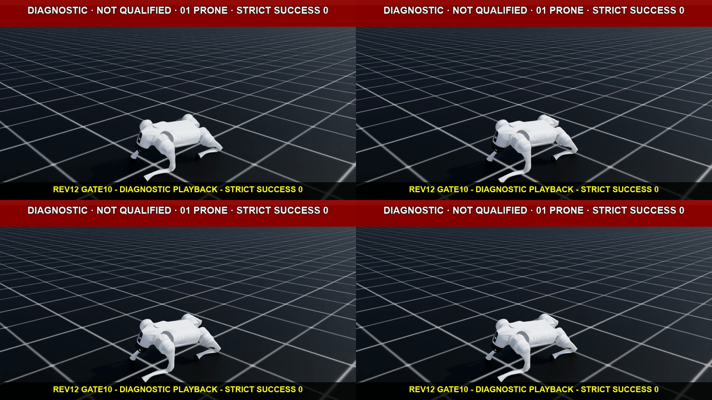

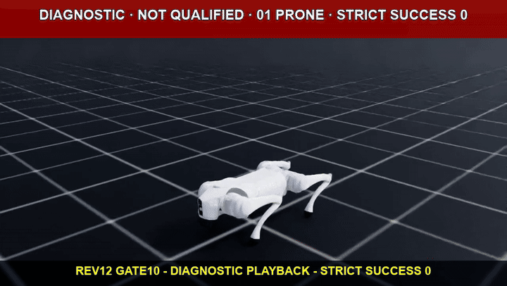

- [rev12 gate10 학습 report](../reports/runs/go2_flat_recover_rev12_prone_gate10_s42_20260828-183416.json)
- [rev12 gate10 분석](../reports/runs/g009_5_r0_diag_rev12_gate10_01_prone_analysis.json)
- [rev12 gate10 capture](../reports/runs/g009_5_r0_diag_rev12_gate10_01_prone_capture_s42.json)
- [rev12 gate10 visual summary](../reports/runs/g009_5_r0_diag_rev12_gate10_01_prone_visual_summary.json)
- [rev12 gate10 visual sidecar](../reports/runs/g009_5_r0_diag_rev12_gate10_01_prone_visual_evidence.json)

Gate10은 기각하며 gate50은 실행하지 않았다. 이어서 같은 10-iteration PPO update 경로를 유지한 pre-reset attribution으로 env·joint·actual/hard-limit·action·EMA target·velocity·torque와 직전 contact history를 귀속했다. 이 결과를 얻는 동안 calf reset, noise, torque, tolerance, reward는 바꾸지 않았다.

#### Gate10 full-state attribution 결과와 rev13

Gate10 aggregate scalar에 사라졌던 terminal 역학 상태를 복원하기 위해 동일한 10-iteration 학습 경로를 full-state attribution으로 다시 실행했다. 조건은 seed `42`, `cuda:0`, headless, scratch, `1,024 env × 24 step × 10 iterations`, 공식 `OnPolicyRunner.learn()`, action `240회`, PPO update `10회`다. 기존 `RecorderManager.record_pre_reset()`을 RNG-neutral하게 감싸고 각 사건 직전 16 control step의 action, EMA target, joint position·velocity, applied torque, root state, body contact를 기록했다.

첫 GPU fresh 3회 보고서는 원 gate10의 hard-limit series, checkpoint hash, action stream과 사건 topology를 재현해 **historical trajectory identity 근거**를 만들었다. 다만 당시 16-step ring에 EMA target·applied torque 전체 이력이 없어 인과 판정에는 부족했다. 이 세 보고서는 삭제하거나 성공 근거로 재해석하지 않고 provenance 자료로 남긴다.

- [preliminary attribution rep01](../reports/runs/g009_r0_gate10_hard_limit_attribution_rev12_gpu_rep01_s42.json)
- [preliminary attribution rep02](../reports/runs/g009_r0_gate10_hard_limit_attribution_rev12_gpu_rep02_s42.json)
- [preliminary attribution rep03](../reports/runs/g009_r0_gate10_hard_limit_attribution_rev12_gpu_rep03_s42.json)

누락된 제어 이력을 추가한 뒤 별도 fresh GPU 프로세스 세 번을 다시 실행했다. 세 보고서는 서로 다른 execution ID를 가지면서도 action stream SHA-256 `5e119de4310c393d7b847d3d460c03533dbcc0ad82f9bcc090e6cf8b83880138`, 전체 `events` 배열의 canonical JSON SHA-256 `28fd03a57d50738cedff01af51ea5fb2f4f1a9ba9d81ee56d84103de9acb2df2`, 사건 수열 `[0,1,1,1,0,0,0,0,0,0]`, 아래 세 사건을 동일하게 재현했다. canonicalization은 `json.dumps(events, ensure_ascii=False, sort_keys=True, separators=(',', ':'), allow_nan=False)`로 고정했고 검증 스크립트가 세 보고서에서 직접 다시 계산한다. 모든 attribution·historical identity check가 true였고 `model_0.pt`와 `model_9.pt` hash도 원 gate10과 일치했다.

| iteration / rollout | env / episode step | 위반 | tolerance 밖 excess | 16-step EMA target 최소 여유 | 16-step applied torque | terminal same-leg contact |
| --- | --- | --- | ---: | ---: | --- | ---: |
| `1 / 5` | `338 / 381` | `FR_calf_joint` lower | `0.001749rad` | `0.744803rad` | `2.797093~23.5Nm`, 복원 방향 `16/16` | `FR_foot`, `4.257184 BW` |
| `2 / 19` | `501 / 26` | `RL_calf_joint` lower | `0.003106rad` | `0.592072rad` | `4.457584~17.263412Nm`, 복원 방향 `16/16` | `RL_foot`, `3.023106 BW` |
| `3 / 5` | `629 / 71` | `RL_calf_joint` lower | `0.001625rad` | `0.573438rad` | `0.461164~22.377861Nm`, 복원 방향 `16/16` | `RL_foot`, `3.155098 BW` |

세 사건은 모두 calf lower-limit 위반이었다. 그러나 48개 이력 step의 EMA target은 hard lower limit보다 최소 `0.573438rad` 안쪽에 있었고 applied calf torque도 전부 관절을 limit 반대 방향으로 되돌리는 부호였다. 따라서 **이 세 사건에서 policy가 lower limit 쪽 target을 직접 명령했다는 가설은 배제한다.** 반대로 사건 직전 calf의 lower 방향 속도와 terminal same-leg foot의 `3.023~4.257 BW` 접촉이 함께 관측돼 impact·inertia와 constraint-resolution overshoot 가설을 지지한다. 이는 귀속 결과이지 rev12 안전 통과나 learned policy qualification이 아니다.

calf reset `-2.37 → -2.34rad` 변경은 현재 증거로 승인하지 않는다. 사건의 episode step은 `26`, `71`, `381`이고, 16-step ring 시작 위치는 각각 `-2.228901`, `-1.949555`, `-1.971275rad`였다. reset 직후 여유 부족과 사건 사이 직접 연결이 관측되지 않았고 16-step 창만으로 reset 영향 자체를 배제할 수도 없다. 따라서 초기 각도를 `0.03rad` 펴는 변경이 세 사건을 줄인다는 근거가 생길 때까지 다음 revision으로 채택하지 않는다.

rev13은 articulation solver **velocity iteration만 `0 → 1`**로 바꾼 단일변수 실험이다. canonical 계약 SHA-256은 `ebee855c503c77bce93c0884535d4fdf66ee5a01538fa59eef0e1b7aabba7558`이다. 이 후보는 [PhysX articulation API](https://nvidia-omniverse.github.io/PhysX/physx/5.3.0/_api_build/class_px_articulation_reduced_coordinate.html)가 교차한 body의 depenetration이 지나치게 격렬할 때 velocity iteration 증가를 제시하는 점과, 세 사건에서 복원 target·torque와 큰 same-leg 접촉이 동시에 관측된 점을 근거로 선택했다. position iteration `8`, calf reset `-2.37rad`, physics/control timestep `0.005/0.02s`, action scale/EMA `0.70/0.2`, PPO noise `0.5`, torque `23.5Nm`, hard-limit tolerance `0.01rad`, reward·curriculum·observation noise는 그대로 뒀다.

clean source commit `e3734b728fcf546fea4ee05b9c8733800d6ab536`에서 seed `42`, headless, CPU, `8 env × 150 step` probe를 새 프로세스로 세 번 실행했다. live articulation 8개는 모두 `position=8 / velocity=1`이었고 run health, numeric-invalid `0`, hard-joint-limit `0`은 통과했다. 그러나 `right_side / reset_pose_hold`의 base 접촉 peak가 세 번 모두 step `129`, `0.645s`의 `15.97161865234375 BW`로 동일했고 `15 BW` 상한을 넘었다. 유일한 false check는 `nonfoot_peak_force_bounded`였다. rev12의 같은 CPU cell `9.332860946655273 BW`보다 `+71.133147%` 높다. delta-v proxy는 감소했지만 force와 root angular peak는 증가했으므로 이를 개선으로 해석하지 않는다. 더 시간적으로 집중되고 회전 성분이 큰 반응과 일치할 뿐 인과가 증명된 것은 아니다.

따라서 rev13은 CPU 관문에서 기각했다. GPU runtime, Gate01, Gate10, PPO는 실행하지 않았고 `learned_policy_qualified=false`, qualification `not_run`, strict success `0`을 유지한다. 이 단계에는 학습 batch·epoch·optimizer update가 없다. 아래 미디어는 Isaac Sim 카메라 영상이 아니라 세 CPU report를 시각화한 진단 텔레메트리다.


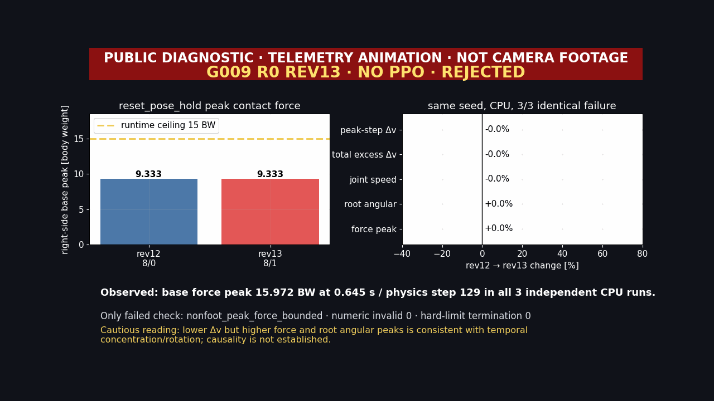

- [rev13 CPU 반복 1](../reports/runs/g009_r0_runtime_probe_rev13_cpu_rep01_s42.json), [반복 2](../reports/runs/g009_r0_runtime_probe_rev13_cpu_rep02_s42.json), [반복 3](../reports/runs/g009_r0_runtime_probe_rev13_cpu_rep03_s42.json)
- [rev13 CPU 실패 3회 합성](../reports/runs/g009_r0_runtime_probe_rev13_cpu_failure_synthesis_s42.json)
- [rev13 공개 미디어 summary](../reports/runs/g009_r0_runtime_probe_rev13_cpu_failure_visual_summary.json)

원본 MP4는 Git에 추적하지 않고 `%USERPROFILE%\IsaacLab\logs\visual_evidence\g009\R0\diagnostic\g009_5_r0_diag_rev13_cpu_runtime_failure_s42.mp4`에만 둔다. H.264 `1280×720`, `30fps`, `5.4초`, SHA-256은 `2e6c38bc9ce2df3b6f50113985433d23f3f06645371e13d8cf9f0dc44940fcd0`다.

#### rev13 04 right-side 실제 카메라 동작 증거

텔레메트리 차트는 동작 영상이 아니므로 같은 실패 cell의 actual camera footage를 별도로 만들었다. clean capture commit `2c6cd014ebad03973de449ac96d16d297e74d42b`에서 seed `42`, CPU, `8 env`, stratified pose, source env `7`, `right_side / reset_pose_hold`, physics/control timestep `0.005/0.02s`, solver live `8/1`을 다시 확인했다. headless off-screen으로 `151 frames`를 기록했으며 PPO checkpoint와 PPO update는 사용하지 않았다.

이 영상은 원 runtime report와 설정·pose·action 경로가 같은 시각 재생이다. 원 report의 `15.97161865234375 BW` peak를 영상 실행이 직접 재현했다고 주장하지 않는다. 공개 파생물에도 `DIAGNOSTIC`, `NOT QUALIFIED`, `NO PPO`, `RIGHT_SIDE`, `RESET_POSE_HOLD`, `REV13 REJECTED`를 고정했다.


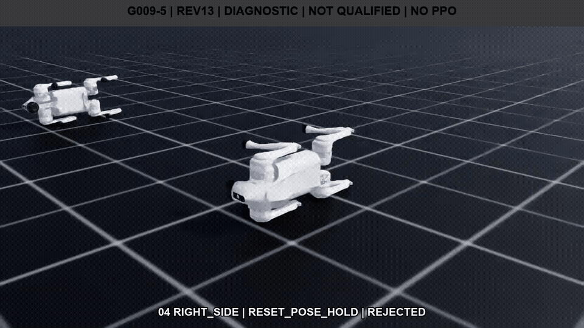

- [rev13 04 right-side camera capture](../reports/runs/g009_5_r0_diag_rev13_04_right_side_runtime_capture_s42.json)
- [rev13 04 right-side camera visual sidecar](../reports/runs/g009_5_r0_diag_rev13_04_right_side_runtime_visual_evidence.json)

로컬 전용 원본은 `%USERPROFILE%\IsaacLab\logs\visual_evidence\g009\R0\diagnostic\g009_5_r0_diag_rev13_04_right_side_runtime_s42.mp4`다. H.264 `1280×720`, `50fps`, `3.02초`, SHA-256은 `7783b28d449874bb3a5dbb5c4d28916a0bd3e350c6e786c0c23aefc070c5eb95`다. 공개 GIF는 `960×540`, 30 frames, `3.0초`, `2,230,203 bytes`, SHA-256 `ef8e57a519d3e9ce91cb0ce54bfe35b32ebd6b4418c52a71a6d34f27b6236da8`이고 대표 PNG는 `1280×720`, `435,646 bytes`, SHA-256 `087c87ce4479962f7fe2084b3dca8d7e9f54c8cd900a565a9e90bc9b2e91457f`다.

#### rev14 depenetration clamp 실제 결과와 strict 기각

rev14는 rev13에서 기각된 articulation solver `position=8 / velocity=1` 위에 만든 진단 후보다. Go2 rigid body의 `max_depenetration_velocity`만 `1.0 → 0.75m/s`로 낮췄다. [Isaac Lab schema](https://isaac-sim.github.io/IsaacLab/v2.0.0/source/api/lab/isaaclab.sim.schemas.html)는 이 값을 solver가 penetration을 보정하며 도입할 수 있는 최대 속도로 정의한다. source commit은 `e9c1eff15bb2679c67e325546a749dbe7f98b07c`, 계약 SHA-256은 `744c53d3c8d1e608f849af405c7d0fad314b01234fc4cb9a4ab1000c69140506`이다.

초기 계측은 링크 수를 13개로 잘못 가정해 기각했다. 실제 live stage를 `root_physx_view.link_paths`로 다시 읽은 결과 Go2 한 articulation에는 head와 foot을 포함한 rigid body가 19개 있었다. 수정한 probe는 8 articulation × 19 body = `152`개 prim에서 USD `RigidBodyAPI`, PhysX `RigidBodyAPI`, `max_depenetration_velocity=0.75m/s`를 모두 확인했다.

같은 seed `42`, `8 env × 150 control step`, physics/control timestep `0.005/0.02s`, stratified pose와 zero-normalized/reset-hold action으로 CPU와 GPU를 각각 독립 프로세스 3회 실행했다. 여섯 실행은 서로 다른 execution ID를 가지며 각 device 안에서 정량 결과가 동일했다.

| 관문 | CPU `3/3` | GPU `3/3` | 판정 |
| --- | ---: | ---: | --- |
| right-side reset-hold primary force | `8.5023536682 BW` | `12.6103706360 BW` | CPU의 rev12 기준 `9.3328609467 BW` 이하 PASS |
| device global force | `13.9438562393 BW` | `12.6103706360 BW` | `15 BW` 이하 PASS |
| numeric-invalid termination | `0` | `0` | PASS |
| hard-joint-limit termination | `0` | `0` | PASS |
| authoritative contact separation | `-0.0109901875m` | GPU 비권위 계측 | `-0.01m` 기준보다 `0.9901875mm` 깊어 FAIL |

force만 보면 rev14 CPU primary는 rev12보다 `0.8305072784 BW` 낮아졌다. 그러나 CPU의 최악 접촉 separation이 허용 기준을 넘었다. max depenetration velocity를 낮추면 순간 보정 속도를 제한할 수 있지만 잔류 침투가 더 깊거나 오래 남을 수 있으므로 force 감소만으로 안전 개선을 판정할 수 없다. strict 3×3 synthesis는 이 trade-off를 이유로 rev14를 `rejected_before_gate01`로 판정했다. CPU runtime `3/3`, GPU runtime `3/3`, strict trade-off synthesis는 완료했으며, 그 아래 단계인 scratch Gate01·Gate10·PPO 학습은 실행하지 않았다. qualification은 `not_run`, `learned=false`, safety numeric/hard termination은 모두 `0`이다.

- [rev14 CPU rep01](../reports/runs/g009_r0_runtime_probe_rev14_actualtopology_cpu_rep01_s42.json), [rep02](../reports/runs/g009_r0_runtime_probe_rev14_actualtopology_cpu_rep02_s42.json), [rep03](../reports/runs/g009_r0_runtime_probe_rev14_actualtopology_cpu_rep03_s42.json)
- [rev14 GPU rep01](../reports/runs/g009_r0_runtime_probe_rev14_actualtopology_gpu_rep01_s42.json), [rep02](../reports/runs/g009_r0_runtime_probe_rev14_actualtopology_gpu_rep02_s42.json), [rep03](../reports/runs/g009_r0_runtime_probe_rev14_actualtopology_gpu_rep03_s42.json)
- [rev14 CPU·GPU 3×3 trade-off synthesis](../reports/runs/g009_r0_runtime_probe_rev14_tradeoff_synthesis_3x3_s42.json)
- [rev14 04 camera capture](../reports/runs/g009_5_r0_diag_rev14_04_right_side_tradeoff_capture_s42.json)
- [rev14 04 camera visual sidecar](../reports/runs/g009_5_r0_diag_rev14_04_right_side_tradeoff_visual_evidence.json)
- [rev14 05 telemetry visual sidecar](../reports/runs/g009_5_r0_diag_rev14_05_cpu_tradeoff_visual_evidence.json)

`04`는 right-side/zero-normalized 조건의 실제 Isaac Sim headless off-screen 카메라 영상이다. 접촉 separation을 영상에서 직접 측정했다는 뜻은 아니다. capture commit은 `0463dc69297b6c52b546ec40670f20038a766285`, 공개 media commit은 `68fddd2`다. 로컬 전용 MP4는 `%USERPROFILE%\IsaacLab\logs\visual_evidence\g009\R0\diagnostic\g009_5_r0_diag_rev14_04_right_side_tradeoff_s42.mp4`이며 SHA-256은 `0bebba8177d48357a743a9a00b93a6ed9ae403a1a53813dc71bff59c027cb865`다. `05`는 force PASS와 separation FAIL을 함께 표시한 텔레메트리 애니메이션이며 카메라 영상이 아니다.


#### rev15 position iteration 결과와 CPU/GPU divergence

rev15는 rev14 위에 누적하지 않았다. 마지막 승인 runtime인 rev12의 articulation `position=8 / velocity=0`, rigid-body `max_depenetration_velocity=1.0m/s`로 돌아가 position iteration만 `8 → 16`으로 바꾼 scratch 단일변수 진단이다. velocity iteration, max depenetration velocity, calf reset, physics/control timestep, action·motor·reward·curriculum, contact offset과 rest offset은 rev12 값을 유지했다. source commit은 `bc999d504e226011ff3d83e68a416b9049b406cb`, source bundle SHA-256은 `218671a84f2748f7b94a426490057318b0896e2160454f6928c4277dee7435df`, canonical contract SHA-256은 `5f29ba19458404b5009d3734294c57e79294efecc7fe03bf8c71c71656129832`다.

seed `42`, headless, `8 env × 150 control step`, physics/control timestep `0.005/0.02s`, 네 canonical pose와 두 action mode를 같은 순서로 고정하고 CPU와 `cuda:0`에서 각각 독립 프로세스 세 번을 실행했다. 여섯 실행의 execution ID와 report SHA-256은 모두 다르다. live stage readback은 8 articulation 모두 solver `16/0`, 8 × 19 = `152`개 rigid body 모두 `max_depenetration_velocity=1.0m/s`였다. 여기서 headless는 GUI 창을 띄우지 않는 실행 방식이다. PhysX simulation과 observation/action control loop는 정상 실행되며, `06` 영상은 같은 `cuda:0` physics를 off-screen camera로 렌더링했다.

| 관문 | CPU `3/3` | GPU `3/3` | 판정 |
| --- | ---: | ---: | --- |
| non-foot peak force | `13.2482814789 BW` | `16.7882747650 BW` | CPU PASS, GPU는 `15 BW`보다 `1.7882747650 BW`·`11.92%` 높아 FAIL |
| authoritative contact separation | `-0.00935308635m` | GPU 비권위 계측 | CPU는 `-0.01m`보다 `0.646913648mm` 안쪽 PASS |
| numeric-invalid termination | `0` | `0` | PASS |
| hard-joint-limit termination | `0` | `0` | PASS |
| runtime/progression | `3/3` PASS | `0/3` PASS | strict reject |

GPU blocking cell은 세 번 모두 env 7의 `right_side / reset_pose_hold`, body index 0 `base`, physics step 129, simulation time `0.645s`였다. `run_health.passed=true`였고 false인 runtime check는 `nonfoot_peak_force_bounded` 하나뿐이었다. CPU와 GPU가 같은 canonical 계약과 live readback을 가졌는데도 force 결과가 갈렸으므로, 이 결과만으로 position iteration 증가가 안전성을 개선했다고 결론낼 수 없다. GPU separation은 현재 authoritative source가 아니므로 수치가 없는 것을 PASS처럼 취급하지 않는다.

rejection synthesis는 증거 합성 자체가 유효하다는 `evidence_synthesis_valid=true`와 후보가 통과했다는 뜻의 `candidate_runtime_calibration_passed=false`를 분리한다. 최종 상태는 `rejected_before_gate01`, `learned=false`, `ppo_training_status=not_run`, qualification `not_run`이다. rev15의 rollout은 물리·관문 진단이며 PPO rollout batch, mini-batch, epoch, optimizer update는 모두 `0`이다. 사전 정의된 RECOVER 보상 함수와 PPO 계약은 바꾸지 않았지만 학습에 사용하지도 않았다.

- [rev15 CPU rep01](../reports/runs/g009_r0_runtime_probe_rev15_cpu_rep01_s42.json), [rep02](../reports/runs/g009_r0_runtime_probe_rev15_cpu_rep02_s42.json), [rep03](../reports/runs/g009_r0_runtime_probe_rev15_cpu_rep03_s42.json)
- [rev15 GPU rep01](../reports/runs/g009_r0_runtime_probe_rev15_gpu_rep01_s42.json), [rep02](../reports/runs/g009_r0_runtime_probe_rev15_gpu_rep02_s42.json), [rep03](../reports/runs/g009_r0_runtime_probe_rev15_gpu_rep03_s42.json)
- [rev15 CPU·GPU 3×3 rejection synthesis](../reports/runs/g009_r0_runtime_probe_rev15_rejection_synthesis_3x3_s42.json)
- [rev15 06 CUDA camera capture](../reports/runs/g009_5_r0_diag_rev15_06_gpu_right_side_force_fail_capture_s42.json)
- [rev15 06 camera visual sidecar](../reports/runs/g009_5_r0_diag_rev15_06_gpu_right_side_force_fail_visual_evidence.json)
- [rev15 07 telemetry visual sidecar](../reports/runs/g009_5_r0_diag_rev15_07_cpu_gpu_telemetry_visual_evidence.json)


`06`은 `cuda:0`, env 7, `right_side / reset_pose_hold`의 실제 Isaac Sim headless off-screen camera footage다. 원 report와 계약·pose·action 경로를 묶은 시각 진단이며, 단일 카메라 재생이 세 runtime report의 peak force를 직접 측정했다는 뜻은 아니다. `07`은 여섯 report의 CPU/GPU force와 CPU separation을 그린 `TELEMETRY ANIMATION · NOT CAMERA FOOTAGE`다. 로컬 전용 H.264 MP4는 `%USERPROFILE%\IsaacLab\logs\visual_evidence\g009\R0\diagnostic\g009_5_r0_diag_rev15_06_gpu_right_side_force_fail_s42.mp4`이고, `1280×720`, `50fps`, `151 frames`, `3.02s`, SHA-256은 `5c3436ce16edc3ea904b609d5a2a975db0b1fef052a78e233cd03f958f129b86`다. Git에는 GIF·PNG·JSON만 둔다.

다음 revision은 position iteration이나 contact offset을 바로 다시 바꾸지 않는다. 먼저 승인된 rev12와 기각된 rev15에서 동일한 pose/action 경로를 CPU와 GPU로 재생하고, physics step별 normal force·contact impulse·contact pair, root pose/velocity, joint state, solver readback을 같은 키로 저장해 최초 divergence step을 찾는다. backend 차이가 readback·접촉 순서·누적 impulse 중 어디서 시작하는지 분리한 뒤 한 가설만 바꾼 새 scratch 후보를 만든다. 그 후보가 CPU·GPU 각각 독립 `3/3`에서 force·separation·numeric/hard safety를 모두 통과하기 전에는 Gate01과 PPO를 열지 않는다.

rev16의 사전 가설은 “position iteration 16이 GPU의 right-side/reset-hold base 접촉 impulse를 CPU와 rev12 position iteration 8보다 더 이르고 좁게 집중시킨다” 하나로 제한한다. rev16은 `diagnostic_protocol`이며 `qualification_eligible=false`다.

| arm | solver | 실행 순서 | 다음 arm을 여는 조건 |
| --- | --- | --- | --- |
| A baseline | `8/0`, max depenetration `1.0m/s` | CPU 3회 → GPU 3회 | 역사적 rev12 force·separation·safety 재현, 새 telemetry 완전성 `3/3` |
| B reenactment | `16/0`, max depenetration `1.0m/s` | CPU 3회 → GPU 3회 | CPU가 rev15 force·separation·env7 사건 계보를 재현할 때만 GPU 실행 |

각 physics substep은 env 7의 19 body contact-force XYZ와 magnitude, base force/BW, foot·non-foot total, `force × 0.005s` impulse, history slot과 physics/control step을 기록한다. 각 control step은 root pose·linear/angular velocity, 19 link velocity, 12 joint position·velocity·applied torque, raw action, processed target와 EMA target을 저장한다. peak 전후 최소 ±8 physics step에서 `5/10/15 BW` 초과 지속시간, 적분 impulse, `peak/window impulse` concentration index, first-contact-to-peak 시간과 같은 window의 root/joint speed를 계산한다. CPU contact callback의 point·body pair·position·normal·separation은 CPU authority로만 기록하고 GPU에서 비어 있으면 `unavailable`로 남긴다.

Arm A의 CPU 또는 GPU가 rev12 기준을 `3/3` 재현하지 못하거나 force-history slot 대응이 틀리면 계측기 교란 또는 baseline 실패로 즉시 중단한다. Arm B GPU 가설은 세 실행 모두 env 7/right-side/reset-hold/base에서 `>15 BW`, CPU보다 최소 한 physics substep 이른 peak, CPU보다 concentration index `20% 이상` 증가, action·EMA trace 오차 `≤1e-6`, 같은 peak window의 force와 root/joint speed 상승을 만족할 때만 지지한다. 한 번이라도 다른 결과가 나오거나 필드가 빠지면 다수결로 통과시키지 않고 `inconclusive`로 판정한다. 가설이 지지돼도 PPO로 진행하지 않고 position 16을 기각해 rev12 position 8을 유지한다.

#### rev16 backend divergence attribution 실제 결과

rev16은 source commit `9ac874f48a1403e0ed838beb5e75938db5873d1c`, source bundle SHA-256 `8b4031ad519a7487aff4eda83638c571d6494524b8872f229eba11fdb618541a`에서 실행했다. seed `42`, headless, `8 env`, physics/control timestep `0.005/0.02s`, 실행당 `600 physics row + 150 control row`를 고정했다. Arm A CPU 3회 → Arm A GPU 3회 → Arm B CPU 3회 → Arm B GPU 3회의 순서를 지켰고, 각 3회 synthesis가 유효해야 다음 그룹을 열었다. 전체 12개 report는 서로 다른 execution ID를 가졌으며 solver·depenetration live readback, telemetry row 수, physics clock, historical fingerprint, numeric-invalid `0`, hard-joint-limit `0`을 모두 통과했다.

| 그룹 | solver | right-side/reset-hold base peak | peak step | peak/window impulse | concentration index | historical 재현 |
| --- | --- | ---: | ---: | ---: | ---: | --- |
| Arm A CPU | `8/0` | `9.3328602041 BW` | `131` | `6.87535 / 14.06690 N·s` | `0.4887608254` | `3/3` PASS |
| Arm A GPU | `8/0` | `8.7950077539 BW` | `130` | `6.47912 / 14.26115 N·s` | `0.4543198511` | `3/3` PASS |
| Arm B CPU | `16/0` | `13.2482805877 BW` | `130` | `9.75977 / 14.48611 N·s` | `0.6737326952` | `3/3` PASS |
| Arm B GPU | `16/0` | `16.7882770994 BW` | `129` | `12.36762 / 15.50992 N·s` | `0.7974004593` | `3/3` PASS, runtime force FAIL |

historical fingerprint와 현재 canonical telemetry는 계산 목적이 다르므로 projection을 분리했다. rev12·rev15 비교용 historical projection은 당시와 같은 native Torch float32 norm·mass reduction·BW normalization·첫 max index를 복원한다. 현재 분석용 canonical projection은 float32 source를 Python float로 옮긴 뒤 `math.fsum`과 제곱근으로 계산한다. historical strict tolerance `1e-6`은 완화하지 않았다. 대신 두 projection이 같은 body·step·classification을 가리키는지 별도 crosscheck를 추가했고, 12회 모두 shared field exact, finite/nonnegative, `15 BW` 분류 일치, force 차이 `≤4e-6 BW`를 통과했다. 최대 pair 차이는 B GPU의 `2.3343854494e-6 BW`였다. 이 분리는 과거 증거를 현재 산식에 억지로 맞춘 것이 아니라 과거 재현과 현재 분석을 동시에 보존한 것이다.

| 사전 가설 검사 | 3회 결과 |
| --- | --- |
| B GPU force `>15 BW` | PASS |
| B GPU peak가 B CPU와 A GPU보다 최소 한 substep 빠름 | PASS, `129 < 130` |
| B GPU/B CPU concentration ratio `≥1.20` | **FAIL, `1.18355612696`** |
| B GPU concentration이 A GPU보다 큼 | PASS |
| action·raw action·EMA trace 오차 `≤1e-6` | PASS, 최대 `0` |
| B GPU peak-window root·joint speed가 B CPU와 A GPU보다 큼 | PASS |
| numeric-invalid·hard-joint-limit termination | PASS, 모두 `0` |

B GPU peak-window root angular speed는 `11.1889840753rad/s`로 B CPU `6.8145360210rad/s`, A GPU `6.7838828192rad/s`보다 높았다. joint speed도 `10.7847614288rad/s`로 B CPU `7.2813477516rad/s`, A GPU `7.7153296471rad/s`보다 높았다. B GPU의 force peak가 한 substep 빨라지고 `>15 BW` 노출이 `0.005s` 동안 한 번 나타난 것도 세 번 똑같았다. 다만 peak/window impulse concentration은 CPU 대비 `18.3556%` 증가에 그쳤다. 사전에 고정한 `20%` 기준을 사후에 낮추지 않았으므로 3회 모두 같은 단일 검사에서 실패했고, 최종 판정은 `hypothesis=inconclusive`, `supported_3_of_3=false`다.

B CPU와 B GPU의 first-control divergence는 control step `1`의 joint velocity에서, first-physics divergence는 physics step `128`의 base force에서 관측됐다. 이는 차이가 나타난 최초 계측 경계를 찾은 결과이지 GPU 접촉 topology의 인과 증명은 아니다. contact point·body pair·normal·separation callback은 CPU만 authority이며 GPU에서는 `unavailable`로 남겼다. 따라서 “position 16이 GPU 접촉 impulse를 20% 이상 더 좁게 만든다”는 주장은 하지 않는다.

rev16은 강화학습이 아니다. 사전 정의한 RECOVER reward와 PPO 계약은 변경하지 않았지만 rollout batch, mini-batch, epoch, optimizer update는 모두 `0`이다. Gate01과 Gate10은 `forbidden`, PPO는 `not_run`, qualification은 `not_run`, `learned=false`다. 가설이 지지됐더라도 position 16은 기각하는 계약이었고, 실제로 force까지 실패했으므로 승인된 runtime baseline은 rev12 `8/0`으로 유지한다.

rev17 E010은 위 분해를 완료했지만 단일 물리 lever를 선택할 만큼의 인과 근거는 만들지 못했다. 다음 작업은 임계값을 낮추거나 곧바로 PPO를 여는 일이 아니다. 먼저 GPU에서도 권위 있는 constraint/contact 정보를 얻을 수 있는 계측 경로를 확인하고, 불가능하면 rev12 `8/0` 기준에서 변경 전 가설·방향·판정 기준을 고정한 단일변수 intervention probe를 설계한다. 후보가 정해진 뒤에도 CPU·GPU 각 독립 `3/3`에서 force·CPU separation·numeric/hard safety를 모두 통과해야 Gate01을 열 수 있다.

- [rev16 Arm A CPU rep01](../reports/runs/g009_r0_rev16_arm_a_cpu_rep01_retry06_s42.json), [rep02](../reports/runs/g009_r0_rev16_arm_a_cpu_rep02_retry02_s42.json), [rep03](../reports/runs/g009_r0_rev16_arm_a_cpu_rep03_retry02_s42.json)
- [rev16 Arm A GPU rep01](../reports/runs/g009_r0_rev16_arm_a_gpu_rep01_retry02_s42.json), [rep02](../reports/runs/g009_r0_rev16_arm_a_gpu_rep02_retry02_s42.json), [rep03](../reports/runs/g009_r0_rev16_arm_a_gpu_rep03_retry02_s42.json)
- [rev16 Arm B CPU rep01](../reports/runs/g009_r0_rev16_arm_b_cpu_rep01_retry01_s42.json), [rep02](../reports/runs/g009_r0_rev16_arm_b_cpu_rep02_retry01_s42.json), [rep03](../reports/runs/g009_r0_rev16_arm_b_cpu_rep03_retry01_s42.json)
- [rev16 Arm B GPU rep01](../reports/runs/g009_r0_rev16_arm_b_gpu_rep01_retry01_s42.json), [rep02](../reports/runs/g009_r0_rev16_arm_b_gpu_rep02_retry01_s42.json), [rep03](../reports/runs/g009_r0_rev16_arm_b_gpu_rep03_retry01_s42.json)
- [rev16 03-run synthesis](../reports/runs/g009_r0_rev16_synthesis_03_a_cpu_retry02_s42.json), [06-run synthesis](../reports/runs/g009_r0_rev16_synthesis_06_a_cpu_gpu_retry01_s42.json), [09-run synthesis](../reports/runs/g009_r0_rev16_synthesis_09_a_all_b_cpu_retry01_s42.json), [12-run final synthesis](../reports/runs/g009_r0_rev16_synthesis_12_full_retry01_s42.json)
- [rev16 08 CUDA camera capture](../reports/runs/g009_5_r0_diag_rev16_08_b_gpu_right_side_force_repro_capture_s42.json), [camera visual sidecar](../reports/runs/g009_5_r0_diag_rev16_08_b_gpu_right_side_force_repro_visual_evidence.json)
- [rev16 09 four-group telemetry sidecar](../reports/runs/g009_5_r0_diag_rev16_09_four_group_telemetry_visual_evidence.json)


`08`은 Arm B `16/0`, `cuda:0`, env 7, `right_side / reset_pose_hold`를 실제 Isaac Sim headless off-screen camera로 촬영한 조건 일치 시각 재생이다. 화면의 `16.788 BW > 15 BW`는 연결된 runtime report의 판정이며 픽셀에서 힘을 측정한 값이 아니다. `09`는 네 그룹의 force, peak step, 17-step impulse concentration과 `1.183556 < 1.20` 판정을 그린 `TELEMETRY · NOT CAMERA` 애니메이션이다. 두 매체 모두 `DIAGNOSTIC · REJECTED · NO PPO · NOT QUALIFIED`를 고정했다.

로컬 전용 H.264 MP4는 `%USERPROFILE%\IsaacLab\logs\visual_evidence\g009\R0\diagnostic\g009_5_r0_diag_rev16_08_b_gpu_right_side_force_repro_s42.mp4`다. `1280×720`, `50fps`, `151 frames`, `3.02s`, `267,188 bytes`, SHA-256 `151146e078ce19f113e197fef931c4e32014424af2d7ce0ef20db7f6c40618b0`이며 Git에는 GIF·PNG·JSON만 둔다. 물리 report의 실행 소스는 커밋 `9ac874f48a1403e0ed838beb5e75938db5873d1c`·bundle `8b4031ad519a7487aff4eda83638c571d6494524b8872f229eba11fdb618541a`, 카메라 recorder의 실제 소스는 clean capture 커밋 `51f2c63eaf408525fc5ddce3249f8138b8c5baaa`·bundle `599487d4669b90472688428b2c9feb6f1d527235eec4e7017f0f2f2edd9962e1`로 분리했다.

#### rev17 E010 mechanism split 오프라인 진단 결과

E010은 새 Isaac Sim 실행이나 새 강화학습이 아니다. rev16의 hash-bound 12개 report를 입력으로 삼아 실행당 `600 physics row + 150 control row`를 다시 검증한 순수 Python 오프라인 분석이다. 원 report는 seed `42`, headless, `8 env`, physics/control `0.005/0.02s`, Arm A/B × CPU/GPU × 3회 조건에서 생성됐다. E010 자체의 rollout batch, mini-batch, epoch, optimizer update는 모두 `0`이며 RECOVER 보상함수도 계산하지 않았다. 분석 JSON의 `status=pass`는 입력 12개, 해시, row shape, 시간축, body/joint alignment와 산술 무결성이 통과했다는 뜻이지 후보 정책이나 solver가 통과했다는 뜻이 아니다.

| B GPU 대비 B CPU, 17-step peak window | 변화 |
| --- | ---: |
| peak base force | `+26.720422%` |
| 전신 body impulse magnitude 합 | `+1.420270%` |
| base window impulse | `+7.067522%` |
| base share | `64.213292% → 67.788797%`, `+3.575505%p` |
| FR+RR hip impulse magnitude | `-10.833784%` |

순간 peak는 크게 올랐지만 같은 17-step 창의 전신 impulse magnitude 증가는 `1.42%`였다. 따라서 “전체 충격량이 26.72% 커졌다”라고 해석하면 안 된다. 관측된 변화는 짧은 시간의 base 집중과 링크별 하중 재배치다. focus step `128~130`에서 B CPU의 body impulse magnitude 합은 `12.273342N·s`, base는 `12.083573N·s`로 `98.4538%`였다. B GPU의 합은 `18.052941N·s`, base는 `14.653786N·s`로 `81.1712%`였고 FR hip `1.566811N·s`, RR hip `1.784526N·s`가 함께 나타났다. 이 값은 GPU force aggregation이지 접촉쌍 topology가 아니다.

CPU authority에서 확인한 접촉 순서는 다음과 같다.

1. physics step `128`: `FL_hip↔ground`, `RL_hip↔ground`
2. physics step `129`: `FL_hip↔ground`, `base↔ground`
3. physics step `130`: `base↔ground`

physics step `128/129/130`은 각각 control bucket `32/33/33`, force-history slot `0/3/2`에 대응한다. control action과 EMA trace 최대 오차는 `0`이지만 root·joint state는 control step `1`부터 갈라졌다. physics force aggregation의 최초 차이는 세 replicate 모두 step `128`, `base_force_bodyweights`, delta `3.1033276173 BW`다. 그러나 GPU contact callback이 없으므로 CPU/GPU 접촉 토폴로지의 최초 차이는 관측할 수 없고 report에 `status=unavailable_on_gpu`, `step=null`로 기록했다. 이 경계 때문에 solver, 초기 geometry, 접촉 timing 중 하나를 원인으로 확정하지 않았다.

결론은 `outcome=inconclusive`, `selected_lever=null`이다. Gate01은 `forbidden`, PPO와 qualification은 `not_run`, `learned=false`다. 다음 revision은 권위 있는 GPU constraint/contact 계측이 가능한지 먼저 검증하거나, 그렇지 않으면 rev12 `8/0`에서 방향과 성공·기각 기준을 사전 등록한 단일변수 intervention만 허용한다. 여러 solver·contact 값을 동시에 바꾸거나 실패 임계값을 사후 완화하지 않는다.

- [rev17 E010 오프라인 분석 JSON](../reports/runs/g009_r0_rev17_mechanism_split_offline_s42.json)
- [rev17 E010 visual summary](../reports/runs/g009_5_r0_e010_rev17_mechanism_split_visual_summary.json)
- [rev17 E010 visual sidecar](../reports/runs/g009_5_r0_e010_rev17_mechanism_split_visual_evidence.json)
- [rev17 E010 전용 validator](../scripts/validate_g009_r0_rev17_mechanism_media.py)

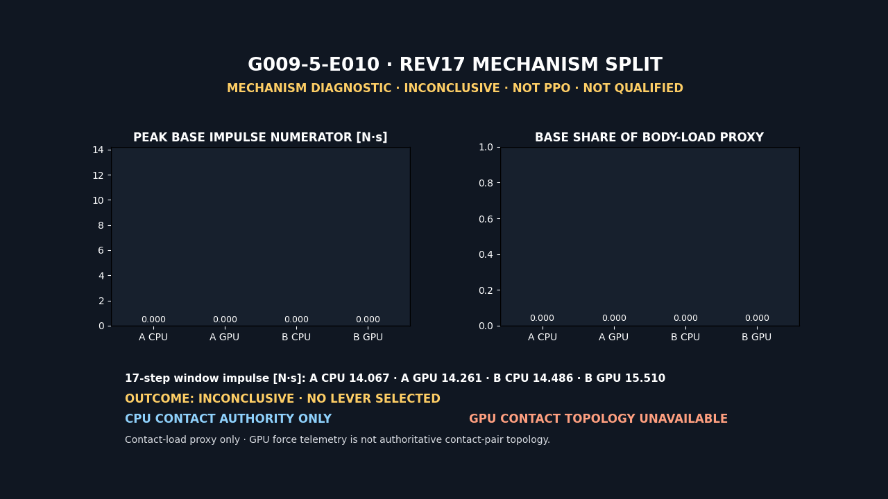

번호 `10`은 telemetry animation이며 camera footage가 아니다. 화면과 JSON에 `INCONCLUSIVE`, `NO LEVER SELECTED`, `NOT PPO`, `NOT QUALIFIED`, `CPU CONTACT AUTHORITY ONLY`, `GPU CONTACT TOPOLOGY UNAVAILABLE`를 고정했다. 공개 PNG는 `72,230 bytes`, SHA-256 `2e94054e25ba2a73791ab6d486884508f65bf59e571d517b798ab095dc45c925`, GIF는 `80,402 bytes`, 6 frames, `4.8s`, SHA-256 `941a1956b1a91f41bd914c5188558c76ff7545bbf90deb42c50359f8c2768ff9`다. 개인 확인용 H.264 MP4는 `%USERPROFILE%\IsaacLab\logs\visual_evidence\g009\R0\diagnostic\g009_5_r0_e010_rev17_mechanism_split_s42.mp4`, `1280×720`, `30fps`, `4.8s`, `68,872 bytes`, SHA-256 `006c82cb35bda8f67c98eaa26a6a95b892e99ee84f5a584b56615c795f5f3d4c`이며 Git에는 넣지 않는다.

#### rev18 E011 raw contact callback CPU/GPU 2×2 진단

E010은 GPU contact-pair 정보가 비어 있어 lever를 고르지 못했다. E011은 그 빈칸이 현재 실행 경로에서 실제로 채워지는지 확인한 headless capability probe다. 새 정책을 학습하거나 복구 동작을 평가한 실험이 아니다. 공통 source commit은 `6072ac01116b8fd65f40c38d7f644ff4208a0b7e`, source bundle SHA-256은 `f6c40a35efbb380ca5644494da0e1b9812e9b66acb465aa727d63f8a9eaa2739`다.

실행 조건은 CPU와 `cuda:0`에서 모두 같게 고정했다.

| 항목 | 값 |
| --- | --- |
| 실험/번호 | `G009-5-E011`, `11`, rev18 |
| 반복 | CPU `2회` + GPU `2회`, 각 새 프로세스·고유 UUID4 |
| seed / 환경 | `42` / `8 env`, 판정 source env `7` |
| 자세·동작 | `right_side / reset_pose_hold` |
| solver | position/velocity iteration `16/0` |
| 실행 모드 | headless, camera/render off |
| 물리 시간 | `150 step × 0.005s = 0.75s` |
| action 갱신 | physics step `1,5,...,149`, 총 `38회` |
| PPO | rollout·mini-batch·epoch·optimizer update 모두 `0` |
| 보상·종료 | 구성은 로드했지만 manual inner loop에서 계산하지 않음 |

`env.step()` 대신 `process_action → apply_action → write_data_to_sim → sim.step(render=False) → scene.update(0.005)`를 직접 호출했다. 따라서 RewardManager와 TerminationManager의 post-step 경로를 건너뛰고 raw callback·ContactSensor proxy·articulation wrench만 수집했다. 이 분리는 “보상값이 좋아져서 접촉이 달라졌다”는 혼동을 막는다.

환경에 구성된 RECOVER 보상함수는 다음과 같지만 E011에서는 한 항도 계산하지 않았다.

| 보상 항 | 가중치 | E011 상태 |
| --- | ---: | --- |
| `upright_progress` | `+2.0` | not computed |
| `gated_base_height_progress` | `+2.0` | not computed |
| `soft_stand_progress` | `+2.0` | not computed |
| `stable_support` | `+0.5` | not computed |
| `upright_hold` | `+5.0` | not computed |
| `stable_success_once` | `+10.0` | not computed |
| `gated_angvel_l2` | `-0.05` | not computed |
| `joint_limit` | `-2.0` | not computed |
| `torque_l2` | `-0.0002` | not computed |
| `joint_acc_l2` | `-2.5e-7` | not computed |
| `gated_action_rate_l2` | `-0.01` | not computed |
| `mechanical_power_proxy` | `-1.0e-5` | not computed |
| `undesired_collision` | `-1.0` | not computed |

[Omni Physics contact report](https://docs.omniverse.nvidia.com/kit/docs/omni_physics/latest/extensions/runtime/source/omni.physx/docs/dev_guide/contact_reports.html)는 callback 버퍼가 callback 동안만 유효하다고 설명한다. probe는 header, actor/collider path, point, normal, impulse, separation을 callback 안에서 즉시 Python 값으로 복사했다. [Isaac Lab ContactSensorData](https://isaac-sim.github.io/IsaacLab/v2.1.1/_modules/isaaclab/sensors/contact_sensor/contact_sensor_data.html)의 `net_forces_w`는 접촉력 proxy이며 raw actor/collider pair를 복원하는 권위 자료로 쓰지 않았다.

첫 CPU 시도는 callback 판정 전에 실패했다. `gym.make()`로 articulation tensor view가 만들어진 뒤 env 7 root에 `PhysxResidualReportingAPI.Apply()`를 적용하면서 env 7 collision mesh가 tensor view 사용 중 다시 파싱됐고, `CpuArticulationView::getRootTransforms`가 실패했다. 이 실행은 결과 2×2에서 제외했다. 실패 JSON은 `%USERPROFILE%\IsaacLab\logs\visual_evidence\g009\R0\diagnostic\failed_attempts\g009_5_r0_e011_rev18_cpu_rep01_preinit_failure_attempt01_s42.json`, Kit 로그는 같은 폴더의 `g009_5_r0_e011_rev18_cpu_rep01_preinit_failure_attempt01_kit.log`다. SHA-256은 각각 `7fc9e0dda04a1e975bbf4f6105d5cc7862df08915125e492afe46b1f16830c5e`, `28335cd1df363346268f782f2df284ad58842703f58e12ee2504777bb7e06e30`이다. [Omni Physics simulation control](https://docs.omniverse.nvidia.com/kit/docs/omni_physics/107.0/dev_guide/simulation_control/simulation_control.html)은 실행 중 USD 변경이 PhysX에 전달된다고 설명하지만 late schema mutation 뒤 tensor view 수명을 보장하지 않는다. 수정 뒤 residual reader는 live scene을 바꾸지 않고 이미 사전 작성된 API를 `Get()`으로만 읽는다. 새 CPU 두 로그에는 shape deletion, `detachShape`, tensor-view invalidation 문자열이 없었다.

최종 2×2 결과는 다음과 같다.

| 슬롯 | raw callback | raw 판정 | probe valid | positive force stimulus | supporting bundle |
| --- | ---: | --- | --- | --- | --- |
| CPU rep01 | `150` | PASS | `true` | `true` | incomplete |
| CPU rep02 | `150` | PASS | `true` | `true` | incomplete |
| GPU rep01 | `0` | unavailable | `true` | `true` | incomplete |
| GPU rep02 | `0` | unavailable | `true` | `true` | incomplete |

CPU 두 실행은 source env 7의 header `358`, contact point `767`, nonzero impulse point `414`, 최대 impulse norm 약 `4.797629N·s`가 반복됐다. GPU 두 실행은 subscription이 성공했고 malformed callback이나 callback error가 없었지만 event가 `0`이었다. 그와 동시에 GPU force proxy 최대 norm 약 `2473.524N`, incoming joint wrench 6D 최대 norm 약 `387.016`이 관측됐다. 따라서 GPU 실행에 접촉 자극이 없었다고 해석할 수는 없다. 반대로 proxy가 raw pair를 대신할 수도 없으므로 GPU 접촉 physics 자체가 고장 났다고 결론내리지 않는다.

모든 실행에서 `150×19×3` net-force proxy와 `150×19×6` incoming joint wrench는 수집됐다. 그러나 `force_matrix_w=None`이고 scene/source-articulation residual API가 사전 작성되지 않아 residual은 unavailable이다. instrumentation bundle은 `0/4 complete`, `status=unavailable`이다. 이것은 raw callback feasibility와 분리한 보조 계측 한계다. Physics residual은 [Isaac Sim PhysicsContext API](https://docs.isaacsim.omniverse.nvidia.com/4.5.0/py/source/extensions/isaacsim.core.api/docs/index.html)의 scene reporting 기능이지만 raw contact ground truth나 solver 품질 합격 기준으로 승격하지 않는다.

2×2 synthesis의 결론은 `outcome=unavailable_on_gpu`다. 정확한 뜻은 “이 source·device·pose·solver·150-step 조건에서 GPU PhysX raw contact-report callback 관측을 2회 모두 얻지 못했다”이다. CPU `2/2`는 raw PASS와 반복성을 충족했고 GPU `2/2`는 probe valid와 positive stimulus를 유지한 채 같은 unavailable signature를 보였다. `status=pass`는 입력 해시·계약·반복성·판정 산술이 검증됐다는 뜻일 뿐 실행 전체나 정책의 성공이 아니다.

- [rev18 CPU rep01](../reports/runs/g009_r0_rev18_raw_contact_cpu_rep01_s42.json), [CPU rep02](../reports/runs/g009_r0_rev18_raw_contact_cpu_rep02_s42.json)
- [rev18 GPU rep01](../reports/runs/g009_r0_rev18_raw_contact_gpu_rep01_s42.json), [GPU rep02](../reports/runs/g009_r0_rev18_raw_contact_gpu_rep02_s42.json)
- [rev18 CPU/GPU 2×2 synthesis](../reports/runs/g009_r0_rev18_raw_contact_feasibility_synthesis_2x2_s42.json)
- [rev18 raw contact probe](../scripts/probe_g009_r0_rev18_gpu_raw_contact.py), [2×2 summarizer](../scripts/summarize_g009_r0_rev18_gpu_raw_contact.py)
- [rev18 번호 11 visual summary](../reports/runs/g009_5_r0_e011_rev18_raw_contact_feasibility_visual_summary.json), [hash-bound sidecar](../reports/runs/g009_5_r0_e011_rev18_raw_contact_feasibility_visual_evidence.json)

번호 `11`은 네 실행의 정량 결과를 재생하는 telemetry animation이다. camera footage, robot locomotion footage, training footage가 아니며 화면에도 `DIAGNOSTIC-ONLY`, `NOT PPO`, `NOT QUALIFIED`, `NO LEVER SELECTED`를 고정했다. 공개 PNG는 `1280×720`, `69,797 bytes`, SHA-256 `0cb74b9eab5291f91afc850771db14b9b92694475cbaf636c91c4731ea620191`다. 공개 GIF는 6 frames, `4.8s`, `37,337 bytes`, SHA-256 `208f19b30d200947490980aeb22d4b898011d13a4dce2f779aa9cc05ef8207a0`다. visual summary는 `3,790 bytes`, SHA-256 `201df8abdf380cf009a297f7be81fb360c2d7195d8eb728bfc4045d71a877f63`, 전용 validator가 PASS한 sidecar는 `4,825 bytes`, SHA-256 `9c2cc14512aa271768eda68adda960bf2b5468d8b756097576a3a8264dc9180d`다.

개인 확인용 H.264 MP4는 `%USERPROFILE%\IsaacLab\logs\visual_evidence\g009\R0\diagnostic\g009_5_r0_e011_rev18_raw_contact_feasibility_s42.mp4`에만 둔다. `1280×720`, `30fps`, `4.8s`, `58,674 bytes`, SHA-256 `542a63a4a686d6d0e1eab1ba729be4aa8ea5fe6572e4ef9c1e6c9a3f341fd38e`이며 Git에는 넣지 않는다.

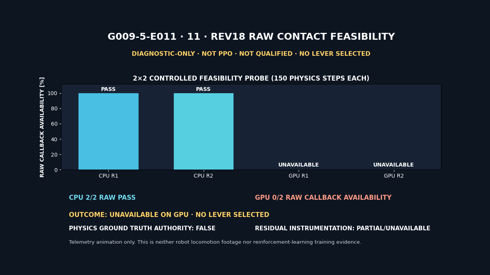

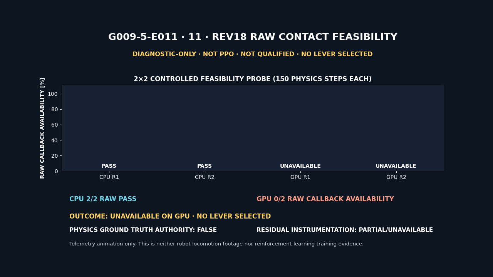

governance는 physics-ground-truth authority `false`, `selected_lever=null`, Gate01 `forbidden`, PPO `not_run/0`, qualification `not_run`, `learned=false`다. Garden에는 성공 사례로 발행하지 않고, 단일변수 intervention이 끝나 계측 또는 안전 gate의 성공 결과와 함께 설명할 수 있을 때 실패 원인과 수정 과정을 포함한다.

canonical GPU JSON에는 subscription 성공, malformed callback `0`, callback error `null`이 기록됐다. 실행 당시 Kit 로그에서 overflow·capacity 경고를 찾지 못했지만 그 로그는 canonical report나 sidecar에 경로·해시로 보존되지 않았다. 따라서 “GPU buffer overflow가 없었다”는 문장을 공개 결론으로 사용하지 않고 buffer 크기도 임의로 바꾸지 않는다. 다음 단계는 rev12 승인 baseline solver `8/0` 안에서 contact offset만 달리하는 동시대 Arm A/B probe다. 이것은 raw callback이 생기는지 확인하는 계측 intervention이며, force·CPU separation·numeric/hard safety를 통과하기 전에는 Gate01이나 PPO를 열지 않는다.

#### rev19 E012 contact-offset 2×2×2 A/B 사전 등록

E012는 이 문단과 machine-readable contract를 source commit에 먼저 고정한 뒤 실행한다. rev18 treatment를 그대로 대조군으로 쓰지 않는다. rev18은 solver `16/0`이고 새 후보는 `8/0`이므로 두 결과를 직접 빼면 solver 변경과 contact-offset 변경이 섞인다. rev12는 `8/0`의 역사적 승인 근거일 뿐 raw callback harness와 source가 다른 formal control이 아니다. 단일변수 효과는 같은 rev19 clean commit 안의 Arm A/B로만 계산한다.

| 축 | Arm A control | Arm B intervention |
| --- | --- | --- |
| position/velocity solver | `8/0` | `8/0` |
| robot contact offset | shape별 runtime baseline `×1.0` | 같은 배열 `×1.5` |
| robot rest offset | 읽은 값 그대로 | 읽은 값 그대로 |
| 반복 | CPU 2회 + GPU 2회 | CPU 2회 + GPU 2회 |
| seed / 환경 / source | `42` / `8 env` / env `7` | 동일 |
| pose / action | `right_side / reset_pose_hold` | 동일 |
| 물리 시간 | `150×0.005s=0.75s` | 동일 |

총 슬롯은 `2 arms × 2 devices × 2 replicates = 8`이고 canonical 순서는 CPU `A1/A2/B1/B2`, GPU `A1/A2/B1/B2`다. CPU 네 report가 raw PASS·probe-valid·manual safety available/PASS·arm별 반복성 PASS를 모두 충족하면 immutable `reports/runs/g009_r0_rev19_contact_offset_cpu_preflight_2x2_s42.json`을 만든다. GPU probe는 AppLauncher 전에 이 artifact의 파일 SHA·source commit·probe source bundle·정확한 CPU 4개 input binding을 검증해야 한다. 어느 arm/device라도 `1/2` split이면 제3회 다수결을 금지하고 `inconclusive_nondeterministic`으로 닫는다. rev18과의 비교는 lineage와 역사적 transport check로만 남기고 E012 causal contrast에 넣지 않는다.

[PhysX Advanced Collision Detection](https://nvidia-omniverse.github.io/PhysX/physx/5.1.2/docs/AdvancedCollisionDetection.html)에 따르면 두 shape의 거리가 contact offset 합보다 작아지면 접촉점 생성을 시작하며 contact offset은 rest offset보다 커야 한다. 값을 늘리면 접촉을 더 일찍 만들 수 있지만 지나치면 접촉 수와 계산 비용이 늘고 surface 가정이 깨져 artifact가 생길 수 있다. [PxShape API](https://nvidia-omniverse.github.io/PhysX/physx/5.5.0/_api_build/classPxShape.html)는 setter가 actor를 자동으로 깨우지 않는다고 명시한다. E012는 이 때문에 첫 physics step 전에 env startup event로 두 arm 모두 같은 get/set 순서를 실행한다.

Go2의 shape별 값을 하나의 절대값으로 덮어쓰지 않는다. startup event가 `root_physx_view.get_contact_offsets()`와 `get_rest_offsets()`로 `8×27` baseline을 읽고, contact 배열만 arm scale로 바꿔 `set_contact_offsets()`에 전달한다. Arm A도 `×1.0`을 set해 API 호출 경로를 B와 맞춘다. tensor 열은 `shape_index_00..26`으로만 부르고 USD collision prim path와 열별 대응 관계는 주장하지 않는다. prim path inventory는 count/topology 증거로만 분리한다. rest setter와 새 `CollisionAPI.Apply`/USD schema mutation은 금지한다. ground offset은 직접 readback하지 않았으므로 unchanged를 주장하지 않고 robot root tensor setter의 호출 범위만 source-bound 증거로 남긴다. report는 before/after 배열, tensor shape, canonical hash, min/max와 다음 항등식을 검증한다.

\[
c_A'=c,\qquad c_B'=1.5c,\qquad r_A'=r_B'=r,\qquad c'>r
\]

나머지는 solver `8/0`, max depenetration `1.0m/s`, physics/control dt `0.005/0.02s`, reset·action·mass·friction·motor·observation 계약을 고정한다. manual inner loop는 action 적용과 scene write/physics step/update만 실행하고 reward·termination·curriculum manager post-step을 호출하지 않는다. 따라서 PPO batch·mini-batch·epoch·optimizer update는 모두 `0`이다.

진단 안전값은 Gate와 구분해 기록한다. finite joint position/contact force, hard joint range `+0.01rad` margin, non-foot peak force `≤15 BW`, CPU 8개 env별·전체·source env raw minimum separation `≥-0.01m`을 raw report에서 재계산한다. `robot.data.default_mass`는 `8×19` snapshot과 body ordering hash를 남기고 150 step 불변성을 검증하며, non-foot force의 BW 분모도 이 snapshot에서 재계산한다. max depenetration readback은 8 articulation × 19 bodies 전부 `1.0m/s`여야 한다. GPU raw callback이 Arm B에서만 `2/2` 생기더라도 이것은 현재 controlled cell에서 관측 경로가 바뀌었다는 제한적 근거다. physics-ground-truth authority는 `false`, `selected_lever=null`, Gate01 `forbidden`, PPO·qualification `not_run`을 유지한다. 두 arm 모두 unavailable이면 intervention을 기각하고, 둘 다 available이면 offset 이진효과는 입증되지 않은 것으로 닫는다. 합성의 `status=complete`는 파일 생성 완료이지 성능 PASS가 아니다.

실행 절차는 CPU 네 report를 먼저 만든 뒤 요약기에 `--mode cpu-preflight`와 정확한 `A1,A2,B1,B2` 순서로 전달하는 방식이다. GPU 네 probe에는 모두 `--cpu-preflight reports/runs/g009_r0_rev19_contact_offset_cpu_preflight_2x2_s42.json`을 넣는다. 마지막 합성은 `--mode final`, 동일 preflight, CPU-first 8 report 순서와 canonical 출력 `reports/runs/g009_r0_rev19_contact_offset_intervention_synthesis_2x2x2_s42.json`을 요구한다. final 단계는 preflight의 CPU binding과 실제 첫 네 입력이 같고 GPU 네 report의 preflight path/SHA/commit/bundle이 모두 같은지 fail-closed로 대조한다. 판정 우선순위는 report/probe integrity → safety availability → CPU preflight validity → safety threshold → replicate split/repeatability다.

첫 CPU A1은 source commit `d3462069ab8dc52024730ea55287cb8382e4d50c`에서 rollout 전에 fail-closed 됐다. 원인은 `stage.Traverse()`가 Go2 robot subtree의 USD instance proxy를 기본 순회하지 않는데도 env별 collision prim 27개가 직접 나온다고 가정한 관찰 하네스였다. 이는 보행·복구 정책, 접촉 오프셋의 물리 효과, 강화학습 결과 실패가 아니다. Kit 로그에서는 articulation과 19 rigid body가 정상 초기화됐고, contact-offset tensor 자체도 `[8,27]`이었다.

수정본은 env별 robot root를 확인한 뒤 `Usd.PrimRange(robot_root, Usd.TraverseInstanceProxies())`로 읽기 순회한다. [OpenUSD의 instancing 문서](https://openusd.org/release/api/_usd__page__scenegraph_instancing.html)는 기본 prim range가 instance proxy를 반환하지 않으며 이 predicate를 명시해야 한다고 설명한다. report는 env별 collision path 수·unique 수·instance-proxy 수와 8환경 relative template 동일성을 남긴다. USD schema를 적용하거나 instanceable 상태를 바꾸지 않으며, 27개 path inventory를 PhysX tensor 열 순서와 매핑하는 권위는 계속 `false`다. 실패 attempt의 report·Kit 로그·SHA manifest는 `%USERPROFILE%\IsaacLab\logs\visual_evidence\g009\R0\diagnostic\failed_attempts\rev19`에 로컬 보존하고, 수정 커밋에서 CPU A1부터 fresh execution으로 다시 시작한다.

#### rev19 E012 attempt02/03: force와 mass의 본체 순서는 같은 축이 아니다

topology 수정 commit `4b993a06039598ee1918f48761179bc201c4a437`에서 다시 실행한 CPU A1 attempt02는 environment 초기화와 150-step manual physics loop를 완료했다. 하지만 final safety snapshot이 `mass evidence unavailable`로 fail-closed 됐다. 따라서 이것도 접촉 오프셋의 효과나 로봇 복구 성공·실패를 판정한 실행이 아니다. PPO rollout batch, mini-batch, epoch, optimizer update, Gate01, qualification은 여전히 모두 `0/not_run`이다.

외부 로컬 wrapper를 사용한 attempt03은 canonical 결과를 만들지 않고 observer 내부 상태만 계측했다. runtime shape는 다음과 같이 정상이다.

| 데이터 | shape | 두 번째 축의 권위 |
| --- | ---: | --- |
| `sensor.data.net_forces_w` | `[8,19,3]` | `sensor.body_names` |
| `robot.data.default_mass` | `[8,19]` | `robot.body_names` |
| `robot.data.joint_pos` | `[8,12]` | articulation joint order |
| `robot.data.joint_pos_limits` | `[8,12,2]` | articulation joint order |

두 19-body 목록은 unique 집합이 정확히 같았지만 ordered list는 달랐다. contact sensor는 각 다리를 hip→thigh→calf→foot 순으로 모은 뒤 다음 다리로 진행했고, articulation mass tensor는 tree/articulation link 순서를 사용했다. 이전 observer는 이 둘을 같은 ordered list라고 요구해 첫 sample에서 `ValueError: mass/contact body ordering mismatch`를 냈다. 150회 호출은 예외를 내부에 저장했지만 최종 snapshot이 원 오류를 일반 메시지로 덮어 attempt02에서 원인이 바로 보이지 않았다.

수정된 역학·계측 계약은 다음과 같다.

1. contact force tensor가 정확히 `[8,19,3]`인지 먼저 확인한다. 이름은 19개인데 미명명 force column이 더 있거나 XYZ가 아닌 벡터 폭이면 즉시 fail-closed한다. 그 다음 `sensor.body_names`에서 non-foot index를 만들어 force tensor에 적용한다.
2. 체중 분모는 mass tensor에 대응하는 `robot.body_names`와 `robot.data.default_mass`를 함께 snapshot하고, 환경별 19-body 총질량에 중력가속도 `9.81m/s²`를 곱한다.
3. 총질량 합은 body 순서에 불변이므로 per-body force와 per-body mass를 짝짓지 않는다. report에 `per_body_force_mass_mapping_used=false`를 명시한다.
4. 두 목록은 각각 길이 19, non-empty string, unique이고 이름 집합이 같아야 한다. `ordered_body_names_equal=false`는 실제 Go2에서 정상 상태다.
5. mass ordering hash와 contact-force ordering hash를 독립적으로 남긴다. 150 step 동안 어느 한쪽 순서나 mass tensor가 바뀌면 fail-closed하며, CPU preflight와 final 8-run synthesis도 두 ordering hash가 모든 실행에서 같은지 재검증한다.
6. observer가 처음 오류를 기록하면 이후 sample을 누적하지 않아 부분 성공처럼 보이지 않게 한다. 누락·중복·다른 body inventory와 serialized relation/hash 변조도 validator가 거부한다.

attempt02의 report·Kit 로그·manifest와 attempt03의 instrumented report·Kit 로그·wrapper·관찰 JSON·manifest는 `%USERPROFILE%\IsaacLab\logs\visual_evidence\g009\R0\diagnostic\failed_attempts\rev19`에만 보존한다. attempt03 관찰 JSON SHA-256은 `6eabcd9b1a5b04a1b77b9f81d21cd023b3c239273ea6f4d4708ba1f16858ad19`다. 이 진단 파일은 source 수정의 근거이지 canonical E012 결과가 아니다. 수정본을 검증·push한 뒤 CPU `A1→A2→B1→B2`를 새 execution ID로 다시 시작한다.

#### rev19 E012 실제 실행: contact offset 1.5배는 GPU callback을 열지 못했다

두 관찰 하네스 결함을 수정·검증한 source commit `723770e57a2f1e76912bbace174db64cf8571f81`에서 canonical 8회 실행을 처음부터 다시 수행했다. 순서는 CPU `A1→A2→B1→B2`, immutable CPU preflight, GPU `A1→A2→B1→B2`다. 모든 실행은 별도 Isaac Sim 프로세스, seed `42`, 8 environments, headless, 150 physics steps, physics/control timestep `0.005/0.02s`, solver `8/0`, max depenetration velocity `1.0m/s`, `right_side / reset_pose_hold`를 사용했다.

여기서 headless는 물리를 생략했다는 뜻이 아니다. Isaac Sim GUI와 화면 렌더링 없이 PhysX simulation과 action/scene write/update를 실행한 것이다. 이 manual diagnostic loop는 policy checkpoint를 로드하지 않았고 reward·termination·curriculum manager의 post-step을 실행하지 않았다. 따라서 PPO rollout batch, mini-batch, learning epoch, optimizer update는 모두 `0`이고 학습된 정책의 보행·복구 성공률을 측정한 실험도 아니다.

| cell | contact offset | raw callback | non-foot peak, all/source | CPU separation, all/source | manual safety | 반복성 |
| --- | ---: | --- | ---: | ---: | --- | --- |
| A CPU | baseline `×1.0` | `150/150`, `2/2 observed` | `9.4086093903 / 9.3328609467 BW` | `-0.0093754977 / -0.0093731135m` | PASS | exact `2/2` |
| B CPU | baseline `×1.5` | `150/150`, `2/2 observed` | `9.4086093903 / 9.3328609467 BW` | `-0.0093754977 / -0.0093731135m` | PASS | exact `2/2` |
| A GPU | baseline `×1.0` | `0/150`, `2/2 unavailable` | `9.4003543854 / 8.7950067520 BW` | raw authority 없음 | PASS | unavailable signature exact `2/2` |
| B GPU | baseline `×1.5` | `0/150`, `2/2 unavailable` | `9.4003543854 / 8.7950067520 BW` | raw authority 없음 | PASS | unavailable signature exact `2/2` |

CPU에서는 각 실행이 150개 physics step과 150개 callback event를 남겼고 두 arm의 구조·수치·안전 결과가 같았다. GPU에서는 subscription 성공, malformed callback `0`, callback error `null`이었지만 callback event 자체가 네 실행 모두 `0`이었다. 동시에 `sensor.data.net_forces_w` 기반 force proxy는 유한하고 양수였으며 safety observation은 통과했다. 이 조합은 “GPU에서 실제 접촉이 없었다”가 아니라 “현재 PhysX contact-report callback을 GPU 접촉 ground truth로 사용할 수 없다”는 관찰 경계다.

단일변수 적용 자체는 검증됐다. 두 arm의 startup baseline contact-offset hash는 `5beda7da5ee87b85b93a120e3e4007ea0affde47198a41d5e7966e583acdeb55`로 같았다. Arm A after hash는 baseline과 같고 Arm B after hash는 `f373b055b4bb9f380b651f2e7051e7f1230110d48f1bb9e3647a63b97b77f3c6`로 달라졌다. rest-offset hash `af9043e1be9ba1cb4f540f869a8baea597ac3b628d675be8a89fd945bd4739a1`, mass tensor hash `db715835c45dc4a645eec3be449463bdc0abac02d8e6d9f1e15340d1053cc927`, mass body-order hash `c7dcbdefada466158e3b05aebd40d1d877e26ea96c343a30f64dd7ce5dd69ef3`, contact-force body-order hash `2df7038571d25fe75680727bb2c9c9e87567d8946aad77d414a41a1b61d24436`은 8회 모두 같았다.

CPU preflight [JSON](../reports/runs/g009_r0_rev19_contact_offset_cpu_preflight_2x2_s42.json)은 SHA-256 `bf7218b198995bb1a6c4b53d075204174c3947726571e886623ffa933ac9fd49`로 GPU stage를 승인했다. 최종 [2×2×2 synthesis](../reports/runs/g009_r0_rev19_contact_offset_intervention_synthesis_2x2x2_s42.json)는 정확한 8개 slot, unique execution ID, source bundle, preflight binding, mass tensor, 두 body-order hash를 다시 검증하고 다음처럼 닫았다.

```text
outcome = gpu_raw_unavailable_both_arms
next_step = stop_without_gpu_contact_absence_claim
selected_lever = null
physics_ground_truth_authority = false
gpu_contact_absence_claimed = false
physics_failure_claimed = false
ppo.status = not_run
qualification.status = not_run
gate01.status = forbidden
```

따라서 contact offset `×1.5`는 선택하지 않는다. CPU safety가 통과했다는 사실은 유효하지만, GPU callback 관찰 경로를 복구하지 못했고 force proxy도 A와 B가 같아서 다음 단계 학습을 열 근거가 없다. 8개 canonical report는 [A CPU rep01](../reports/runs/g009_r0_rev19_contact_offset_armA_cpu_rep01_s42.json), [rep02](../reports/runs/g009_r0_rev19_contact_offset_armA_cpu_rep02_s42.json), [B CPU rep01](../reports/runs/g009_r0_rev19_contact_offset_armB_cpu_rep01_s42.json), [rep02](../reports/runs/g009_r0_rev19_contact_offset_armB_cpu_rep02_s42.json), [A GPU rep01](../reports/runs/g009_r0_rev19_contact_offset_armA_gpu_rep01_s42.json), [rep02](../reports/runs/g009_r0_rev19_contact_offset_armA_gpu_rep02_s42.json), [B GPU rep01](../reports/runs/g009_r0_rev19_contact_offset_armB_gpu_rep01_s42.json), [rep02](../reports/runs/g009_r0_rev19_contact_offset_armB_gpu_rep02_s42.json)다.

시각 증거 번호는 `12`이며 `12.01 CPU preflight`와 `12.02 final CPU→GPU 2×2×2`를 분리했다. 이 파일은 simulation camera footage나 보행 영상이 아니라 canonical run 8개·CPU preflight·final synthesis의 수치를 움직이는 그래프로 재구성한 telemetry animation이다. 모든 프레임에 `TELEMETRY ANIMATION / NOT CAMERA FOOTAGE / DIAGNOSTIC ONLY / NO PPO / NOT QUALIFIED`를 표시했고, [visual-evidence sidecar](../reports/runs/g009_5_r0_e012_rev19_contact_offset_intervention_visual_evidence.json)가 입력 JSON 10개와 공개 GIF·PNG, 로컬 MP4를 SHA-256으로 묶는다.

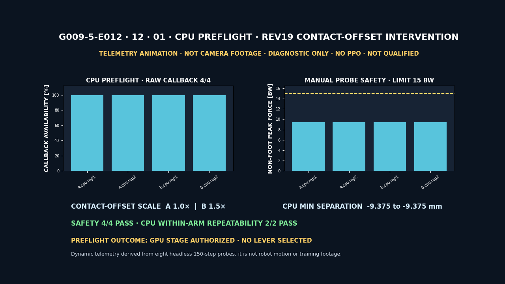

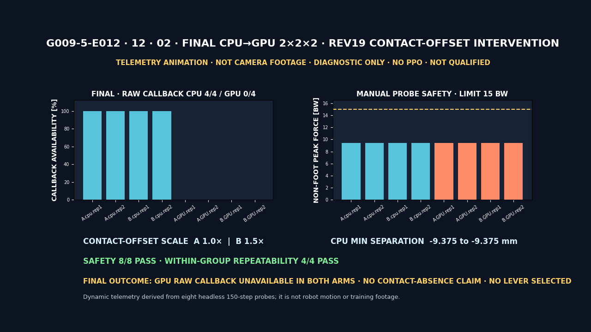

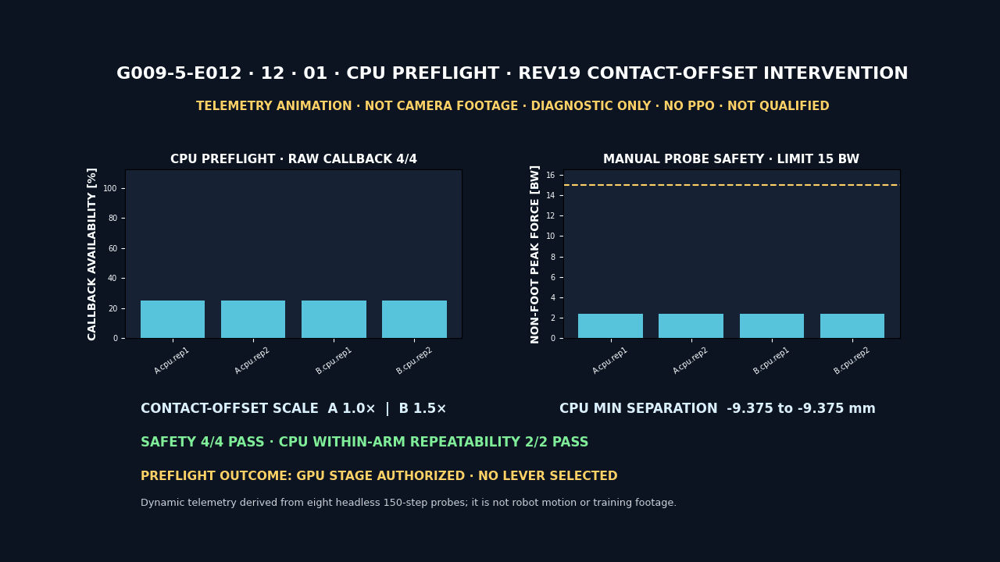

Git에는 위 GIF·PNG·sidecar만 둔다. 사용자가 직접 볼 H.264 영상은 `%USERPROFILE%\IsaacLab\logs\visual_evidence\g009\R0\diagnostic\g009_5_r0_e012_rev19_contact_offset_intervention_s42.mp4`에만 보존했다. 해상도 `1280×720`, `30fps`, 168 frames, `5.6s`, SHA-256은 `baf9c0facd73b88d376d2c88a7ee5de019039b827d60870b0914e206bdbb9d03`이다.

#### 다음 작업: rev20 GPU terrain-pair contact authority

E012 뒤에는 contact offset을 더 키우지 않는다. 다음 단일가설은 다음과 같다.

> GPU rigid contact는 존재하지만 전역 Python contact-report callback은 현재 clone/GPU 실행의 판정 권위가 아니다. 기존 ContactSensor의 PhysX `RigidContactView`에 terrain filter를 명시하면 같은 GPU step에서 terrain-pair normal force를 텐서로 읽을 수 있다.

[Isaac Lab 2.1.1 ContactSensor API](https://isaac-sim.github.io/IsaacLab/v2.1.1/source/api/lab/isaaclab.sensors.html)는 `net_forces_w`를 sensor body가 받은 모든 접촉의 합산 normal force로 정의하고, filter를 쓰면 sensor-body와 filter-body 사이의 `force_matrix_w`를 제공한다. `body_names`는 ordered이며 `contact_physx_view`는 `RigidContactView`다. 반면 [Omniverse PhysX contact reports](https://docs.omniverse.nvidia.com/kit/docs/omni_physics/latest/extensions/runtime/source/omni.physx/docs/dev_guide/contact_reports.html)는 `FOUND/PERSISTS/LOST` header와 position·normal·impulse·separation을 전달하는 event API다. E012의 callback count와 ContactSensor force tensor를 동치로 놓을 수 없는 이유다.

[RigidContactView tensor API](https://docs.omniverse.nvidia.com/kit/docs/omni_physics/107.0/extensions/runtime/source/omni.physics.tensors/docs/api/python.html)는 `get_net_contact_forces(dt)`와 filter pair별 `get_contact_force_matrix(dt)`를 구분한다. 공개 문서 버전이 현재 Kit와 완전히 같다고 가정하지 않고, rev20 report에 runtime method 존재 여부·extension/runtime version·view properties를 먼저 남긴다. 상세 point data를 반환하는 `get_contact_data(dt)`는 non-zero `max_contact_data_count`가 필요하지만 rev20은 matrix-only이므로 호출하지 않는다. [PhysX GPU rigid bodies](https://nvidia-omniverse.github.io/PhysX/physx/5.4.0/docs/GPURigidBodies.html)의 GPU contact generation과 [Direct GPU API 제한](https://nvidia-omniverse.github.io/PhysX/physx/5.4.0/docs/DirectGPUAPI.html)은 별개이므로 Direct GPU API도 켜지 않는다.

rev20에서는 물리 파라미터를 하나도 바꾸지 않는다.

| 고정 항목 | 값 |
| --- | --- |
| source cell | rev19 Arm A baseline contact offset `×1.0` |
| solver / depenetration | `8/0`, `1.0m/s` |
| seed / env / pose / action | `42`, 8 env, `right_side`, `reset_pose_hold` |
| physics/control dt | `0.005/0.02s` |
| friction / mass / motor / reset | rev19과 동일 |
| GPU buffer / Direct GPU API | 변경 금지 |
| PPO / Gate / qualification | `0 / forbidden / not_run` |

변경은 terrain-filtered matrix 관찰 경로 하나다. simulation loop 밖에서 view를 한 번 만들거나 기존 `contact_physx_view`의 filter를 재사용하고, 시작 전 reporter API·threshold `0`, ordered sensor rigid-body paths, terrain filter collider paths와 cardinality를 기록한다. 첫 physics step 이후 매 step 같은 `dt`로 기존 `net_forces_w`와 `get_contact_force_matrix(dt)`를 함께 읽는다. global callback은 count와 error만 남기는 diagnostic telemetry로 격하하고 판정에는 넣지 않는다.

PASS 조건은 다음 네 가지를 모두 만족하는 것이다.

1. runtime API/view가 존재하고 예외가 없으며 reporter schema·threshold·terrain filter path가 사전등록과 일치한다.
2. force matrix가 finite이고 실제 tensor shape, sensor/filter ordered path hash, device를 report에 남긴다.
3. `net_forces_w` norm이 `1e-6N`보다 큰 step 중 terrain-pair force matrix norm도 `1e-6N`보다 큰 step이 CPU와 GPU에서 각각 최소 한 번 존재한다.
4. fresh reset 반복에서 availability, ordering hash, peak/integral force가 사전 허용오차 안에서 재현된다.

view 생성 실패, filter cardinality/path 불일치, matrix exception/non-finite, 또는 net force가 비영인 모든 step에서 terrain matrix가 0이면 fail-closed다. 그 경우 offset·solver·buffer를 동시에 건드리지 않고 sensor rigid-body와 실제 terrain collider path 선택만 dump하고 수정한다. PASS한 뒤에만 future safety/contact authority를 `RigidContactView` terrain-pair matrix로 전환하는 별도 사전등록을 만들고, 그 다음에 경사 복구 Gate01과 PPO 재개 여부를 판단한다.

#### rev20 E013 사전등록: 번호 13 terrain-pair matrix

실행 전에 [machine-readable preregistration](../configs/g009_r0_rev20_terrain_contact_matrix.json)을 별도 파일로 고정했다. 증거 ID는 `G009-5-E013`, 시각 증거 번호는 `13`이다. canonical 순서는 `cpu.rep1 → cpu.rep2 → cuda:0.rep1 → cuda:0.rep2`이고, CPU 두 실행을 묶은 immutable preflight가 통과하기 전에는 GPU AppLauncher를 시작할 수 없다. 제3회 다수결은 금지한다.

terrain filter는 추측한 terrain root가 아니라 rev19 CPU raw contact에서 actor와 collider로 실제 관찰된 `/World/ground/terrain/GroundPlane/CollisionPlane` 하나를 사용한다. PhysX tensor API의 단일 static filter 예외를 적용하되 다음 구조를 모두 fail-closed로 확인한다. canonical 실행 전 설치본 ABI 스모크에서는 `view.filter_paths`와 `view.filter_names`가 논리 필터 1개를 flat list로 주지 않고, 152개 sensor row 각각에 같은 1개 path/name을 넣은 `[152,1]` 중첩 목록으로 노출된다는 점도 확인했다. 따라서 `logical_filter_paths_sha256`은 공통 row 한 개에 대해 계산하고, `raw_filter_paths_sha256`은 `[152,1]` raw metadata 전체에 대해 따로 계산한다. 두 해시는 이름과 범위가 다르며, raw 152개 모든 row가 공통 논리 값과 같은지도 별도로 검증한다.

| 구조 항목 | 사전등록 기대값 |
| --- | --- |
| `sensor_count` | `8 env × 19 body = 152` |
| `filter_count` | `1` |
| direct matrix raw shape | `[152,1,3]` |
| reshaped/buffer matrix | `[8,19,1,3]` |
| net force tensor | `[8,19,3]` |
| logical filter path hash | `logical_filter_paths_sha256=0e7310394b8a9adb8b4cd6fe66f00c662855733094e5252dcd70acf1f7fcf6c0` |
| same-step threshold | `1e-6N` |

각 physics step은 `sim.step(render=False) → scene.update(dt=0.005)` 뒤에 읽는다. lazy sensor update를 먼저 해소하고 `net_forces_w` clone → `force_matrix_w` buffer clone → direct `get_contact_force_matrix(dt)` clone 순서를 고정한다. buffer와 direct tensor는 storage alias가 아니어야 하며 두 clone은 150회 모두 exact equality여야 한다. direct raw axis는 `view.sensor_paths`가 권위다. 설치본의 `robot.root_physx_view.prim_paths[i]`는 robot namespace가 아니라 articulation root body인 `.../Robot/base`를 반환한다. 각 root-body path의 마지막 `/base`를 제거해 `.../Robot` body namespace를 도출한 뒤, 152개 sensor path를 19개씩 연속 분할한다. chunk `i`의 모든 path가 그 namespace의 direct child이고 ordered leaf가 `sensor.body_names`와 같을 때만 `[8,19,1,3]` reshape를 허용한다. 원본 articulation root-body path와 도출한 namespace를 둘 다 report에 남긴다.

terrain matrix는 filter 축을 합산한 뒤 net force와 같은 env·body 축에서 비교한다. 8개 환경 각각에서 같은 body의 두 force norm이 동시에 `1e-6N`을 넘는 step이 최소 1회 있어야 한다. peak와 integral의 반복 허용식은 `abs(a-b) ≤ max(1e-5, 1e-6×max(abs(a),abs(b)))`로 고정한다.

두 반복은 availability, sensor/body order hash, raw `[152,1]` filter metadata hash, logical filter row hash, shape, 환경별 overlap step indices, safety checks가 exact하게 같아야 한다. CPU와 GPU 사이의 수치 동일성은 요구하지 않는다. callback은 count/error만 남기며 outcome 계산에는 넣지 않는다. CUDA report는 requested/runtime/tensor device와 GPU dynamics readback을 모두 검증한다.

GPU report는 AppLauncher 생성 전에 CPU preflight의 path·SHA-256·git commit·probe source bundle·정확한 CPU 입력 2개를 검증해 내장한다. final synthesis의 첫 CPU 입력 2개는 preflight 입력과 exact-equal이어야 하고 두 GPU report는 같은 preflight를 가리켜야 한다. matrix safety나 device readback이 실패하면 overlap 수치가 양수여도 PASS할 수 없다.

물리 baseline은 rev19 Arm A다. contact-offset hash `5beda7da...`, rest-offset hash `af9043e1...`, mass tensor hash `db715835...`, mass/force body-order hash `c7dcbdef.../2df70385...`, solver `8/0`, max depenetration `1.0m/s`를 다시 확인한다. 관측 경로만 바뀌었다는 것을 입증하기 위해 ground `0.8/0.6`·foot `1.0/1.0`·multiply effective friction, action `scale=0.70`·EMA `alpha=0.2`, soft-limit factor `0.9`, Go2 DCMotor의 raw config(`armature/effort_limit_sim=null`)와 resolved tensor(`0.0/1e9`)를 분리한 effort `23.5Nm`·velocity `30rad/s`·stiffness `25`·damping `0.5`·armature/friction, XY/yaw 범위가 `[0,0]`인 8환경 stratified reset root/joint state와 env 0~3 zero action·4~7 hold target, physics/control dt `0.005/0.02s`·decimation `4`도 config와 live tensor로 다시 읽고 canonical JSON hash를 만든다. setter는 호출하지 않는다. offset·rest·friction·mass·motor·reset·dt·GPU buffer·Direct GPU API·상세 `get_contact_data`를 바꾸면 결과를 해석하지 않는다.

안전식도 구현 전에 숫자로 고정했다. joint position은 모든 env·step에서 `[hard lower-0.01rad, hard upper+0.01rad]`의 양 끝을 포함해 만족해야 한다. non-foot은 `sensor.body_names`에서 대소문자를 무시하고 `foot`이 없는 body만 고른다. 각 env에서 150 step×body의 `norm(net_forces_w)` 최댓값을 `sum(robot.data.default_mass[env,:])×9.81`로 나눈 비율이 `15BW` 이하인지 확인하며, force/mass body 이름은 같은 unique set이되 per-body mass-force 대응에는 쓰지 않는다.

두 반복이 실제 별도 프로세스였다는 증거도 fail-closed다. raw report마다 canonical slot/device/replicate/output path와 고유 lowercase UUID4 execution ID를 내장한다. CPU preflight는 CPU raw 두 파일을 정확한 순서의 `{path,sha256}`로 묶고 path·hash·execution ID 중복을 거부한다. GPU raw 두 파일은 AppLauncher 전에 동일 preflight의 path·SHA-256·git commit·source bundle·CPU input binding을 확인한다. final synthesis는 네 raw report를 canonical 순서로 hash-bind하고 처음 두 CPU binding이 preflight 입력과 byte-for-byte 같을 때만 결과를 낸다.

CPU/GPU가 각각 `2/2` 통과해도 결론은 `terrain_pair_matrix_authority_candidate_validated`다. 이것은 terrain-pair aggregated normal force의 관측 권위 후보를 검증했다는 뜻이지 contact point·separation·충격량 권위, 자가복구 성공, 학습 정책 자격을 의미하지 않는다. 다음 단계는 matrix 기반 safety authority를 별도로 사전등록하는 것이며 Gate01·PPO·qualification은 계속 닫는다. 미디어는 `13.01 CPU preflight`, `13.02 final CPU→GPU`로 나누고 MP4는 로컬에만 둔다.

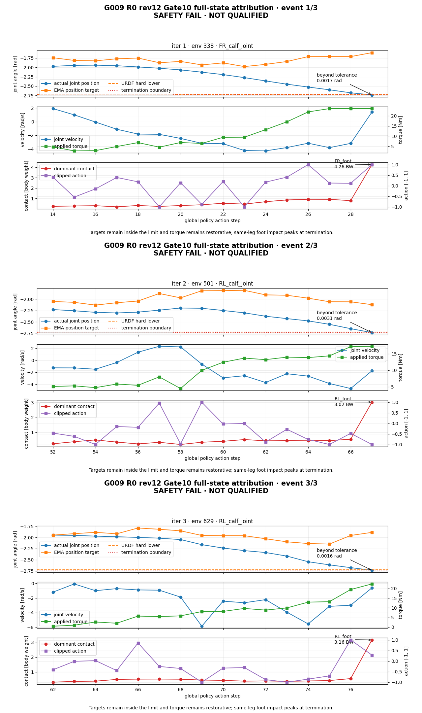


- [full-state attribution rep01](../reports/runs/g009_r0_gate10_hard_limit_attribution_rev12_fullstate_gpu_rep01_s42.json)
- [full-state attribution rep02](../reports/runs/g009_r0_gate10_hard_limit_attribution_rev12_fullstate_gpu_rep02_s42.json)
- [full-state attribution rep03](../reports/runs/g009_r0_gate10_hard_limit_attribution_rev12_fullstate_gpu_rep03_s42.json)
- [full-state 3회 synthesis](../reports/runs/g009_r0_gate10_hard_limit_attribution_rev12_fullstate_synthesis_3x3_s42.json)
- [full-state synthesis 재검증 도구](../scripts/verify_g009_r0_gate10_fullstate_synthesis.py)
- [full-state visual summary](../reports/runs/g009_r0_gate10_hard_limit_attribution_rev12_fullstate_visual_summary.json)
- [공개 진단 PNG](media/g009/R0/diagnostic/g009_5_r0_diag_rev12_gate10_fullstate_dynamics.png)
- [공개 진단 GIF](media/g009/R0/diagnostic/g009_5_r0_diag_rev12_gate10_fullstate_dynamics.gif)

원본 MP4는 Git에 추적하지 않고 `%USERPROFILE%\IsaacLab\logs\visual_evidence\g009\R0\diagnostic\g009_5_r0_diag_rev12_gate10_fullstate_dynamics_s42.mp4`에만 둔다. H.264 `1280×720`, 30fps, 5.4초이며 SHA-256은 `6320c4d83f470dcb97ccc2e4c11a016aa38d19d32c6a902c7dfa1ab0a5d4c739`다. 공개 PNG·GIF와 visual summary에도 `diagnostic_only=true`, `public_claim_eligible=false`, `learned_policy_qualified=false`를 유지한다. strict success는 현재 `0`이고, 네 자세별 성공률 `≥80%`, 중앙 복구시간 `≤4s`, safety termination `0`의 최종 자격 조건은 바꾸지 않는다.

### rev9 actor/critic, action, 성공 gate

- actor `P-RECOVER-83`: proprioception·joint·이전 action·발 접촉/하중 53차원과 body-fixed 5×3 range 15차원, hit mask 15차원
- critic `C-RECOVER-107`: actor prefix 83차원과 simulation-only privileged suffix 24차원
- action: 12관절 position target, scale `0.8`, EMA alpha `0.2`, soft-limit factor `0.9`; hard joint range 중앙 `72%`
- hard-limit termination: URDF limit 대비 `0.01rad` 초과를 그대로 유지
- 성공: tilt `≤20°`, 높이 `0.30~0.60m`, 양의 법선 하중 발 `≥3`, 총 발 하중 `≥0.60mg`, non-foot contact `0`, 선속도 `≤0.5m/s`, 각속도 `≤1.0rad/s`를 0.5초 연속 유지

strict success는 평균 reward나 순간 upright로 대체하지 않는다. 공식 checkpoint가 되려면 네 자세 각각 성공률 `≥80%`, 자세별 중앙 복구시간 `≤4s`, numeric-invalid와 hard-joint-limit safety termination `0`을 모두 만족해야 한다.

### headless와 runtime calibration

학습과 probe의 `headless=true`는 Isaac Sim GUI 창을 띄우지 않고 PhysX, 센서, 환경, 정책 rollout과 PPO update를 실행한다는 뜻이다. 영상 단계에서는 같은 headless 실행에 카메라 extension을 켜 off-screen 렌더링한다. 따라서 headless 학습이 물리 계산을 생략하거나 가짜 궤적을 재생한다는 뜻은 아니다.

GPU와 CPU에서 각각 8환경×150 step의 runtime probe를 실행했다. 두 probe와 synthesis는 계약 SHA-256 `4e0499699a24a272cccb9687f417d97770fcbc229186e2aedde6914e45beab66`, source commit `42647e1620907c811ab8b646732a528878b07b83`, 13개 source binding 파일 hash와 bundle SHA-256 `2745de1317e7d312bb18eb1ec208bfdddf5180577f9491cc825ebd09e5f96c2f`를 공유한다. source binding이 dirty이거나 두 장치의 bundle이 다르면 synthesis가 fail-closed로 중단된다. pose reset, P83/C107 shape, no-hit semantics, action EMA, material readback, joint-limit tolerance와 GPU/CPU 분리 조건이 통과했다. 이 probe는 random/untrained action의 계약 검증이므로 `learned_policy_qualified=false`, `status=not_run`이다.

## 검증 결과

### 1. S0 analytic gate

근거: [g009_s0_analytic_validation.json](../reports/runs/g009_s0_analytic_validation.json)

| 항목 | 결과 |
| --- | ---: |
| 경사 | `0, 5, 10, 15, 20, 25°` |
| 방위 | `0, 90, 180, 270°` |
| 전체 cell | `24` |
| PASS | `24/24` |
| 최대 경사각 오차 | `7.172749647565979e-07°` |
| 최대 analytic-triangle normal 오차 | `2.181721622226445e-05°` |
| 같은 seed mesh hash | 전 cell 일치 |
| 같은 seed material hash | 전 cell 일치 |
| material ID | S0 전 cell `0`만 사용 |
| friction order | 전 cell `static >= dynamic >= 0` |

이 validator는 Isaac runtime을 사용하지 않는다. 따라서 report의 `24/24`는 analytic geometry·material·friction gate이며 USD runtime readback이나 정책 성공을 뜻하지 않는다.

### 2. 순수 Python G009 검사

다음 네 파일을 한 번에 실행했다.

```powershell
cd "$HOME\isaac-walk-rl"
py -m pytest -q `
  tests/test_g009_terrain.py `
  tests/test_g009_support_plane.py `
  tests/test_g009_media_contract.py `
  tests/test_g009_s0_validation.py `
  tests/test_g009_s0_capture.py `
  tests/test_g009_s0_media.py
```

결과는 `68 passed in 5.96s`다. 지형 determinism, seed 분리, base+residual 합성, 방향축, friction 한계, robust plane outlier, fallback continuity, tangent projection, whole-body COM, 2점 nonblocking, capture provenance, float32 material readback 허용 범위, transactional media publish와 rollback을 포함한다.

### 3. Isaac Lab 구성·회귀 검사

고정된 Isaac Sim 번들 Python으로 G009와 G008 config test를 함께 실행했다.

```powershell
cd "$HOME\isaac-walk-rl"
& "$HOME\IsaacLab\_isaac_sim\python.bat" -m pytest -q `
  tests/test_g009_config_diff.py `
  tests/test_g008_config_diff.py
```

프로세스는 exit code `0`으로 끝났다.

| 묶음 | PASS |
| --- | ---: |
| G009 Isaac 구성·spawn·reset | `7/7` |
| G008 config 회귀 | `8/8` |
| 합계 | `15/15` |

이 검사는 task registry, G008 상속 diff, 단일 slope collision/RayCaster surface, material binding, slope control 노출, triangle height·normal reset을 확인한다.

### 4. R0 계약·보상·runtime 검사

rev9 구현 뒤 G009 순수 Python 검사에서 `172 passed`, Isaac 번들 Python의 RECOVER 구성 검사에서 `6 passed`, 기존 G009 구성 diff에서 `7 passed`를 확인했다. 할인 잠재 보상의 episode telescope, success one-shot latch, actor privilege 경계, pose curriculum, source-bundle provenance, 평가·미디어 fail-closed 계약, qualification 실행 조건을 포함한다. rev9 pilot은 실행 자체와 provenance는 통과했지만 학습 안전 gate는 실패했다.

runtime 근거:

- [R0 실행 계약](../configs/g009_r0.json)
- [GPU runtime probe](../reports/runs/g009_r0_runtime_probe_gpu.json)
- [CPU runtime probe](../reports/runs/g009_r0_runtime_probe_cpu.json)
- [GPU/CPU synthesis](../reports/runs/g009_r0_runtime_probe_synthesis.json)

세 report가 모두 같은 계약 SHA를 가리키며 `runtime_calibration_passed=true`다. rev9 학습 checkpoint는 생성됐지만 안전 gate 실패로 기각했으므로 `learned_policy_qualified=false`다.

### 5. S0 headless off-screen 재생

학습과 영상 렌더링을 분리했다. 녹화는 Isaac Sim을 `--headless`로 실행하되 카메라 extension을 켜는 off-screen 방식이다. 물리와 정책 추론은 50 Hz(`step_dt=0.02 s`)로 실행하고, 한 환경에서 525 step, 약 10.5초를 촬영했다. 이 실행에는 PPO update, rollout batch, mini-batch, epoch가 없다. 기존 G008 checkpoint를 inference에만 사용했다.

명령 시퀀스는 모든 경사에서 같으며 로봇의 body up-axis를 support normal에 맞춘 뒤 그 normal 둘레로 90° 회전해 전진축을 등고선 방향에 놓는다.

| 구간 | step | 속도 명령 `[v_x,v_y,w_z]` |
| --- | ---: | --- |
| 정지 | `75` | `[0.0, 0.0, 0.0]` |
| 등고선 왼쪽 | `200` | `[0.4, 0.0, 0.0]` |
| 정지 | `50` | `[0.0, 0.0, 0.0]` |
| 등고선 오른쪽 | `200` | `[-0.4, 0.0, 0.0]` |

세 캡처는 source commit, recorder·config hash, checkpoint hash, USD readback과 원본 영상 hash를 각각 기록한다. PhysX가 material float를 float32로 반환하므로 설정값 `0.8/0.6`은 runtime에서 `0.800000011920929/0.6000000238418579`로 읽혔다. validator는 절대오차 `1e-6` 안의 유한 실수만 허용하며 bool, NaN, Inf와 의미 있는 수치 차이는 거부한다.

| profile | 요청/실측 경사 | reset 최대 각도 오차 | 최대 support-normal 상대 tilt | 하방 이동 final/max | `termination.fall` | 판정 |
| --- | ---: | ---: | ---: | ---: | --- | --- |
| `slope_05` | `5.0/4.999972°` | `0.02798°` | `3.6857°` | `0.0780/0.0780 m` | `false` | 정성 재생 완료 |
| `slope_15` | `15.0/14.999944°` | `0.01978°` | `13.5774°` | `0.0909/0.2274 m` | `false` | 정성 재생 완료 |
| `slope_25_stress` | `25.0/25.000044°` | `0.0°` | `84.7832°` | `2.3925/2.3925 m` | `false` | stress 실패 경계 |

`termination.fall=false`만으로 성공을 판정하지 않는다. 25° 결과처럼 몸통 기울기와 하방 이동이 크게 무너질 수 있기 때문이다. 다음 WALK qualification은 다중 환경·다중 seed에서 방향별 추종, tilt, drift, 접촉, 낙상 gate를 함께 통과해야 한다.


증거 파일:

- [5° capture report](../reports/runs/g009_s0_slope_05_capture.json)
- [15° capture report](../reports/runs/g009_s0_slope_15_capture.json)
- [25° stress capture report](../reports/runs/g009_s0_slope_25_stress_capture.json)
- [시각·물리 summary](../reports/runs/g009_s0_visual_summary.json)
- [미디어 sidecar](../reports/runs/g009_s0_visual_evidence.json)
- 로컬 합성 MP4: `%USERPROFILE%\IsaacLab\logs\visual_evidence\g009\S0\g009_s0_slopes.mp4`

합성 MP4는 H.264 `1440×430`, 50 fps, 10.48초이며 저장소에 올리지 않는다. 공개 GIF는 `960×286`, 42 frames, 10.5초, `980,271 bytes`다. 접촉시트는 `960×572`, `177,749 bytes`다. sidecar가 두 공개 파일과 로컬 합성 MP4의 SHA-256, ffprobe 결과, source commit을 묶는다.

## 기존 G008 checkpoint의 정확한 역할

S0의 parent는 기존 friction S1 checkpoint다.

- checkpoint: `%USERPROFILE%\IsaacLab\logs\rsl_rl\unitree_go2_rough\2026-08-26_11-37-54_g008_friction_s1_finetune_command_s42_e1024_i300\model_2097.pt`
- SHA-256: `40af0a0f80489d705e1e8fdeedd2f765177d3d67bf757709b9195cc2bbeaaee0`
- 역할: S0 시각 재생과 0도 회귀 확인

이 checkpoint는 G009 경사에서 새로 학습한 정책이 아니다. 경사 WALK 성공, RECOVER 성공, 비대칭 마찰 복구 능력을 증명하지 않는다. G008에서도 불규칙 도로 추가 PPO가 기존 정책보다 좋아지지 않아 새 checkpoint를 기각한 기록이 있다. 자세한 근거는 [G008 불규칙 도로·공간 마찰 강화학습](G008_IRREGULAR_ROAD.md)과 [G008 시각 증거](G008_VISUAL_EVIDENCE.md)에 있다.

G009 R0에서는 scratch PPO smoke와 50회 진단 pilot을 실제로 실행했다. rev1~rev8은 strict success 신호가 0이어서 전부 기각했고, rev9는 support/hold 신호를 처음 확인했지만 strict success `0`과 hard-limit 23/50 때문에 기각했다. 따라서 현재 정확한 표현은 “강화학습으로 복구 동작의 부분 신호를 찾고 안전 실패 원인을 분리했다”이며, “자가복구를 학습했다”는 표현은 qualification gate를 통과한 뒤에만 사용한다.

## 다음 학습과 검증 순서

한 번에 경사·요철·마찰·외란·전복을 모두 섞지 않는다. 아래 순서를 지켜 새 물리 축을 하나씩 연다.

1. **R0 rev9 diagnostic media — 완료**: 기각한 prone pilot을 성공 영상과 분리해 로컬 MP4와 `DIAGNOSTIC / NOT QUALIFIED` 표시가 있는 공개 GIF·PNG·정량 JSON으로 남겼다.
2. **R0 rev10 safety revision — 완료**: action scale만 `0.8 → 0.70`으로 줄이고 EMA `0.2`, PPO 초기 noise `0.5`, reward, hard tolerance `0.01rad`는 유지했다. prone phase 경계를 `(1201,2401)`로 고쳐 50회 pilot 전 구간 prone `1.0`을 요구한다.
3. **R0 rev10 CPU runtime — 기각**: `reset_pose_hold` calf action 포화가 확인된 동일 궤적에서 `16.066175 BW > 15 BW`가 두 번 재현됐다. 당시 직접 인과로 단정하지 않고 threshold를 유지한 채 실패 JSON을 보존했으며, rev11 한 변수 A/B에서 가설을 다시 검사했다.
4. **R0 rev11 runtime gate — 완료**: calf reset만 `-2.40 → -2.37 rad`로 옮겼다. CPU/GPU 독립 실행 각 3회에서 hold 비포화, target 오차 `≤1e-6 rad`, 전체 runtime contract를 모두 통과했다.
5. **R0 rev11 safety gates — gate01 기각**: `1,024×1`에서 numeric-invalid는 `0`이었지만 hard-joint-limit maximum이 `0.0416667`이었다. 로컬 MP4와 공개 GIF·PNG·JSON을 남기고 gate10·gate50은 실행하지 않았다.
6. **R0 gate01 attribution — 완료**: 같은 core source·seed·초기 학습 경로의 fresh 24-step rollout 세 번에서 같은 `FR_calf_joint` lower-limit 사건을 reset 직전에 귀속했다. 과거 사건과의 bitwise identity는 주장하지 않으며 safety·qualification은 계속 FAIL이다.
7. **R0 rev12 solver A/B — gate10 기각**: hard-limit tolerance, torque, reward, curriculum, PPO noise를 유지하고 articulation solver position iteration만 `4 → 8`로 바꿨다. CPU/GPU 각 3회 runtime과 새 scratch gate01은 통과했지만 gate10 iterations `1/2/3`에서 hard-limit이 각 한 건 상당 재발했다. gate50은 닫았다.
8. **R0 rev12 Gate10 full-state attribution — 완료**: preliminary GPU fresh 3회로 historical identity를 고정하고, target·torque·contact 16-step 이력을 보강한 full-state GPU fresh 3회에서 동일 사건 topology와 canonical full-event payload를 재현했다. policy 직접 명령 가설은 배제했지만 reset 영향 자체는 배제하지 않았으며, 직접 연결이 없어 reset `-2.34rad` 변경을 다음 revision으로 승인하지 않았다. impact·inertia·constraint-resolution overshoot를 다음 검사 대상으로 좁혔고 safety와 qualification은 FAIL을 유지한다.
9. **R0 rev13 velocity solver A/B — CPU gate 기각·미디어 완료**: position iteration `8`과 나머지 계약을 유지하고 velocity iteration만 `0 → 1`로 바꿨다. CPU 독립 실행 `3/3`에서 live `8/1`은 확인했지만 오른쪽 옆면 base 접촉이 동일하게 `15.97161865234375 BW > 15 BW`였다. GPU·Gate01·Gate10·PPO는 실행하지 않았다. 실패 텔레메트리와 번호 `04 right_side` 실제 off-screen camera footage를 분리해 남겼다.
10. **R0 rev14 depenetration clamp A/B — strict 기각·미디어 완료**: source `e9c1eff`, contract `744c53d3...`에서 solver `8/1`, rigid-body max depenetration `0.75m/s`를 8 articulation × 19 body = 152개에 확인했다. CPU·GPU runtime 각 `3/3`, force와 numeric/hard safety는 통과했지만 CPU separation `-0.0109901875m`가 `-0.01m` 기준을 `0.9901875mm` 넘겨 Gate01 전에 기각했다. GPU runtime은 완료 단계이며 Gate01·Gate10·PPO만 차단 단계다.
11. **R0 rev15 position solver A/B — strict 기각·미디어 완료**: 승인된 rev12의 solver `8/0`, max depenetration `1.0m/s`에서 position iteration만 `8 → 16`으로 바꿨다. CPU는 force `13.2482814789 BW`와 separation `-0.00935308635m`를 `3/3` 통과했지만 GPU는 `16.7882747650 BW`로 force gate를 `3/3` 실패했다. numeric/hard safety는 여섯 실행 모두 0이고, Gate01·Gate10·PPO는 미실행이다.
12. **R0 rev16 backend divergence attribution — 완료·가설 불확정**: rev12 `8/0`과 rev15 `16/0`을 Arm A/B로 분리해 CPU·GPU 각 `3/3`, 총 12회를 순차 실행했다. historical projection과 canonical telemetry를 분리해 과거 fingerprint와 현재 수치를 모두 검증했다. B GPU peak는 `16.7882770994 BW`, step `129`로 재현됐지만 B GPU/B CPU concentration ratio가 `1.18355612696 < 1.20`이라 가설은 `inconclusive`다. PPO는 실행하지 않았고 position 16 기각을 유지한다.
13. **R0 rev17 mechanism split — E010 완료·lever 미선정**: rev16의 12개 immutable report에서 peak/window 분자·분모, base/link 하중, CPU 접촉쌍과 GPU force aggregation을 분리했다. peak `+26.72%`와 17-step 전신 impulse `+1.42%`는 같은 현상이 아니며 GPU 접촉쌍 authority가 없어 `selected_lever=null`로 닫았다. 다음은 GPU constraint/contact 계측 가능성 검증 또는 사전 등록 단일변수 intervention이며, 그 전에는 Gate01·PPO를 열지 않는다.
14. **R0 rev18 raw-contact feasibility — E011 완료·GPU 관측 불가**: CPU `2/2`는 callback `150회`, raw PASS와 반복성을 확인했다. GPU `2/2`는 probe valid와 positive force stimulus를 유지했지만 callback `0회`의 같은 unavailable signature였다. residual/force-matrix 계측은 unavailable이며 PPO·Gate01·qualification은 실행하지 않았다.
15. **R0 rev19 contact-offset intervention — E012 완료·lever 미선정**: Arm A `8/0 + offset×1.0`, Arm B `8/0 + offset×1.5`를 CPU/GPU 각 2회, 총 8회 비교했다. CPU는 raw callback과 safety를 `4/4` 통과했지만 GPU는 두 arm 모두 callback `0/150`의 unavailable signature였다. offset 적용 무결성은 확인했으나 A/B force proxy가 같아 `selected_lever=null`로 닫았고, GPU 접촉 부재·물리 실패를 주장하지 않는다. PPO·Gate01·qualification은 실행하지 않았다.
16. **R0 rev20 terrain-pair contact authority — 다음 진단**: rev19 Arm A baseline 물리를 그대로 고정하고 terrain-filtered `RigidContactView.get_contact_force_matrix(dt)`만 추가한다. CPU/GPU에서 기존 `net_forces_w`와 같은 step의 terrain-pair normal force를 대조해 GPU 접촉 판정 권위를 확보할 수 있는지 먼저 검증한다. offset·solver·friction·GPU buffer·Direct GPU API는 바꾸지 않으며, PASS 전까지 PPO와 qualification은 계속 닫는다.
17. **R0 qualification**: 모든 안전 gate를 통과한 revision에서 Hydra override·resume 없이 `1,024 env × 24 steps × 300 iterations`, seed 42를 다시 scratch로 실행한다. 네 자세 각각 성공률 `≥80%`, 중앙 복구시간 `≤4s`, safety termination `0`을 통과해야 checkpoint를 승인한다.
18. **GATE-R1 freeze**: S0 nominal height, WALK torque·power, R0 RECOVER power·충격 proxy를 calibration하고 별도 verifier가 동결한다.
19. **S1-low WALK**: `5/10°` contour-left/right를 G008 WALK parent에서 seed별 독립 lineage로 학습한다.
20. **S1-high WALK**: `15/20°`를 순차적으로 연다. `25°`는 stress로 유지한다.
21. **D0A/D0B/D0C**: G006 exact 회귀, G009 0도 transfer, 통과한 경사별 delta-velocity를 분리한다.
22. **D1 external wrench**: 힘·시간·충격량 pulse를 mild에서 strong 순서로 추가한다.
23. **S2 residual height**: nominal friction에서 base slope에 G008 도로 residual만 더한다.
24. **S3-controlled**: 발별 비대칭 마찰을 통제한다.
25. **S3-spatial**: 비주기 공간 마찰 mosaic로 옮긴다.
26. **F0A와 R0B**: 실제 WALK 낙상 snapshot을 수집하고 curated/replay `50/50` reset으로 RECOVER를 다시 학습한다.
27. **R1/R2**: 낮은 경사, 높은 경사 self-righting을 차례로 연다.
28. **R3-controlled/R3-spatial**: controlled 마찰 뒤 spatial 마찰 복구를 연다.
29. **D2**: 외란이 만든 live fall을 RECOVER로 넘겨 `push -> fall -> recover -> stand -> command resume`를 평가한다.
30. **F0B-TV와 R4**: training/validation natural-fall inventory로 최종 bridge를 학습한다.
31. **I0**: 세 WALK/RECOVER seed pair의 live·snapshot validation을 통과한 뒤 checkpoint, gate, trigger, component SHA를 동결한다.
32. **F0B-FINAL과 I1**: sealed final-heldout을 처음 열어 한 번만 평가한다.
33. **D3**: `25°`, physical-limit friction, strong wrench를 결합한 stress 평가를 수행한다.
34. **M1 link-mass**: G009 final-heldout을 고정한 뒤 hip, thigh, calf, foot 질량·관성을 한 그룹씩 바꾸는 별도 goal로 연다.

각 stage는 새 평가 JSON과 미디어 세트를 가져야 한다. 한 방향, 한 자세, 한 friction pattern의 blocking cell이 실패하면 평균 성능이 높아도 다음 stage를 열지 않는다.

## 학습 budget과 seed 계보

### smoke와 qualification

- smoke: `64 env × 24 steps/env × 1 iteration`, seed 42, `1,536 transitions`, optimizer mini-batch update `20회`
- rev9 pilot: `1,024 env × 24 steps/env × 50 iterations`, seed 42, `1,228,800 transitions`, optimizer mini-batch update `1,000회`
- qualification: `1,024 env × 24 steps/env × 300 iterations`, seed 42, `7,372,800 transitions`, optimizer mini-batch update `6,000회`
- smoke는 reset, rollout, PPO update, checkpoint 저장, 정상 종료만 확인하며 성능을 주장하지 않는다.
- pilot과 qualification은 rejected checkpoint에서 resume하지 않는 별도 scratch lineage다.
- seed 42 qualification을 통과한 stage만 production seed 세 개로 확대한다.

### production ladder

production은 training seed `42/43/44`를 각각 독립 lineage로 학습한다.

```text
600 cumulative iterations
  -> validation FAIL이면 optimizer·normalization·curriculum state를 포함해 resume
1200 cumulative iterations
  -> validation FAIL이면 같은 lineage로 resume
2400 cumulative iterations
  -> FAIL이면 원인과 budget revision 필요성을 기록하고 중단
```

`600 -> 1200 -> 2400`은 세 run을 새로 시작한다는 뜻이 아니다. 같은 seed lineage의 누적 목표다. checkpoint는 100 iteration마다 저장하지만 정책 선택 후보는 rung boundary인 600, 1200, 2400만 사용한다. validation gate를 처음 통과한 가장 작은 rung을 선택한다.

seed 42/43/44 중 가장 좋은 하나만 고르지 않는다. 세 seed가 각각 자기 validation cell을 통과해야 하며 다음 stage는 같은 seed의 selected parent를 이어 간다.

| 용도 | seed |
| --- | --- |
| training | `42, 43, 44` |
| checkpoint validation | `1042, 1043, 1044` |
| final-heldout | `2042, 2043, 2044` |

세 집합은 policy, terrain, evaluation namespace에서 서로 겹치지 않게 유지한다. final-heldout은 checkpoint, gate, trigger profile을 동결한 뒤 최초 한 번만 연다.

## 포트폴리오에서 의미 있는 증거

G009를 포트폴리오에 넣을 때 핵심은 “Isaac Sim에서 로봇을 걸었다”가 아니다. 다음 문제 해결 연결이 보여야 한다.

1. G008의 공간 마찰·요철 결과를 산 비탈 문제와 구분했다.
2. 월드 수평 기준의 자세 평가가 경사에서 틀릴 수 있음을 local support plane으로 수정했다.
3. analytic ground truth와 센서 기반 estimate를 분리하고 actor privilege 누출을 막았다.
4. 몸통 접촉의 의미가 반대인 WALK와 RECOVER를 별도 PPO로 설계했다.
5. `tan(theta)/mu`로 물리 한계 stress와 정책 실패를 분리했다.
6. 평균 점수 대신 방향·자세·마찰·seed별 worst cell을 blocking gate로 삼았다.
7. 기존 checkpoint 재생과 새 PPO 학습을 문서에서 구분했다.
8. stage마다 영상과 정량 report를 checkpoint SHA-256으로 결합한다.
9. Gate10 aggregate 실패를 pre-reset full-state로 재계측해 policy 명령, 접촉, 관성, constraint 해석을 분리했다.
10. 실패를 숨기지 않고 preliminary identity 증거와 보강된 causal evidence를 따로 보존해 다음 단일변수 실험을 선택했다.
11. 동일 계약의 CPU/GPU 결과가 갈릴 때 한쪽 수치를 평균으로 덮지 않고 backend divergence를 새 blocking 문제로 승격했다.
12. 과거 float32 fingerprint와 현재 canonical telemetry 산식을 분리하고 pair crosscheck를 추가해 tolerance를 사후 완화하지 않은 채 두 증거 계보를 보존했다.
13. raw callback, force proxy, joint wrench, residual을 서로 다른 권위 수준으로 분리하고 CPU/GPU `2×2` 반복으로 “접촉 없음”과 “GPU에서 raw 관측 불가”를 구분했다.
14. contact offset `×1.0/×1.5`를 같은 source의 CPU/GPU `2×2×2`로 비교해 개입 적용과 안전성은 검증하되, 양 arm의 GPU raw callback이 모두 unavailable이면 lever를 선택하지 않는 fail-closed 결정을 유지했다.

현재 공개 가능한 성과는 C0/S0의 deterministic terrain, 계측 수학, Isaac runtime 물성 readback과 동일 조건 시각 재생, R0의 actor privilege 경계·보상/성공 계약, rev1~rev9 실패 진단, rev10 CPU 실패 재현, rev11·rev12 runtime 및 safety gate, rev12 Gate10 full-state GPU fresh `3/3` 귀속, rev13 CPU `3/3` 기각, rev14 CPU·GPU 각 `3/3`의 force/separation trade-off, rev15 CPU/GPU 각 `3/3`의 backend force divergence, rev16 Arm A/B × CPU/GPU 12-run attribution, rev17 E010의 hash-bound mechanism split, rev18 E011의 raw-contact capability `2×2` 진단, rev19 E012의 contact-offset `2×2×2` 개입 검증이다. rev14는 force를 낮췄지만 separation이 기준보다 `0.9901875mm` 깊어 기각됐고, rev15는 CPU force와 separation을 통과했지만 GPU force가 `15 BW`보다 `11.92%` 높아 기각됐다. rev16은 B GPU의 더 이른 peak와 root·joint speed 상승을 재현했지만 concentration 증가는 `18.36%`로 사전 기준 `20%`에 못 미쳐 가설을 `inconclusive`로 닫았다. rev17은 peak base force `+26.72%`와 17-step 전신 impulse `+1.42%`를 분리하고 CPU 접촉 순서를 확인했지만 GPU contact-pair authority가 없어 원인 lever를 고르지 않았다. rev18은 CPU raw callback을 `2/2` 재현했지만 GPU에서는 positive force stimulus가 있는 동안에도 callback이 `0/2`여서 `unavailable_on_gpu`로 닫았다. rev19는 offset `×1.5` 적용 무결성과 CPU safety를 확인했지만 두 arm 모두 GPU callback `0/150`, 동일 force proxy였으므로 `selected_lever=null`로 닫았다. 이는 모르는 부분을 수치와 권위 경계로 제한한 진단 증거이며 성공 정책 증거는 아니다. rev20 terrain-pair force matrix 권위 검증을 통과하기 전에는 새 물리 파라미터·Gate01·PPO를 열지 않는다. `25°`는 최대 주행 가능 경사가 아니라 현재 stress cell이며, 기존 정책이 크게 기울고 아래로 밀린 실패 결과로 공개한다. R0 strict success `0`과 hard-joint-limit 실패도 경계 조건으로 함께 남긴다. 성공한 전복 복구 영상은 향후 revision이 네 자세별 성공률 `≥80%`, 중앙 복구시간 `≤4s`, safety termination `0`의 qualification gate를 통과한 뒤 별도로 추가한다.

## 실물 로봇과 Mini Pupper에 대한 범위 제한

G009의 Go2 checkpoint를 Mini Pupper나 3D 프린팅 로봇에 직접 옮기지 않는다. 로봇이 바뀌면 다음 항목이 달라진다.

- 링크 질량·관성·COM
- 관절 범위와 joint order
- 모터 torque-speed envelope
- action scale과 nominal stance
- 발 크기·마찰·구동 지연
- 센서 noise와 control dt

재사용 가능한 것은 terrain generator, 평가 grid, reward 구조, support-plane 계측, supervisor 상태 구조, media/report schema다. 정책 weight와 Go2의 절대 임계값은 재사용하지 않는다. Mini Pupper는 해당 물성과 actuator readback을 가진 별도 adapter를 만든 뒤 처음부터 다시 학습해야 한다.

따라서 현재 결과로 “실제 로봇에서도 같은 경사와 마찰에서 걷는다”, “Mini Pupper로 직접 전이된다”, “sim-to-real이 완료됐다”라고 주장하지 않는다. 실물 제작과 전이는 G009 시뮬레이션 final-heldout 이후 별도 goal에서 검증한다.

## 근거와 재현 자료

### 저장소 근거

- [S0 실행 계약](../configs/g009_s0.json)
- [R0 실행 계약](../configs/g009_r0.json)
- [R0 GPU runtime probe](../reports/runs/g009_r0_runtime_probe_gpu.json)
- [R0 CPU runtime probe](../reports/runs/g009_r0_runtime_probe_cpu.json)
- [R0 probe synthesis](../reports/runs/g009_r0_runtime_probe_synthesis.json)
- [R0 rev11 CPU/GPU 3×3 synthesis](../reports/runs/g009_r0_runtime_probe_rev11_synthesis_3x3_s42.json)
- [R0 rev11 CPU 반복 1](../reports/runs/g009_r0_runtime_probe_rev11_cpu_rep01_s42.json), [반복 2](../reports/runs/g009_r0_runtime_probe_rev11_cpu_rep02_s42.json), [반복 3](../reports/runs/g009_r0_runtime_probe_rev11_cpu_rep03_s42.json)
- [R0 rev11 GPU 반복 1](../reports/runs/g009_r0_runtime_probe_rev11_gpu_rep01_s42.json), [반복 2](../reports/runs/g009_r0_runtime_probe_rev11_gpu_rep02_s42.json), [반복 3](../reports/runs/g009_r0_runtime_probe_rev11_gpu_rep03_s42.json)
- [R0 rev15 CPU·GPU 3×3 rejection synthesis](../reports/runs/g009_r0_runtime_probe_rev15_rejection_synthesis_3x3_s42.json)
- [R0 rev15 06 CUDA camera sidecar](../reports/runs/g009_5_r0_diag_rev15_06_gpu_right_side_force_fail_visual_evidence.json)
- [R0 rev15 07 CPU·GPU telemetry sidecar](../reports/runs/g009_5_r0_diag_rev15_07_cpu_gpu_telemetry_visual_evidence.json)
- [R0 rev15 06 공개 GIF](media/g009/R0/diagnostic/g009_5_r0_diag_rev15_06_gpu_right_side_force_fail.gif)
- [R0 rev15 07 공개 GIF](media/g009/R0/diagnostic/g009_5_r0_diag_rev15_07_cpu_gpu_telemetry.gif)
- [R0 rev16 12-run final synthesis](../reports/runs/g009_r0_rev16_synthesis_12_full_retry01_s42.json)
- [R0 rev16 Arm A CPU 3-run synthesis](../reports/runs/g009_r0_rev16_synthesis_03_a_cpu_retry02_s42.json)
- [R0 rev16 Arm A CPU·GPU 6-run synthesis](../reports/runs/g009_r0_rev16_synthesis_06_a_cpu_gpu_retry01_s42.json)
- [R0 rev16 Arm A 전체·Arm B CPU 9-run synthesis](../reports/runs/g009_r0_rev16_synthesis_09_a_all_b_cpu_retry01_s42.json)
- [R0 rev16 08 CUDA camera sidecar](../reports/runs/g009_5_r0_diag_rev16_08_b_gpu_right_side_force_repro_visual_evidence.json)
- [R0 rev16 09 four-group telemetry sidecar](../reports/runs/g009_5_r0_diag_rev16_09_four_group_telemetry_visual_evidence.json)
- [R0 rev16 08 공개 GIF](media/g009/R0/diagnostic/g009_5_r0_diag_rev16_08_b_gpu_right_side_force_repro.gif)
- [R0 rev16 09 공개 GIF](media/g009/R0/diagnostic/g009_5_r0_diag_rev16_09_four_group_telemetry.gif)
- [R0 rev17 E010 mechanism split](../reports/runs/g009_r0_rev17_mechanism_split_offline_s42.json)
- [R0 rev17 E010 visual summary](../reports/runs/g009_5_r0_e010_rev17_mechanism_split_visual_summary.json)
- [R0 rev17 E010 visual sidecar](../reports/runs/g009_5_r0_e010_rev17_mechanism_split_visual_evidence.json)
- [R0 rev17 E010 공개 PNG](media/g009/R0/diagnostic/g009_5_r0_e010_rev17_mechanism_split.png)
- [R0 rev17 E010 공개 GIF](media/g009/R0/diagnostic/g009_5_r0_e010_rev17_mechanism_split.gif)
- [R0 rev18 E011 CPU rep01](../reports/runs/g009_r0_rev18_raw_contact_cpu_rep01_s42.json), [CPU rep02](../reports/runs/g009_r0_rev18_raw_contact_cpu_rep02_s42.json)
- [R0 rev18 E011 GPU rep01](../reports/runs/g009_r0_rev18_raw_contact_gpu_rep01_s42.json), [GPU rep02](../reports/runs/g009_r0_rev18_raw_contact_gpu_rep02_s42.json)
- [R0 rev18 E011 CPU/GPU 2×2 synthesis](../reports/runs/g009_r0_rev18_raw_contact_feasibility_synthesis_2x2_s42.json)
- [R0 rev18 E011 visual summary](../reports/runs/g009_5_r0_e011_rev18_raw_contact_feasibility_visual_summary.json), [visual sidecar](../reports/runs/g009_5_r0_e011_rev18_raw_contact_feasibility_visual_evidence.json)
- [R0 rev18 E011 공개 PNG](media/g009/R0/diagnostic/g009_5_r0_e011_rev18_raw_contact_feasibility.png), [공개 GIF](media/g009/R0/diagnostic/g009_5_r0_e011_rev18_raw_contact_feasibility.gif)
- [R0 rev19 E012 CPU preflight](../reports/runs/g009_r0_rev19_contact_offset_cpu_preflight_2x2_s42.json), [2×2×2 final synthesis](../reports/runs/g009_r0_rev19_contact_offset_intervention_synthesis_2x2x2_s42.json)
- [R0 rev19 E012 visual sidecar](../reports/runs/g009_5_r0_e012_rev19_contact_offset_intervention_visual_evidence.json)
- [R0 rev19 E012 공개 PNG 12.01](media/g009/R0/diagnostic/g009_5_r0_e012_rev19_contact_offset_intervention_01_cpu_preflight.png), [PNG 12.02](media/g009/R0/diagnostic/g009_5_r0_e012_rev19_contact_offset_intervention_02_final_outcome.png), [공개 GIF](media/g009/R0/diagnostic/g009_5_r0_e012_rev19_contact_offset_intervention.gif)
- [R0 rev7 50회 진단 pilot](../reports/runs/go2_flat_recover_rev7_pilot_s42_20260828-1312.json)
- [R0 rev8 50회 안전 pilot](../reports/runs/go2_flat_recover_rev8_safety_pilot_s42_20260828-1318.json)
- [R0 rev9 50회 prone pilot](../reports/runs/go2_flat_recover_rev9_prone_pilot_s42_20260828-1421.json)
- [R0 rev9 prone 진단 capture](../reports/runs/g009_r0_diag_rev9_01_prone_capture_s42.json)
- [R0 rev9 prone 진단 GIF](media/g009/R0/diagnostic/g009_5_r0_diag_rev9_01_prone.gif)
- [R0 rev9 prone 진단 접촉시트](media/g009/R0/diagnostic/g009_5_r0_diag_rev9_01_prone_still.png)
- [R0 rev9 prone 진단 미디어 sidecar](../reports/runs/g009_r0_diag_rev9_01_prone_visual_evidence.json)
- [S0 analytic validation](../reports/runs/g009_s0_analytic_validation.json)
- [S0 시각·물리 summary](../reports/runs/g009_s0_visual_summary.json)
- [S0 미디어 sidecar](../reports/runs/g009_s0_visual_evidence.json)
- [S0 공개 GIF](media/g009/S0/g009_s0_slopes.gif)
- [S0 공개 접촉시트](media/g009/S0/g009_s0_slopes_contact_sheet.png)
- [C0 media contract receipt](../reports/runs/g009_c0_media_contract.json)
- [C0 validation log](../reports/validation/g009_c0_media_contract.log)
- [G008 불규칙 도로·공간 마찰 결과](G008_IRREGULAR_ROAD.md)
- [G008 마찰·링크 질량 한계](G008_PERIODIC_FRICTION_AND_LINK_MASS_LIMITS.md)
- [G008 보상과 도로 curriculum](G008_REWARD_AND_ROAD_CURRICULUM.md)
- [G006 rough·DR·외란 회복 결과](G006_ROUGH_PUSH_RECOVERY.md)

### 설계에 반영한 연구

- [Learning Quadrupedal Locomotion over Challenging Terrain](https://arxiv.org/abs/2010.11251): challenging terrain에서 지형 관측과 proprioception을 결합하는 원칙을 height scan·접촉 proxy 구조에 반영했다.
- [Rapid Motor Adaptation for Legged Robots](https://arxiv.org/abs/2107.04034): 학습 시 privileged dynamics 정보와 실행 시 관측 가능한 정보를 분리하는 원칙을 actor/critic schema에 반영했다.
- [Robust Recovery Controller for a Quadrupedal Robot using Deep Reinforcement Learning](https://arxiv.org/abs/1901.07517): 정상 locomotion과 다른 초기 상태·목표를 가진 recovery policy를 독립 학습하는 설계 근거로 사용했다.
- [Learning Agile and Dynamic Motor Skills for Legged Robots](https://doi.org/10.1126/scirobotics.aau5872): 전복 중에는 standing posture 규제를 게이트하고 action·torque·acceleration·접촉 비용을 단계적으로 강화하는 근거로 사용했다.
- [Learning to Walk in Minutes Using Massively Parallel Deep Reinforcement Learning](https://proceedings.mlr.press/v164/rudin22a.html): 50Hz 정책·0.005초 physics step과 성과 기반 terrain curriculum을 R0의 pose curriculum 설계에 참고했다.
- [Policy Invariance Under Reward Transformations](https://ai.stanford.edu/~ang/papers/shaping-icml99.pdf): `γΦ(s')-Φ(s)` 형태의 잠재 보상으로 왕복 진동 보상 해킹을 막는 이론 근거로 사용했다.

이 프로젝트는 위 논문의 전체 시스템을 재현한 것이 아니다. 연구에서 확인한 원칙을 Isaac Sim 4.5·Isaac Lab 2.1.1의 로컬 API와 현재 Go2 실험 계약에 맞춰 적용한다.
