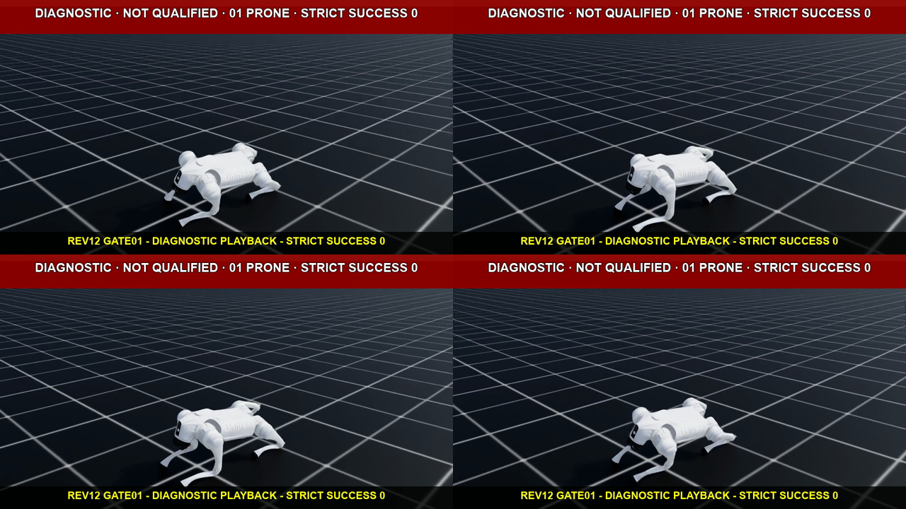
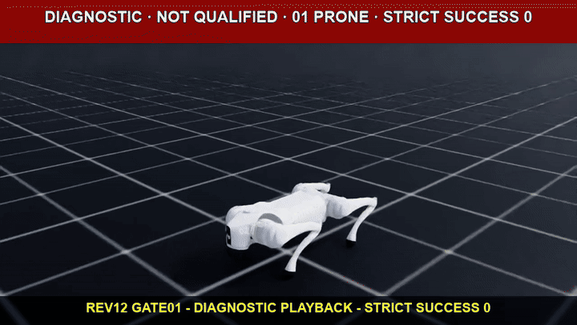

# G009 산 비탈 횡단·전복 복구 강화학습

- 기준일: 2026-08-28
- 시뮬레이터: Isaac Sim 4.5.0
- 학습 프레임워크: Isaac Lab v2.1.1 (`90b79bb2d44feb8d833f260f2bf37da3487180ba`)
- 강화학습: RSL-RL 2.3.3 PPO
- 로봇: Isaac Lab 내장 Unitree Go2
- 현재 단계: C0·S0 완료, G009-5 R0 rev9 진단 미디어 완료, rev10 CPU 안전 실패 재현, rev11 scratch `gate01` 안전 실패·fresh attribution `3/3` 완료, rev12 solver A/B runtime `6/6`과 새 scratch `gate01` 안전 관문 통과·단계 미디어 완료
- 현재 한계: rev12 gate01은 hard-limit·numeric-invalid가 0이었지만 stable support·upright hold·strict success도 모두 0이다. 승인된 learned checkpoint가 없으므로 전복 복구 성능은 주장하지 않는다.

## 작업 순번

`G009-n`은 읽는 순서를 위한 번호이고 괄호의 `C0`, `S0`, `R0`, `S1-low`가 protocol stage ID다.

| 작업 번호 | protocol stage | 내용 | 상태 |
| --- | --- | --- | --- |
| `G009-1` | `C0` | goal별 미디어 경로와 24개 stage registry | 완료 |
| `G009-2` | `S0` | 6개 경사 × 4개 방위 analytic gate | `24/24` 통과 |
| `G009-3` | `S0` | collision mesh, material, support-normal reset의 Isaac runtime readback | 완료 |
| `G009-4` | `S0` | 5°·15°·25° 동일 조건 headless 재생 | 완료, 25°는 실패 경계 |
| `G009-5` | `R0` | 평지 네 전복 자세 RECOVER PPO | rev11 gate01 기각·귀속 완료, rev12 runtime `6/6`·gate01 안전 통과, gate10 대기 |
| `G009-6` | `S1-low` | 5°·10° 횡경사 WALK PPO | R0·calibration 뒤 실행 |

이후 `S1-high`, 외란, residual terrain, 발별·공간 마찰, 경사 RECOVER와 link-mass를 순차적으로 연다. 전체 stage 순서는 [다음 학습과 검증 순서](#다음-학습과-검증-순서)에 있다.

## 먼저 결론

G009는 산 비탈에서 보행 영상을 만드는 작업이 아니라, 경사·요철·발별 마찰·외란·전복을 서로 분리해 학습하고 다시 결합하는 실험이다. 목표는 다음 네 상황을 수치와 실행 증거로 설명하는 것이다.

1. 로봇이 경사면을 등고선 방향으로 가로지를 때 하산 방향으로 밀리는 현상을 억제한다.
2. prone, supine, left-side, right-side 전복 상태에서 지형 법선을 기준으로 다시 일어난다.
3. 네 발이 서로 다른 마찰을 받거나 공간 마찰 지도가 이동 경로에 따라 바뀌어도 복구한다.
4. 외란을 버틴 경우와 실제 낙상 뒤 RECOVER 정책으로 전환한 경우를 구분해 평가한다.

현재 C0·S0와 R0 rev12 학습 전 runtime calibration을 완료하고 첫 scratch safety gate를 열었다. 경사 `0/5/10/15/20/25°`와 방위 `0/90/180/270°`를 교차한 24개 analytic cell이 모두 통과했다. R0는 네 canonical 전복 자세, P-RECOVER-83/C-RECOVER-107 관측, EMA action, 엄격 성공 latch, 할인 호환 잠재 보상, pose curriculum을 코드와 manifest로 고정했다. 최신 rev12 canonical 계약 SHA-256은 `d4b48d2b5fc1ea7684684a6324ba22fbfae767effeae45668c7310df382392e0`이며, CPU·GPU runtime `6/6`과 `1,024×1` scratch gate01의 hard-limit·numeric-invalid `0`을 통과했다.

이 결과는 지형 생성·계측 수학과 R0 실행 계약이 맞는다는 뜻이다. G009 정책이 경사에서 걷거나 전복 뒤 일어난다는 뜻은 아니다. 기존 G008 checkpoint는 S0 지형과 카메라 연결을 확인하는 시각 재생용이며, R0 rev1~rev8 체크포인트는 성공 경험이 없어 전부 기각했다.

**S0에서 재생하는 실제 policy는 G008 checkpoint다. 현재 결과의 정확한 의미는 `G009 학습 전 배선·정성 재생 검증`이며 `G009 강화학습 완료`가 아니다.**

## 현재 상태와 주장 범위

| 구분 | 상태 | 확인된 내용 | 아직 주장하지 않는 내용 |
| --- | --- | --- | --- |
| C0 미디어 계약 | PASS | `<goal_id>`별 로컬 MP4 경로, G009 24개 stage registry, G008 경로 회귀 | G009 동작 성능 |
| S0 import-light 지형 gate | PASS | 6개 경사 × 4개 방위, 총 `24/24` cell | Isaac USD runtime 전체 물리 readback |
| S0 Isaac 구성·runtime | PASS | G009 7개 구성·spawn·reset 검사, G008 8개 회귀 검사, `5/15/25°` USD geometry·material readback | PPO 학습 성능 |
| support-plane 수학 모듈 | 순수 수학 PASS | robust fit, fallback, 접평면 투영, COM, 지지 영역 수학 | 매 step RayCaster runtime 연결 완료 |
| G009 WALK PPO | 미실행 | 학습 계약과 stage 순서가 사전 등록됨 | 경사 횡단 성공 |
| G009 RECOVER PPO | rev12 runtime `6/6`, gate01 safety PASS, gate10 대기 | scratch rev1~rev9, 실패 동작 증거, rev10 CPU 실패 재현, rev11 gate01 실패 미디어·fresh attribution, rev12 solver A/B 3×3 runtime·gate01 단계 미디어 | 사건 전 접촉·관성·solver 기여율, learned checkpoint의 전복 복구 성공, 공식 qualification |
| supervisor | 미구현 | 상태 전이와 평가 계약이 정해짐 | `fall -> recover -> walk` 연결 성공 |
| S0 미디어 녹화 | 완료 | 3개 로컬 MP4, 공개 GIF·PNG, capture JSON·summary·sidecar 해시 결합 | G009 WALK 성공 |
| 실물 로봇 | 범위 밖 | Mini Pupper 재학습 원칙만 정함 | Go2 정책의 직접 전이, sim-to-real 완료 |

S0 증거의 source commit은 `4bad4dd8634c11aa452da41ad0c2fb852e70e607`이다. 원본 MP4는 저장소 밖에 두고 GIF·PNG·JSON만 공개한다. 25° 재생은 `termination.fall=false`였지만 최대 기울기가 `84.7832°`, 최대 하방 이동이 `2.3925 m`였다. 이를 통과나 보행 성공으로 판정하지 않고, 기존 G008 정책의 한계를 드러낸 stress 결과로 남긴다. C0는 동작 stage가 아닌 governance 변경이므로 영상이 없는 것이 계약에 맞다.

## 문제 정의

### 1. 횡경사 보행

경사각을 `theta`, 로봇 질량을 `m`이라 하면 경사 아래 방향 중력 성분은 다음과 같다.

\[
F_{downhill}=m g \sin(\theta)
\]

로봇이 경사를 정면으로 오르는 대신 옆으로 가로지르면 등산측 발과 하산측 발의 수직항력이 달라진다. 같은 gait라도 발별 마찰 한계와 몸통 roll moment가 비대칭이 된다. 따라서 월드 수평면에서 속도와 roll만 보는 방식으로는 정상적인 경사 적응 자세와 실제 낙상을 구분하기 어렵다.

G009는 경사 좌표를 `+x=uphill`, `-x=downhill`, `+y=contour-left`, `-y=contour-right`로 고정한다. WALK는 contour-left와 contour-right를 별도 blocking cell로 평가해 한쪽 방향의 실패를 평균에 숨기지 않는다.

### 2. 경사면 전복과 self-righting

기존 보행 환경에서는 몸통 접촉이 낙상이며 episode 종료다. 그러나 self-righting에서는 몸통이나 다리 링크의 지면 접촉이 시작 조건이자 필요한 동작이다. 같은 `base_contact`를 한 정책 안에서 실패와 정상 접촉으로 동시에 해석하면 보상과 종료 조건이 충돌한다.

RECOVER는 prone, supine, left-side, right-side 네 curated pose에서 시작한다. 한 순간 upright threshold를 넘는 것으로 성공 처리하지 않는다. 지형 법선 대비 tilt, base 높이, 낮은 각속도를 연속으로 유지하고 zero-command hold와 command resume까지 통과해야 복구 성공이다.

### 3. 비대칭·공간 마찰

G008은 비주기 공간 마찰과 불규칙 도로를 이미 구현했다. 네 발이 같은 마찰을 밟는 frame과 서로 다른 마찰을 밟는 frame을 모두 관측했지만, 기존 도로의 국소 경사는 최대 약 `2.7°`였다. 이 결과를 산 비탈 대응으로 확대 해석하지 않는다.

G009는 마찰 난이도를 두 단계로 분리한다.

- controlled per-foot: 바닥을 `1.0/1.0`으로 고정하고 발 material만 바꿔 어느 발이 낮은 마찰인지 통제한다.
- spatial mosaic: 발을 `1.0/1.0`으로 고정하고 지면 material map만 바꿔 이동 중 접촉 재질이 달라지게 한다.

두 축을 동시에 바꾸지 않는 이유는 실패 원인을 발별 비대칭과 공간 전환 중 하나로 좁히기 위해서다. 기본 effective static/dynamic pair는 `ICE=0.25/0.15`, `LOW=0.40/0.28`, `MEDIUM=0.60/0.45`, `NOMINAL=0.80/0.60`이며 PhysX `multiply` combine mode를 유지한다.

### 4. 외란과 실제 낙상

G006은 rough terrain에서 root delta velocity `0.5/1.0/1.5m/s`를 전후좌우로 주는 외란 평가를 수행했다. baseline은 `99.5370%`, push curriculum은 `99.5988%` 회복률이었지만 paired bootstrap 95% 신뢰구간이 0을 포함했다. 따라서 정책 우월성과 산 비탈 self-righting은 입증되지 않았다. 자세한 결과는 [G006 rough·DR·외란 회복 결과](G006_ROUGH_PUSH_RECOVERY.md)에 있다.

G009는 기존 delta-velocity 회귀와 새 힘-시간-충격량 외란을 분리한다.

\[
J=m\Delta v,\qquad F=\frac{J}{T_{eff}}
\]

`control_dt=0.02s`, `sim_dt=0.005s`에서 `0.10s` pulse는 5 control step·20 physics step, `0.20s` pulse는 10 control step·40 physics step이다. 외란을 버틴 trial은 WALK disturbance recovery로, `DETECT_FALL`이 발생한 trial은 RECOVER 호출과 command resume까지 별도로 집계한다. 이 external-wrench 단계는 아직 구현되지 않았다.

## WALK와 RECOVER를 별도 PPO로 학습하는 이유

G009는 하나의 만능 정책 대신 두 PPO 정책과 한 supervisor를 사용한다.

| 구분 | WALK | RECOVER |
| --- | --- | --- |
| 시작 상태 | 정상 기립·보행 상태 | prone/supine/left/right 또는 실제 WALK 낙상 snapshot |
| 주목표 | 명령 속도 추종, drift·slip 억제 | upright 진입·유지, 충돌·에너지 제한 |
| 몸통 접촉 | 낙상 termination | 허용되는 초기·중간 상태 |
| episode | 20초 | 8초 |
| 성공 | 방향별 추종·생존·물리 gate | upright 유지 후 hold와 command resume |
| checkpoint | G008 WALK에서 seed별 독립 lineage | random initialization의 별도 lineage |

분리의 핵심은 학습 표본과 의미를 보존하는 것이다. 정상 보행 표본이 압도적으로 많으면 하나의 정책에서 드문 전복 복구 표본이 묻힐 수 있다. 반대로 몸통 접촉을 허용하면 WALK의 낙상 신호가 약해진다. 두 정책을 나누면 보상, termination, checkpoint, 실패 유형을 각각 추적할 수 있다.

두 정책은 다음 상태 감독기로 연결한다.

```text
WALK -> DETECT_FALL -> RECOVER -> VERIFY_STAND -> WALK
                          |              |
                          +-- timeout ---+--> SAFE_STOP
```

supervisor는 PPO 보상을 공유하지 않는다. false trigger, recovery timeout, 재낙상, zero-command hold, command resume 성공률을 별도 지표로 계산한다. `SAFE_STOP`은 시뮬레이션 episode 종료 절차일 뿐 실물 torque-off 검증이 아니다.

## 실행 구조: headless 학습과 off-screen 촬영

학습은 Windows 네이티브 환경에서 `--headless`로 실행한다. headless는 물리를 생략한다는 뜻이 아니다. 창과 실시간 viewport를 띄우지 않을 뿐 PhysX 접촉, height scan, 관측 생성, 정책 추론, reward 계산, rollout 수집, PPO update는 그대로 수행한다.

영상은 학습 프로세스와 분리한 off-screen headless camera replay로 만든다. 이 구조는 학습 처리량과 카메라 렌더링 비용을 분리하고, checkpoint·config·camera pose가 고정된 재생을 만든다.

| 산출물 | 위치·제약 | 역할 |
| --- | --- | --- |
| 원본 MP4 | `%USERPROFILE%\IsaacLab\logs\visual_evidence\g009\<stage>` | 사용자 로컬 원본, Git 제외 |
| 공개 GIF | `docs/media/g009/<stage>` 아래, 10 MiB 미만 | Git 공개 동작 요약 |
| 대표 PNG | `docs/media/g009/<stage>` 아래, 10 MiB 미만 | 방향·자세·실패 frame 비교 |
| JSON sidecar | `reports/runs` | checkpoint/config/report/media SHA-256 결합 |
| 정량 report | `reports/runs` | 성능 판정 권위 |

영상은 한 환경의 동작 증거이며 성능 판정은 아니다. stage가 바뀔 때마다 새로 촬영하되, 통과 여부는 같은 checkpoint를 사용한 다중 환경 평가 JSON으로 결정한다.

## 고정 정책 인터페이스

### action과 시간

- action: Go2 12개 관절의 default-offset joint-position target
- WALK action scale: `0.25`
- RECOVER action: `EMAJointPositionToLimitsAction`, scale `0.8`, alpha `0.2`, asset soft-limit factor `0.9`
- RECOVER 유효 target 범위: hard joint range의 중앙 `72%`; URDF hard-limit termination tolerance `0.01rad` 유지
- `sim_dt=0.005s`, decimation `4`
- `control_dt=0.02s`, policy rate `50Hz`
- WALK episode: `20.0s`
- RECOVER episode: `8.0s`
- supervisor 평가 horizon: `15.0s` 이상

### WALK actor observation: `P-WALK-235`

| 항목 | 차원 | noise/corruption |
| --- | ---: | --- |
| base linear velocity | 3 | uniform `±0.1` |
| base angular velocity | 3 | uniform `±0.2` |
| projected gravity | 3 | uniform `±0.05` |
| `[v_x, v_y, yaw_rate]` command | 3 | 없음 |
| relative joint position | 12 | uniform `±0.01` |
| relative joint velocity | 12 | uniform `±1.5` |
| last action | 12 | 없음 |
| height scan | 187 | uniform `±0.1`, clip `[-1,1]` |

### WALK critic observation: `C-WALK-254`

critic은 actor의 235개 항목을 corruption 없이 받고 다음 privileged 19개를 추가한다.

- `terrain_normal_gt`: 3
- 발별 effective static/dynamic friction: 8
- whole-body COM in base frame: 3
- total mass: 1
- commanded wrench vector: 3
- normalized pulse time remaining: 1

### RECOVER actor observation: `P-RECOVER-83`

| 항목 | 차원 |
| --- | ---: |
| base linear velocity | 3 |
| base angular velocity | 3 |
| projected gravity | 3 |
| relative joint position | 12 |
| relative joint velocity | 12 |
| last RECOVER action | 12 |
| four-foot contact state | 4 |
| normalized four-foot load magnitude | 4 |
| body-fixed range, 5×3 | 15 |
| body-fixed range hit mask | 15 |

range/depth 입력은 base에 고정된 5×3 pinhole ray이며 최대 거리 `1.0m`다. no-hit는 `range=1`, `mask=0`으로 표현하고 numeric invalid로 종료하지 않는다. actor의 foot load는 지형 정답 법선이 아니라 접촉력 크기를 nominal body weight로 정규화해, 실제 foot load 또는 관절 torque 기반 추정기로 교체할 수 있게 했다.

### RECOVER critic observation: `C-RECOVER-107`

critic은 actor의 83개 항목을 corruption 없이 받고 다음 privileged 24개를 추가한다.

- `terrain_normal_gt`: 3
- `base_height_gt`: 1
- 발별 effective static/dynamic friction: 8
- whole-body COM in base frame: 3
- total mass: 1
- commanded wrench vector: 3
- normalized pulse time remaining: 1
- source fall class one-hot: 4

`commanded_wrench`와 `normalized_pulse_time_remaining` 4차원은 D1 external-wrench 확장을 위해 예약한 critic-only 채널이다. 외란 event가 없는 R0에서는 각각 `critic_zero_external_wrench`, `critic_zero_disturbance_pulse`가 상수 0을 반환한다. 현재 측정 신호나 actor 입력으로 해석하지 않는다.

### privilege 원칙

actor에는 exact friction, analytic `terrain_normal_gt`, exact base height, source fall class를 넣지 않는다. `terrain_normal_gt`와 base height는 critic·성공 판정·계측 검증에만 사용한다. actor는 IMU/projected gravity, encoder, contact/load 추정, base-mounted range/depth adapter만 사용한다.

이 경계는 `configs/g009_r0.json`과 actor call-graph 회귀 테스트로 고정했다. 현재 표기는 `conditional_adapter_required`다. 실제 센서 브래킷·intrinsic·noise floor를 측정하기 전에는 hardware-equivalent 또는 sim-to-real 완료라고 표현하지 않는다.

## PPO-P1 학습 계약

WALK와 RECOVER 모두 RSL-RL 2.3.3의 `PPO-G009-P1`을 사용하되 checkpoint와 observation schema는 공유하지 않는다.

| 항목 | 값 |
| --- | --- |
| rollout horizon | `24 steps/env` |
| actor hidden dims | `[512, 256, 128]`, ELU |
| critic hidden dims | `[512, 256, 128]`, ELU |
| init noise std | WALK `1.0`, RECOVER `0.5` |
| learning epochs | `5` |
| mini-batches | `4` |
| clip parameter | `0.2` |
| entropy coefficient | `0.01` |
| discount `gamma` | `0.99` |
| GAE `lambda` | `0.95` |
| learning rate | `1e-3` |
| schedule | adaptive |
| desired KL | `0.01` |
| max gradient norm | `1.0` |
| empirical normalization | `false`로 시작 |

한 iteration의 rollout batch는 `num_envs × 24`다. 이 batch를 4개 mini-batch로 나누고 5 epoch 반복하므로 iteration당 optimizer mini-batch update는 20회다. normalization을 나중에 켜면 같은 checkpoint 계보를 이어 쓰지 않고 새 policy schema와 lineage를 만든다.

## 보상 함수 계약

아래 식에서 W1과 R1 이후 항은 아직 학습 전 설계이고, R0는 rev1~rev8 진단 결과를 반영해 코드·테스트·manifest에 고정한 rev9 계약이다. `r_*`는 각 항의 per-step 측정값을 뜻한다. 항 ID, 식, 가중치, 활성 stage, source hash는 실행 report와 reward manifest에 함께 기록한다.

### W0: 기존 Go2 회귀 reward

\[
\begin{aligned}
R_{W0}={}&1.5r_{track\_lin\_exp}+0.75r_{track\_yaw\_exp}
-2.0r_{vertical\_velocity\_L2}\\
&-0.05r_{rollpitch\_angvel\_L2}
-0.0002r_{torque\_L2}
-2.5\times10^{-7}r_{joint\_acc\_L2}\\
&-0.01r_{action\_rate\_L2}+0.01r_{feet\_air\_time}
\end{aligned}
\]

S0는 기존 checkpoint 회귀와 시각 재생을 위해 W0를 바꾸지 않는다.

### W1: 산 비탈 WALK reward

W1은 W0의 역할을 support-plane frame으로 옮기고 downhill drift, tilt, slip, 비발 접촉, 관절 한계, power proxy를 명시한다.

\[
\begin{aligned}
R_{W1}={}&1.5r_{support\_command\_exp}+0.75r_{yaw\_exp}
-2.0r_{normal\_velocity\_L2}\\
&-0.05r_{tangent\_axis\_angvel\_L2}
-0.5r_{downhill\_drift\_L2}
-0.5r_{support\_tilt\_L2}\\
&-0.1r_{contact\_tangent\_feet\_slide}
-1.0r_{nonfoot\_contact}
-2.0r_{joint\_limit}\\
&-0.0002r_{torque\_L2}
-2.5\times10^{-7}r_{joint\_acc\_L2}
-0.01r_{action\_rate\_L2}\\
&-10^{-5}r_{mechanical\_power\_proxy}
+0.01r_{feet\_air\_time}
\end{aligned}
\]

posture 항은 월드 수평을 목표로 하지 않고 body up-axis와 support normal의 관계를 사용한다.

### R0: 평지 RECOVER reward

\[
\begin{aligned}
R_{R0}={}&2.0r_{upright\_progress}+2.0r_{gated\_base\_height\_progress}
+2.0r_{soft\_stand\_progress}\\
&+0.5r_{stable\_support}
&+5.0r_{upright\_hold}+10.0r_{stable\_success\_once}
-0.05r_{gated\_angvel\_L2}\\
&-2.0r_{joint\_limit}
-0.0002r_{torque\_L2}
-2.5\times10^{-7}r_{joint\_acc\_L2}\\
&-0.01r_{gated\_action\_rate\_L2}
-10^{-5}r_{mechanical\_power\_proxy}
-1.0r_{undesired\_collision}
\end{aligned}
\]

세 progress 항은 절대 자세를 오래 유지해 보상을 누적하는 rate가 아니라 할인 호환 잠재차다.

\[
r_{\Phi,t}=\frac{\gamma\Phi(s_t)-\Phi(s_{t-1})}{0.02},\qquad \gamma=0.99
\]

RewardManager가 다시 `control_dt=0.02s`를 곱하므로 실제 contribution은 `weight × (γΦ_t-Φ_{t-1})`다. episode reset에서 이전 잠재값을 0으로 놓고 terminal 전이의 현재 잠재값도 0으로 강제해 전체 할인 shaping return이 0으로 telescope한다. 같은 상태를 오가는 roll/height 진동으로 양의 return을 만드는 경로는 다단계 회귀 테스트로 막았다.

- upright potential: body up-axis와 true support normal의 cosine alignment
- gated height potential: `clip((height-0.06)/0.24,0,1)`에 alignment `0.0→0.8` soft gate를 곱함
- soft-stand potential: `u×z×(0.5c+0.5l)`, `u=clip((alignment+1)/2)`, `c=positive-normal contact count/3`, `l=positive-normal foot load/(0.60mg)`
- strict success: tilt `≤20°`, base height `0.30~0.60m`, 양의 법선 하중을 받는 발 `≥3`, 총 발 하중 `≥0.60mg`, non-foot contact `0`, 선속도 `≤0.5m/s`, 각속도 `≤1.0rad/s`를 25 control step(`0.5s`) 연속 만족

strict success는 shaping과 분리한다. `stable_success_once`는 위 AND gate가 연속 25 step 유지될 때만 정확히 한 번 지급된다. 누운 동안 angular-velocity 페널티는 원래 값의 `0.1배`(`-0.005`), raw action-rate 페널티는 `0.2배`(`-0.002`)이고, 높이 `0.20→0.30m`와 alignment `0.50→cos20°`를 함께 만족할수록 원래 가중치로 복원된다. joint-limit·torque·joint-acceleration·power·collision 안전 항은 완화하지 않는다.

### R1: 경사 RECOVER reward

\[
R_{R1}=R_{R0}-1.0r_{downhill\_rolling\_velocity\_L2}
-0.1r_{contact\_tangent\_link\_speed}
\]

R2, R3, R4에서는 reward를 계속 바꾸지 않는다. terrain, friction, reset distribution만 한 축씩 넓혀 어떤 난이도가 실패를 만들었는지 추적한다.

### termination

| 정책 | 종료 조건 |
| --- | --- |
| WALK | `base_contact > 1N`, timeout, numeric invalid |
| RECOVER | timeout, stable success, numeric invalid, URDF hard joint-limit violation |

RECOVER에서 `base_contact`는 termination이 아니다. 이 차이가 두 정책을 분리하는 가장 직접적인 이유다.

## 경사 지형과 local support plane

### base slope와 residual height 분리

최종 지형 높이는 다음 두 배열을 독립적으로 보존한다.

\[
h_{final}(x,y)=h_{\mathrm{base}}(x,y)+h_{\mathrm{residual}}(x,y)
\]

base slope는 경사각 `theta`와 uphill unit vector `u=[u_x,u_y]`로 만든다.

\[
h_{\mathrm{base}}(x,y)=\tan(\theta)(u_xx+u_yy)
\]

S0에서는 `residual_amplitude=0`으로 순수 평면의 각도와 법선을 검증한다. 이후 S2에서 G008의 crown, long-wave, roughness, pothole을 residual로 더한다. 두 값을 분리 저장하면 원래 경사 때문에 생긴 하산 drift와 국소 요철 때문에 생긴 접촉 변화를 별도로 분석할 수 있다.

현재 구현은 [terrain.py](../src/isaac_walk_g009/terrain.py)에 있다. seed에서 residual용과 material용 난수열을 분리하며 mesh points, faces, face material의 dtype·shape·bytes를 SHA-256으로 묶는다.

### analytic triangle normal

평면 gradient가 `grad h=[g_x,g_y]`이면 analytic normal은 다음과 같다.

\[
n_{gt}=\frac{[-g_x,-g_y,1]}{\lVert[-g_x,-g_y,1]\rVert}
\]

생성된 triangle에서도 두 edge의 cross product로 normal을 다시 계산하고 항상 위쪽으로 정렬한다. `terrain_normal_gt`는 deterministic mesh에서 얻는 simulation-only 정답이다. actor observation에는 넣지 않는다.

S0 reset은 base 위치의 정확한 triangle을 찾고 그 triangle plane에서 높이와 normal을 구한다. body up-axis를 해당 normal에 맞춘 뒤 yaw를 support normal 둘레에 적용한다. 관련 코드는 [events.py](../src/isaac_walk_g009/mdp/events.py)에 있다.

### RayCaster와 contact-point proxy

Isaac Lab v2.1.1 ContactSensor는 접촉 여부와 normal force history를 제공하지만 정확한 접촉점을 기본 필드로 제공하지 않는다. 따라서 발 링크 위치를 실제 접촉점이라고 부르지 않고 지형에 투영한 `contact-point proxy`라고 기록한다.

계획된 estimator는 다음 순서를 사용한다.

1. 접촉 중인 발의 terrain projection proxy를 모은다.
2. 비공선 표본이 3개 이상이면 robust plane fit을 수행한다.
3. 접촉 표본이 부족하거나 퇴화하면 RayCaster hit 또는 base 주변 terrain stencil로 보완한다.
4. fit residual, 유효 표본 수, inlier 수, fallback 이유를 기록한다.
5. 이전 step normal을 fallback으로 사용해 normal 방향의 불연속을 줄인다.
6. analytic `terrain_normal_gt`와 `terrain_normal_est`의 각도 오차를 계측한다.

[support_plane.py](../src/isaac_walk_g009/support_plane.py)는 이 수학과 입력 계약을 구현했다. 모든 non-degenerate 3점 조합을 검사하되 표본이 많으면 고정 seed로 최대 128개 hypothesis를 선택한다. inlier 수가 가장 많은 plane을 고르고 median·maximum residual로 tie-break한 뒤 inlier 전체로 다시 fit한다. 이 모듈은 현재 순수 NumPy 수준에서 검증됐으며 실제 환경의 RayCaster stream과 매 step 연결하는 작업은 후속 단계다.

### 접평면 속도와 body tilt

월드 벡터 `v`의 support-plane 접선 성분은 다음과 같다.

\[
v_{tangent}=v-(v\cdot n)n
\]

접촉 중인 발·링크에 대해서만 이 속도의 크기를 slip proxy로 사용한다. body tilt도 world roll/pitch 하나가 아니라 body up-axis `z_b`와 support normal `n` 사이의 각도로 계산한다.

\[
tilt=\cos^{-1}(z_b\cdot n)
\]

### whole-body COM과 support region

COM은 base 위치로 대체하지 않는다. runtime link mass `m_i`와 link COM world position `p_i`를 사용한다.

\[
p_{COM}=\frac{\sum_i m_i p_i}{\sum_i m_i}
\]

COM을 support plane에 투영하고 활성 접촉 proxy의 convex hull과 비교한다. 비공선 접촉이 3개 이상이면 inside, edge, outside와 signed margin을 계산하며 outside만 blocking 진단으로 쓸 수 있다.

접촉이 2점뿐인 trot 구간은 다각형이 아니다. 두 점을 잇는 segment 또는 foot-radius capsule에 대한 거리만 기록하고 `blocking=false`로 유지한다. 2점 지지를 polygon failure로 처리하면 정상적인 동적 trot을 정적 불안정으로 오판하기 때문이다.

## 경사와 마찰의 물리 한계

정지 상태의 질점 근사에서는 미끄러지지 않기 위한 필요조건을 다음처럼 볼 수 있다.

\[
mg\sin(\theta)\leq \mu_s mg\cos(\theta)
\quad\Rightarrow\quad
\tan(\theta)\leq\mu_s
\]

G009는 각 cell마다 다음 비율을 기록한다.

\[
\rho_s=\frac{\tan(\theta)}{\mu_s},\qquad
\rho_d=\frac{\tan(\theta)}{\mu_d}
\]

`rho_s >= 1`이면 정적 질점 근사에서도 한계에 도달한 physical-limit stress로 분류한다. 이 식은 동적 보행의 충분조건이 아니다. 발 충격, 수직항력 재분배, 몸통 관성, 접촉 전환 때문에 실제 안전 여유는 더 작다.

S0 nominal static friction `0.8`에서 `25°`의 `tan(theta)/mu_s`는 약 `0.5828846`이다. 반면 `20°`와 ICE static friction `0.25`를 조합하면 약 `1.456`이므로 qualification 성공을 강제하지 않고 stress cell로 분리해야 한다.

비대칭 마찰에서는 로봇 전체를 하나의 `mu`로 요약하지 않는다. 발별 `mu_eff` vector, worst-foot ID, 패턴과 permutation을 보존한다. controlled와 spatial 단계에서 발과 지면의 마찰을 동시에 바꾸지 않는 것도 effective friction의 원인을 하나로 유지하기 위해서다.

## C0/S0 구현

### C0: goal별 미디어 계약

C0는 원본 MP4 위치를 G008 고정 경로에서 `%USERPROFILE%\IsaacLab\logs\visual_evidence\<goal_id>`로 일반화했다. G008의 기존 경로와 증거는 그대로 유효해야 한다.

구현과 증거:

- [media_contract.py](../src/isaac_walk_g009/media_contract.py)
- [validate_g009_media_contract.py](../scripts/validate_g009_media_contract.py)
- [C0 validator JSON](../reports/runs/g009_c0_media_contract.json)
- [C0 실행 로그](../reports/validation/g009_c0_media_contract.log)

검증 결과:

- G009 stage registry 24개 확인
- portable path와 공개 GIF/PNG 10 MiB 제한 확인
- C0가 동작 영상 없는 governance stage인지 확인
- G008 로컬 영상 참조 18개 경로 확인
- G008 미디어 관련 회귀 `15 passed`
- repository validator PASS

### S0: deterministic slope와 reset

구현 파일:

- [terrain.py](../src/isaac_walk_g009/terrain.py): base slope, residual, material map, mesh, analytic normal, friction limit
- [support_plane.py](../src/isaac_walk_g009/support_plane.py): robust plane, fallback, tangent projection, COM, support region
- [sim_terrain.py](../src/isaac_walk_g009/sim_terrain.py): 단일 static collision·RayCaster mesh와 nominal material spawn
- [env_cfg.py](../src/isaac_walk_g009/env_cfg.py): G008 command 환경에서 slope field만 교체하고 상속 외란·질량 randomization 비활성화
- [events.py](../src/isaac_walk_g009/mdp/events.py): exact triangle height·normal 기반 reset
- [registry.py](../src/isaac_walk_g009/registry.py): `Isaac-G009-Velocity-Slope-Go2-S0-v0` 등록
- [g009_s0.json](../configs/g009_s0.json): S0 실행·지형·시각 재생 계약
- [validate_g009_s0.py](../scripts/validate_g009_s0.py): import-light 24-cell analytic gate

S0에서는 하나의 nominal ground material `0.8/0.6`, 중립 foot material `1.0/1.0`, `multiply` combine mode를 사용한다. G008에서 상속될 수 있는 push, base mass, external wrench event는 끈다. height scanner와 collision은 동일한 slope surface를 가리켜 시각 mesh와 물리 mesh가 달라지는 문제를 막는다.

## G009-5 R0 구현과 rev1~rev9 진단

R0는 평지에서 전복된 Go2를 별도 RECOVER PPO로 일으키는 단계다. WALK checkpoint를 재사용하거나 resume하지 않는다. 관측 스키마, action envelope, 보상 또는 curriculum의 의미가 바뀔 때마다 이전 checkpoint를 버리고 scratch에서 다시 시작한다.

### 네 canonical 초기 자세

| 미디어 번호 | 자세 | root 높이 | 초기 body-up |
| ---: | --- | ---: | --- |
| `01` | prone | `0.165m` | `[0, 0, 1]` |
| `02` | supine | `0.060m` | `[0, 0, -1]` |
| `03` | left_side | `0.163m` | `[0, -1, 0]` |
| `04` | right_side | `0.163m` | `[0, 1, 0]` |

root XY에는 `±0.05m`, yaw에는 `[-π,π]` noise를 주고 root·joint state를 한 번에 쓴다. 초기 root 선속도와 각속도는 0이다. episode는 8초, 최대 400 control step이다. `physics_dt=0.005s`, decimation 4이므로 정책은 50Hz(`control_dt=0.02s`)로 동작한다.

### pose curriculum

rev7·rev8의 네 자세 균등 1,024환경×50회 파일럿에서 stable support, upright hold, strict success가 모두 0이었다. rev9는 가장 낮은 난이도인 prone에서 동작을 먼저 발견한 뒤 side와 supine을 여는 curriculum을 사용한다.

| PPO iteration | control step | prone | supine | left | right |
| ---: | ---: | ---: | ---: | ---: | ---: |
| `0~49` | `<1,200` | `100%` | `0%` | `0%` | `0%` |
| `50~99` | `<2,400` | `50%` | `0%` | `25%` | `25%` |
| `100~299` | `≥2,400` | `25%` | `25%` | `25%` | `25%` |

curriculum clock은 `env.common_step_counter`이며 한 PPO iteration을 24 control step으로 환산한다. pose class는 critic-only 정보라 actor에 들어가지 않는다. 공식 평가는 curriculum 확률을 쓰지 않고 네 자세를 같은 수로 배정한다.

### 진단 학습 계보

아래 실행의 `passed=true`는 프로세스 종료, checkpoint 저장, TensorBoard 생성 같은 run-health만 뜻한다. 학습 성공 판정이 아니다. 1회 smoke는 동작 안전성 진단이고, 50회 pilot은 보상 신호와 초기 학습 방향을 확인하는 실행이다.

rev1~rev8 report는 당시 dirty working tree에서 생성돼 `source_bundle.matches_repository_commit=false`다. 마지막 scalar와 파일 hash는 기각 근거로 보존하지만 당시 revision source를 완전 재현하는 승인 증거로 사용하지 않는다. rev9부터는 clean commit과 source bundle SHA가 없는 runtime·학습 report를 승인하지 않는다.

| revision | 실행 | 핵심 관측 | 판정 |
| --- | --- | --- | --- |
| rev1 | `64×1`, `1024×50` | 50회 최종 reward `-22.2530`, success `0`, hard-limit `0.0417` | 기각 |
| rev2 | `64×1`, `1024×50` | 50회 최종 reward `-18.2441`, upright progress `0.2291`, success `0` | 기각 |
| rev3 | `64×1` | body-fixed 5×3 range+hit mask로 P83/C107 고정, hard-limit `0.75` | 안전 envelope 실패 |
| rev4 | `64×1` | action scale `0.8`, hard-limit `0.625` | scale만으로 부족 |
| rev5 | `64×1` | EMA alpha `0.2`, hard-limit `0` | 안전 개선, 탐색 검증 필요 |
| rev6 | `64×1`, `1024×1` | 1,024환경 hard-limit `0.0417` | 확률적 한계 노출 |
| rev7 | `1024×1`, `1024×50` | stress hard-limit `0`, 50회 success/support/hold `0`, final reward `-1.0981` | sparse signal로 기각 |
| rev8 | `1024×50` | EMA alpha `0.1`, success/support/hold `0`, final reward `-0.1903` | 덜 움직여 손실만 감소, 기각 |
| rev9 | `1024×50` prone pilot | support/hold 각각 21개 scalar에서 nonzero, strict success `0`, hard-limit 23/50, 마지막 step curriculum 누출 | 부분 신호 확인·안전 gate 실패로 기각 |

rev9는 rev8 checkpoint를 이어 쓰지 않았다. rev8의 reward 개선처럼 보이는 수치는 복구 향상이 아니라 action smoothing으로 움직임과 페널티가 함께 줄어든 결과이므로 성공 근거로 사용하지 않는다.

### rev9 prone pilot 결과

rev9는 clean source에서 `1,024 env × 24 steps × 50 iterations`, seed `42`를 scratch로 실행했다. 총 transition은 `1,228,800`, optimizer mini-batch update는 `1,000회`다. 실행 시간은 `115.616초`, 평균/중앙 처리량은 `12,895.5/13,018 steps/s`, peak VRAM은 `4,376 MiB`였다. 학습 source commit은 `030d6b4471848f538a28a8649e2d5b4e615df568`, source bundle SHA-256은 `45a1b4cc9ccf73b8dedd63d69ab8e8163addb5b6cb0297daa89861a9a72abd55`다. 생성한 `model_49.pt`의 SHA-256은 `18e87baf43351d5e36aae5cabc608666099e7460a20d2606610607bfc35b3bf1`이다.

| 관측 | rev9 결과 | 해석 |
| --- | ---: | --- |
| 최종 mean reward | `0.3024127` | reward 상승만으로 복구 성공을 판정하지 않음 |
| `stable_support` | 50개 중 `21`개 scalar nonzero, 최대 `0.0001432292` | strict-stable 영역에 일부 trajectory가 진입 |
| `upright_hold` | 50개 중 `21`개 scalar nonzero, 최대 `0.001417420` | 순간적인 upright 유지 경험이 생김 |
| `stable_success_once` | 전 구간 `0` | 0.5초 연속 엄격 성공은 발견하지 못함 |
| `numeric_invalid` | 전 구간 `0` | 수치 폭주는 없음 |
| `hard_joint_limit` | 50개 중 `23`개 scalar nonzero, 최대 `0.4583333` | qualification 안전 조건 위반 |
| policy mean noise std | `0.5017449 → 0.5398955` | 탐색 분산이 학습 중 증가 |

마지막 10 iteration에서는 stable support와 upright hold가 각각 8회 nonzero였지만 strict success는 10회 모두 `0`이었다. partial recovery signal은 확인했으나 hard-limit 최대값이 `0`이어야 한다는 안전 gate를 통과하지 못했으므로 300-iteration qualification은 열지 않는다.

또한 50회 pilot의 마지막 rollout에서 pose curriculum 경계가 한 control step 먼저 열렸다. 마지막 scalar가 prone `0.9791667`, left/right `0.0104167`로 기록됐다. 이는 `<1,200 step` 경계에서 정확히 1,200번째 step이 다음 phase로 넘어간 결과다. rev10에서는 50회 안전 pilot 전체가 prone `1.0`이 되도록 경계를 수정하고 이전 checkpoint를 resume하지 않는다.

근거: [rev9 학습 보고서](../reports/runs/go2_flat_recover_rev9_prone_pilot_s42_20260828-1421.json)

### rev9 prone 진단 영상

rev9의 실제 동작을 성공 영상과 분리해 `01 prone` 진단 증거로 고정했다. 촬영은 학습과 분리된 1환경·seed 42·8초·50Hz headless off-screen replay다. H.264 원본은 Git에 넣지 않고 `%USERPROFILE%\IsaacLab\logs\visual_evidence\g009\R0\diagnostic\g009_5_r0_diag_rev9_01_prone_s42.mp4`에만 보관한다.

- capture source commit: `1ba2859d6817faa49f8d49465274ca00a4377efe`
- checkpoint: `model_49.pt`, SHA-256 `18e87baf43351d5e36aae5cabc608666099e7460a20d2606610607bfc35b3bf1`
- 원본 MP4: `1280×720`, H.264, `8.0 s`, `400 frame`, SHA-256 `acea63898220e3d355222c138b022bf77b4704705dd1c6fb84dcefd62d9a580d`
- 물리 readback: terrain static friction `0.8`, effective foot static friction `0.8000000119`, robot total mass `15.0189991 kg`
- 판정: `strict success=0`, recovery time 없음, episode time-out, safety termination은 아니지만 학습 구간의 hard-joint-limit 때문에 checkpoint 자체는 기각
- 공개 파생물: [진단 GIF](media/g009/R0/diagnostic/g009_5_r0_diag_rev9_01_prone.gif), [4시점 접촉시트](media/g009/R0/diagnostic/g009_5_r0_diag_rev9_01_prone_still.png)
- 연결 보고서: [capture JSON](../reports/runs/g009_r0_diag_rev9_01_prone_capture_s42.json), [visual summary](../reports/runs/g009_r0_diag_rev9_01_prone_visual_summary.json), [visual evidence sidecar](../reports/runs/g009_r0_diag_rev9_01_prone_visual_evidence.json)

공개 GIF와 PNG에는 `DIAGNOSTIC · NOT QUALIFIED`, `STRICT SUCCESS 0`, `HARD LIMIT EVENTS`를 고정 표기했다. 영상에서 몸통이 움직이는 사실은 복구 성공이 아니며, 다중 환경 pilot report의 strict-success `0`과 안전 gate 실패가 최종 판정이다. 첫 Vulkan 시도는 Windows renderer 초기화 전에 종료됐고, D3D12로 전환한 뒤 화면이 너무 넓었던 두 시도는 로컬 `rejected_attempts`에 보존했다. 최종 증거만 공개 경로에 연결했다.

### rev10 안전 계약

rev10 계약 ID는 `g009_r0_recover_rev10`, canonical contract SHA-256은 `b5499b4a8c111788c3c601fd983bb03907cb3779106821ce2a0be6ef447d5912`다. rev9에서 처음 나타난 support/hold 신호를 보존하면서 hard-joint-limit 원인을 한 변수로 검증하기 위해 다음 두 항목만 바꿨다.

| 항목 | rev9 | rev10 | 역학적 의미 |
| --- | ---: | ---: | --- |
| normalized action scale | `0.80` | `0.70` | 관절 목표 권한을 `12.5%` 줄여 충돌·관성·제어 오버슈트가 URDF hard limit을 넘을 여유를 낮춤 |
| effective hard-range fraction | `0.72` | `0.63` | `scale × soft factor(0.9)` |
| hard-limit margin per side | `0.14` | `0.185` | 각 관절 범위 끝의 목표 여유를 `4.5%p` 확대 |
| curriculum phase end | `(1200,2400)` | `(1201,2401)` | 1,200·2,400번째 control step의 한-step 조기 phase 전환을 제거 |

EMA alpha `0.2`, 50Hz 제어, PPO initial noise `0.5`, soft-limit factor `0.9`, 보상 항목과 가중치, hard-limit tolerance `0.01rad`는 바꾸지 않았다. action target이 hard range의 중앙 `63%`에 있다는 사실만으로 실제 joint state 안전을 보장할 수는 없다. 발·몸통 충돌과 링크 관성 때문에 관절이 target을 넘어갈 수 있으므로, rev10의 안전성은 scratch rollout의 실제 `Episode_Termination/hard_joint_limit`로 판정한다.

curriculum 회귀는 control step `0/1199/1200`을 phase 0, `1201/2399/2400`을 phase 1, `2401`을 phase 2로 고정한다. 별도 전수 검사에서 `1..1200` 전 구간은 prone 확률 `1.0`, 나머지 자세 `0.0`이어야 한다.

### rev10 CPU 실패와 rev11 역학 수정

rev10 GPU probe는 전체 runtime contract를 통과했지만 CPU probe는 `left_side / reset_pose_hold / env 6`에서 physics step `131`(`0.655 s`)에 비발 접촉력 `16.066175 BW`를 기록했다. 상한은 `15 BW`이며 약 `7.11%` 초과다. 새 프로세스에서 반복한 두 JSON이 SHA-256 `4f072ca2f5bc65813bbec5f036d6ae556cf247fa60b07a639df4104528d5dbd4`로 byte-identical이어서 일회성 solver 흔들림으로 처리하지 않았다.

직접 확인된 계약 불일치는 reset pose와 action envelope가 맞지 않는다는 점이다. rev10의 calf reset은 `-2.40 rad`지만 scale `0.70`으로 이 위치를 역변환하면 normalized action이 `-1.0`에 포화된다. soft-limit rescale 뒤 실제 도달 target은 약 `-2.373986 rad`이므로 목표가 `+0.026014 rad`, 약 `1.49°` 펴진다. EMA는 reset 직후 현재 joint position에서 시작하지만 alpha `0.2`로 이 오차를 매 step 반영한다. 따라서 probe의 `reset_pose_hold`는 실제 hold가 아니었다. 이 불일치와 CPU peak가 같은 궤적에서 반복됐다는 상관을 먼저 확인했고, 아래 rev11 한 변수 A/B로 가설을 다시 검사했다.

rev11은 힘 상한, action scale, EMA, PPO noise, reward, curriculum, hard-limit tolerance를 바꾸지 않고 calf reset만 `-2.40 → -2.37 rad`로 옮겨 위 역학 가설을 검사한다. 이는 목표를 scale `0.70`의 도달 범위 안에 넣는 약 `0.03 rad` 수정이다. 계약 ID는 `g009_r0_recover_rev11`, canonical SHA-256은 `0679a10d025156f53452e04b50c40b530318cf4c5e904cfc34152b9dea700da4`다.

runtime probe는 다음을 fail-closed로 검사한다.

- hold normalized action이 `[-1,1]` 경계에 포화되지 않는가
- inverse-map 뒤 reachable processed target과 reset joint position의 최대 오차가 `1e-6 rad` 이하인가
- 최대 비발 접촉력을 낸 body name/index와 physics step은 무엇인가
- 비발 peak `≤15 BW`, 누적 초과 impulse `≤3 m/s`, CPU separation `≥-0.01 m`인가
- numeric-invalid와 hard-joint-limit이 모두 `0`인가

CPU와 GPU를 각각 독립 프로세스 3회 실행했고 여섯 결과 모두 전체 runtime contract를 통과했다. 중앙값으로 peak를 숨기거나 통과한 실행만 고르지 않고 `all-runs/worst-case`로 판정했다. rev10 실패 JSON 두 개는 삭제하지 않고 원인 증거로 보존한다.

각 rev11 probe는 Isaac Sim을 열기 전에 기존 output과 경로 탈출을 거부하고 UUID4 execution ID, UTC 시작시각, canonical `reports/runs/<filename>.json` binding을 report에 기록한다. strict 3+3 synthesis는 task ID, seed `42`, headless, source commit·bundle, 전체 checks, CPU separation, 여섯 execution ID의 유일성, 실제 입력 경로 binding을 다시 검산한다. 따라서 같은 JSON을 세 파일명으로 복사하거나 상위 `passed=true`만 남겨도 통과할 수 없다. probe와 synthesis 결과는 target과 temporary 파일을 모두 덮어쓰지 않는다.

| backend | 독립 실행 | all-runs worst 비발 peak | worst cell | 결과 |
| --- | ---: | ---: | --- | --- |
| CPU | `3/3` | `13.9706669 BW` | `left_side / reset_pose_hold / base / step 131` | PASS |
| GPU (`cuda:0`) | `3/3` | `11.0431929 BW` | `right_side / reset_pose_hold / base / step 128` | PASS |

여섯 실행 모두 hold action이 포화되지 않았고 reachable target 최대 오차는 `1.1920929e-7 rad`였다. source commit은 `0e43426a94acf34ca6b0346bd30729c486213d5f`, source bundle SHA-256은 `22dac2899e6a709bddb9544318a8b8a3b4514c54f4c7732d7b62220a3b3f203f`다. rev10과 rev11의 통제된 한 변수 비교에서 CPU peak는 `16.066175 → 13.970667 BW`, 약 `13.04%` 감소했고 세 번 반복됐다. 이는 reset/action 불일치 제거가 peak 감소 원인이라는 가설을 지지한다. 다만 한 backend·한 seed·150-step probe만으로 모든 접촉 상황의 보편적 인과를 확정하지 않는다. 합성 결과의 `runtime_calibration_passed=true`는 학습 환경 계약을 뜻하고, 정책 평가는 아직 `learned_policy_qualified=false`, `status=not_run`이다.

### rev11 단계별 진단 증거 계약

`1,024×1`, `1,024×10`, `1,024×50`은 checkpoint와 학습 budget이 서로 다른 단계이므로 각각 새 영상을 만든다. 파일 stem은 순서가 보이도록 다음처럼 고정한다.

| 학습 gate | checkpoint | output stem | 판정 용도 |
| --- | --- | --- | --- |
| `gate01` | `model_0.pt` | `g009_5_r0_diag_rev11_gate01_01_prone` | 첫 PPO update 뒤 수치·관절 안전 |
| `gate10` | `model_9.pt` | `g009_5_r0_diag_rev11_gate10_01_prone` | 초기 탐색 증가 뒤 안전 유지 |
| `gate50` | `model_49.pt` | `g009_5_r0_diag_rev11_gate50_01_prone` | prone-only pilot의 안전·support/hold 신호 |

원본 MP4는 `%USERPROFILE%\IsaacLab\logs\visual_evidence\g009\R0\diagnostic\<stem>_s42.mp4`에만 둔다. 공개 GIF·PNG는 `docs/media/g009/R0/diagnostic`, capture·analysis·summary·sidecar JSON은 `reports/runs`에 같은 stem으로 둔다. 세 gate 모두 `diagnostic_only=true`, `qualification_status=not_run`, `public_claim_eligible=false`이며 단일 환경 영상의 성공 장면이 있어도 공식 qualification으로 승격하지 않는다.

동적 recorder는 미래 report를 자기 자신과 비교하지 않는다. 호출자가 지정한 정확한 run name, `reports/runs/<run-name>.json`, 현재 Git HEAD, 필수 source binding 10개 전체 집합·개별 hash·aggregate, checkpoint 경로·hash·iteration 번호를 함께 대조한다. output stem은 정규식 full-match를 통과해야 하며 기존 analysis·capture·MP4·GIF·PNG·summary·sidecar가 하나라도 있으면 덮어쓰지 않고 중단한다. rev9 역사 증거는 당시 training/capture commit의 Git blob을 LF와 CRLF 두 EOL 후보로 재구성해 검증하므로 rev11 config가 현재 HEAD에 있어도 과거 해시 계보가 깨지지 않는다.

각 gate의 실행 순서는 TensorBoard 분석 → 1환경 off-screen 녹화 → 공개 파생물 생성이다.

```powershell
cd "$HOME\isaac-walk-rl"

$gate = "gate01"
$runName = "<정확한 run_training.ps1 RunName>"
$stem = "g009_5_r0_diag_rev11_${gate}_01_prone"
$trainingReport = ".\reports\runs\${runName}.json"
$checkpoint = "$HOME\IsaacLab\logs\rsl_rl\g009_recover_r0\<run-directory>\model_0.pt"

& "$HOME\IsaacLab\_isaac_sim\python.bat" .\scripts\analyze_g009_r0_pilot.py `
  --training-report $trainingReport --checkpoint $checkpoint `
  --revision rev11 --gate-label $gate --output-stem $stem `
  --expected-run-name $runName

& "$HOME\IsaacLab\_isaac_sim\python.bat" .\scripts\record_g009_r0_diagnostic.py `
  --training-report $trainingReport --checkpoint $checkpoint `
  --revision rev11 --gate-label $gate --output-stem $stem `
  --expected-run-name $runName --headless

py .\scripts\build_g009_r0_diagnostic_media.py `
  --revision rev11 --gate-label $gate --output-stem $stem `
  --expected-run-name $runName
```

`gate10`은 `model_9.pt`, `gate50`은 `model_49.pt`로 바꾼다. 실제 gate 통과 판정은 영상이 아니라 bound training report의 safety aggregate와 TensorBoard series로 내린다.

### rev11 gate01 실행 결과

rev11 gate01은 clean source commit `26fa9860470fe30ce192b342165caf2122598e8f`에서 `1,024 env × 24 control step × 1 iteration`, seed `42`, headless, scratch로 실행했다. transition은 `24,576`, PPO optimizer update는 `5 epochs × 4 mini-batches = 20회`다. wall time은 `18.581 s`, 처리량은 `7,766 steps/s`, peak VRAM은 `4,368 MiB`, final mean reward는 `-0.52`였다. `model_0.pt` SHA-256은 `e89f92235656ef61e082333981a3045ba3582331cc1f7d6457d6806172291e4c`다.

| gate01 관측 | 값 | 판정 |
| --- | ---: | --- |
| process/run health | exit `0`, iteration `0/1`, checkpoint 존재 | PASS |
| `numeric_invalid` maximum | `0` | PASS |
| `hard_joint_limit` maximum | `0.0416666679` | FAIL |
| curriculum phase / prone probability | `0 / 1.0` | PASS, 경계 누수 없음 |
| stable support / upright hold / strict success | `0 / 0 / 0` | 학습 신호 없음 |

따라서 gate01은 기각하고 gate10·gate50을 열지 않는다. RSL-RL episode summary는 위반 관절, 실제 초과량, pose/action 시점을 제공하지 않으므로 다음 revision 전에 별도 attribution probe로 이를 계측한다. 1환경 deterministic playback은 8초 time-out으로 종료됐고 stable success가 없었다. 이 캡처에서는 safety termination이 없었지만, 단일 환경 재생이 1,024환경 학습 aggregate의 hard-limit 실패를 상쇄하지 않는다.

원본 MP4는 `%USERPROFILE%\IsaacLab\logs\visual_evidence\g009\R0\diagnostic\g009_5_r0_diag_rev11_gate01_01_prone_s42.mp4`에만 보관한다. H.264 `1280×720`, `50 fps`, 400 frame, 8초, SHA-256은 `7a6ffd04430508d440625a23a8105fd06087b3d4f25390dec9ef2b64bf7c04cd`다. 공개 파생물에는 `DIAGNOSTIC · NOT QUALIFIED · 01 PRONE · STRICT SUCCESS 0`를 표시했다.

- [rev11 gate01 학습 report](../reports/runs/go2_flat_recover_rev11_prone_gate01_s42_20260828-1651.json)
- [rev11 gate01 분석](../reports/runs/g009_5_r0_diag_rev11_gate01_01_prone_analysis.json)
- [rev11 gate01 capture](../reports/runs/g009_5_r0_diag_rev11_gate01_01_prone_capture_s42.json)
- [rev11 gate01 공개 GIF](media/g009/R0/diagnostic/g009_5_r0_diag_rev11_gate01_01_prone.gif)
- [rev11 gate01 공개 접촉시트](media/g009/R0/diagnostic/g009_5_r0_diag_rev11_gate01_01_prone_still.png)
- [rev11 gate01 visual summary](../reports/runs/g009_5_r0_diag_rev11_gate01_01_prone_visual_summary.json)
- [rev11 gate01 visual sidecar](../reports/runs/g009_5_r0_diag_rev11_gate01_01_prone_visual_evidence.json)

### rev11 gate01 hard-limit 귀속 실험

gate01의 `Episode_Termination/hard_joint_limit = 0.0416666679`를 관절 각도로 읽으면 안 된다. RSL-RL은 rollout 각 step에서 종료된 환경 수를 모은 뒤 24개 값을 평균한다. 따라서 `0.0416666679 × 24 ≈ 1`이고, 의미는 1,024환경의 첫 24-step stochastic rollout에서 hard-limit 종료가 한 번 기록됐다는 것이다. 이 숫자만으로 위반 env, 관절, limit 방향, 초과량은 알 수 없다.

기존 `model_0.pt`로 그 사건을 그대로 재생할 수도 없다. checkpoint는 문제의 rollout과 PPO optimizer `5 epochs × 4 mini-batches`가 끝난 뒤 저장됐으며 원 action trace와 RNG state를 보관하지 않는다. 그러므로 아래 실험은 과거 사건의 bitwise replay가 아니라, 당시 core source와 같은 task·seed·초기 학습 경로로 실행한 fresh reproduction이다. 결과 JSON은 이 한계를 `historical_event_identity_confirmed=false`로 고정한다.

#### 관측 지점과 RNG 비개입 조건

Isaac Lab의 `ManagerBasedRLEnv.step()`은 termination을 계산한 뒤 `RecorderManager.record_pre_reset()`을 호출하고, 그 다음 종료 환경을 reset한다. 실제 limit 초과 state를 보존하려면 이 경계에서 읽어야 한다. 일반 `RecorderTerm`을 등록하면 active recorder가 있는 RL 환경에서 noisy observation 계산이 한 번 더 일어나 Torch random stream이 달라진다. 따라서 진단 도구는 recorder term을 한 개도 등록하지 않고 기존 manager 인스턴스의 `record_pre_reset` 메서드만 감싼다.

observer는 state를 복사하기 전후 CPU·전체 CUDA RNG state를 비교한다. 동시에 아래 조건을 모두 검사한다.

| 검사 | 통과 조건 |
| --- | --- |
| active recorder term | 실행 전후 `0` |
| 공식 rollout 경로 | `OnPolicyRunner.learn(1, init_at_random_ep_len=True)` |
| stochastic action | `runner.alg.act()`의 wrapper clip 전 sample을 24회 수집 |
| PPO update | `alg.update()` 진입 직전 sentinel 도달, 실제 update `0회` |
| policy state | rollout 전과 update 직전 SHA-256 동일 |
| storage | `RolloutStorage.step = 24` |
| checkpoint | 기존 `model_0.pt` hash만 계보 확인, load `0회`, 새 `model_*.pt` 생성 `0개` |
| runtime pin | `cuda:0`, Isaac Lab `v2.1.1` / `90b79bb…`, RSL-RL `2.3.3`, 공식 실행 소스 11개 SHA 기대값과 실제값 일치, Git 추적 핵심 경로 6개 clean |

#### 사건별 저장 필드와 판정

hard-limit term이 참인 각 `(rollout_control_step, env_index)`에 대해 다음을 reset 전에 저장한다.

- env index, pose ID/name, rollout·episode control step, simulation step
- 12개 joint name, actual position, URDF lower/upper hard limit
- 위반 관절의 lower/upper 방향, hard limit 기준 raw excess, `0.01rad` tolerance를 뺀 margin excess
- wrapper clip 전 stochastic PPO sample, `[-1,1]` clip 후 action
- soft-limit rescale와 EMA를 거친 joint target, joint velocity, applied torque

저장 후 원 termination predicate인 `position < lower - 0.01` 또는 `position > upper + 0.01`을 다시 계산한다. termination key multiset과 attribution key multiset이 정확히 같고, 모든 vector가 finite이며, post-wrapper action이 pre-wrapper sample의 clamp와 같고, 원 gate01이 뜻한 event count `1`까지 재현돼야 `outcome=attributed`다. 사건이 없으면 `not_reproduced`, 하나라도 불일치하면 `invalid`이며 둘 다 PASS가 아니다. `attributed`여도 기존 gate01의 `safety_gate_passed=false`와 `learned_policy_qualified=false`는 바뀌지 않는다.

소스와 문서를 먼저 clean commit으로 고정한 뒤 아래 명령을 서로 다른 output으로 최대 세 번 실행한다.

```powershell
cd "$HOME\IsaacLab"
& "$HOME\IsaacLab\_isaac_sim\python.bat" `
  "$HOME\isaac-walk-rl\scripts\attribute_g009_r0_gate01.py" `
  --training-report "$HOME\isaac-walk-rl\reports\runs\go2_flat_recover_rev11_prone_gate01_s42_20260828-1651.json" `
  --output "$HOME\isaac-walk-rl\reports\runs\g009_r0_gate01_hard_limit_attribution_rev11_gpu_rep01_s42.json" `
  --headless --device cuda:0
```

첫 실행에서 정확히 귀속되더라도 반복 실행은 action-stream SHA와 귀속 관절의 반복성을 보여 주는 보강 증거다. 세 결과를 보고 rev12에서 바꿀 변수는 하나만 고른다. hard-limit tolerance `0.01rad`, 보상, curriculum, PPO noise를 동시에 완화하지 않으며 실제 원인이 reset/action envelope인지, stochastic target인지, 충돌 관성인지 분리한 뒤 scratch `gate01 → gate10 → gate50`을 다시 시작한다.

#### 3회 fresh attribution 결과

진단 도구를 포함한 clean source commit `12caebe523ae0a414630216e30d100302f693a0d`에서 `cuda:0` 새 프로세스를 세 번 실행했다. 30개 boolean check는 각 report에서 모두 참이었다. execution ID와 report SHA는 세 개 모두 달랐고, source bundle·policy·24-step stochastic action stream SHA와 사건 identity는 같았다.

| 반복 | outcome | 사건 | actual / hard lower | tolerance 밖 excess |
| --- | --- | --- | ---: | ---: |
| rep01 | `attributed` | step `23`, env `706`, `FR_calf_joint`, lower | `-2.7339249 / -2.7227001rad` | `0.0012247rad` |
| rep02 | `attributed` | step `23`, env `706`, `FR_calf_joint`, lower | `-2.7339249 / -2.7227001rad` | `0.0012247rad` |
| rep03 | `attributed` | step `23`, env `706`, `FR_calf_joint`, lower | `-2.7339249 / -2.7227001rad` | `0.0012247rad` |

사건 순간 FR calf의 wrapper clip 전·후 action은 모두 `+0.1681439`였고 EMA processed target은 `-1.6222125rad`였다. target은 hard lower보다 약 `1.10049rad` 안쪽이다. 실제 joint velocity는 `-0.1714629rad/s`로 lower 방향이었지만 applied torque는 반대 방향 최대치 `+23.5Nm`였다. Go2 DC motor의 position controller가 joint를 limit 안쪽으로 되돌리려는 최대 토크를 내고 있는데도 actual state가 lower limit을 넘었다는 뜻이다.

이 관측은 적어도 사건 순간 “policy가 calf를 lower limit 쪽으로 명령했다”는 설명과 맞지 않는다. actuator가 반대 방향 최대 토크를 내는데도 actual joint가 lower를 넘으려면 이전 step의 관성, 외부 접촉력, joint/contact constraint 오차 중 하나 이상의 비명령 요인이 필요하다. 현재 event에는 이전 step의 target·torque history와 body별 contact force가 없으므로 FR calf 자체의 바닥 접촉, 다른 링크에서 전달된 충격, 4회의 PhysX articulation position iteration이 각각 얼마나 기여했는지는 아직 확정하지 않는다. rev12는 safety threshold나 torque를 완화하지 않고 solver position iteration만 바꾸어 이 가설을 판별한다.

- [fresh attribution rep01](../reports/runs/g009_r0_gate01_hard_limit_attribution_rev11_gpu_rep01_s42.json)
- [fresh attribution rep02](../reports/runs/g009_r0_gate01_hard_limit_attribution_rev11_gpu_rep02_s42.json)
- [fresh attribution rep03](../reports/runs/g009_r0_gate01_hard_limit_attribution_rev11_gpu_rep03_s42.json)

### rev12: solver position iteration 단일변수 A/B

rev12 계약 ID는 `g009_r0_recover_rev12`, canonical SHA-256은 `d4b48d2b5fc1ea7684684a6324ba22fbfae767effeae45668c7310df382392e0`이다. 이 hash는 solver `8/0`과 아래 불변 조건을 함께 묶는다.

Go2 DC motor 모델은 position error에 `Kp=25`, velocity에 `Kd=0.5`를 적용하고 effort를 `±23.5Nm`로 제한한다. 귀속 표본에 이를 대입하면 비포화 요구 토크는 다음과 같다.

```text
25 × (-1.6222125 - -2.7339249) - 0.5 × (-0.1714629)
≈ +27.88 Nm
```

실제 readback `+23.5Nm`는 limit 안쪽으로 되돌리는 방향의 torque saturation과 일치한다. 또한 rev11 deterministic reset-pose-hold에서도 prone `RR_calf_joint`의 raw hard-lower crossing이 GPU `0.007208rad`, CPU `0.006586rad`까지 나타났다. tolerance `0.01rad` 안이라 종료되지 않았고 hold action도 포화되지 않았다. stochastic PPO action이 없어도 prone 접촉 자세가 calf를 hard limit 근처로 보낼 수 있다는 별도 관측이다.

rev12는 이 가설을 다음 한 변수로만 검사한다.

| 항목 | rev11 | rev12 | 상태 |
| --- | ---: | ---: | --- |
| PhysX articulation solver position iterations | `4` | `8` | 유일한 변경 |
| solver velocity iterations | `0` | `0` | 유지 |
| physics / control timestep | `0.005 / 0.02s` | 동일 | 유지 |
| calf reset | `-2.37rad` | 동일 | 유지 |
| action scale / EMA | `0.70 / 0.2` | 동일 | 유지 |
| PPO initial noise | `0.5` | 동일 | 유지 |
| motor effort limit | `23.5Nm` | 동일 | 유지 |
| hard-limit tolerance | `0.01rad` | 동일 | 유지 |
| reward / curriculum | rev11 | 동일 | 유지 |

position iteration 증가는 한 physics step 안에서 articulation position constraint를 반복 해석하는 횟수를 늘린다. 예상 효과는 접촉·joint constraint의 잔류 위치 오차 감소이고, 비용은 physics 계산량 증가와 접촉 궤적 변화다. 이는 아직 해결책으로 승인된 값이 아니라 판별할 가설이다.

검증 순서는 다음과 같다.

1. CPU/GPU runtime probe에서 실제 USD PhysX articulation readback이 `position=8`, `velocity=0`인지 확인한다.
2. 네 pose × `zero_normalized`, `reset_pose_hold` 두 action mode × 150 control step에서 numeric-invalid·hard-limit `0`, torque·joint speed·contact peak·tail settling 기존 상한을 유지한다.
3. prone reset-pose-hold raw crossing이 rev11 GPU `0.007208rad`보다 감소해야 solver 가설을 지지한다. 감소하지 않으면 gate01 전에 rev12를 기각한다.
4. runtime gate 통과 뒤 seed 42, headless, `1,024 env × 24 step × 1 iteration`을 resume 없이 scratch로 실행한다.
5. gate01 hard-limit이 하나라도 재발하면 gate10을 열지 않는다. 통과할 때만 `gate10 → gate50`과 각 단계 미디어를 생성한다.

#### rev12 runtime 3×3 결과

clean source commit `9da3e87e4be9142035d24e8a4a22e204f8b229d5`에서 `cuda:0`과 CPU를 각각 독립 새 프로세스 세 번으로 실행했다. 여섯 execution ID는 모두 달랐고, source bundle SHA-256 `55e6eabbde30930b89d386b8a7533beccb903fc95934fcf6c3f2f1110ba5c0b4`와 contract SHA-256 `d4b48d2b5fc1ea7684684a6324ba22fbfae767effeae45668c7310df382392e0`은 고정됐다. 모든 report가 live USD articulation 8개의 solver readback `8/0`, runtime contract, run health, numeric-invalid `0`, hard-limit termination `0`을 통과했다.

| 장치 | 반복 | prone reset-hold raw crossing | rev11 대비 | 최악의 non-foot contact | runtime |
| --- | ---: | ---: | ---: | ---: | --- |
| GPU | `3/3` | `0.0019140244rad` | `73.45%` 감소 | `9.4003544 BW` | PASS |
| CPU | `3/3` | `0.0028049946rad` | `57.41%` 감소 | `9.4086094 BW` | PASS |

CPU 접촉력 최악 셀은 세 번 모두 `left_side / reset_pose_hold / base`, physics step `131`이었다. 값은 `15 BW` 상한 아래이고 rev11 CPU `13.9706669 BW`보다 `32.65%` 낮다. GPU도 rev11 `11.0431929 BW`보다 `14.88%` 낮다. raw crossing은 tolerance `0.01rad`를 완화하지 않은 상태에서 줄었으므로 position iteration 증가가 접촉 자세의 joint constraint 잔류 오차를 낮춘다는 가설은 **지지**된다. 다만 raw crossing이 0은 아니고 runtime probe는 정책을 학습하거나 평가하지 않으므로 “문제가 해결됐다”거나 “복구를 학습했다”는 결론은 아직 낼 수 없다.

- [GPU rep01](../reports/runs/g009_r0_runtime_probe_rev12_gpu_rep01_s42.json), [rep02](../reports/runs/g009_r0_runtime_probe_rev12_gpu_rep02_s42.json), [rep03](../reports/runs/g009_r0_runtime_probe_rev12_gpu_rep03_s42.json)
- [CPU rep01](../reports/runs/g009_r0_runtime_probe_rev12_cpu_rep01_s42.json), [rep02](../reports/runs/g009_r0_runtime_probe_rev12_cpu_rep02_s42.json), [rep03](../reports/runs/g009_r0_runtime_probe_rev12_cpu_rep03_s42.json)
- [엄격 3×3 합성](../reports/runs/g009_r0_runtime_probe_rev12_synthesis_3x3_s42.json): `runtime_calibration_passed=true`, `learned_policy_qualified=false`

따라서 runtime gate가 열렸고 resume 없는 rev12 scratch gate01 실행 조건을 충족했다. 아래 실제 `1,024 env × 24 step × 1 iteration` 결과에서 hard-limit·numeric-invalid가 모두 0일 때만 gate10을 연다.

#### rev12 scratch gate01 결과와 영상

runtime 증거를 commit `61013ef8896ac2577c50c0ed15947040447c893d`로 먼저 고정한 뒤 `go2_flat_recover_rev12_prone_gate01_s42_20260828-182222`를 resume 없이 실행했다. seed `42`, headless, `1,024 env × 24 control step × 1 iteration`이며 transition은 `24,576`, PPO optimizer update는 `5 epochs × 4 mini-batches = 20회`다. source bundle SHA-256은 `2471c64c7fa107005c199ce8c27f42d4e9782b59452c4376e7ca981125aafffa`, checkpoint SHA-256은 `52f45ef5ae9d3c98ced51132e7fb6b5e8d78d0721a7efd9657f3fdc46ea17017`이다.

| gate01 관측 | 값 | 판정 |
| --- | ---: | --- |
| process/run health | exit `0`, iteration `0/1`, checkpoint 존재 | PASS |
| `numeric_invalid` maximum | `0` | PASS |
| `hard_joint_limit` maximum | `0` | PASS |
| curriculum phase / prone probability | `0 / 1.0` | PASS, 경계 누수 없음 |
| stable support / upright hold / strict success | `0 / 0 / 0` | 학습 성공 신호 없음 |
| final mean reward / throughput / peak VRAM | `-0.51 / 7,512 steps/s / 4,352 MiB` | 진단 수치 |

rev11 gate01은 24-step stochastic rollout에서 hard-limit 종료가 한 번 발생했지만 rev12는 같은 gate에서 재발하지 않았다. 따라서 **gate01 안전 관문은 통과하고 gate10을 연다.** 이 판정은 첫 rollout의 안전성에만 해당한다. support·hold·strict success가 모두 0이므로 복구 학습 성공이나 qualification으로 올리지 않는다.

1환경 deterministic playback도 safety termination 없이 8초 time-out으로 끝났고 strict success는 0이었다. 원본 MP4는 `%USERPROFILE%\IsaacLab\logs\visual_evidence\g009\R0\diagnostic\g009_5_r0_diag_rev12_gate01_01_prone_s42.mp4`에만 보관한다. H.264 `1280×720`, `50fps`, 8초, SHA-256은 `4073f4b68d752a0760ed8ea31fc482ade95a150b657c658f69c5f1a2d7422982`다. 공개 파생물에는 `DIAGNOSTIC · NOT QUALIFIED · 01 PRONE · STRICT SUCCESS 0`를 넣었다.





- [rev12 gate01 학습 report](../reports/runs/go2_flat_recover_rev12_prone_gate01_s42_20260828-182222.json)
- [rev12 gate01 분석](../reports/runs/g009_5_r0_diag_rev12_gate01_01_prone_analysis.json)
- [rev12 gate01 capture](../reports/runs/g009_5_r0_diag_rev12_gate01_01_prone_capture_s42.json)
- [rev12 gate01 visual summary](../reports/runs/g009_5_r0_diag_rev12_gate01_01_prone_visual_summary.json)
- [rev12 gate01 visual sidecar](../reports/runs/g009_5_r0_diag_rev12_gate01_01_prone_visual_evidence.json)

다음 단계는 동일 rev12 계약의 resume 없는 scratch `1,024 env × 24 step × 10 iterations` gate10이다. hard-limit·numeric-invalid가 계속 0이어야 gate50으로 진행한다.

사전 계획에서 solver A/B가 실패할 때의 다음 후보는 calf reset `-2.37 → -2.34rad` 단일변수였다. rev12 runtime과 gate01이 통과했으므로 이 backup은 활성화하지 않는다. 이후 gate에서 hard-limit이 재발하더라도 rev12에 값을 섞지 않고 새 revision의 별도 A/B로 다뤄 초기 자세 완화와 solver 수렴 효과를 분리한다. torque 상한이나 hard-limit tolerance 확대는 실물 타당성과 안전 판정을 약화하므로 후보에서 제외한다.

### rev9 actor/critic, action, 성공 gate

- actor `P-RECOVER-83`: proprioception·joint·이전 action·발 접촉/하중 53차원과 body-fixed 5×3 range 15차원, hit mask 15차원
- critic `C-RECOVER-107`: actor prefix 83차원과 simulation-only privileged suffix 24차원
- action: 12관절 position target, scale `0.8`, EMA alpha `0.2`, soft-limit factor `0.9`; hard joint range 중앙 `72%`
- hard-limit termination: URDF limit 대비 `0.01rad` 초과를 그대로 유지
- 성공: tilt `≤20°`, 높이 `0.30~0.60m`, 양의 법선 하중 발 `≥3`, 총 발 하중 `≥0.60mg`, non-foot contact `0`, 선속도 `≤0.5m/s`, 각속도 `≤1.0rad/s`를 0.5초 연속 유지

strict success는 평균 reward나 순간 upright로 대체하지 않는다. 공식 checkpoint가 되려면 네 자세 각각 성공률 `≥80%`, 자세별 중앙 복구시간 `≤4s`, numeric-invalid와 hard-joint-limit safety termination `0`을 모두 만족해야 한다.

### headless와 runtime calibration

학습과 probe의 `headless=true`는 Isaac Sim GUI 창을 띄우지 않고 PhysX, 센서, 환경, 정책 rollout과 PPO update를 실행한다는 뜻이다. 영상 단계에서는 같은 headless 실행에 카메라 extension을 켜 off-screen 렌더링한다. 따라서 headless 학습이 물리 계산을 생략하거나 가짜 궤적을 재생한다는 뜻은 아니다.

GPU와 CPU에서 각각 8환경×150 step의 runtime probe를 실행했다. 두 probe와 synthesis는 계약 SHA-256 `4e0499699a24a272cccb9687f417d97770fcbc229186e2aedde6914e45beab66`, source commit `42647e1620907c811ab8b646732a528878b07b83`, 13개 source binding 파일 hash와 bundle SHA-256 `2745de1317e7d312bb18eb1ec208bfdddf5180577f9491cc825ebd09e5f96c2f`를 공유한다. source binding이 dirty이거나 두 장치의 bundle이 다르면 synthesis가 fail-closed로 중단된다. pose reset, P83/C107 shape, no-hit semantics, action EMA, material readback, joint-limit tolerance와 GPU/CPU 분리 조건이 통과했다. 이 probe는 random/untrained action의 계약 검증이므로 `learned_policy_qualified=false`, `status=not_run`이다.

## 검증 결과

### 1. S0 analytic gate

근거: [g009_s0_analytic_validation.json](../reports/runs/g009_s0_analytic_validation.json)

| 항목 | 결과 |
| --- | ---: |
| 경사 | `0, 5, 10, 15, 20, 25°` |
| 방위 | `0, 90, 180, 270°` |
| 전체 cell | `24` |
| PASS | `24/24` |
| 최대 경사각 오차 | `7.172749647565979e-07°` |
| 최대 analytic-triangle normal 오차 | `2.181721622226445e-05°` |
| 같은 seed mesh hash | 전 cell 일치 |
| 같은 seed material hash | 전 cell 일치 |
| material ID | S0 전 cell `0`만 사용 |
| friction order | 전 cell `static >= dynamic >= 0` |

이 validator는 Isaac runtime을 사용하지 않는다. 따라서 report의 `24/24`는 analytic geometry·material·friction gate이며 USD runtime readback이나 정책 성공을 뜻하지 않는다.

### 2. 순수 Python G009 검사

다음 네 파일을 한 번에 실행했다.

```powershell
cd "$HOME\isaac-walk-rl"
py -m pytest -q `
  tests/test_g009_terrain.py `
  tests/test_g009_support_plane.py `
  tests/test_g009_media_contract.py `
  tests/test_g009_s0_validation.py `
  tests/test_g009_s0_capture.py `
  tests/test_g009_s0_media.py
```

결과는 `68 passed in 5.96s`다. 지형 determinism, seed 분리, base+residual 합성, 방향축, friction 한계, robust plane outlier, fallback continuity, tangent projection, whole-body COM, 2점 nonblocking, capture provenance, float32 material readback 허용 범위, transactional media publish와 rollback을 포함한다.

### 3. Isaac Lab 구성·회귀 검사

고정된 Isaac Sim 번들 Python으로 G009와 G008 config test를 함께 실행했다.

```powershell
cd "$HOME\isaac-walk-rl"
& "$HOME\IsaacLab\_isaac_sim\python.bat" -m pytest -q `
  tests/test_g009_config_diff.py `
  tests/test_g008_config_diff.py
```

프로세스는 exit code `0`으로 끝났다.

| 묶음 | PASS |
| --- | ---: |
| G009 Isaac 구성·spawn·reset | `7/7` |
| G008 config 회귀 | `8/8` |
| 합계 | `15/15` |

이 검사는 task registry, G008 상속 diff, 단일 slope collision/RayCaster surface, material binding, slope control 노출, triangle height·normal reset을 확인한다.

### 4. R0 계약·보상·runtime 검사

rev9 구현 뒤 G009 순수 Python 검사에서 `172 passed`, Isaac 번들 Python의 RECOVER 구성 검사에서 `6 passed`, 기존 G009 구성 diff에서 `7 passed`를 확인했다. 할인 잠재 보상의 episode telescope, success one-shot latch, actor privilege 경계, pose curriculum, source-bundle provenance, 평가·미디어 fail-closed 계약, qualification 실행 조건을 포함한다. rev9 pilot은 실행 자체와 provenance는 통과했지만 학습 안전 gate는 실패했다.

runtime 근거:

- [R0 실행 계약](../configs/g009_r0.json)
- [GPU runtime probe](../reports/runs/g009_r0_runtime_probe_gpu.json)
- [CPU runtime probe](../reports/runs/g009_r0_runtime_probe_cpu.json)
- [GPU/CPU synthesis](../reports/runs/g009_r0_runtime_probe_synthesis.json)

세 report가 모두 같은 계약 SHA를 가리키며 `runtime_calibration_passed=true`다. rev9 학습 checkpoint는 생성됐지만 안전 gate 실패로 기각했으므로 `learned_policy_qualified=false`다.

### 5. S0 headless off-screen 재생

학습과 영상 렌더링을 분리했다. 녹화는 Isaac Sim을 `--headless`로 실행하되 카메라 extension을 켜는 off-screen 방식이다. 물리와 정책 추론은 50 Hz(`step_dt=0.02 s`)로 실행하고, 한 환경에서 525 step, 약 10.5초를 촬영했다. 이 실행에는 PPO update, rollout batch, mini-batch, epoch가 없다. 기존 G008 checkpoint를 inference에만 사용했다.

명령 시퀀스는 모든 경사에서 같으며 로봇의 body up-axis를 support normal에 맞춘 뒤 그 normal 둘레로 90° 회전해 전진축을 등고선 방향에 놓는다.

| 구간 | step | 속도 명령 `[v_x,v_y,w_z]` |
| --- | ---: | --- |
| 정지 | `75` | `[0.0, 0.0, 0.0]` |
| 등고선 왼쪽 | `200` | `[0.4, 0.0, 0.0]` |
| 정지 | `50` | `[0.0, 0.0, 0.0]` |
| 등고선 오른쪽 | `200` | `[-0.4, 0.0, 0.0]` |

세 캡처는 source commit, recorder·config hash, checkpoint hash, USD readback과 원본 영상 hash를 각각 기록한다. PhysX가 material float를 float32로 반환하므로 설정값 `0.8/0.6`은 runtime에서 `0.800000011920929/0.6000000238418579`로 읽혔다. validator는 절대오차 `1e-6` 안의 유한 실수만 허용하며 bool, NaN, Inf와 의미 있는 수치 차이는 거부한다.

| profile | 요청/실측 경사 | reset 최대 각도 오차 | 최대 support-normal 상대 tilt | 하방 이동 final/max | `termination.fall` | 판정 |
| --- | ---: | ---: | ---: | ---: | --- | --- |
| `slope_05` | `5.0/4.999972°` | `0.02798°` | `3.6857°` | `0.0780/0.0780 m` | `false` | 정성 재생 완료 |
| `slope_15` | `15.0/14.999944°` | `0.01978°` | `13.5774°` | `0.0909/0.2274 m` | `false` | 정성 재생 완료 |
| `slope_25_stress` | `25.0/25.000044°` | `0.0°` | `84.7832°` | `2.3925/2.3925 m` | `false` | stress 실패 경계 |

`termination.fall=false`만으로 성공을 판정하지 않는다. 25° 결과처럼 몸통 기울기와 하방 이동이 크게 무너질 수 있기 때문이다. 다음 WALK qualification은 다중 환경·다중 seed에서 방향별 추종, tilt, drift, 접촉, 낙상 gate를 함께 통과해야 한다.


증거 파일:

- [5° capture report](../reports/runs/g009_s0_slope_05_capture.json)
- [15° capture report](../reports/runs/g009_s0_slope_15_capture.json)
- [25° stress capture report](../reports/runs/g009_s0_slope_25_stress_capture.json)
- [시각·물리 summary](../reports/runs/g009_s0_visual_summary.json)
- [미디어 sidecar](../reports/runs/g009_s0_visual_evidence.json)
- 로컬 합성 MP4: `%USERPROFILE%\IsaacLab\logs\visual_evidence\g009\S0\g009_s0_slopes.mp4`

합성 MP4는 H.264 `1440×430`, 50 fps, 10.48초이며 저장소에 올리지 않는다. 공개 GIF는 `960×286`, 42 frames, 10.5초, `980,271 bytes`다. 접촉시트는 `960×572`, `177,749 bytes`다. sidecar가 두 공개 파일과 로컬 합성 MP4의 SHA-256, ffprobe 결과, source commit을 묶는다.

## 기존 G008 checkpoint의 정확한 역할

S0의 parent는 기존 friction S1 checkpoint다.

- checkpoint: `%USERPROFILE%\IsaacLab\logs\rsl_rl\unitree_go2_rough\2026-08-26_11-37-54_g008_friction_s1_finetune_command_s42_e1024_i300\model_2097.pt`
- SHA-256: `40af0a0f80489d705e1e8fdeedd2f765177d3d67bf757709b9195cc2bbeaaee0`
- 역할: S0 시각 재생과 0도 회귀 확인

이 checkpoint는 G009 경사에서 새로 학습한 정책이 아니다. 경사 WALK 성공, RECOVER 성공, 비대칭 마찰 복구 능력을 증명하지 않는다. G008에서도 불규칙 도로 추가 PPO가 기존 정책보다 좋아지지 않아 새 checkpoint를 기각한 기록이 있다. 자세한 근거는 [G008 불규칙 도로·공간 마찰 강화학습](G008_IRREGULAR_ROAD.md)과 [G008 시각 증거](G008_VISUAL_EVIDENCE.md)에 있다.

G009 R0에서는 scratch PPO smoke와 50회 진단 pilot을 실제로 실행했다. rev1~rev8은 strict success 신호가 0이어서 전부 기각했고, rev9는 support/hold 신호를 처음 확인했지만 strict success `0`과 hard-limit 23/50 때문에 기각했다. 따라서 현재 정확한 표현은 “강화학습으로 복구 동작의 부분 신호를 찾고 안전 실패 원인을 분리했다”이며, “자가복구를 학습했다”는 표현은 qualification gate를 통과한 뒤에만 사용한다.

## 다음 학습과 검증 순서

한 번에 경사·요철·마찰·외란·전복을 모두 섞지 않는다. 아래 순서를 지켜 새 물리 축을 하나씩 연다.

1. **R0 rev9 diagnostic media — 완료**: 기각한 prone pilot을 성공 영상과 분리해 로컬 MP4와 `DIAGNOSTIC / NOT QUALIFIED` 표시가 있는 공개 GIF·PNG·정량 JSON으로 남겼다.
2. **R0 rev10 safety revision — 완료**: action scale만 `0.8 → 0.70`으로 줄이고 EMA `0.2`, PPO 초기 noise `0.5`, reward, hard tolerance `0.01rad`는 유지했다. prone phase 경계를 `(1201,2401)`로 고쳐 50회 pilot 전 구간 prone `1.0`을 요구한다.
3. **R0 rev10 CPU runtime — 기각**: `reset_pose_hold` calf action 포화가 확인된 동일 궤적에서 `16.066175 BW > 15 BW`가 두 번 재현됐다. 당시 직접 인과로 단정하지 않고 threshold를 유지한 채 실패 JSON을 보존했으며, rev11 한 변수 A/B에서 가설을 다시 검사했다.
4. **R0 rev11 runtime gate — 완료**: calf reset만 `-2.40 → -2.37 rad`로 옮겼다. CPU/GPU 독립 실행 각 3회에서 hold 비포화, target 오차 `≤1e-6 rad`, 전체 runtime contract를 모두 통과했다.
5. **R0 rev11 safety gates — gate01 기각**: `1,024×1`에서 numeric-invalid는 `0`이었지만 hard-joint-limit maximum이 `0.0416667`이었다. 로컬 MP4와 공개 GIF·PNG·JSON을 남기고 gate10·gate50은 실행하지 않았다.
6. **R0 gate01 attribution — 완료**: 같은 core source·seed·초기 학습 경로의 fresh 24-step rollout 세 번에서 같은 `FR_calf_joint` lower-limit 사건을 reset 직전에 귀속했다. 과거 사건과의 bitwise identity는 주장하지 않으며 safety·qualification은 계속 FAIL이다.
7. **R0 rev12 solver A/B — runtime·gate01 완료, gate10 다음**: hard-limit tolerance, torque, reward, curriculum, PPO noise를 유지하고 articulation solver position iteration만 `4 → 8`로 바꿨다. CPU/GPU 각 3회 runtime probe가 모두 통과했고 raw crossing과 contact peak가 감소했다. 새 scratch gate01도 hard-limit·numeric-invalid `0`으로 통과했지만 strict success는 `0`이므로 다음은 resume 없는 gate10 안전 진단이다.
8. **R0 qualification**: 모든 안전 gate를 통과한 revision에서 Hydra override·resume 없이 `1,024 env × 24 steps × 300 iterations`, seed 42를 다시 scratch로 실행한다. 네 자세 각각 성공률 `≥80%`, 중앙 복구시간 `≤4s`, safety termination `0`을 통과해야 checkpoint를 승인한다.
9. **GATE-R1 freeze**: S0 nominal height, WALK torque·power, R0 RECOVER power·충격 proxy를 calibration하고 별도 verifier가 동결한다.
10. **S1-low WALK**: `5/10°` contour-left/right를 G008 WALK parent에서 seed별 독립 lineage로 학습한다.
11. **S1-high WALK**: `15/20°`를 순차적으로 연다. `25°`는 stress로 유지한다.
12. **D0A/D0B/D0C**: G006 exact 회귀, G009 0도 transfer, 통과한 경사별 delta-velocity를 분리한다.
13. **D1 external wrench**: 힘·시간·충격량 pulse를 mild에서 strong 순서로 추가한다.
14. **S2 residual height**: nominal friction에서 base slope에 G008 도로 residual만 더한다.
15. **S3-controlled**: 발별 비대칭 마찰을 통제한다.
16. **S3-spatial**: 비주기 공간 마찰 mosaic로 옮긴다.
17. **F0A와 R0B**: 실제 WALK 낙상 snapshot을 수집하고 curated/replay `50/50` reset으로 RECOVER를 다시 학습한다.
18. **R1/R2**: 낮은 경사, 높은 경사 self-righting을 차례로 연다.
19. **R3-controlled/R3-spatial**: controlled 마찰 뒤 spatial 마찰 복구를 연다.
20. **D2**: 외란이 만든 live fall을 RECOVER로 넘겨 `push -> fall -> recover -> stand -> command resume`를 평가한다.
21. **F0B-TV와 R4**: training/validation natural-fall inventory로 최종 bridge를 학습한다.
22. **I0**: 세 WALK/RECOVER seed pair의 live·snapshot validation을 통과한 뒤 checkpoint, gate, trigger, component SHA를 동결한다.
23. **F0B-FINAL과 I1**: sealed final-heldout을 처음 열어 한 번만 평가한다.
24. **D3**: `25°`, physical-limit friction, strong wrench를 결합한 stress 평가를 수행한다.
25. **M1 link-mass**: G009 final-heldout을 고정한 뒤 hip, thigh, calf, foot 질량·관성을 한 그룹씩 바꾸는 별도 goal로 연다.

각 stage는 새 평가 JSON과 미디어 세트를 가져야 한다. 한 방향, 한 자세, 한 friction pattern의 blocking cell이 실패하면 평균 성능이 높아도 다음 stage를 열지 않는다.

## 학습 budget과 seed 계보

### smoke와 qualification

- smoke: `64 env × 24 steps/env × 1 iteration`, seed 42, `1,536 transitions`, optimizer mini-batch update `20회`
- rev9 pilot: `1,024 env × 24 steps/env × 50 iterations`, seed 42, `1,228,800 transitions`, optimizer mini-batch update `1,000회`
- qualification: `1,024 env × 24 steps/env × 300 iterations`, seed 42, `7,372,800 transitions`, optimizer mini-batch update `6,000회`
- smoke는 reset, rollout, PPO update, checkpoint 저장, 정상 종료만 확인하며 성능을 주장하지 않는다.
- pilot과 qualification은 rejected checkpoint에서 resume하지 않는 별도 scratch lineage다.
- seed 42 qualification을 통과한 stage만 production seed 세 개로 확대한다.

### production ladder

production은 training seed `42/43/44`를 각각 독립 lineage로 학습한다.

```text
600 cumulative iterations
  -> validation FAIL이면 optimizer·normalization·curriculum state를 포함해 resume
1200 cumulative iterations
  -> validation FAIL이면 같은 lineage로 resume
2400 cumulative iterations
  -> FAIL이면 원인과 budget revision 필요성을 기록하고 중단
```

`600 -> 1200 -> 2400`은 세 run을 새로 시작한다는 뜻이 아니다. 같은 seed lineage의 누적 목표다. checkpoint는 100 iteration마다 저장하지만 정책 선택 후보는 rung boundary인 600, 1200, 2400만 사용한다. validation gate를 처음 통과한 가장 작은 rung을 선택한다.

seed 42/43/44 중 가장 좋은 하나만 고르지 않는다. 세 seed가 각각 자기 validation cell을 통과해야 하며 다음 stage는 같은 seed의 selected parent를 이어 간다.

| 용도 | seed |
| --- | --- |
| training | `42, 43, 44` |
| checkpoint validation | `1042, 1043, 1044` |
| final-heldout | `2042, 2043, 2044` |

세 집합은 policy, terrain, evaluation namespace에서 서로 겹치지 않게 유지한다. final-heldout은 checkpoint, gate, trigger profile을 동결한 뒤 최초 한 번만 연다.

## 포트폴리오에서 의미 있는 증거

G009를 포트폴리오에 넣을 때 핵심은 “Isaac Sim에서 로봇을 걸었다”가 아니다. 다음 문제 해결 연결이 보여야 한다.

1. G008의 공간 마찰·요철 결과를 산 비탈 문제와 구분했다.
2. 월드 수평 기준의 자세 평가가 경사에서 틀릴 수 있음을 local support plane으로 수정했다.
3. analytic ground truth와 센서 기반 estimate를 분리하고 actor privilege 누출을 막았다.
4. 몸통 접촉의 의미가 반대인 WALK와 RECOVER를 별도 PPO로 설계했다.
5. `tan(theta)/mu`로 물리 한계 stress와 정책 실패를 분리했다.
6. 평균 점수 대신 방향·자세·마찰·seed별 worst cell을 blocking gate로 삼았다.
7. 기존 checkpoint 재생과 새 PPO 학습을 문서에서 구분했다.
8. stage마다 영상과 정량 report를 checkpoint SHA-256으로 결합한다.

현재 공개 가능한 성과는 C0/S0의 deterministic terrain, 계측 수학, Isaac runtime 물성 readback과 동일 조건 시각 재생, R0의 actor privilege 경계·보상/성공 계약, rev1~rev9 실패 진단, rev10 CPU 실패 재현과 rev11 CPU/GPU `6/6` runtime A/B다. 25°에서 기존 정책이 크게 기울고 아래로 밀린 결과와 R0의 sparse-reward·hard-joint-limit 실패도 경계 조건으로 공개한다. 성공한 전복 복구 영상은 향후 revision이 공식 qualification gate를 통과한 뒤 별도로 추가한다.

## 실물 로봇과 Mini Pupper에 대한 범위 제한

G009의 Go2 checkpoint를 Mini Pupper나 3D 프린팅 로봇에 직접 옮기지 않는다. 로봇이 바뀌면 다음 항목이 달라진다.

- 링크 질량·관성·COM
- 관절 범위와 joint order
- 모터 torque-speed envelope
- action scale과 nominal stance
- 발 크기·마찰·구동 지연
- 센서 noise와 control dt

재사용 가능한 것은 terrain generator, 평가 grid, reward 구조, support-plane 계측, supervisor 상태 구조, media/report schema다. 정책 weight와 Go2의 절대 임계값은 재사용하지 않는다. Mini Pupper는 해당 물성과 actuator readback을 가진 별도 adapter를 만든 뒤 처음부터 다시 학습해야 한다.

따라서 현재 결과로 “실제 로봇에서도 같은 경사와 마찰에서 걷는다”, “Mini Pupper로 직접 전이된다”, “sim-to-real이 완료됐다”라고 주장하지 않는다. 실물 제작과 전이는 G009 시뮬레이션 final-heldout 이후 별도 goal에서 검증한다.

## 근거와 재현 자료

### 저장소 근거

- [S0 실행 계약](../configs/g009_s0.json)
- [R0 실행 계약](../configs/g009_r0.json)
- [R0 GPU runtime probe](../reports/runs/g009_r0_runtime_probe_gpu.json)
- [R0 CPU runtime probe](../reports/runs/g009_r0_runtime_probe_cpu.json)
- [R0 probe synthesis](../reports/runs/g009_r0_runtime_probe_synthesis.json)
- [R0 rev11 CPU/GPU 3×3 synthesis](../reports/runs/g009_r0_runtime_probe_rev11_synthesis_3x3_s42.json)
- [R0 rev11 CPU 반복 1](../reports/runs/g009_r0_runtime_probe_rev11_cpu_rep01_s42.json), [반복 2](../reports/runs/g009_r0_runtime_probe_rev11_cpu_rep02_s42.json), [반복 3](../reports/runs/g009_r0_runtime_probe_rev11_cpu_rep03_s42.json)
- [R0 rev11 GPU 반복 1](../reports/runs/g009_r0_runtime_probe_rev11_gpu_rep01_s42.json), [반복 2](../reports/runs/g009_r0_runtime_probe_rev11_gpu_rep02_s42.json), [반복 3](../reports/runs/g009_r0_runtime_probe_rev11_gpu_rep03_s42.json)
- [R0 rev7 50회 진단 pilot](../reports/runs/go2_flat_recover_rev7_pilot_s42_20260828-1312.json)
- [R0 rev8 50회 안전 pilot](../reports/runs/go2_flat_recover_rev8_safety_pilot_s42_20260828-1318.json)
- [R0 rev9 50회 prone pilot](../reports/runs/go2_flat_recover_rev9_prone_pilot_s42_20260828-1421.json)
- [R0 rev9 prone 진단 capture](../reports/runs/g009_r0_diag_rev9_01_prone_capture_s42.json)
- [R0 rev9 prone 진단 GIF](media/g009/R0/diagnostic/g009_5_r0_diag_rev9_01_prone.gif)
- [R0 rev9 prone 진단 접촉시트](media/g009/R0/diagnostic/g009_5_r0_diag_rev9_01_prone_still.png)
- [R0 rev9 prone 진단 미디어 sidecar](../reports/runs/g009_r0_diag_rev9_01_prone_visual_evidence.json)
- [S0 analytic validation](../reports/runs/g009_s0_analytic_validation.json)
- [S0 시각·물리 summary](../reports/runs/g009_s0_visual_summary.json)
- [S0 미디어 sidecar](../reports/runs/g009_s0_visual_evidence.json)
- [S0 공개 GIF](media/g009/S0/g009_s0_slopes.gif)
- [S0 공개 접촉시트](media/g009/S0/g009_s0_slopes_contact_sheet.png)
- [C0 media contract receipt](../reports/runs/g009_c0_media_contract.json)
- [C0 validation log](../reports/validation/g009_c0_media_contract.log)
- [G008 불규칙 도로·공간 마찰 결과](G008_IRREGULAR_ROAD.md)
- [G008 마찰·링크 질량 한계](G008_PERIODIC_FRICTION_AND_LINK_MASS_LIMITS.md)
- [G008 보상과 도로 curriculum](G008_REWARD_AND_ROAD_CURRICULUM.md)
- [G006 rough·DR·외란 회복 결과](G006_ROUGH_PUSH_RECOVERY.md)

### 설계에 반영한 연구

- [Learning Quadrupedal Locomotion over Challenging Terrain](https://arxiv.org/abs/2010.11251): challenging terrain에서 지형 관측과 proprioception을 결합하는 원칙을 height scan·접촉 proxy 구조에 반영했다.
- [Rapid Motor Adaptation for Legged Robots](https://arxiv.org/abs/2107.04034): 학습 시 privileged dynamics 정보와 실행 시 관측 가능한 정보를 분리하는 원칙을 actor/critic schema에 반영했다.
- [Robust Recovery Controller for a Quadrupedal Robot using Deep Reinforcement Learning](https://arxiv.org/abs/1901.07517): 정상 locomotion과 다른 초기 상태·목표를 가진 recovery policy를 독립 학습하는 설계 근거로 사용했다.
- [Learning Agile and Dynamic Motor Skills for Legged Robots](https://doi.org/10.1126/scirobotics.aau5872): 전복 중에는 standing posture 규제를 게이트하고 action·torque·acceleration·접촉 비용을 단계적으로 강화하는 근거로 사용했다.
- [Learning to Walk in Minutes Using Massively Parallel Deep Reinforcement Learning](https://proceedings.mlr.press/v164/rudin22a.html): 50Hz 정책·0.005초 physics step과 성과 기반 terrain curriculum을 R0의 pose curriculum 설계에 참고했다.
- [Policy Invariance Under Reward Transformations](https://ai.stanford.edu/~ang/papers/shaping-icml99.pdf): `γΦ(s')-Φ(s)` 형태의 잠재 보상으로 왕복 진동 보상 해킹을 막는 이론 근거로 사용했다.

이 프로젝트는 위 논문의 전체 시스템을 재현한 것이 아니다. 연구에서 확인한 원칙을 Isaac Sim 4.5·Isaac Lab 2.1.1의 로컬 API와 현재 Go2 실험 계약에 맞춰 적용한다.
