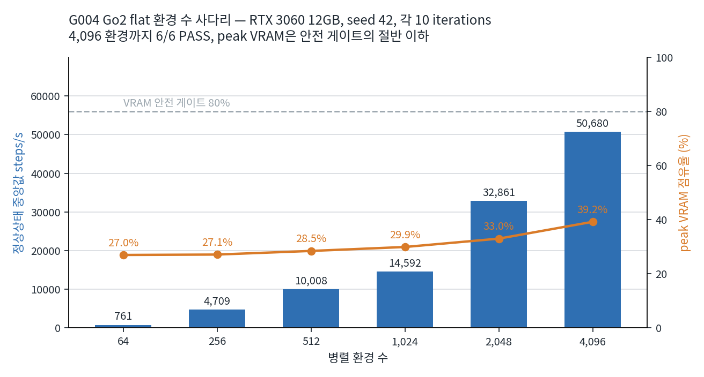
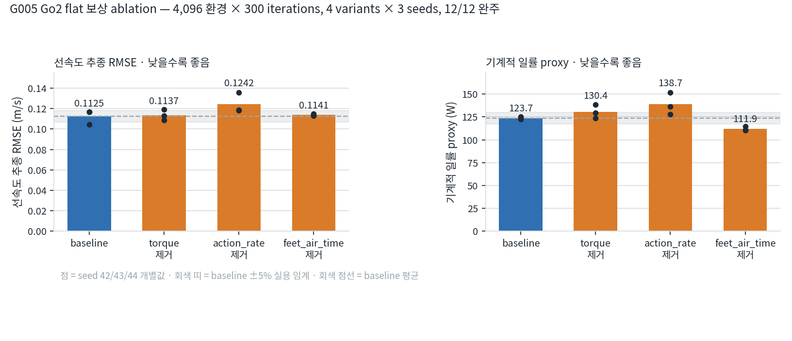
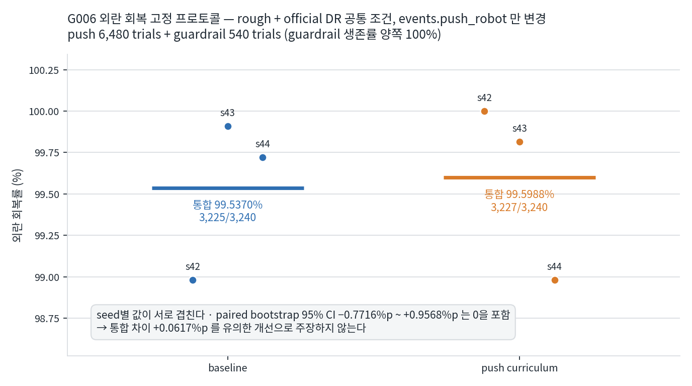

# 결과 요약 (G003~G008)

Isaac Sim 4.5 / Isaac Lab v2.1.1 / RSL-RL PPO로 Unitree Go2 보행 정책을 학습하고, **보상 항목·지형·외란을 한 번에 하나씩만 바꿔** baseline과 비교했다. RTX 3060 12GB 한 대에서 4,096 병렬 환경까지 올렸고, 모든 비교는 동일 budget과 seed 42/43/44 반복으로 수행했다. 개선이 확인되지 않은 실험은 개선되지 않았다고 기록했다.

아래 수치는 전부 `reports/runs/` 의 실행 JSON에서 직접 뽑은 것이다. 각 그림 아래에 원본 파일 경로를 적었다.

---

## 1. 자원 한계를 실측으로 정했다

12GB GPU에서 병렬 환경을 몇 개까지 올릴 수 있는지 추정하지 않고 64부터 한 단계씩 올려 측정했다. 4,096 환경에서 **정상상태 50,680 steps/s**, peak VRAM은 **4,822 MiB(39.24%)** 로 안전 게이트 80%의 절반 이하였다. 4,096은 "2048 PASS + peak ≤ 9,830 MiB + GPU 회복 확인"이라는 사전 게이트를 통과한 뒤에만 실행했다.

| 환경 수 | 정상상태 steps/s | peak VRAM | 판정 |
| ---: | ---: | ---: | :---: |
| 64 | 761 | 26.99% | PASS |
| 256 | 4,709 | 27.13% | PASS |
| 512 | 10,008 | 28.47% | PASS |
| 1,024 | 14,592 | 29.93% | PASS |
| 2,048 | 32,861 | 33.02% | PASS |
| 4,096 | **50,680** | **39.24%** | PASS |

근거: [`reports/runs/g004_go2_scale_summary.json`](../reports/runs/g004_go2_scale_summary.json)

---

## 2. 보상 항목을 하나씩 빼서 trade-off를 분리했다

`dof_torques_l2`, `action_rate_l2`, `feet_air_time` 세 항목을 **한 번에 하나씩만** 제거하고, 4,096 환경 × 300 iterations를 4 variants × seed 42/43/44로 돌렸다. **12/12 완주, 실패 0.** 평가는 고정 26×10×20초 프로토콜과 strict hash 검증을 거쳤다.

| variant | 선속도 RMSE (m/s) | 일률 proxy (W) | action_rate L2 | 낙상률 |
| --- | ---: | ---: | ---: | ---: |
| baseline | 0.1125 | 123.67 | 2.252 | 0.0000 |
| torque 제거 | 0.1137 | 130.44 | 3.176 | 0.0026 |
| action_rate 제거 | **0.1242** | **138.70** | **5.031** | 0.0000 |
| feet_air_time 제거 | 0.1141 | **111.89** | 2.185 | 0.0000 |

읽는 법은 이렇다. `action_rate` 를 빼면 추종 오차와 에너지가 **동시에** 나빠지고 action 변화량이 2.2배가 된다. 반대로 `feet_air_time` 을 빼면 에너지는 9.5% 줄지만 그건 보행이 좋아진 게 아니라 발이 덜 뜬 결과다. **에너지 지표 하나만 보면 잘못 읽는다**는 것이 이 실험의 결론이다.

`n=3` 이므로 표본 표준편차와 paired delta는 탐색적 근거이며 검정력이 제한된다는 경고를 summary JSON에 함께 기록했다.

근거: [`reports/runs/g005_reward_ablation_summary.json`](../reports/runs/g005_reward_ablation_summary.json) · 설계: [`G005_REWARD_ABLATION.md`](G005_REWARD_ABLATION.md)

---

## 3. 개선이 없을 때 없다고 기록했다

rough terrain과 official domain randomization을 공통 조건으로 고정하고 **`events.push_robot` 하나만** 바꿔 4,096 환경 × 1,500 iterations × 3 seeds를 학습했다(6/6 완주). 고정 push 프로토콜로 **6,480 trials**, 무외란 guardrail로 **540 trials**를 평가했다.

| | 회복률 | 시행 |
| --- | ---: | ---: |
| baseline | 99.5370% | 3,225 / 3,240 |
| push curriculum | 99.5988% | 3,227 / 3,240 |
| 차이 | +0.0617%p | paired bootstrap 95% CI **−0.7716%p ~ +0.9568%p** |

신뢰구간이 0을 포함하고 seed별 값이 서로 겹친다. `push_curriculum` 의 seed 44(98.98%)가 `baseline` 의 seed 43(99.91%)보다 낮다. **따라서 유의한 개선을 주장하지 않는다.** guardrail 생존률은 양쪽 100%였다.

같은 조건에서 추적 지표는 tracking error sq `−9.1290%`, yaw error sq `−9.7386%`로 개선됐고 대가로 torque L2 `+4.4411%`, 일률 proxy `+3.6121%`가 늘었다. 이 값은 기술통계 비교이며 flat→rough 또는 DR 단독의 인과효과로 주장하지 않는다.

근거: [`reports/runs/g006_production_*_e4096_i1500_s*_push.json`](../reports/runs/) · 설계: [`G006_ROUGH_PUSH_RECOVERY.md`](G006_ROUGH_PUSH_RECOVERY.md) · 상세: [`G006_PORTFOLIO.md`](G006_PORTFOLIO.md)

---

## 4. 커스텀 태스크와 단일축 curriculum

upstream Isaac Lab은 수정하지 않고 별도 태스크로 등록했다.

| 단계 | 규모 | 결과 |
| --- | --- | --- |
| G008 네 방향 명령 term | warm-start 1,024 env × 300 it, 평면 64환경 평가 | PASS. 생존 64/64, 선속도 RMSE `0.0466~0.0794`, yaw RMSE `0.0741~0.1154`. rough는 좌·우 PASS, 전진·후진 자세 gate **FAIL** |
| G008 마찰 단일축 S1 | `.*_foot` static `0.72~0.88` / dynamic `0.52~0.68`, 64 buckets | 평면 네 방향 gate PASS. 그러나 terrain level 평균이 `3.45 → 2.27` 로 하락해 **S2 미승인** |
| G008 링크 질량 단일축 S1 | 16-body mass `0.95~1.05`, inertia 재계산 | 학습은 완료했으나 우회전 yaw RMSE `0.2956 / 0.2947` 로 nominal guardrail **FAIL**, S2 미승인 |
| G008 링크 그룹 민감도 | 25조건 × 2정책 × 4방향 × 4반복, 800환경 | 전진·후진 25/25 PASS, 낙상 0. leg-mass S1 nominal 우회전 yaw RMSE `0.44 rad/s` **FAIL** |
| G007 RBQ 외부 자산 게이트 | 라이선스 fail-closed 판정 | `license_scope_unresolved`. expect-blocked exit 0 / require-ready exit 3, 46 tests PASS. **자산 다운로드·변환 미실행** |

**두 단일축 모두 S2로 올리지 않았다.** gate를 통과하지 못한 단계를 완료로 기록하지 않는 것이 이 저장소의 규칙이다.

근거: [`G008_COMMAND_FRICTION_LINK_MASS.md`](G008_COMMAND_FRICTION_LINK_MASS.md) · [`G008_PERIODIC_FRICTION_AND_LINK_MASS_LIMITS.md`](G008_PERIODIC_FRICTION_AND_LINK_MASS_LIMITS.md) · [`G007_RBQ_COMPATIBILITY_SPIKE.md`](G007_RBQ_COMPATIBILITY_SPIKE.md)

---

## 5. 어디까지가 내 구현인가

경계를 분명히 해 둔다.

**upstream(Isaac Lab v2.1.1)에서 가져온 것**
- ANYmal-C / Go2 velocity 태스크와 로봇 자산
- `UnitreeGo2RoughEnvCfg` 의 terrain curriculum과 official domain randomization
- RSL-RL PPO 구현

**직접 구현한 것**
- 네 방향 exact primitive를 포함한 custom command term과 태스크 등록 (upstream 무수정)
- 마찰·링크 질량 단일축 event 설정과 runtime 물성 readback probe
- 환경 수 사다리 하네스와 VRAM 안전 게이트
- 고정 평가 프로토콜(26×10×20초, push 6,480 trials, guardrail 540 trials)과 Wilson·paired bootstrap 신뢰구간 계산
- 환경 manifest 자동 수집(버전·commit·CUDA·드라이버·GPU), checkpoint SHA-256 결합, 실행 큐와 재개
- G007 외부 자산 fail-closed 라이선스 게이트

---

## 6. 방법론에서 지킨 것

1. **사전등록.** 계약을 먼저 커밋하고 실행한다. 결과를 보고 기준을 바꾸지 않는다.
2. **동일 budget · seed 반복.** 모든 비교는 같은 환경 수·iteration에 seed 42/43/44를 돌린다.
3. **실패를 실패로 남긴다.** S2 미승인 2건, rough 자세 gate FAIL, 외란 회복 유의차 없음을 그대로 기록했다.

---

## 7. 다시 하면 바꿀 것

- **DR 범위의 근거.** 마찰 `0.72~0.88` 과 질량 `0.95~1.05` 는 문헌 인용이다. 대상 하드웨어의 토크-속도 곡선과 발 마찰을 실측해 범위를 정하는 쪽이 옳다.
- **seed 수.** `n=3` 은 방향 확인에는 되지만 검정력이 부족하다. 최소 5로 늘려야 paired delta를 주장할 수 있다.
- **baseline이 이미 99.5%인 태스크.** 외란 회복 baseline이 천장에 붙어 있어 개선 폭을 볼 수 없었다. curriculum 효과를 보려면 baseline이 무너지는 강도로 push를 키우는 설계가 먼저다.

---

## 8. 아직 진행 중 (미완결)

`G009` 산 비탈 보행·전복 복구는 **R0 strict success = 0** 이며 완료가 아니다. rev14~rev24는 접촉력 진단과 관측 계약 기록이고, GPU 접촉 콜백 부재(`unavailable_on_gpu`) 등 플랫폼 한계를 수치와 권위 경계로 좁힌 단계다. 최신 rev24는 GPU throughput **실행 직전 체크포인트**이며 아직 결과가 없다. 어느 것도 성공 정책의 증거가 아니다. 상세는 [`G009_MOUNTAIN_SLOPE_RECOVERY.md`](G009_MOUNTAIN_SLOPE_RECOVERY.md)에 있다.

실기체 이관은 범위 밖이다. 로봇이 바뀌면 링크 질량·관성·COM, 관절 범위와 순서, 모터 torque-speed envelope, action scale, 발 마찰, 제어 dt가 모두 달라지므로 정책 weight와 절대 임계값은 재사용하지 않는다. 재사용 가능한 것은 terrain generator, 평가 grid, reward 구조, support-plane 계측, media/report schema다.

---

전체 검증 상태는 [`VALIDATION_MATRIX.md`](VALIDATION_MATRIX.md), 실행 기록은 [`../RUN_NOTES.md`](../RUN_NOTES.md)에 있다.
